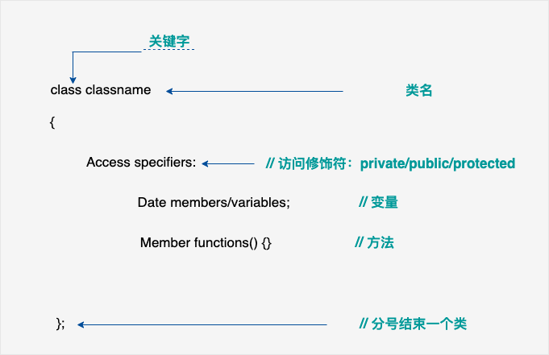
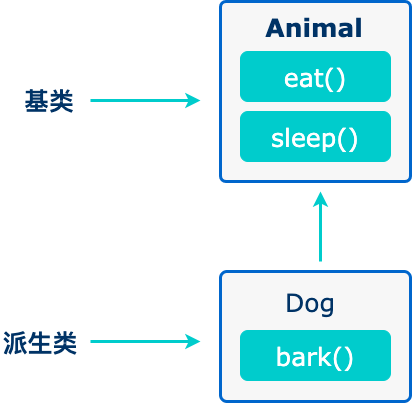

# 引入
> 根据菜鸟教程学习，供自用  

打印hello world

```c++
#include <iostream>
using namespace std;
int main()
{
    cout << "Hello World" << "\n";
    return 0;
}
```

现象

```powershell
PS C:\Users\86177> cd "d:\DeskTop\cppstudy\" ; if ($?) { g++ -std=c++11 hello.cpp -o a.exe } ; if ($?) { ./a.exe }
Hello World
PS D:\DeskTop\cppstudy> 
```

# 简介

面向对象开发的四大特性

- **封装（Encapsulation）**：封装是将数据和方法组合在一起，对外部隐藏实现细节，只公开对外提供的接口。这样可以提高安全性、可靠性和灵活性。
- **继承（Inheritance）**：继承是从已有类中派生出新类，新类具有已有类的属性和方法，并且可以扩展或修改这些属性和方法。这样可以提高代码的复用性和可扩展性。
- **多态（Polymorphism）**：多态是指同一种操作作用于不同的对象，可以有不同的解释和实现。它可以通过接口或继承实现，可以提高代码的灵活性和可读性。
- **抽象（Abstraction）**：抽象是从具体的实例中提取共同的特征，形成抽象类或接口，以便于代码的复用和扩展。抽象类和接口可以让程序员专注于高层次的设计和业务逻辑，而不必关注底层的实现细节。


# 基本语法

 *C++ 程序可以定义为对象的集合，这些对象通过调用彼此的方法进行交互。* 

- **对象 -** 对象具有状态和行为。例如：一只狗的状态 - 颜色、名称、品种，行为 - 摇动、叫唤、吃。对象是类的实例。
- **类 -** 类可以定义为描述对象行为/状态的模板/蓝图。
- **方法 -** 从基本上说，一个方法表示一种行为。一个类可以包含多个方法。可以在方法中写入逻辑、操作数据以及执行所有的动作。
- **即时变量 -** 每个对象都有其独特的即时变量。对象的状态是由这些即时变量的值创建的。


## 标识符

下表列出了 C++ 中的保留字。这些保留字不能作为常量名、变量名或其他标识符名称。

| asm          | else      | new              | this     |
| ------------ | --------- | ---------------- | -------- |
| auto         | enum      | operator         | throw    |
| bool         | explicit  | private          | true     |
| break        | export    | protected        | try      |
| case         | extern    | public           | typedef  |
| catch        | false     | register         | typeid   |
| char         | float     | reinterpret_cast | typename |
| class        | for       | return           | union    |
| const        | friend    | short            | unsigned |
| const_cast   | goto      | signed           | using    |
| continue     | if        | sizeof           | virtual  |
| default      | inline    | static           | void     |
| delete       | int       | static_cast      | volatile |
| do           | long      | struct           | wchar_t  |
| double       | mutable   | switch           | while    |
| dynamic_cast | namespace | template         |          |


## 注释

块注释符（/*...*/）是不可以嵌套使用的。

**#if 0 ... #endif** 属于条件编译，0 即为参数。

此外，我们还可以使用 **#if 0 ... #endif** 来实现注释，且可以实现嵌套，格式为：

```
#if 0
   code
#endif 
```

你可以把 **#if 0** 改成 **#if 1** 来执行 **code** 的代码。

这种形式对程序调试也可以帮助，测试时使用 **#if 1** 来执行测试代码，发布后使用 **#if 0** 来屏蔽测试代码。

**#if** 后可以是任意的条件语句。

下面的代码如果 condition 条件为 true 执行 code1 ，否则执行 code2。

```
#if condition
  code1
#else
  code2
#endif
```


# 数据类型


| 类型     | 关键字                                  |
| :------- | :-------------------------------------- |
| 布尔型   | bool                                    |
| 字符型   | char                                    |
| 整型     | int                                     |
| 浮点型   | float                                   |
| 双浮点型 | double                                  |
| 无类型   | void                                    |
| 宽字符型 | wchar_t  （typedef short int wchar_t;） |


 在每一行后插入一个换行符，**<<** 运算符用于向屏幕传多个值， 

| 类型               | 位            | 范围                                                         |
| :----------------- | :------------ | :----------------------------------------------------------- |
| char               | 1 个字节      | -128 到 127 或者 0 到 255                                    |
| unsigned char      | 1 个字节      | 0 到 255                                                     |
| signed char        | 1 个字节      | -128 到 127                                                  |
| int                | 4 个字节      | -2147483648 到 2147483647                                    |
| unsigned int       | 4 个字节      | 0 到 4294967295                                              |
| signed int         | 4 个字节      | -2147483648 到 2147483647                                    |
| short int          | 2 个字节      | -32768 到 32767                                              |
| unsigned short int | 2 个字节      | 0 到 65,535                                                  |
| signed short int   | 2 个字节      | -32768 到 32767                                              |
| long int           | 8 个字节      | -9,223,372,036,854,775,808 到 9,223,372,036,854,775,807      |
| signed long int    | 8 个字节      | -9,223,372,036,854,775,808 到 9,223,372,036,854,775,807      |
| unsigned long int  | 8 个字节      | 0 到 18,446,744,073,709,551,615                              |
| float              | 4 个字节      | 精度型占4个字节（32位）内存空间，+/- 3.4e +/- 38 (~7 个数字) |
| double             | 8 个字节      | 双精度型占8 个字节（64位）内存空间，+/- 1.7e +/- 308 (~15 个数字) |
| long long          | 8 个字节      | 双精度型占8 个字节（64位）内存空间，表示 -9,223,372,036,854,775,807 到 9,223,372,036,854,775,807 的范围 |
| long double        | 16 个字节     | 长双精度型 16 个字节（128位）内存空间，可提供18-19位有效数字。 |
| wchar_t            | 2 或 4 个字节 | 1 个宽字符                                                   |

## typedef声明
`typedef int feet;` 

## 枚举类型
```c++
enum color{red,blue,green}c;
c=blue;
//这里red=0,blue=1,green=2;c被赋值为1;

enum color2{red1,blue1=5,green1};
//这里red1=0,blue1=5,green1=6;(默认情况下，每个名称都会比它前面一名称大1，但red的值依然是0)
```
## 类型转换
四种：静态转换、动态转换、常量转换、重新解释转换
1. 静态转换（static_cast）
强转，不检查
```c++
int a=10;
float b=static_cast<float>(a);//将a转换为float类型
```
2. 动态转换（dynamic_cast）
将一个基类指针或引用转换为派生类指针或引用。  
检查，不能转换返回空指针或者引发异常。  
```c++
class Base{};
class Derived:public Base{};
Base* ptr_base=new Derived;
Derived* ptr_derived=dynamic_cast<Derived*>(ptr_base);
//将基类指针ptr_base转换为派生类指针ptr_derived
```
3. 常量转换（const_cast）
将const类型的对象转换为非const类型
```c++
const int a=10;
int& r=const_cast<int&>(a);
//将const int转换为int
```
4. 重新解释转换（reinterpret_cast）
将一个数据类型的值重新解释为另一个数据类型的值，不检查（同静态转换？）
```c++
int i=10;
float f=reineterpret_cast<float&>(i);
//重新解释将int类型转换为float类型
```
>静态转换用于在兼容类型之间进行安全转换，编译时会进行检查。  
>重新类型转换用于在不同类型之间进行底层位模式的重新解释，不进行任何类型检查，风险较高。

# 变量类型
|类型|描述|
|----|----|
|bool|1个字节|
|char|1个字节|
|int |4个字节|
|float|4个字节(1位符号，8位指数，23位小数)|
|double|8个字节(1位符号，11位指数，52位小数)|
|void|表示类型的缺失|
|wchar_t|2或4个字节（宽字符）|
- - -
>整数类型  
1. int 4字节  
2. short 2字节  
3. long 4字节  
4. long long 8字节  
>浮点类型
1. float 4字节  
2. double 8字节  
3. long double （占用字节数随实现而变化） 
>字符类型
1. char 1字节  
2. wchar_t 2或4字节  
3. char16_t 2字节  
4. char32_t 4字节  
>布尔类型
1. bool 1字节  
>枚举类型
1. enum 用于定义一组命名的整数常量
>指针类型
1. type* 指向type类型的指针
>数组类型
1. 类型[常量表达式]
>结构体类型
1. struct 关键字定义,可以包含不同类型的成员
>类类型
1. class 用于定义具有数据成员和函数成员的复合类型
>共用体类型
1. union 定义一种特殊的数据类型，允许在相同的内存位置存储不同的数据类型  
- - - 
***不带初始化的定义：带有静态存储持续时间的变量会被隐式初始化为 NULL（所有字节的值都是 0），其他所有变量的初始值是未定义的。***
- - - 
## 左值和右值
>左值：指向内存位置的表达式被称为左值（lvalue）表达式。左值可以出现在赋值号的左边或右边。  
>右值：术语右值（rvalue）指的是存储在内存中某些地址的数值。右值是不能对其进行赋值的表达式，也就是说我们不可以把一个右值赋值给一个变量。  
(变量是左值，因此可以出现在赋值号的左边。数值型的字面值是右值，因此不能被赋值，不能出现在赋值号的左边。下面是一个有效的语句)  
- - - 
# 变量作用域
1. 局部变量
2. 全局变量
3. 形式参量
- - - 
1. 局部作用域
2. 全局作用域
3. 块作用域
4. 类作用域：在类内部声明的变量具有类作用域，它们可以被类的所有成员函数访问。类作用域变量的生命周期与类的生命周期相同。  
（如果在内部作用域中声明的变量与外部作用域中的变量同名，则内部作用域中的变量将覆盖外部作用域中的变量。）  
- - -
当局部变量被定义时，系统不会对其初始化，您必须自行对其初始化。定义全局变量时，系统会自动初始化为`0`,`'\0'`,`NULL`  
## 块作用域举例
```C++
#include <iostream>
int main()
{
  int a=10;
  {
    int a=20;
    std::cout<<"块变量:"<<a<<std::endl;
  }
  std::cout<<"块变量:"<<a<<std::endl;
  return 0;
}
```
## 类作用域举例
```C++
class Myclass
{
  public:
    static int class_var;//类作用域变量
};

int Myclass::class_var=10;

int main()
{
  std::cout<<"类变量:"<<Myclass::class_var<<std::endl;
  return 0;
}
```
Myclass类中声明了一个名为class_var的类作用域变量，可以使用类名和作用域解析运算符`::`来访问这个变量。
# 常量
:字面量
## 整数常量
```c++
212         // 合法的  不带前缀则默认表示十进制
215u        // 合法的  U表示无符号整数（unsigned）
0xFeeL      // 合法的  L表示长整数（long）
078         // 非法的：8不是八进制的数字  前缀0表示八进制
032UU       // 非法的：不能重复后缀

85         // 十进制   不带前缀则默认表示十进制
0213       // 八进制    前缀0表示八进制
0x4b       // 十六进制   前缀0x或0X表示十六进制

30         // 整数       不带前缀则默认表示十进制
30u        // 无符号整数 
30l        // 长整数 
30ul       // 无符号长整数

```
## 浮点常量
```c++
3.14159       // 合法的 
314159E-5L    // 合法的 
510E          // 非法的：不完整的指数
210f          // 非法的：没有小数或指数
.e55          // 非法的：缺少整数或分数
```
## 布尔常量
布尔常量
布尔常量共有两个，它们都是标准的 C++ 关键字：

true 值代表真。
false 值代表假。
我们不应把 true 的值看成 1，把 false 的值看成 0。
## 字符常量
>如果常量以 L（仅当大写时）开头，则表示它是一个宽字符常量（例如 L'x'），此时它必须存储在 wchar_t 类型的变量中  
>否则，它就是一个窄字符常量（例如 'x'），此时它可以存储在 char 类型的简单变量中  
>字符常量可以是一个普通的字符（例如 'x'）、一个转义序列（例如 '\t'），或一个通用的字符（例如 '\u02C0'）。  
- - - 
>C++ 中，有一些特定的字符，当它们前面有反斜杠时，它们就具有特殊的含义，被用来表示如换行符（\n）或制表符（\t）等。  
- - -   
|转义序列|	含义|
|---|---|
|\\	|\ 字符|
|\'|	' 字符|
|\"	|" 字符|
|\?|	? 字符|
|\a	|警报铃声|
|\b	|退格键|
|\f	|换页符|
|\n	|换行符|
|\r|	回车|
|\t|	水平制表符|
|\v	|垂直制表符|
|\ooo	|一到三位的八进制数|
|\xhh . . .|	一个或多个数字的十六进制数v
## 字符串常量
字符串字面值或常量是括在双引号 "" 中的。   
您可以使用 \ 做分隔符，把一个很长的字符串常量进行分行。（只是编写分行，输出没有分行）   
## 定义常量
1. 使用#define预处理`#define identifier value`
2. 使用const关键字  `const type variable = value;`  `const int  LENGTH = 10;`  ` const char NEWLINE = '\n';`   
***请注意，把常量定义为大写字母形式，是一个很好的编程实践。***  

# 修饰符类型
下面列出了数据类型修饰符：

signed：表示变量可以存储负数。对于整型变量来说，signed 可以省略，因为整型变量默认为有符号类型。

unsigned：表示变量不能存储负数。对于整型变量来说，unsigned 可以将变量范围扩大一倍。

short：表示变量的范围比 int 更小。short int 可以缩写为 short。

long：表示变量的范围比 int 更大。long int 可以缩写为 long。

long long：表示变量的范围比 long 更大。C++11 中新增的数据类型修饰符。

float：表示单精度浮点数。

double：表示双精度浮点数。

bool：表示布尔类型，只有 true 和 false 两个值。

char：表示字符类型。

wchar_t：表示宽字符类型，可以存储 Unicode 字符。
```c++
signed int num1 = -10; // 定义有符号整型变量 num1，初始值为 -10
unsigned int num2 = 20; // 定义无符号整型变量 num2，初始值为 20

short int num1 = 10; // 定义短整型变量 num1，初始值为 10
long int num2 = 100000; // 定义长整型变量 num2，初始值为 100000

long long int num1 = 10000000000; // 定义长长整型变量 num1，初始值为 10000000000

float num1 = 3.14f; // 定义单精度浮点数变量 num1，初始值为 3.14
double num2 = 2.71828; // 定义双精度浮点数变量 num2，初始值为 2.71828

bool flag = true; // 定义布尔类型变量 flag，初始值为 true

char ch1 = 'a'; // 定义字符类型变量 ch1，初始值为 'a'
wchar_t ch2 = L'你'; // 定义宽字符类型变量 ch2，初始值为 '你'
```
## 类型限定符
|限定符	|含义|
|---|---|
|const|	const 定义常量，表示该变量的值不能被修改。|
|volatile|	修饰符 volatile 告诉该变量的值可能会被程序以外的因素改变，如硬件或其他线程。|
|restrict	|由 restrict 修饰的指针是唯一一种访问它所指向的对象的方式。只有 C99 增加了新的类型限定符 restrict。|
|mutable	|mutable 用于修饰类的成员变量。被 mutable 修饰的成员变量可以被修改，即使它们所在的对象是 const 的。|
|static|	用于定义静态变量，表示该变量的作用域仅限于当前文件或当前函数内，不会被其他文件或函数访问。|
|register|	用于定义寄存器变量，表示该变量被频繁使用，可以存储在CPU的寄存器中，以提高程序的运行效率。|
### volatile实例
```c++
volatile int i = 10; // 定义一个 volatile 整型变量 i，表示其值可能会被程序以外的因素改变。
```
### const实例
```c++
const int NUM = 10; // 定义常量 NUM，其值不可修改
const int* ptr = &NUM; // 定义指向常量的指针，指针所指的值不可修改
int const* ptr2 = &NUM; // 和上面一行等价
```
### mutable实例
```c++
class Example {
public:
    int get_value() const {
        return value_; // const 关键字表示该成员函数不会修改对象中的数据成员
    }
    void set_value(int value) const {
        value_ = value; // mutable 关键字允许在 const 成员函数中修改成员变量
    }
private:
    mutable int value_;
};
```
### register实例
```c++
void example_function(register int num) {
    // register 关键字建议编译器将变量 num 存储在寄存器中
    // 以提高程序执行速度
    // 但是实际上是否会存储在寄存器中由编译器决定
}
```
### static实例
```c++
void example_function() {
    static int count = 0; // static 关键字使变量 count 存储在程序生命周期内都存在
    count++;
}
```
# 存储类
auto：这是默认的存储类说明符，通常可以省略不写。auto 指定的变量具有自动存储期，即它们的生命周期仅限于定义它们的块（block）。auto 变量通常在栈上分配。

register：用于建议编译器将变量存储在CPU寄存器中以提高访问速度。在 C++11 及以后的版本中，register 已经是一个废弃的特性，不再具有实际作用。

static：用于定义具有静态存储期的变量或函数，它们的生命周期贯穿整个程序的运行期。在函数内部，static变量的值在函数调用之间保持不变。在文件内部或全局作用域，static变量具有内部链接，只能在定义它们的文件中访问。

extern：用于声明具有外部链接的变量或函数，它们可以在多个文件之间共享。默认情况下，全局变量和函数具有 extern 存储类。在一个文件中使用extern声明另一个文件中定义的全局变量或函数，可以实现跨文件共享。

mutable (C++11)：用于修饰类中的成员变量，允许在const成员函数中修改这些变量的值。通常用于缓存或计数器等需要在const上下文中修改的数据。

thread_local (C++11)：用于定义具有线程局部存储期的变量，每个线程都有自己的独立副本。线程局部变量的生命周期与线程的生命周期相同。  
```c++
#include <iostream>

// 全局变量，具有外部链接，默认存储类为extern
int globalVar;

void function() {
    // 局部变量，具有自动存储期，默认存储类为auto
    auto int localVar = 10;

    // 静态变量，具有静态存储期，生命周期贯穿整个程序
    static int staticVar = 20;

    const int constVar = 30; // const变量默认具有static存储期

    // 尝试修改const变量，编译错误
    // constVar = 40;

    // mutable成员变量，可以在const成员函数中修改
    class MyClass {
    public:
        mutable int mutableVar;

        void constMemberFunc() const {
            mutableVar = 50; // 允许修改mutable成员变量
        }
    };

    // 线程局部变量，每个线程有自己的独立副本
    thread_local int threadVar = 60;
}

int main() {
    extern int externalVar; // 声明具有外部链接的变量

    function();

    return 0;
}
```
## auto存储类
自 C++ 11 以来，auto 关键字用于两种情况：声明变量时根据初始化表达式自动推断该变量的类型、声明函数时函数返回值的占位符。

C++98 标准中 auto 关键字用于自动变量的声明，但由于使用极少且多余，在 C++17 中已删除这一用法。

根据初始化表达式自动推断被声明的变量的类型，如：
```c++
auto f=3.14;      //double
auto s("hello");  //const char*
auto z = new auto(9); // int*
auto x1 = 5, x2 = 5.0, x3='r';//错误，必须是初始化为同一类型
```
## thread_local存储类
thread_local 是 C++11 引入的一种存储类，用于在多线程环境中管理线程特有的变量。

使用 thread_local 修饰的变量在每个线程中都有独立的实例，因此每个线程对该变量的操作不会影响其他线程。

独立性：每个线程都有自己独立的变量副本，不同线程之间的读写操作互不干扰。
生命周期：thread_local 变量在其线程结束时自动销毁。
初始化：thread_local 变量可以进行静态初始化或动态初始化，支持在声明时初始化。
thread_local 适合用于需要存储线程状态、缓存或者避免数据竞争的场景，如线程池、请求上下文等。

以下演示了可以被声明为 thread_local 的变量：
```c++
#include <iostream>
#include <thread>
 
thread_local int threadSpecificVar = 0; // 每个线程都有自己的 threadSpecificVar
 
void threadFunction(int id) {
    threadSpecificVar = id; // 设置线程特有的变量
    std::cout << "Thread " << id << ": threadSpecificVar = " << threadSpecificVar << std::endl;
}
 
int main() {
    std::thread t1(threadFunction, 1);
    std::thread t2(threadFunction, 2);
 
    t1.join();
    t2.join();
 
    return 0;
}
```
注意事项：  
性能：由于每个线程都有独立的副本，thread_local 变量的访问速度可能比全局或静态变量稍慢。  
静态存储：thread_local 变量的存储类型为静态存储持续时间，因此在程序整个运行期间会一直存在。  
- - - 
# 运算符
同C
#  循环
同C  
一般情况下，C++ 程序员偏向于使用 `for(;;)` 结构来表示一个无限循环。  
注意：您可以按 Ctrl + C 键终止一个无限循环。
#  判断
同C  
# 函数
同C  
函数还有很多叫法，比如方法、子例程或程序，等等。  
## lamba表达式
C++11 提供了对匿名函数的支持,称为 Lambda 函数(也叫 Lambda 表达式)。  
Lambda 表达式把函数看作对象。Lambda 表达式可以像对象一样使用，比如可以将它们赋给变量和作为参数传递，还可以像函数一样对其求值。  
Lambda 表达式本质上与函数声明非常类似。  
Lambda 表达式具体形式如下:  `[capture](parameters)->return-type{body}`  
eg:`[](int x, int y){ return x < y ; }`  
如果没有返回值可以表示为：`[capture](parameters){body}`  
eg:`[]{ ++global_x; } `    
在一个更为复杂的例子中，返回类型可以被明确的指定如下：`[](int x, int y) -> int { int z = x + y; return z + x; }`  
本例中，一个临时的参数 z 被创建用来存储中间结果。如同一般的函数，z 的值不会保留到下一次该不具名函数再次被调用时。  
如果 lambda 函数没有传回值（例如 void），其返回类型可被完全忽略。  
在Lambda表达式内可以访问当前作用域的变量，这是Lambda表达式的闭包（Closure）行为。 与JavaScript闭包不同，C++变量传递有传值和传引用的区别。可以通过前面的[]来指定：  
```c++
[]      // 沒有定义任何变量。使用未定义变量会引发错误。
[x, &y] // x以传值方式传入（默认），y以引用方式传入。
[&]     // 任何被使用到的外部变量都隐式地以引用方式加以引用。
[=]     // 任何被使用到的外部变量都隐式地以传值方式加以引用。
[&, x]  // x显式地以传值方式加以引用。其余变量以引用方式加以引用。
[=, &z] // z显式地以引用方式加以引用。其余变量以传值方式加以引用。
```
另外有一点需要注意。对于[=]或[&]的形式，lambda 表达式可以直接使用 this 指针。但是，对于[]的形式，如果要使用 this 指针，必须显式传入：
`[this]() { this->someFunc(); }();`  
# 数字
同C
# 数组
同C
```C++
#include <iostream>
using namespace std;
 
#include <iomanip>
using std::setw;
 
int main ()
{
   int n[ 10 ]; // n 是一个包含 10 个整数的数组
 
   // 初始化数组元素          
   for ( int i = 0; i < 10; i++ )
   {
      n[ i ] = i + 100; // 设置元素 i 为 i + 100
   }
   cout << "Element" << setw( 13 ) << "Value" << endl;
 
   // 输出数组中每个元素的值                     
   for ( int j = 0; j < 10; j++ )
   {
      cout << setw( 7 )<< j << setw( 13 ) << n[ j ] << endl;
   }
 
   return 0;
}
```
上面的程序使用了 setw() 函数 来格式化输出。当上面的代码被编译和执行时，它会产生下列结果：
```c++
Element        Value
      0          100
      1          101
      2          102
      3          103
      4          104
      5          105
      6          106
      7          107
      8          108
      9          109
```
- - -

|概念|	描述|
|---|---|
|多维数组	C++| 支持多维数组。多维数组最简单的形式是二维数组。|
|指向数组的指针	|您可以通过指定不带索引的数组名称来生成一个指向数组中第一个元素的指针。|
|传递数组给函数	|您可以通过指定不带索引的数组名称来给函数传递一个指向数组的指针。|
|从函数返回数组	|C++ 允许从函数返回数组。|
# 字符串
同C  
字符串实际上是使用 null 字符 \0 终止的一维字符数组。因此，一个以 null 结尾的字符串，包含了组成字符串的字符。  
其实，您不需要把 null 字符放在字符串常量的末尾。C++ 编译器会在初始化数组时，自动把 \0 放在字符串的末尾。
- - - 
## String类
C++ 标准库提供了 string 类类型，支持上述所有的操作，另外还增加了其他更多的功能。  
```c++
#include <iostream>
#include <string>
 
using namespace std;
 
int main ()
{
   string str1 = "runoob";
   string str2 = "google";
   string str3;
   int  len ;
 
   // 复制 str1 到 str3
   str3 = str1;
   cout << "str3 : " << str3 << endl;
 
   // 连接 str1 和 str2
   str3 = str1 + str2;
   cout << "str1 + str2 : " << str3 << endl;
 
   // 连接后，str3 的总长度
   len = str3.size();
   cout << "str3.size() :  " << len << endl;
 
   return 0;
}
```
result:
```c++
str3 : runoob
str1 + str2 : runoobgoogle
str3.size() :  12
```
# 指针
同C

|概念|	描述|
|---|---|
|C++ Null 指针	|C++ 支持空指针。NULL 指针是一个定义在标准库中的值为零的常量。|
|C++ 指针的算术运算	|可以对指针进行四种算术运算：++、--、+、-|
|C++ 指针 vs 数组|	指针和数组之间有着密切的关系。|
|C++ 指针数组	|可以定义用来存储指针的数组。|
|C++ 指向指针的指针	|C++ 允许指向指针的指针。|
|C++ 传递指针给函数	|通过引用或地址传递参数，使传递的参数在调用函数中被改变。|
|C++ 从函数返回指针	|C++ 允许函数返回指针到局部变量、静态变量和动态内存分配。|
# 引用
引用变量是一个别名，也就是说，它是某个已存在变量的另一个名字。一旦把引用初始化为某个变量，就可以使用该引用名称或变量名称来指向变量。  
## 引用vs指针
1. 不存在空引用。引用必须连接到一块合法的内存。
2. 一旦引用被初始化为一个对象，就不能被指向到另一个对象。指针可以在任何时候指向到另一个对象。
3. 引用必须在创建时被初始化。指针可以在任何时间被初始化。
- - - 
```c++
#include <iostream>
 
using namespace std;
 
int main ()
{
   // 声明简单的变量
   int    i;
   double d;
 
   // 声明引用变量
   int&    r = i;  //r 是一个初始化为 i 的整型引用
   double& s = d;  //s 是一个初始化为 d 的 double 型引用
   
   i = 5;
   cout << "Value of i : " << i << endl;
   cout << "Value of i reference : " << r  << endl;
 
   d = 11.7;
   cout << "Value of d : " << d << endl;
   cout << "Value of d reference : " << s  << endl;
   
   return 0;
}
```
result:
```c++
Value of i : 5
Value of i reference : 5
Value of d : 11.7
Value of d reference : 11.7
```
|概念	|描述|
|---|---|
|把引用作为参数|	C++ 支持把引用作为参数传给函数，这比传一般的参数更安全。|
|把引用作为返回值|	可以从 C++ 函数中返回引用，就像返回其他数据类型一样。|
# 日期和时间
***需要在 C++ 程序中引用`<ctime>` 头文件。***
有四个与时间相关的类型：clock_t、time_t、size_t 和 tm。类型 clock_t、size_t 和 time_t 能够把系统时间和日期表示为某种整数。

结构类型 tm 把日期和时间以 C 结构的形式保存
```c++
struct tm {
  int tm_sec;   // 秒，正常范围从 0 到 59，但允许至 61
  int tm_min;   // 分，范围从 0 到 59
  int tm_hour;  // 小时，范围从 0 到 23
  int tm_mday;  // 一月中的第几天，范围从 1 到 31
  int tm_mon;   // 月，范围从 0 到 11
  int tm_year;  // 自 1900 年起的年数
  int tm_wday;  // 一周中的第几天，范围从 0 到 6，从星期日算起
  int tm_yday;  // 一年中的第几天，范围从 0 到 365，从 1 月 1 日算起
  int tm_isdst; // 夏令时
};
```
|序号|	函数 & 描述|
|--|--|
|1|	time_t time(time_t *time);
该函数返回系统的当前日历时间，自 1970 年 1 月 1 日以来经过的秒数。如果系统没有时间，则返回 -1。|
|2|	char *ctime(const time_t *time);
该返回一个表示当地时间的字符串指针，字符串形式 day month year hours:minutes:seconds year\n\0。|
|3|	struct tm *localtime(const time_t *time);
该函数返回一个指向表示本地时间的 tm 结构的指针。|
|4|	clock_t clock(void);
该函数返回程序执行起（一般为程序的开头），处理器时钟所使用的时间。如果时间不可用，则返回 -1。|
|5|	char * asctime ( const struct tm * time );
该函数返回一个指向字符串的指针，字符串包含了 time 所指向结构中存储的信息，返回形式为：day month date hours:minutes:seconds year\n\0。|
|6|	struct tm *gmtime(const time_t *time);
该函数返回一个指向 time 的指针，time 为 tm 结构，用协调世界时（UTC）也被称为格林尼治标准时间（GMT）表示。|
|7|	time_t mktime(struct tm *time);
该函数返回日历时间，相当于 time 所指向结构中存储的时间。|
|8|	double difftime ( time_t time2, time_t time1 );
该函数返回 time1 和 time2 之间相差的秒数。|
|9|	size_t strftime();
该函数可用于格式化日期和时间为指定的格式。|
- - - 
```c++
#include <iostream>
#include <ctime>
 
using namespace std;
 
int main( )
{
   // 基于当前系统的当前日期/时间
   time_t now = time(0);
   
   // 把 now 转换为字符串形式
   char* dt = ctime(&now);
 
   cout << "本地日期和时间：" << dt << endl;
 
   // 把 now 转换为 tm 结构
   tm *gmtm = gmtime(&now);
   dt = asctime(gmtm);
   cout << "UTC 日期和时间："<< dt << endl;
}
```
result:
```c++
本地日期和时间：Sat Jan  8 20:07:41 2011

UTC 日期和时间：Sun Jan  9 03:07:41 2011
```
## 使用tm结构格式化时间
```c++
#include <iostream>
#include <ctime>
 
using namespace std;
 
int main( )
{
   // 基于当前系统的当前日期/时间
   time_t now = time(0);
 
   cout << "1970 到目前经过秒数:" << now << endl;
 
   tm *ltm = localtime(&now);
 
   // 输出 tm 结构的各个组成部分
   cout << "年: "<< 1900 + ltm->tm_year << endl;
   cout << "月: "<< 1 + ltm->tm_mon<< endl;
   cout << "日: "<<  ltm->tm_mday << endl;
   cout << "时间: "<< ltm->tm_hour << ":";
   cout << ltm->tm_min << ":";
   cout << ltm->tm_sec << endl;
}
```
result:
```c++
1970 到目前时间:1503564157
年: 2017
月: 8
日: 24
时间: 16:42:37
```
# 基本的输入输出
C++ 的 I/O 发生在流中，流是字节序列。如果字节流是从设备（如键盘、磁盘驱动器、网络连接等）流向内存，这叫做输入操作。如果字节流是从内存流向设备（如显示屏、打印机、磁盘驱动器、网络连接等），这叫做输出操作。
- - -

|头文件|	函数和描述|
|--|--|
|`<iostream>`|	该文件定义了 cin、cout、cerr 和 clog 对象，分别对应于标准输入流、标准输出流、非缓冲标准错误流和缓冲标准错误流。|
|`<iomanip>`	|该文件通过所谓的参数化的流操纵器（比如 setw 和 setprecision），来声明对执行标准化 I/O 有用的服务。|
|`<fstream>`|	该文件为用户控制的文件处理声明服务。我们将在文件和流的相关章节讨论它的细节。|
- - -
## 标准输出流 cout
预定义的对象 cout 是 iostream 类的一个实例。cout 对象"连接"到标准输出设备，通常是显示屏。  
cout 是与流插入运算符 << 结合使用的，如下所示：
```c++
#include <iostream>
 
using namespace std;
 
int main( )
{
   char str[] = "Hello C++";
 
   cout << "Value of str is : " << str << endl;
}
```
reslut:
```c++
Value of str is : Hello C++
```
流插入运算符 << 在一个语句中可以多次使用，如上面实例中所示，endl 用于在行末添加一个换行符。  
## 标准输入流 cin
预定义的对象 cin 是 iostream 类的一个实例。cin 对象附属到标准输入设备，通常是键盘。  
cin 是与流提取运算符 >> 结合使用的，如下所示：  
```c++
#include <iostream>
 
using namespace std;
 
int main( )
{
   char name[50];
 
   cout << "请输入您的名称： ";
   cin >> name;
   cout << "您的名称是： " << name << endl;
 
}
```
result:
```c++
请输入您的名称： cplusplus
您的名称是： cplusplus
```
- - - 
`cin >> name >> age;`相当于`cin >> name;cin >> age;`
## 标准错误流 cerr
预定义的对象 cerr 是 iostream 类的一个实例。cerr 对象附属到标准输出设备，通常也是显示屏，但是 cerr 对象是非缓冲的，且每个流插入到 cerr 都会立即输出。  
cerr 也是与流插入运算符 << 结合使用的，如下所示：
```c++
#include <iostream>
 
using namespace std;
 
int main( )
{
   char str[] = "Unable to read....";
 
   cerr << "Error message : " << str << endl;
}
```
result:
```c++
Error message : Unable to read....
```
- - - 
## 标准日志流 clog
预定义的对象 clog 是 iostream 类的一个实例。clog 对象附属到标准输出设备，通常也是显示屏，但是 clog 对象是缓冲的。这意味着每个流插入到 clog 都会先存储在缓冲区，直到缓冲填满或者缓冲区刷新时才会输出。  
clog 也是与流插入运算符 << 结合使用的，如下所示：
```c++
#include <iostream>
 
using namespace std;
 
int main( )
{
   char str[] = "Unable to read....";
 
   clog << "Error message : " << str << endl;
}
```
result:
```c++
Error message : Unable to read....
```
***良好的编程实践告诉我们，使用 cerr 流来显示错误消息，而其他的日志消息则使用 clog 流来输出。***
# 结构体
同C
## 使用成员访问运算符（.）
```c++
#include <iostream>
#include <cstring>
 
using namespace std;
 
// 声明一个结构体类型 Books 
struct Books
{
   char  title[50];
   char  author[50];
   char  subject[100];
   int   book_id;
};
 
int main( )
{
   Books Book1;        // 定义结构体类型 Books 的变量 Book1
   Books Book2;        // 定义结构体类型 Books 的变量 Book2
 
   // Book1 详述
   strcpy( Book1.title, "C++ 教程");
   strcpy( Book1.author, "Runoob"); 
   strcpy( Book1.subject, "编程语言");
   Book1.book_id = 12345;
 
   // Book2 详述
   strcpy( Book2.title, "CSS 教程");
   strcpy( Book2.author, "Runoob");
   strcpy( Book2.subject, "前端技术");
   Book2.book_id = 12346;
 
   // 输出 Book1 信息
   cout << "第一本书标题 : " << Book1.title <<endl;
   cout << "第一本书作者 : " << Book1.author <<endl;
   cout << "第一本书类目 : " << Book1.subject <<endl;
   cout << "第一本书 ID : " << Book1.book_id <<endl;
 
   // 输出 Book2 信息
   cout << "第二本书标题 : " << Book2.title <<endl;
   cout << "第二本书作者 : " << Book2.author <<endl;
   cout << "第二本书类目 : " << Book2.subject <<endl;
   cout << "第二本书 ID : " << Book2.book_id <<endl;
 
   return 0;
}
```
result:
```c++
第一本书标题 : C++ 教程
第一本书作者 : Runoob
第一本书类目 : 编程语言
第一本书 ID : 12345
第二本书标题 : CSS 教程
第二本书作者 : Runoob
第二本书类目 : 前端技术
第二本书 ID : 12346
```
- - - 
## 结构体作为函数参数
```c++
#include <iostream>
#include <cstring>
 
using namespace std;
void printBook( struct Books book );
 
// 声明一个结构体类型 Books 
struct Books
{
   char  title[50];
   char  author[50];
   char  subject[100];
   int   book_id;
};
 
int main( )
{
   Books Book1;        // 定义结构体类型 Books 的变量 Book1
   Books Book2;        // 定义结构体类型 Books 的变量 Book2
 
    // Book1 详述
   strcpy( Book1.title, "C++ 教程");
   strcpy( Book1.author, "Runoob"); 
   strcpy( Book1.subject, "编程语言");
   Book1.book_id = 12345;
 
   // Book2 详述
   strcpy( Book2.title, "CSS 教程");
   strcpy( Book2.author, "Runoob");
   strcpy( Book2.subject, "前端技术");
   Book2.book_id = 12346;
 
   // 输出 Book1 信息
   printBook( Book1 );
 
   // 输出 Book2 信息
   printBook( Book2 );
 
   return 0;
}
void printBook( struct Books book )
{
   cout << "书标题 : " << book.title <<endl;
   cout << "书作者 : " << book.author <<endl;
   cout << "书类目 : " << book.subject <<endl;
   cout << "书 ID : " << book.book_id <<endl;
}
```
result:
```c++
书标题 : C++ 教程
书作者 : Runoob
书类目 : 编程语言
书 ID : 12345
书标题 : CSS 教程
书作者 : Runoob
书类目 : 前端技术
书 ID : 12346
```
- - - 
## 结构体中各个部分详解
>struct 关键字：用于定义结构体，它告诉编译器后面要定义的是一个自定义类型。  
>成员变量：成员变量是结构体中定义的数据项，它们可以是任何基本类型或其他自定义类型。在 struct 中，这些成员默认是 public，可以直接访问。  
>成员函数：结构体中也可以包含成员函数，这使得结构体在功能上类似于类。成员函数可以操作结构体的成员变量，提供对数据的封装和操作。  
>访问权限：与 class 类似，你可以在 struct 中使用 public、private 和 protected 来定义成员的访问权限。在 struct 中，默认所有成员都是 public，而 class 中默认是 private。  
## 指向结构的指针
定义指向结构的指针`struct Books *struct_pointer;`  
在上述定义的指针变量中存储结构变量的地址`struct_pointer = &Book1;`  
使用指向该结构的指针访问结构的成员，您必须使用 -> 运算符`struct_pointer->title;`    
```c++
#include <iostream>
#include <string>
 
using namespace std;
 
// 声明一个结构体类型 Books 
struct Books
{
    string title;
    string author;
    string subject;
    int book_id;
 
    // 构造函数
    Books(string t, string a, string s, int id)
        : title(t), author(a), subject(s), book_id(id) {}
};
 
// 打印书籍信息的函数
void printBookInfo(const Books& book) {
    cout << "书籍标题: " << book.title << endl;
    cout << "书籍作者: " << book.author << endl;
    cout << "书籍类目: " << book.subject << endl;
    cout << "书籍 ID: " << book.book_id << endl;
}
 
int main()
{
    // 创建两本书的对象
    Books Book1("C++ 教程", "Runoob", "编程语言", 12345);
    Books Book2("CSS 教程", "Runoob", "前端技术", 12346);
 
    // 输出书籍信息
    printBookInfo(Book1);
    printBookInfo(Book2);
 
    return 0;
}
```
reuslt:
```c++
书标题  : C++ 教程
书作者 : Runoob
书类目 : 编程语言
书 ID : 12345
书标题  : CSS 教程
书作者 : Runoob
书类目 : 前端技术
书 ID : 12346
```
## typedef关键字
更简单的定义结构的方式，您可以为创建的类型取一个"别名"  
```c++
typedef struct Books
{
   char  title[50];
   char  author[50];
   char  subject[100];
   int   book_id;
}Books;
```
现在可以`Books Book1, Book2;`这样定义结构体变量了
## 结构体与类的区别
在 C++ 中，struct 和 class 本质上非常相似，唯一的区别在于默认的访问权限：  
struct 默认的成员和继承是 public。  
class 默认的成员和继承是 private。  
在实践中，大多数程序员倾向于使用 struct 来表示数据结构（例如，一个点或矩形），而使用 class 来实现面向对象编程的特性。  
## 结构体与函数的结合
可以通过构造函数初始化结构体，还可以通过引用传递结构体来避免不必要的拷贝。  
```c++
struct Books {
    string title;
    string author;
    string subject;
    int book_id;

    // 构造函数
    Books(string t, string a, string s, int id)
        : title(t), author(a), subject(s), book_id(id) {}

    void printInfo() const {
        cout << "书籍标题: " << title << endl;
        cout << "书籍作者: " << author << endl;
        cout << "书籍类目: " << subject << endl;
        cout << "书籍 ID: " << book_id << endl;
    }
};

void printBookByRef(const Books& book) {
    book.printInfo();
}
```
# vector容器
需要`#include <vector>`  
一种序列容器，它允许你在运行时动态地插入和删除元素。  
vector 是基于数组的数据结构，但它可以自动管理内存，这意味着你不需要手动分配和释放内存。  
>基本特性   
>>动态大小：vector 的大小可以根据需要自动增长和缩小。  
>>连续存储：vector 中的元素在内存中是连续存储的，这使得访问元素非常快速。  
>>可迭代：vector 可以被迭代，你可以使用循环（如 for 循环）来访问它的元素。  
>>元素类型：vector 可以存储任何类型的元素，包括内置类型、对象、指针等。  
- - - 
使用场景：  
当你需要一个可以动态增长和缩小的数组时。  
当你需要频繁地在序列的末尾添加或移除元素时。  
当你需要一个可以高效随机访问元素的容器时。  
```c++
//创建一个 vector 可以像创建其他变量一样简单：
std::vector<int> myVector; // 创建一个存储整数的空 vector

//这将创建一个空的整数向量,也可以在创建时指定初始大小和初始值：
std::vector<int> myVector(5); // 创建一个包含 5 个整数的 vector，每个值都为默认值（0）
std::vector<int> myVector(5, 10); // 创建一个包含 5 个整数的 vector，每个值都为 10

//或
std::vector<int> vec; // 默认初始化一个空的 vector
std::vector<int> vec2 = {1, 2, 3, 4}; // 初始化一个包含元素的 vector

//添加元素
//可以使用 push_back 方法向 vector 中添加元素：
myVector.push_back(7); // 将整数 7 添加到 vector 的末尾

//访问元素
//可以使用下标操作符 [] 或 at() 方法访问 vector 中的元素：
int x = myVector[0]; // 获取第一个元素
int y = myVector.at(1); // 获取第二个元素

//获取大小
//可以使用 size() 方法获取 vector 中元素的数量：
int size = myVector.size(); // 获取 vector 中的元素数量

//迭代访问
//可以使用迭代器遍历 vector 中的元素：
for (auto it = myVector.begin(); it != myVector.end(); ++it) {
    std::cout << *it << " ";
}

//或使用范围 for 循环
for (int element : myVector) {
    std::cout << element << " ";
}

//删除元素
//可以使用 erase() 方法删除 vector 中的元素：
myVector.erase(myVector.begin() + 2); // 删除第三个元素

//清空
//可以使用 clear() 方法清空 vector 中的所有元素：
myVector.clear(); // 清空 vector
```
- - - 
* 示例
```c++
#include <iostream>
#include <vector>

int main() {
    // 创建一个空的整数向量
    std::vector<int> myVector;

    // 添加元素到向量中
    myVector.push_back(3);
    myVector.push_back(7);
    myVector.push_back(11);
    myVector.push_back(5);

    // 访问向量中的元素并输出
    std::cout << "Elements in the vector: ";
    for (int element : myVector) {
        std::cout << element << " ";
    }
    std::cout << std::endl;

    // 访问向量中的第一个元素并输出
    std::cout << "First element: " << myVector[0] << std::endl;

    // 访问向量中的第二个元素并输出
    std::cout << "Second element: " << myVector.at(1) << std::endl;

    // 获取向量的大小并输出
    std::cout << "Size of the vector: " << myVector.size() << std::endl;

    // 删除向量中的第三个元素
    myVector.erase(myVector.begin() + 2);

    // 输出删除元素后的向量
    std::cout << "Elements in the vector after erasing: ";
    for (int element : myVector) {
        std::cout << element << " ";
    }
    std::cout << std::endl;

    // 清空向量并输出
    myVector.clear();
    std::cout << "Size of the vector after clearing: " << myVector.size() << std::endl;

    return 0;
}
```
result
```c++
Elements in the vector: 3 7 11 5 
First element: 3
Second element: 7
Size of the vector: 4
Elements in the vector after erasing: 3 7 5 
Size of the vector after clearing: 0
```
* 实例2
```c++
#include <bits/stdc++.h>
using namespace std;

int main()
{
  // 定义一个整数向量 inner，用于存储乘法表的每一项
  vector<int> inner;
  // 计数器 count，用于追踪输出向量中的元素位置
  int count = 0;
  
  // 生成 1 到 9 的乘法表
  for (int i = 1; i < 10; i++) {
    // 内层循环，用于输出每一行的乘法结果
    for (int j = 1; j <= i; j++) {
      inner.push_back(i * j); // 将乘法结果存储到 inner 向量中
      cout << setw(4) << inner[count++];  // 输出当前存储的乘法结果，格式化为宽度为 4 的字段
    }
    cout << endl; // 换行，开始输出下一行的乘法结果
  }

  system("pause"); // 暂停程序，等待用户按键
  return 0;
}
```
# 数据结构
同C
1. 数组
2. 结构体
3. 类  
类是 C++ 中用于面向对象编程的核心结构，允许定义成员变量和成员函数。与 struct 类似，但功能更强大，支持继承、封装、多态等特性。  
特点：  
可以包含成员变量、成员函数、构造函数、析构函数。  
支持面向对象特性，如封装、继承、多态。   
```c++
class Person {
private:
    string name;
    int age;
public:
    Person(string n, int a) : name(n), age(a) {}
    void printInfo() {
        cout << "Name: " << name << ", Age: " << age << endl;
    }
};
Person p("Bob", 30);
p.printInfo(); // 输出: Name: Bob, Age: 30
```
4. 链表  
链表是一种动态数据结构，由一系列节点组成，每个节点包含数据和指向下一个节点的指针。  
特点：  
动态调整大小，不需要提前定义容量。  
插入和删除操作效率高，时间复杂度为 O(1)（在链表头部或尾部操作）。  
线性查找，时间复杂度为 O(n)。  
```c++
struct Node {
    int data;
    Node* next;
};
Node* head = nullptr;
Node* newNode = new Node{10, nullptr};
head = newNode; // 插入新节点
```
5. 栈    
栈是一种后进先出（LIFO, Last In First Out）的数据结构，常用于递归、深度优先搜索等场景。  
特点：  
只允许在栈顶进行插入和删除操作。  
时间复杂度为 O(1)。  
```c++
stack<int> s;
s.push(1);
s.push(2);
cout << s.top(); // 输出 2
s.pop();
```
6. 队列  
队列是一种先进先出（FIFO, First In First Out）的数据结构，常用于广度优先搜索、任务调度等场景。  
特点：  
插入操作在队尾进行，删除操作在队头进行。  
时间复杂度为 O(1)。  
```c++
queue<int> q;
q.push(1);
q.push(2);
cout << q.front(); // 输出 1
q.pop();
```
7. 双端队列  
双端队列允许在两端进行插入和删除操作，是栈和队列的结合体。  
特点：  
允许在两端进行插入和删除。  
时间复杂度为 O(1)。  
```c++
deque<int> dq;
dq.push_back(1);
dq.push_front(2);
cout << dq.front(); // 输出 2
dq.pop_front();
```
8. 哈希表  
哈希表是一种通过键值对存储数据的数据结构，支持快速查找、插入和删除操作。C++ 中的 unordered_map 是哈希表的实现。  
特点：  
使用哈希函数快速定位元素，时间复杂度为 O(1)。  
不保证元素的顺序。  
```c++
unordered_map<string, int> hashTable;
hashTable["apple"] = 10;
cout << hashTable["apple"]; // 输出 10
```
9. 映射  map    
map 是一种有序的键值对容器，底层实现是红黑树。与 unordered_map 不同，它保证键的顺序，查找、插入和删除的时间复杂度为 O(log n)。  
特点：     
保证元素按键的顺序排列。  
使用二叉搜索树实现。  
```c++
map<string, int> myMap;
myMap["apple"] = 10;
cout << myMap["apple"]; // 输出 10
```
10. 集合  set    
set 是一种用于存储唯一元素的有序集合，底层同样使用红黑树实现。它保证元素不重复且有序。  
特点：  
保证元素的唯一性。  
元素自动按升序排列。  
时间复杂度为 O(log n)。  
```c++
set<int> s;
s.insert(1);
s.insert(2);
cout << *s.begin(); // 输出 1
```
11. 动态数组  vector    
vector 是 C++ 标准库提供的动态数组实现，可以动态扩展容量，支持随机访问。  
特点：  
动态调整大小。  
支持随机访问，时间复杂度为 O(1)。  
当容量不足时，动态扩展，时间复杂度为摊销 O(1)。  
```c++
vector<int> v;
v.push_back(1);
v.push_back(2);
cout << v[0]; // 输出 1
```
# ***类和对象***
## 类定义
定义一个类需要使用关键字`class`,然后指定类的名称，并类的主体是包含在一对花括号中，主体包含类的成员变量和成员函数。  
定义一个类，本质上是定义一个数据类型的蓝图，它定义了类的对象包括了什么，以及可以在这个对象上执行哪些操作。  
  
以下实例我们使用关键字 class 定义 Box 数据类型，包含了三个成员变量 length、breadth 和 height：    
```c++
class Box
{
   public:
      double length;   // 盒子的长度
      double breadth;  // 盒子的宽度
      double height;   // 盒子的高度
};
```
关键字 public 确定了类成员的访问属性。在类对象作用域内，公共成员在类的外部是可访问的。您也可以指定类的成员为 private 或 protected，这个我们稍后会进行讲解。  
```c++
Box Box1;          // 声明 Box1，类型为 Box
Box Box2;          // 声明 Box2，类型为 Box
```
## 访问数据成员
```c++
#include <iostream>
 
using namespace std;//这行代码的作用是指示编译器，在当前作用域中直接使用 std 命名空间中的所有标识符，而不需要在每次引用时都加上 std:: 前缀。
 
class Box
{
   public:
      double length;   // 长度
      double breadth;  // 宽度
      double height;   // 高度
      // 成员函数声明
      double get(void);
      void set( double len, double bre, double hei );
};
// 成员函数定义
double Box::get(void)
{
    return length * breadth * height;
}
 
void Box::set( double len, double bre, double hei)
{
    length = len;
    breadth = bre;
    height = hei;
}
int main( )
{
   Box Box1;        // 声明 Box1，类型为 Box
   Box Box2;        // 声明 Box2，类型为 Box
   Box Box3;        // 声明 Box3，类型为 Box
   double volume = 0.0;     // 用于存储体积
 
   // box 1 详述
   Box1.height = 5.0; 
   Box1.length = 6.0; 
   Box1.breadth = 7.0;
 
   // box 2 详述
   Box2.height = 10.0;
   Box2.length = 12.0;
   Box2.breadth = 13.0;
 
   // box 1 的体积
   volume = Box1.height * Box1.length * Box1.breadth;
   cout << "Box1 的体积：" << volume <<endl;
 
   // box 2 的体积
   volume = Box2.height * Box2.length * Box2.breadth;
   cout << "Box2 的体积：" << volume <<endl;
 
 
   // box 3 详述
   Box3.set(16.0, 8.0, 12.0); 
   volume = Box3.get(); 
   cout << "Box3 的体积：" << volume <<endl;
   return 0;
}
```
result:
```c++
Box1 的体积：210
Box2 的体积：1560
Box3 的体积：1536
```
## 类&对象详解
|概念|	描述|
|---|---|
|类成员函数	|类的成员函数是指那些把定义和原型写在类定义内部的函数，就像类定义中的其他变量一样。|
|类访问修饰符|	类成员可以被定义为 public、private 或 protected。默认情况下是定义为 private。|
|构造函数 & 析构函数|	类的构造函数是一种特殊的函数，在创建一个新的对象时调用。类的析构函数也是一种特殊的函数，在删除所创建的对象时调用。|
|C++ 拷贝构造函数|	拷贝构造函数，是一种特殊的构造函数，它在创建对象时，是使用同一类中之前创建的对象来初始化新创建的对象。|
|C++ 友元函数|	友元函数可以访问类的 private 和 protected 成员。|
|C++ 内联函数	|通过内联函数，编译器试图在调用函数的地方扩展函数体中的代码。|
|C++ 中的 this 指针|	每个对象都有一个特殊的指针 this，它指向对象本身。|
|C++ 中指向类的指针|	指向类的指针方式如同指向结构的指针。实际上，类可以看成是一个带有函数的结构。|
|C++ 类的静态成员	|类的数据成员和函数成员都可以被声明为静态的。|


# 继承
>继承允许我们依据另一个类来定义一个类  
>>创建和维护一个应用程序变得更加容易  
>>达到了重用代码功能和提高执行效率的效果  

**当创建新类时，只需指定新类（派生类）继承一个已有的类(基类)的成员即可**  

```c++
//基类
class Animal
{
    //eat()函数
    //sleep()函数
};
//派生类
clss Dog : public Animal
{
    // bark()函数
    // run()函数
}
```
## 基类和派生类
一个类可以派生自多个类，这意味着，它可以从多个基类继承数据和函数。定义一个派生类，我们使用一个类派生列表来指定基类。类派生列表以一个或多个基类命名，形式如下：  
`class derived-class: access-specifier base-class`  
>访问修饰符`access-specifier`是public、protected或private中的一个。    （如果未使用访问修饰符 access-specifier，则默认为 private。）   
>base-class 是之前定义过的某个类的名称。  
```c++
//假设有一个基类 Shape，Rectangle 是它的派生类，
#include <iostream>
using namespace std;
 
// 基类
class Shape 
{
   public:
      void setWidth(int w)
      {
         width = w;
      }
      void setHeight(int h)
      {
         height = h;
      }
   protected:
      int width;
      int height;
};
 
// 派生类
class Rectangle: public Shape
{
   public:
      int getArea()
      { 
         return (width * height); 
      }
};
 
int main(void)
{
   Rectangle Rect;
 
   Rect.setWidth(5);
   Rect.setHeight(7);
 
   // 输出对象的面积
   cout << "Total area: " << Rect.getArea() << endl;
 
   return 0;
}
```
result:
```c++
Total area: 35
```
## 访问控制和继承
派生类可以访问基类中的所有的非私有成员。因此基类成员如果不想被派生类的成员函数访问，则应在基类中将这些成员声明为 private。  
* 访问权限总结  
- - - 
|访问|public|protected|private|
|---|---|---|---|
|同一个类|yes|yes|yes|
|派生类|yes|yes|no|
|外部的类|yes|no|no|
- - -  
* 一个派生类继承了所有的基类方法，但下列情况除外：    
>基类的构造函数、析构函数和拷贝构造函数。  
>基类的重载运算符。  
>基类的友元函数。  
- - -
## 继承类型
当一个类派生自基类，该基类可以被继承为 public、protected 或 private 几种类型。继承类型是通过上面讲解的访问修饰符 access-specifier 来指定的。  
***几乎不使用 protected 或 private 继承，通常使用 public 继承。***  
遵循以下几个规则  
公有继承（public）：当一个类派生自公有基类时，基类的公有成员也是派生类的公有成员，基类的保护成员也是派生类的保护成员，基类的私有成员不能直接被派生类访问，但是可以通过调用基类的公有和保护成员来访问。  
保护继承（protected）： 当一个类派生自保护基类时，基类的公有和保护成员将成为派生类的保护成员。  
私有继承（private）：当一个类派生自私有基类时，基类的公有和保护成员将成为派生类的私有成员。  
## 多继承
多继承即一个子类可以有多个父类，它继承了多个父类的特性。  
C++ 类可以从多个类继承成员，语法如下：  
```c++
class <派生类名>:<继承方式1><基类名1>,<继承方式2><基类名2>,…
{
<派生类类体>
};
```
eg:
```c++
#include <iostream>
 
using namespace std;
 
// 基类 Shape
class Shape 
{
   public:
      void setWidth(int w)
      {
         width = w;
      }
      void setHeight(int h)
      {
         height = h;
      }
   protected:
      int width;
      int height;
};
 
// 基类 PaintCost
class PaintCost 
{
   public:
      int getCost(int area)
      {
         return area * 70;
      }
};
 
// 派生类
class Rectangle: public Shape, public PaintCost
{
   public:
      int getArea()
      { 
         return (width * height); 
      }
};
 
int main(void)
{
   Rectangle Rect;
   int area;
 
   Rect.setWidth(5);
   Rect.setHeight(7);
 
   area = Rect.getArea();
   
   // 输出对象的面积
   cout << "Total area: " << Rect.getArea() << endl;
 
   // 输出总花费
   cout << "Total paint cost: $" << Rect.getCost(area) << endl;
 
   return 0;
}
```
result:
```c++
Total area: 35
Total paint cost: $2450
```
# 重载运算符和重载函数
C++ 允许在同一作用域中的某个函数和运算符指定多个定义，分别称为函数重载和运算符重载。  
重载声明是指一个与之前已经在该作用域内声明过的函数或方法具有相同名称的声明，但是它们的参数列表和定义（实现）不相同。  
当您调用一个重载函数或重载运算符时，编译器通过把您所使用的参数类型与定义中的参数类型进行比较，决定选用最合适的定义。选择最合适的重载函数或重载运算符的过程，称为重载决策。
## 函数重载
**同名函数的形式参数（指参数的个数、类型或者顺序）必须不同。您不能仅通过返回类型的不同来重载函数。**
eg:
```c++
#include <iostream>
using namespace std;
 
class printData
{
   public:
      void print(int i) {
        cout << "整数为: " << i << endl;
      }
 
      void print(double  f) {
        cout << "浮点数为: " << f << endl;
      }
 
      void print(char c[]) {
        cout << "字符串为: " << c << endl;
      }
};
 
int main(void)
{
   printData pd;
 
   // 输出整数
   pd.print(5);
   // 输出浮点数
   pd.print(500.263);
   // 输出字符串
   char c[] = "Hello C++";
   pd.print(c);
 
   return 0;
}
```
result:
```c++
整数为: 5
浮点数为: 500.263
字符串为: Hello C++
```
## 运算符重载
**重载的运算符是带有特殊名称的函数，函数名是由关键字 operator 和其后要重载的运算符符号构成的。与其他函数一样，重载运算符有一个返回类型和一个参数列表。**  
`Box operator+(const Box&);`   
声明加法运算符用于把两个 Box 对象相加，返回最终的 Box 对象。大多数的重载运算符可被定义为普通的非成员函数或者被定义为类成员函数。如果我们定义上面的函数为类的非成员函数，那么我们需要为每次操作传递两个参数，如下所示：  
`Box operator+(const Box&, const Box&);`
下面的实例使用成员函数演示了运算符重载的概念。在这里，对象作为参数进行传递，对象的属性使用 this 运算符进行访问，如下所示：  
```c++
#include <iostream>
using namespace std;
 
class Box
{
   public:
 
      double getVolume(void)
      {
         return length * breadth * height;
      }
      void setLength( double len )
      {
          length = len;
      }
 
      void setBreadth( double bre )
      {
          breadth = bre;
      }
 
      void setHeight( double hei )
      {
          height = hei;
      }
      // 重载 + 运算符，用于把两个 Box 对象相加
      Box operator+(const Box& b)
      {
         Box box;
         box.length = this->length + b.length;
         box.breadth = this->breadth + b.breadth;
         box.height = this->height + b.height;
         return box;
      }
   private:
      double length;      // 长度
      double breadth;     // 宽度
      double height;      // 高度
};
// 程序的主函数
int main( )
{
   Box Box1;                // 声明 Box1，类型为 Box
   Box Box2;                // 声明 Box2，类型为 Box
   Box Box3;                // 声明 Box3，类型为 Box
   double volume = 0.0;     // 把体积存储在该变量中
 
   // Box1 详述
   Box1.setLength(6.0); 
   Box1.setBreadth(7.0); 
   Box1.setHeight(5.0);
 
   // Box2 详述
   Box2.setLength(12.0); 
   Box2.setBreadth(13.0); 
   Box2.setHeight(10.0);
 
   // Box1 的体积
   volume = Box1.getVolume();
   cout << "Volume of Box1 : " << volume <<endl;
 
   // Box2 的体积
   volume = Box2.getVolume();
   cout << "Volume of Box2 : " << volume <<endl;
 
   // 把两个对象相加，得到 Box3
   Box3 = Box1 + Box2;
 
   // Box3 的体积
   volume = Box3.getVolume();
   cout << "Volume of Box3 : " << volume <<endl;
 
   return 0;
}
```
>Box operator+(const Box& b)。这个函数声明了+运算符被重载以接受两个Box对象作为参数。第一个参数是隐式的，通过this指针指向调用该运算符的Box对象。第二个参数是显式的，即+运算符右侧的Box对象。

## 可重载运算符/不可重载运算符
### 可重载运算符

|运算符|详细|
|---|---|
|双目算术运算符|	+ (加)，-(减)，*(乘)，/(除)，% (取模)|
|关系运算符|	==(等于)，!= (不等于)，< (小于)，> (大于)，<=(小于等于)，>=(大于等于)|
|逻辑运算符	|  \|(逻辑或)，&&(逻辑与)，!(逻辑非)|
|单目运算符	|+ (正)，-(负)，*(指针)，&(取地址)|
|自增自减运算符|	++(自增)，--(自减)|
|位运算符	|  \|(按位或)，& (按位与)，~(按位取反)，^(按位异或),，<< (左移)，>>(右移)|
|赋值运算符	|=, +=, -=, *=, /= , % = , &=, |=, ^=, <<=, >>=|
|空间申请与释放|	new, delete, new[ ] , delete[]|
|其他运算符	|()(函数调用)，->(成员访问)，,(逗号)，\[](下标)|

### 不可重载的运算符
|运算符|详细|
|---|---|
|.|成员访问运算符|
|.\*，->*|成员指针访问运算符|
|::|域运算符|
|sizeof|长度运算符|
|?:|条件运算符|
|#|预处理运算符|

#### 重载一元减运算符（ - ）
```c++
#include <iostream>
using namespace std;
 
class Distance
{
   private:
      int feet;             // 0 到无穷
      int inches;           // 0 到 12
   public:
      // 所需的构造函数
      Distance(){
         feet = 0;
         inches = 0;
      }
      Distance(int f, int i){
         feet = f;
         inches = i;
      }
      // 显示距离的方法
      void displayDistance()
      {
         cout << "F: " << feet << " I:" << inches <<endl;
      }
      // 重载负运算符（ - ）
      Distance operator- ()  
      {
         feet = -feet;
         inches = -inches;
         return Distance(feet, inches);
      }
};
int main()
{
   Distance D1(11, 10), D2(-5, 11);
 
   -D1;                     // 取相反数
   D1.displayDistance();    // 距离 D1
 
   -D2;                     // 取相反数
   D2.displayDistance();    // 距离 D2
 
   return 0;
}
```
####   二元运算符重载
二元运算符需要两个参数，下面是二元运算符的实例。我们平常使用的加运算符（ + ）、减运算符（ - ）、乘运算符（ * ）和除运算符（ / ）都属于二元运算符。就像加(+)运算符。  
```c++
#include <iostream>
using namespace std;
 
class Box
{
   double length;      // 长度
   double breadth;     // 宽度
   double height;      // 高度
public:
 
   double getVolume(void)
   {
      return length * breadth * height;
   }
   void setLength( double len )
   {
       length = len;
   }
 
   void setBreadth( double bre )
   {
       breadth = bre;
   }
 
   void setHeight( double hei )
   {
       height = hei;
   }
   // 重载 + 运算符，用于把两个 Box 对象相加
   Box operator+(const Box& b)
   {
      Box box;
      box.length = this->length + b.length;
      box.breadth = this->breadth + b.breadth;
      box.height = this->height + b.height;
      return box;
   }
};
// 程序的主函数
int main( )
{
   Box Box1;                // 声明 Box1，类型为 Box
   Box Box2;                // 声明 Box2，类型为 Box
   Box Box3;                // 声明 Box3，类型为 Box
   double volume = 0.0;     // 把体积存储在该变量中
 
   // Box1 详述
   Box1.setLength(6.0); 
   Box1.setBreadth(7.0); 
   Box1.setHeight(5.0);
 
   // Box2 详述
   Box2.setLength(12.0); 
   Box2.setBreadth(13.0); 
   Box2.setHeight(10.0);
 
   // Box1 的体积
   volume = Box1.getVolume();
   cout << "Volume of Box1 : " << volume <<endl;
 
   // Box2 的体积
   volume = Box2.getVolume();
   cout << "Volume of Box2 : " << volume <<endl;
 
   // 把两个对象相加，得到 Box3
   Box3 = Box1 + Box2;
 
   // Box3 的体积
   volume = Box3.getVolume();
   cout << "Volume of Box3 : " << volume <<endl;
 
   return 0;
}
```
当 2 个对象相加时是没有顺序要求的，但要重载 + 让其与一个数字相加则有顺序要求，可以通过加一个友元函数使另一个顺序的输入合法。  
```c++
#include<iostream>
using namespace std;
class A
{
    private:
        int a;
    public:
            A();
            A(int n);
            A operator+(const A & obj);
            A operator+(const int b);
    friend A operator+(const int b, A obj); 
            void display(); 
} ;
A::A()
{
    a=0;
}
A::A(int n)//构造函数 
{
    a=n;
}
A A::operator +(const A& obj)//重载+号用于 对象相加 
{
    return this->a+obj.a;
}
A A::operator+(const int b)//重载+号用于  对象与数相加
{
    return A(a+b);
}
A operator+(const int b,  A obj)
{
    return obj+b;//友元函数调用第二个重载+的成员函数  相当于 obj.operator+(b); 
}
void A::display()
{
    cout<<a<<endl;
}
int main ()
{
    A a1(1);
    A a2(2);
    A a3,a4,a5;
    a1.display();
    a2.display();
    int m=1;
    a3=a1+a2;//可以交换顺序，相当月a3=a1.operator+(a2); 
    a3.display();
    a4=a1+m;//因为加了个友元函数所以也可以交换顺序了。
    a4.display();
    a5=m+a1;
    a5.display();
}
```
result 
```
1
2
3
2
2
```
对实例进行改写，以非成员函数的方式重载运算符 +:  
```c++
#include <iostream>
using namespace std;
 
class Box
{
   double length;      // 长度
   double breadth;     // 宽度
   double height;      // 高度
public:
 
   double getVolume(void)
   {
      return length * breadth * height;
   }
   void setLength( double len )
   {
       length = len;
   }
 
   void setBreadth( double bre )
   {
       breadth = bre;
   }
 
   void setHeight( double hei )
   {
       height = hei;
   }

   /**
    * 改写部分 2018.09.05
    * 重载 + 运算符，用于把两个 Box 对象相加
    * 因为其是全局函数，对应的参数个数为2。
    * 当重载的运算符函数是全局函数时，需要在类中将该函数声明为友员。
    */
   friend Box operator+(const Box& a, const Box& b);

};

Box operator+(const Box& a, const Box& b)
{
    Box box;
    box.length = a.length + b.length;
    box.breadth = a.breadth + b.breadth;
    box.height = a.height + b.height;
    // cout << box.length << "--" << box.breadth << "--" << box.height << endl; 
    return box;
}

// 程序的主函数
int main( )
{
   Box Box1;                // 声明 Box1，类型为 Box
   Box Box2;                // 声明 Box2，类型为 Box
   Box Box3;                // 声明 Box3，类型为 Box
   double volume = 0.0;     // 把体积存储在该变量中
 
   // Box1 详述
   Box1.setLength(6.0); 
   Box1.setBreadth(7.0); 
   Box1.setHeight(5.0);
 
   // Box2 详述
   Box2.setLength(12.0); 
   Box2.setBreadth(13.0); 
   Box2.setHeight(10.0);
 
   // Box1 的体积
   volume = Box1.getVolume();
   cout << "Volume of Box1 : " << volume <<endl;
 
   // Box2 的体积
   volume = Box2.getVolume();
   cout << "Volume of Box2 : " << volume <<endl;
 
   // 把两个对象相加，得到 Box3
   Box3 = Box1 + Box2;
 
   // Box3 的体积
   volume = Box3.getVolume();
   cout << "Volume of Box3 : " << volume <<endl;
 
   return 0;
}
```
#### 关系运算符重载
C++ 语言支持各种关系运算符（ < 、 > 、 <= 、 >= 、 == 等等），它们可用于比较 C++ 内置的数据类型。

您可以重载任何一个关系运算符，重载后的关系运算符可用于比较类的对象。  
```c++
#include <iostream>
using namespace std;
 
class Distance
{
   private:
      int feet;             // 0 到无穷
      int inches;           // 0 到 12
   public:
      // 所需的构造函数
      Distance(){
         feet = 0;
         inches = 0;
      }
      Distance(int f, int i){
         feet = f;
         inches = i;
      }
      // 显示距离的方法
      void displayDistance()
      {
         cout << "F: " << feet << " I:" << inches <<endl;
      }
      // 重载负运算符（ - ）
      Distance operator- ()  
      {
         feet = -feet;
         inches = -inches;
         return Distance(feet, inches);
      }
      // 重载小于运算符（ < ）
      bool operator <(const Distance& d)
      {
         if(feet < d.feet)
         {
            return true;
         }
         if(feet == d.feet && inches < d.inches)
         {
            return true;
         }
         return false;
      }
};
int main()
{
   Distance D1(11, 10), D2(5, 11);
 
   if( D1 < D2 )
   {
      cout << "D1 is less than D2 " << endl;
   }
   else
   {
      cout << "D2 is less than D1 " << endl;
   }
   return 0;
}
```
result:  
`D2 is less than D1`  
#### 输入输出运算符重载
#### ++与--运算符重载
#### 赋值运算符重载
#### 函数调用符重载
#### 下标运算符[]重载
#### 类成员访问运算符->重载


# 多态
多态按字面的意思就是多种形态。  
当类之间存在层次结构，并且类之间是通过继承关联时，就会用到多态。  
C++ 多态允许使用基类指针或引用来调用子类的重写方法，**从而使得同一接口可以表现不同的行为**。  
多态使得代码更加灵活和通用，程序可以通过基类指针或引用来操作不同类型的对象，而不需要显式区分对象类型。这样可以使代码更具扩展性，在增加新的形状类时不需要修改主程序。  
- - -
虚函数（Virtual Functions）：  
在基类中声明一个函数为虚函数，使用关键字virtual。  
派生类可以重写（override）这个虚函数。  
调用虚函数时，会根据对象的实际类型来决定调用哪个版本的函数。  
- - - 
动态绑定（Dynamic Binding）：  
也称为晚期绑定（Late Binding），在运行时确定函数调用的具体实现。  
需要使用指向基类的指针或引用来调用虚函数，编译器在运行时根据对象的实际类型来决定调用哪个函数。  
- - - 
纯虚函数（Pure Virtual Functions）：  
一个包含纯虚函数的类被称为抽象类（Abstract Class），它不能被直接实例化。  
纯虚函数没有函数体，声明时使用= 0。  
它强制派生类提供具体的实现。  
- - - 
多态的实现机制：  
虚函数表（V-Table）：C++运行时使用虚函数表来实现多态。每个包含虚函数的类都有一个虚函数表，表中存储了指向类中所有虚函数的指针。  
虚函数指针（V-Ptr）：对象中包含一个指向该类虚函数表的指针。  
- - -
使用多态的优势：  
代码复用：通过基类指针或引用，可以操作不同类型的派生类对象，实现代码的复用。  
扩展性：新增派生类时，不需要修改依赖于基类的代码，只需要确保新类正确重写了虚函数。  
解耦：多态允许程序设计更加模块化，降低类之间的耦合度。  
- - - 
注意事项：  
只有通过基类的指针或引用调用虚函数时，才会发生多态。  
如果直接使用派生类的对象调用函数，那么调用的是派生类中的版本，而不是基类中的版本。  
多态性需要运行时类型信息（RTTI），这可能会增加程序的开销。  
- - - 
示例代码1：  
```c++
#include <iostream>
using namespace std;

// 基类 Animal
class Animal {
public:
    // 虚函数 sound，为不同的动物发声提供接口
    virtual void sound() const {
        cout << "Animal makes a sound" << endl;
    }
    
    // 虚析构函数确保子类对象被正确析构
    virtual ~Animal() { 
        cout << "Animal destroyed" << endl; 
    }
};

// 派生类 Dog，继承自 Animal
class Dog : public Animal {
public:
    // 重写 sound 方法
    void sound() const override {
        cout << "Dog barks" << endl;
    }
    
    ~Dog() {
        cout << "Dog destroyed" << endl;
    }
};

// 派生类 Cat，继承自 Animal
class Cat : public Animal {
public:
    // 重写 sound 方法
    void sound() const override {
        cout << "Cat meows" << endl;
    }
    
    ~Cat() {
        cout << "Cat destroyed" << endl;
    }
};

// 测试多态
int main() {
    Animal* animalPtr;  // 基类指针

    // 创建 Dog 对象，并指向 Animal 指针
    animalPtr = new Dog();
    animalPtr->sound();  // 调用 Dog 的 sound 方法
    delete animalPtr;    // 释放内存，调用 Dog 和 Animal 的析构函数

    // 创建 Cat 对象，并指向 Animal 指针
    animalPtr = new Cat();
    animalPtr->sound();  // 调用 Cat 的 sound 方法
    delete animalPtr;    // 释放内存，调用 Cat 和 Animal 的析构函数

    return 0;
}
```
result:
```c++
Dog barks
Dog destroyed
Animal destroyed
Cat meows
Cat destroyed
Animal destroyed
//////////////////////////////////
Animal 类定义了一个虚函数 sound()，这是一个虚函数（virtual），用于表示动物发声的行为。
~Animal() 为虚析构函数，确保在释放基类指针指向的派生类对象时能够正确调用派生类的析构函数，防止内存泄漏。

Dog 和 Cat 类都从 Animal 类派生，并各自实现了 sound() 方法。
Dog 的 sound() 输出"Dog barks"；Cat 的 sound() 输出"Cat meows"。这使得同一个方法（sound()）在不同的类中表现不同的行为。

创建一个基类指针 animalPtr。
使用 new Dog() 创建 Dog 对象，将其地址赋给 animalPtr。此时，调用 animalPtr->sound() 会输出"Dog barks"，因为 animalPtr 实际指向的是 Dog 对象。
释放 Dog 对象时，先调用 Dog 的析构函数，再调用 Animal 的析构函数。
使用 new Cat() 创建 Cat 对象并赋给 animalPtr，再调用 animalPtr->sound()，输出"Cat meows"，显示多态行为。

虚函数：通过在基类中使用 virtual 关键字声明虚函数，派生类可以重写这个函数，从而使得在运行时根据对象类型调用正确的函数。  
动态绑定：C++ 的多态通过动态绑定实现。在运行时，基类指针 animalPtr 会根据它实际指向的对象类型（Dog 或 Cat）调用对应的 sound() 方法。
虚析构函数：在具有多态行为的基类中，析构函数应该声明为 virtual，以确保在删除派生类对象时调用派生类的析构函数，防止资源泄漏。
```

- - - 
示例代码2： 
通过基类指针调用不同的派生类方法，展示了多态的动态绑定特性  
```c++
#include <iostream>
using namespace std;
 
// 基类 Shape，表示形状
class Shape {
   protected:
      int width, height; // 宽度和高度
 
   public:
      // 构造函数，带有默认参数
      Shape(int a = 0, int b = 0) : width(a), height(b) { }
 
      // 虚函数 area，用于计算面积
      // 使用 virtual 关键字，实现多态
      virtual int area() {
         cout << "Shape class area: " << endl;
         return 0;
      }
};
 
// 派生类 Rectangle，表示矩形
class Rectangle : public Shape {
   public:
      // 构造函数，使用基类构造函数初始化 width 和 height
      Rectangle(int a = 0, int b = 0) : Shape(a, b) { }
 
      // 重写 area 函数，计算矩形面积
      int area() override { 
         cout << "Rectangle class area: " << endl;
         return width * height;
      }
};
 
// 派生类 Triangle，表示三角形
class Triangle : public Shape {
   public:
      // 构造函数，使用基类构造函数初始化 width 和 height
      Triangle(int a = 0, int b = 0) : Shape(a, b) { }
 
      // 重写 area 函数，计算三角形面积
      int area() override { 
         cout << "Triangle class area: " << endl;
         return (width * height / 2); 
      }
};
 
// 主函数
int main() {
   Shape *shape;           // 基类指针
   Rectangle rec(10, 7);   // 矩形对象
   Triangle tri(10, 5);    // 三角形对象
 
   // 将基类指针指向矩形对象，并调用 area 函数
   shape = &rec;
   cout << "Rectangle Area: " << shape->area() << endl;
 
   // 将基类指针指向三角形对象，并调用 area 函数
   shape = &tri;
   cout << "Triangle Area: " << shape->area() << endl;
 
   return 0;
}
```
result:
```c++
Rectangle Area: Rectangle class area: 
70
Triangle Area: Triangle class area: 
25

/////////////////////////////////////
Shape 是一个抽象基类，定义了一个虚函数 area()。area() 是用来计算面积的虚函数，并使用了 virtual 关键字，这样在派生类中可以重写该函数，进而实现多态。
width 和 height 是 protected 属性，只能在 Shape 类及其派生类中访问。

Rectangle 继承了 Shape 类，并重写了 area() 方法，计算矩形的面积。
area() 方法使用了 override 关键字，表示这是对基类 Shape 的 area() 方法的重写。
Rectangle::area() 返回 width * height，即矩形的面积。

Triangle 类也继承自 Shape，并重写了 area() 方法，用于计算三角形的面积。
Triangle::area() 返回 width * height / 2，这是三角形面积的公式。

定义了一个基类指针 shape，这个指针可以指向任何 Shape 类的对象或其派生类的对象。
首先将 shape 指针指向 Rectangle 对象 rec，然后调用 shape->area()。由于 area() 是虚函数，此时会动态绑定到 Rectangle::area()，输出矩形的面积。
接着，将 shape 指针指向 Triangle 对象 tri，调用 shape->area() 时会动态绑定到 Triangle::area()，输出三角形的面积。

虚函数：在基类 Shape 中定义了虚函数 area()。虚函数的作用是让派生类可以重写此函数，并在运行时根据指针的实际对象类型调用适当的函数实现。
动态绑定：因为 area() 是虚函数，shape->area() 调用时会在运行时根据 shape 实际指向的对象类型（Rectangle 或 Triangle）来调用相应的 area() 实现。这种在运行时决定调用哪个函数的机制称为动态绑定，是多态的核心。
基类指针的多态性：基类指针 shape 可以指向任何派生自 Shape 的对象。当 shape 指向不同的派生类对象时，调用 shape->area() 会产生不同的行为，这体现了多态的特性。
```

## 纯虚函数
纯虚函数是没有实现的虚函数，在基类中用 = 0 来声明。  
纯虚函数表示基类定义了一个接口，但具体实现由派生类负责。  

# 数据抽象
只向外界提供关键信息，并隐藏其后台的实现细节，即只表现必要的信息而不呈现细节。  
一台电视机，您可以打开和关闭、切换频道、调整音量、添加外部组件（如喇叭、录像机、DVD 播放器），但是您不知道它的内部实现细节  
 C++ 中，我们使用访问标签来定义类的抽象接口。一个类可以包含零个或多个访问标签：  
 eg
```c++
#include <iostream>
using namespace std;
 
class Adder{
   public:
      // 构造函数
      Adder(int i = 0)
      {
        total = i;
      }
      // 对外的接口
      void addNum(int number)
      {
          total += number;
      }
      // 对外的接口
      int getTotal()
      {
          return total;
      };
   private:
      // 对外隐藏的数据
      int total;
};
int main( )
{
   Adder a;
   
   a.addNum(10);
   a.addNum(20);
   a.addNum(30);
 
   cout << "Total " << a.getTotal() <<endl;
   return 0;
}
```
result:上面的类把数字相加，并返回总和。公有成员 addNum 和 getTotal 是对外的接口，用户需要知道它们以便使用类。私有成员 total 是用户不需要了解的，但又是类能正常工作所必需的。  
`构造函数是C++中一个特殊的成员函数，它在创建对象时自动调用，用于初始化对象的成员变量。构造函数的名字必须与类名完全相同，且没有返回类型（连void也没有）`

# 封装
通过将数据和操作数据的函数封装在一个类中来实现。这种封装确保了数据的私有性和完整性，防止了外部代码对其直接访问和修改。
>程序语句（代码）：这是程序中执行动作的部分，它们被称为函数。  
>程序数据：数据是程序的信息，会受到程序函数的影响。  
- - -
面向对象编程（OOP）  
重要的 OOP 概念，即数据隐藏。  
数据封装是一种把数据和操作数据的函数捆绑在一起的机制，数据抽象是一种仅向用户暴露接口而把具体的实现细节隐藏起来的机制。  
- - - 
数据封装示例：
任何带有公有和私有成员的类都可以作为数据封装和数据抽象的实例。请看下面的实例：
```c++
#include <iostream>
using namespace std;
 
class Adder{
   public:
      // 构造函数
      Adder(int i = 0)
      {
        total = i;
      }
      // 对外的接口
      void addNum(int number)
      {
          total += number;
      }
      // 对外的接口
      int getTotal()
      {
          return total;
      };
   private:
      // 对外隐藏的数据
      int total;
};
int main( )
{
   Adder a;
   
   a.addNum(10);
   a.addNum(20);
   a.addNum(30);
 
   cout << "Total " << a.getTotal() <<endl;
   return 0;
}
```
数据封装通过类和访问修饰符（public, private, protected）来实现，以下是一个简单的例子：  
```c++
#include <iostream>
using namespace std;

class Student {
private:
    string name;
    int age;

public:
    // 构造函数
    Student(string studentName, int studentAge) {
        name = studentName;
        age = studentAge;
    }

    // 访问器函数（getter）
    string getName() {
        return name;
    }

    int getAge() {
        return age;
    }

    // 修改器函数（setter）
    void setName(string studentName) {
        name = studentName;
    }

    void setAge(int studentAge) {
        if (studentAge > 0) {
            age = studentAge;
        } else {
            cout << "Invalid age!" << endl;
        }
    }

    // 打印学生信息
    void printInfo() {
        cout << "Name: " << name << ", Age: " << age << endl;
    }
};

int main() {
    // 创建一个 Student 对象
    Student student1("Alice", 20);

    // 访问和修改数据
    student1.printInfo();

    student1.setName("Bob");
    student1.setAge(22);

    student1.printInfo();

    return 0;
}
```

# 接口
C++ 接口是使用抽象类来实现的，抽象类与数据抽象互不混淆，数据抽象是一个把实现细节与相关的数据分离开的概念。  
如果类中至少有一个函数被声明为纯虚函数，则这个类就是抽象类。纯虚函数是通过在声明中使用 "= 0" 来指定的，如下所示：  
```c++
class Box
{
   public:
      // 纯虚函数
      virtual double getVolume() = 0;
   private:
      double length;      // 长度
      double breadth;     // 宽度
      double height;      // 高度
};
```
设计抽象类（通常称为 ABC）的目的，是为了给其他类提供一个可以继承的适当的基类。抽象类不能被用于实例化对象，它只能作为接口使用。如果试图实例化一个抽象类的对象，会导致编译错误。  
因此，如果一个 ABC 的子类需要被实例化，则必须实现每个纯虚函数，这也意味着 C++ 支持使用 ABC 声明接口。如果没有在派生类中重写纯虚函数，就尝试实例化该类的对象，会导致编译错误。  
可用于实例化对象的类被称为具体类。    
- - - 
设计抽象类（通常称为 ABC）的目的，是为了给其他类提供一个可以继承的适当的基类。抽象类不能被用于实例化对象，它只能作为接口使用。如果试图实例化一个抽象类的对象，会导致编译错误。

因此，如果一个 ABC 的子类需要被实例化，则必须实现每个纯虚函数，这也意味着 C++ 支持使用 ABC 声明接口。如果没有在派生类中重写纯虚函数，就尝试实例化该类的对象，会导致编译错误。

可用于实例化对象的类被称为具体类。

eg
基类 Shape 提供了一个接口 getArea()，在两个派生类 Rectangle 和 Triangle 中分别实现了 getArea()：
```c++
#include <iostream>
 
using namespace std;
 
// 基类
class Shape 
{
public:
   // 提供接口框架的纯虚函数
   virtual int getArea() = 0;
   void setWidth(int w)
   {
      width = w;
   }
   void setHeight(int h)
   {
      height = h;
   }
protected:
   int width;
   int height;
};
 
// 派生类
class Rectangle: public Shape
{
public:
   int getArea()
   { 
      return (width * height); 
   }
};
class Triangle: public Shape
{
public:
   int getArea()
   { 
      return (width * height)/2; 
   }
};
 
int main(void)
{
   Rectangle Rect;
   Triangle  Tri;
 
   Rect.setWidth(5);
   Rect.setHeight(7);
   // 输出对象的面积
   cout << "Total Rectangle area: " << Rect.getArea() << endl;
 
   Tri.setWidth(5);
   Tri.setHeight(7);
   // 输出对象的面积
   cout << "Total Triangle area: " << Tri.getArea() << endl; 
 
   return 0;
}
```
从上面的实例中，我们可以看到一个抽象类是如何定义一个接口 getArea()，两个派生类是如何通过不同的计算面积的算法来实现这个相同的函数。  
- - - 
设计策略
面向对象的系统可能会使用一个抽象基类为所有的外部应用程序提供一个适当的、通用的、标准化的接口。然后，派生类通过继承抽象基类，就把所有类似的操作都继承下来。

外部应用程序提供的功能（即公有函数）在抽象基类中是以纯虚函数的形式存在的。这些纯虚函数在相应的派生类中被实现。

这个架构也使得新的应用程序可以很容易地被添加到系统中，即使是在系统被定义之后依然可以如此。