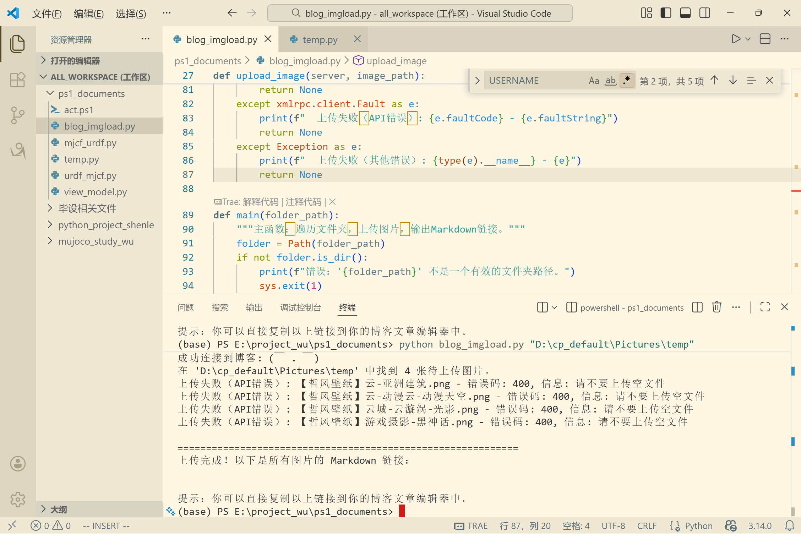

# 原因
在博客园后台没发现能一次性上传多张图片的选项，功能    
在vsc的插件里面也得每次先复制到粘贴板，再快捷键复制一张   
之前某些情况上传需要上传多张图片，都是一张一张传的，  
希望下次能有个简便的方法，所以用 ___ai___ 写了个py脚本  
（非专业,ai生成较为臃肿）    

# 依赖
脚本依赖  
```py
pip install requests  #用来发送HTTP POST请求
```
- - -
链接博客园需要metaweblog访问令牌（博客园设置最下方）    
  


- - -
# 测试脚本
测试能否成功连接博客园，顺便查看下自己的博客id  
```py
import xmlrpc.client

# 请将以下变量替换为你的真实凭证
API_URL = ""   # 你的博客园metaweblog API地址，通常是 https://rpc.cnblogs.com/metaweblog/你的博客园用户名
USERNAME = ""  # 你的博客园登录用户名
PASSWORD = "" # 你的令牌

def get_blog_id():
    """通过API获取博客ID"""
    try:
        server = xmlrpc.client.ServerProxy(API_URL)
        # 调用 blogger.getUsersBlogs 方法
        blogs = server.blogger.getUsersBlogs('', USERNAME, PASSWORD)
        
        if blogs:
            print("✅ 连接成功！你的博客信息如下：\n")
            # 通常用户只有一个博客，取第一个即可
            blog = blogs[0]
            print(f"   博客ID (blogid): {blog['blogid']}")
            print(f"   博客名称: {blog['blogName']}")
            print(f"   博客地址: {blog['url']}")
            print(f"\n🎯 请将以下 blogid 用于你的上传脚本：")
            print(f"   BLOG_ID = \"{blog['blogid']}\"")
            return blog['blogid']
        else:
            print("未找到博客信息。")
            return None
            
    except xmlrpc.client.Fault as e:
        # 处理API级别的错误（如密码错误）
        print(f"❌ API调用失败 [错误码 {e.faultCode}]: {e.faultString}")
        if e.faultCode == 801:
            print("提示：这通常意味着用户名或密码/令牌不正确。请检查你的凭证。")
        return None
    except Exception as e:
        # 处理网络连接等其他错误
        print(f"❌ 发生错误: {e}")
        return None

if __name__ == "__main__":
    get_blog_id()
```
- - -
## 输出示例
```ps
(base) PS E:\project_wu\ps1_documents> python .\getblog.py

   博客ID (blogid): XXXXXX
   博客名称: (￣ . ￣)
   博客地址: https://www.cnblogs.com/shenleblog/

🎯 请将以下 blogid 用于你的上传脚本：
   BLOG_ID = "XXXXXX"
```


# 上传复数图片脚本
1. 将所有图片放置在同一文件夹，执行脚本      
2. 可修改“默认路径”：DEFAULT_FOLDER      
3. 也可在脚本后输入参数，指定文件夹路径  
```py
#!/usr/bin/env python3
"""
博客园图片批量上传脚本
基于手动构建XML-RPC请求。
用法:python blog_imgload_final.py [图片文件夹路径]
"""

import base64
import xml.etree.ElementTree as ET
import requests
import sys
import os
import argparse
from pathlib import Path

# ============== 你的配置 ==============
API_URL = ""   # 你的博客园metaweblog API地址，通常是 https://rpc.cnblogs.com/metaweblog/你的博客园用户名
USERNAME = ""  # 你的博客园登录用户名
PASSWORD = "" # 你的令牌
BLOG_ID = ""  #理论上可以为0
# =====================================

SUPPORTED_EXTENSIONS = {'.jpg', '.jpeg', '.png', '.gif', '.bmp', '.webp'}

def build_xml_request(image_path):
    """手动构建XML-RPC请求体(已验证的核心函数)"""
    with open(image_path, 'rb') as f:
        image_bytes = f.read()
    
    base64_data = base64.b64encode(image_bytes).decode('ascii')
    
    method_call = ET.Element('methodCall')
    method_name = ET.SubElement(method_call, 'methodName')
    method_name.text = 'metaWeblog.newMediaObject'
    
    params = ET.SubElement(method_call, 'params')
    
    # 四个参数：blogid, username, password, file struct
    for text in [BLOG_ID, USERNAME, PASSWORD]:
        param = ET.SubElement(params, 'param')
        value = ET.SubElement(param, 'value')
        string_elem = ET.SubElement(value, 'string')
        string_elem.text = text
    
    # 构建 file struct
    param4 = ET.SubElement(params, 'param')
    value4 = ET.SubElement(param4, 'value')
    struct = ET.SubElement(value4, 'struct')
    
    # bits (base64)
    member1 = ET.SubElement(struct, 'member')
    name1 = ET.SubElement(member1, 'name'); name1.text = 'bits'
    value_m1 = ET.SubElement(member1, 'value')
    base64_elem = ET.SubElement(value_m1, 'base64'); base64_elem.text = base64_data
    
    # name (string)
    member2 = ET.SubElement(struct, 'member')
    name2 = ET.SubElement(member2, 'name'); name2.text = 'name'
    value_m2 = ET.SubElement(member2, 'value')
    string_m2 = ET.SubElement(value_m2, 'string'); string_m2.text = os.path.basename(image_path)
    
    # type (string)
    member3 = ET.SubElement(struct, 'member')
    name3 = ET.SubElement(member3, 'name'); name3.text = 'type'
    value_m3 = ET.SubElement(member3, 'value')
    string_m3 = ET.SubElement(value_m3, 'string')
    ext = os.path.splitext(image_path)[1].lower()
    mime_type = f'image/{ext[1:]}' if ext in ['.jpg', '.jpeg', '.png', '.gif', '.bmp'] else 'application/octet-stream'
    string_m3.text = mime_type
    
    xml_str = ET.tostring(method_call, encoding='utf-8', method='xml').decode('utf-8')
    return f"<?xml version='1.0' encoding='UTF-8'?>\n{xml_str}"

def upload_single_image(image_path):
    """上传单张图片并返回URL,集成到批量处理中"""
    print(f"  正在处理: {os.path.basename(image_path)} (大小: {os.path.getsize(image_path)} 字节)")
    
    xml_body = build_xml_request(image_path)
    headers = {'Content-Type': 'text/xml; charset=utf-8'}
    
    try:
        response = requests.post(API_URL, data=xml_body.encode('utf-8'), headers=headers, timeout=30)
        response.raise_for_status()
        
        # 解析XML响应，提取URL
        root = ET.fromstring(response.text)
        fault = root.find('.//fault')
        if fault is not None:
            # 提取错误信息
            fault_string = fault.find('.//string')
            if fault_string is not None and fault_string.text:
                print(f"  ❌ 上传失败: {fault_string.text}")
            else:
                print(f"  ❌ 上传失败: API返回错误结构")
            return None
        
        # 查找返回的URL (响应中的第一个<string>标签内容)
        url_elem = root.find('.//string')
        if url_elem is not None and url_elem.text:
            image_url = url_elem.text
            print(f"  ✅ 上传成功!")
            return image_url
        else:
            print(f"  ❌ 上传失败: 响应中未找到URL")
            return None
            
    except requests.exceptions.RequestException as e:
        print(f"  ❌ 网络请求失败: {e}")
        return None
    except Exception as e:
        print(f"  ❌ 意外错误: {type(e).__name__}: {e}")
        return None

def main():
    # 设置默认路径
    DEFAULT_FOLDER = r"D:\cp_default\Pictures\temp"
    
    parser = argparse.ArgumentParser(
        description='批量上传图片到博客园',
        formatter_class=argparse.RawDescriptionHelpFormatter,
        epilog=f"""
使用示例:
  %(prog)s                    # 使用默认路径: {DEFAULT_FOLDER}
  %(prog)s "C:\\MyImages"     # 使用自定义路径
        """
    )
    
    parser.add_argument(
        'folder', 
        type=str, 
        nargs='?',  # 使参数变为可选
        default=DEFAULT_FOLDER,
        help=f'包含图片的文件夹路径 (默认: {DEFAULT_FOLDER})'
    )
    
    args = parser.parse_args()
    
    folder_path = Path(args.folder)
    if not folder_path.is_dir():
        print(f"错误: '{args.folder}' 不是一个有效的文件夹路径")
        sys.exit(1)
    
    print(f"博客园图片批量上传 - 使用路径: {folder_path}")
    print("=" * 60)
    
    # 使用集合(Set)自动去重，再转换为列表
    image_files_set = set()
    for file_path in folder_path.rglob('*'):
        if file_path.is_file():
            if file_path.suffix.lower() in SUPPORTED_EXTENSIONS:
                # 使用文件的绝对路径作为集合的键，确保唯一性
                image_files_set.add(file_path.resolve())
    
    # 将集合转换回列表以便后续遍历
    image_files = list(image_files_set)
    
    if not image_files:
        print(f"在 '{args.folder}' 中未找到支持的图片文件")
        print(f"支持格式: {', '.join(SUPPORTED_EXTENSIONS)}")
        return
    
    print(f"找到 {len(image_files)} 张待上传图片\n")
    
    # 上传所有图片并收集链接
    markdown_links = []
    success_count = 0
    
    for image_file in image_files:
        url = upload_single_image(str(image_file))
        if url:
            markdown_links.append(f"")
            success_count += 1
        print()  # 空行分隔
    
    # 输出最终结果
    print("=" * 60)
    if success_count > 0:
        print(f"批量上传完成！成功 {success_count}/{len(image_files)} 张")
        print("Markdown链接如下:\n")
        for link in markdown_links:
            print(link)
    else:
        print("所有图片上传均失败")
    print("\n提示：你可以直接复制以上链接到你的博客文章编辑器中。")

if __name__ == "__main__":
    main()
```
- - -
## 输出示例  
```ps
(base) PS E:\project_wu\ps1_documents> python blog_imgload_final.py                              
博客园图片批量上传 - 使用路径: D:\cp_default\Pictures\temp
============================================================
找到 5 张待上传图片

  正在处理: 【哲风壁纸】云-动漫云-动漫天空.png (大小: 9124711 字节)
  ✅ 上传成功!

  正在处理: 【哲风壁纸】云城-云漩涡-光影.png (大小: 1436233 字节)
  ✅ 上传成功!

  正在处理: test1.png (大小: 547830 字节)
  ✅ 上传成功!

  正在处理: 【哲风壁纸】云-亚洲建筑.png (大小: 542527 字节)
  ✅ 上传成功!

  正在处理: 【哲风壁纸】游戏摄影-黑神话.png (大小: 1597735 字节)
  ✅ 上传成功!

============================================================
批量上传完成！成功 5/5 张
Markdown链接如下:


     
     
   
```  
