


# 机器人导论学习
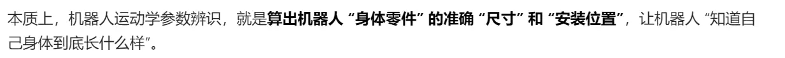
## 第一章
### 正运动学和逆运动学
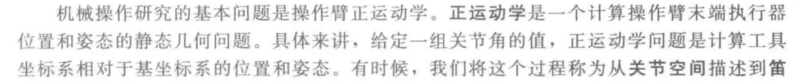
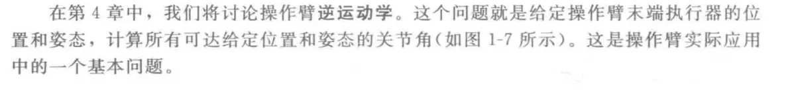
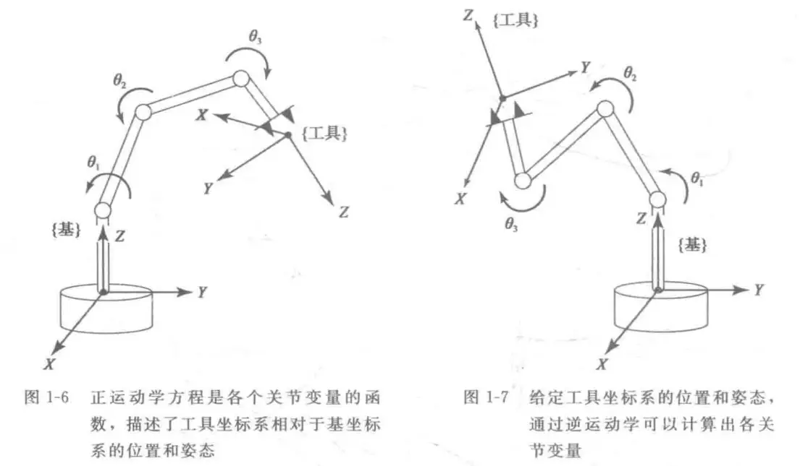
### 关节空间和笛卡尔空间


|对比维度|关节空间|笛卡尔空间|
|---    |---    |---      |
|描述对象|机器人自身关节的运动|末端执行器在全局的状态|
|指令类型|关节角度 / 速度 / 扭矩（电机可直接执行）|位置 (x,y,z)+ 姿态（用户 / 任务层面）|
|动力学计算|直接建模、计算简单|需转换到关节空间，计算复杂|
|运动约束|需考虑关节限位（如转角不超过 180°）|需考虑空间障碍物（如不撞桌子）|

- - -
#### 奇异点
在奇异点，映射不可逆，___关节空间到笛卡尔空间的转换 “失效” 的特殊姿态___，此时机器人末端执行器会丢失某个方向的运动能力，还可能出现关节扭矩无穷大的风险
#### 轨迹生成
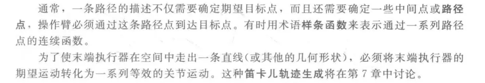

### DH建模（SDH、MDH）
正运动学建模：
DH:
[SDH与MDH的区别](https://zhuanlan.zhihu.com/p/1929494983540475477)  
[MDH建模](https://www.cnblogs.com/s206/p/16067661.html)  
[SDH与MDH建模](https://blog.csdn.net/jiachin/article/details/113850912)  
- - -
#### SDH:关节处建立坐标
每个关节分配一个坐标系：坐标系 i 固定在连杆 i 的末端（即关节 i+1 的轴线上）。  
特殊处理：基座坐标系 0 与连杆 0 的坐标系重合，末端执行器坐标系 n 固定在连杆 n 的末端。
#### MDH:将关节坐标建立在连杆的近端
每个关节分配一个坐标系：但坐标系 i 固定在连杆 i−1 的末端（即关节 i 的轴线上）。  
特殊处理：基座坐标系 0 位于第一个关节轴线上，末端执行器坐标系 n 固定在最后一个关节轴线上。  
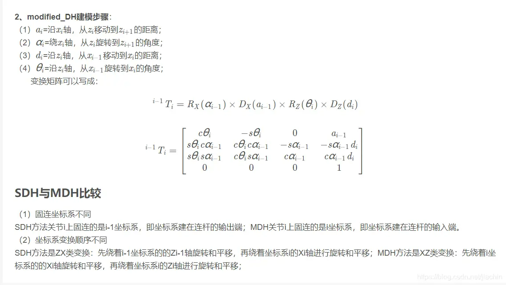
- - -
此外还有___六参数Stone模型、CPC模型、modified CPC模型___

### 机器人工作空间分析
机器人的工作空间是指机器人在完成所有可到达的位置时，末端执行器包括的 总体空间体积。   
常用的工作空间分析法：数值法、几何法、解析解法  
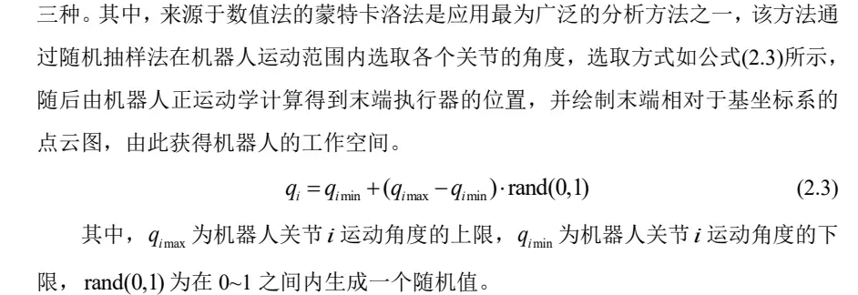
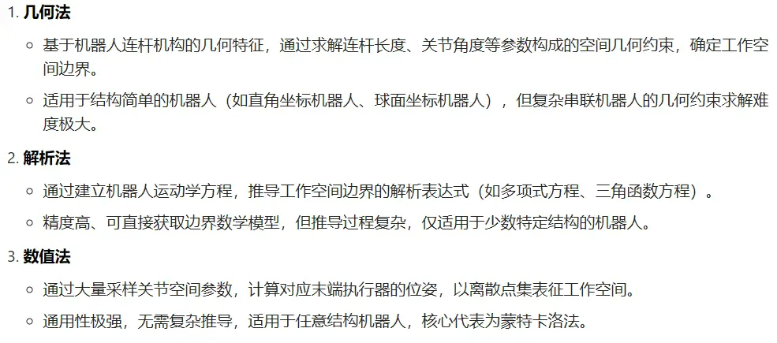

### 动力学建模
#### 牛顿欧拉法
牛顿欧拉法的本质：___给机器人的每个关节、每根 “胳膊腿”（连杆）算 “受力” 和 “运动”，从最底下的底座一步步算到最顶端的爪子，再反过来核对一遍，确保算得准。___  
  从下往上算：正递推  
  从上往下算：逆递推  
#### 拉格朗日法
能量的角度出发,虚功原理  
___不算机器人每个零件的受力，只看 “总能量” 的变化，就能算出每个关节该用多大劲___

### 动力学参数辨识原理
动力学参数辨识原理  
参数辨识流程图：  
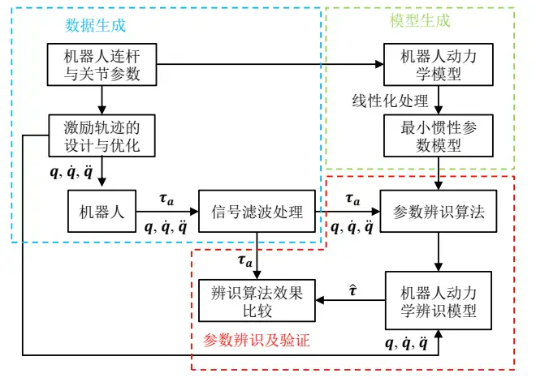

#### 激励轨迹：
合理的激励轨迹不仅应当保证机器人平稳运行，还应该保证可以尽可能激发机器人的动力学特性并且遍布机器人的工作空间。   
激励轨迹的设计主要包含___激励轨迹类型___的选择和___激励轨迹参数的优化___   

目前学者大多多选用___多项式___或___傅里叶级数___生成轨迹   


多项式轨迹的 计算较为简便，易于实现，且容易满足轨迹边界位置的约束条件，但该方法在信号处 理过程中辨识效率较低   

傅里叶级数轨迹通过叠加基频整数倍的信号组成激励轨迹， 傅里叶轨迹具有较好的周期性和连续性，在单次辨识实验中可以连续运行激励轨迹， 由此可以保证多次激励轨迹的运行工况相同，提高了信号的信噪比，减少了噪声对辨 识结果的影响；傅里叶级数多阶可导，求导运算简单，极大地提高了机器人关节角速 度和角加速度的求解速度；通过使用有限项可以设计频率范围，可以有效地减少高频 噪声和关节柔性效应对辨识结果的影响   


轨迹约束：机器人在运动过程中不仅受到工作空间和关节模组运动限位的约束，而且由于机器人伺服电机性能约束的影响，机器人的关节角度，关节角速度和关节角加速度均 需要满足一定的限制，从而避免在机器人运动过程中发生碰撞或导致部件过载等情 况。   
___因为机器人结构的物理约束，动力学参数并非任意取值，而是存在参数的上下限___
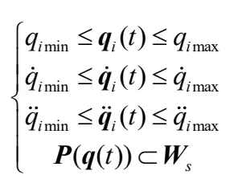
为了便于参数辨识，起始状态和终止状态角度相同，启停位置处角速度与角加速度数值均应设置为0  
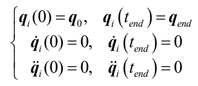
___观测矩阵 Y___ 的条件数是评判激励轨迹在辨识过程中的抗噪能力的重 要指标。（轨迹观测矩阵的条件数越小，激励轨迹的抗噪能力越强）
条件数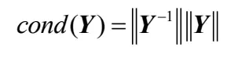
将轨迹优化问题转化为___ 观测矩阵条件数优化问题，___  
凸优化问题（___目标函数为凸函数、约束集合为凸集___，这类问题具有全局最优解唯一的优良性质）  

#### 信号处理
降噪：均值滤波法（1）  
括卡尔曼滤波、无限脉冲响应滤波、巴特沃斯滤波（2）  
#### 基于加权最小二乘法的参数辨识 
最小二乘法（Least Squares，LS）  
（通过求导的方法找到损失函数 L(w, b) 的最小值。将 L(w, b) 分别对 w 和 b 求偏导，并令其等于零）
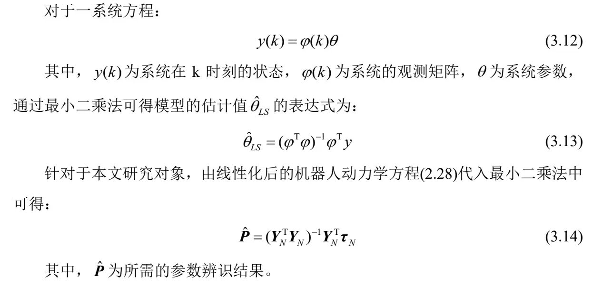
（当样本量 n 或特征维度很高时，计算量会非常大，尤其是需要求解矩阵的逆==>最小二乘法在处理复杂系统模型时的计算耗时较长，抗噪声能力较弱，仅采用 最小二乘法难以保证动力学方程的精确性。）   
加权最小二乘法（Weighted Least Squares，WLS）  
引入权重矩阵对LS法进行改善（权重矩阵可以由机器人关节的测量力矩估计误差的协方差进行表征）  
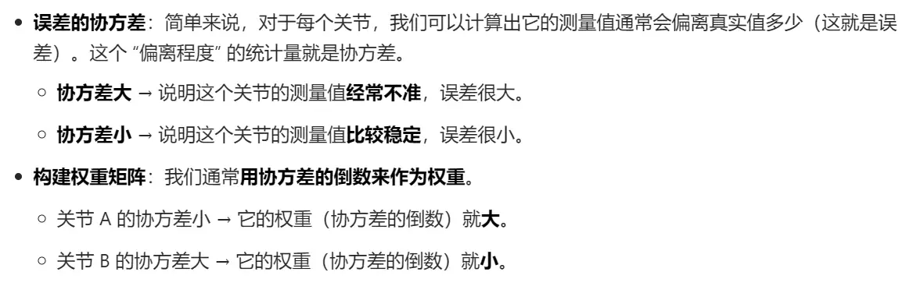
（但设置合适的权重因子需要一定的 先验条件或额外用于分析的数据，一定程度上限制了加权最小二乘 法的应用。）
#### 基于改进遗传算法的参数辨识 
启发式全局 优化方法  
遗传算法对于全局最优问题求解中，算法的鲁棒性和适应性较强，全局搜索能力强（但是控制参数和适应度函数选择不当时，算法计算效率较 低且容易陷入局部最优）  
遗传算法：从给定的初始随机种群出发，依赖于种群中个体随机的交 叉、变异等现象生成适应度更高的个体。通过迭代，重复种群进化环节，从而使得种 群寻得全局最优解。  
核心在于  <u>适应度函数的设计、遗传参数的设置、基因变异和交叉的选择</u>
1. 基因变异概率越大，算法跳出局部最优解的概率越高
2. 基因变异概率过高，退化为随机搜索
3. 交叉概率越大，新个体产生速度越快，增强算法全局搜索能力
4. 交叉概率过大，种群中适应度较高个体被影响的概率增加，降低种群质量。  

__改进遗传算法：__
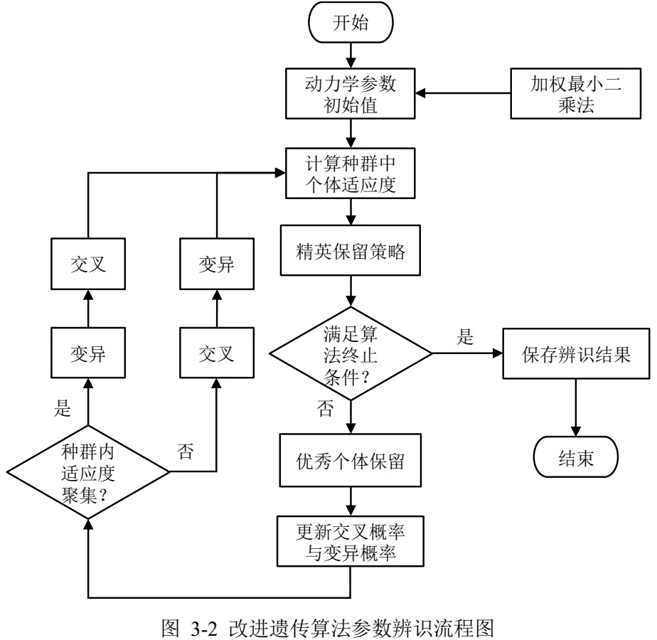
__为保证算法的所设计算法的收敛性，采用精英保留策略。__  
每次迭代之后将子代 种群中适应度最高值与父代种群中适应度最高值进行比较，若父代中适应度最高值 大于子代，则随机淘汰一个子代种群中的个体，并将父代中适应度最高的个体加入子 代种群中。   
- - -
- - 
- - -
# matlab机器人工具箱学习
## 机器人工具箱-常用函数
### 1. 旋转-旋转矩阵  
rotx()   roty()   rotz() :相应绕x轴，y轴，z轴旋转得到的旋转矩阵    
eul2r():欧拉角转旋转矩阵    
tr2eul():旋转矩阵转欧拉角  
rpy2r():roll-pitch-yaw转旋转矩阵  
tr2rpy():旋转矩阵转roll-pitch-yaw   


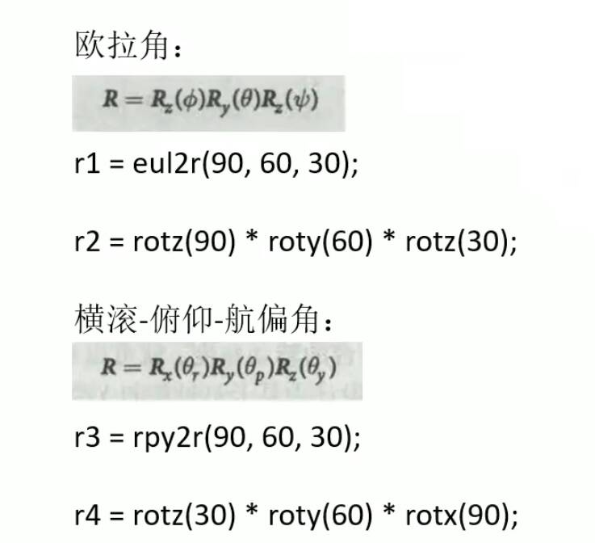

补充解释：  
旋转矩阵描述了旋转，没有平移
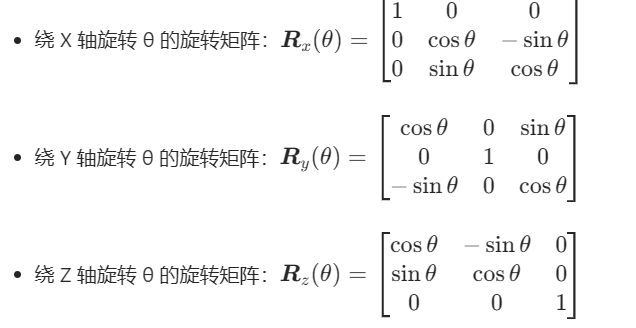
绕当前坐标系（“本体坐标系”“动系”）旋转，是每次旋转后坐标系跟着转动；  
绕固定坐标系（也叫 “惯性坐标系”“静系”）旋转，是每次旋转都基于最初的坐标系。

左乘是 “相对于固定坐标系” 做变换，右乘是 “相对于当前（本体）坐标系” 做变换  
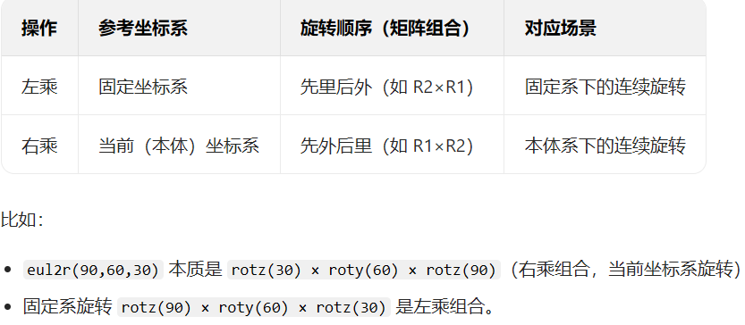
- - -
```matlab
>>  r1 = eul2r(pi/2, pi/3, pi/6);          % 假设是固定坐标系Z-Y-Z（α=90, β=60, γ=30）
r2 = rotz(pi/2) * roty(pi/3) * rotz(pi/6);  % 固定坐标系下的Z-Y-Z手动组合
>> r1

r1 =

   -0.5000   -0.8660         0
    0.4330   -0.2500    0.8660
   -0.7500    0.4330    0.5000

>> r2

r2 =

   -0.5000   -0.8660         0
    0.4330   -0.2500    0.8660
   -0.7500    0.4330    0.5000

>> 


>> r3=rpy2r(pi/2,pi/3,pi/6);
r4=rotz(pi/6)*roty(pi/3)*rotx(pi/2);
>> r3

r3 =

    0.4330    0.7500    0.5000
    0.2500    0.4330   -0.8660
   -0.8660    0.5000         0

>> r4

r4 =

    0.4330    0.7500    0.5000
    0.2500    0.4330   -0.8660
   -0.8660    0.5000         0

>> 
```


- - -
### 2. 旋转-变换矩阵

trotx()   troty()   trotz() :相应绕x轴，y轴，z轴旋转得到的变换矩阵    
eul2tr():欧拉角转变换矩阵    
tr2eul():变换矩阵转欧拉角  
rpy2tr():roll-pitch-yaw转变换矩阵  
tr2rpy():变换矩阵转roll-pitch-yaw   

- - -
补充解释：  
变换矩阵描述了旋转+平移（包含了旋转矩阵的信息）
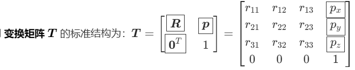  

绕当前坐标系旋转是右乘：   
>T1=eul2tr(pi/2, pi/3, pi/6);  
>T2=trotz(pi/2)* troty(pi/3)* trotz(pi/6);  
>T1=T2;

绕固定坐标系旋转是左乘：  
>T3 = rpy2tr(pi/2, pi/3, pi/6);  
>T4 = trotz(pi/6)* troty(pi/3)* trotx(pi/2);  
>T3=T4;
```matlab
>> T1=eul2tr(pi/2, pi/3, pi/6); 
T2=trotz(pi/2)* troty(pi/3)* trotz(pi/6);  
T3 = rpy2tr(pi/2, pi/3, pi/6);  
T4 = trotz(pi/6)* troty(pi/3)* trotx(pi/2);  
>> T1

T1 =

   -0.5000   -0.8660         0         0
    0.4330   -0.2500    0.8660         0
   -0.7500    0.4330    0.5000         0
         0         0         0    1.0000

>> T2

T2 =

   -0.5000   -0.8660         0         0
    0.4330   -0.2500    0.8660         0
   -0.7500    0.4330    0.5000         0
         0         0         0    1.0000

>> T3

T3 =

    0.4330    0.7500    0.5000         0
    0.2500    0.4330   -0.8660         0
   -0.8660    0.5000         0         0
         0         0         0    1.0000

>> T4

T4 =

    0.4330    0.7500    0.5000         0
    0.2500    0.4330   -0.8660         0
   -0.8660    0.5000         0         0
         0         0         0    1.0000

>> 
%% 上面平移向量为0  
```


- - -
### 3. 位移-变换矩阵、旋转矩阵-变换矩阵    
transl():位移向量转变换矩阵    
t2r():变换矩阵转旋转矩阵  
r2t():旋转矩阵转变换矩阵  
- - -
eg:  
```matlab
>> T = transl(1.5,1,0.5)*trotx(pi/6)*trotz(pi/3);
P = transl(T);
R = t2r(T);
>> T

T =

    0.5000   -0.8660         0    1.5000
    0.7500    0.4330   -0.5000    1.0000
    0.4330    0.2500    0.8660    0.5000
         0         0         0    1.0000

>> P

P =

    1.5000
    1.0000
    0.5000

>> R

R =

    0.5000   -0.8660         0
    0.7500    0.4330   -0.5000
    0.4330    0.2500    0.8660

>> 

```
- - -
### 4. SerialLink类  
描述串联机器人的核心类  

1、 关键属性  
>.links：存储所有连杆的Link对象数组；  
>.name：机器人名称；  
>.n：机器人自由度（关节数）；  
>.dh：D-H 参数表（标准或改进型）。  
-  - -
2、 关键方法  
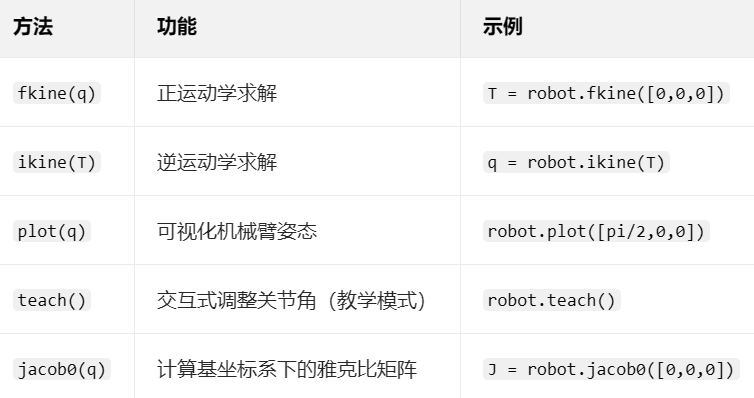
>fkine(正运动学)：已知机械臂所有关节的角度 / 位移（关节空间），通过 D-H 参数和变换矩阵的串联计算，求解末端执行器的位姿（笛卡尔空间，用 4×4 变换矩阵表示）。  
- -
>ikine(逆运动学)：已知末端执行器的目标位姿（笛卡尔空间，4×4 变换矩阵或位置 + 姿态），求解能让末端到达该位姿的关节角向量。    
- - -
eg
```matlab
% 定义连杆：Link([theta, d, a, alpha], 'standard') （标准D-H参数）
L1 = Link([0, 0, 0, pi/2], 'standard');  % 连杆1：theta=0, d=0, a=0, alpha=pi/2
L2 = Link([0, 0, 0.5, 0], 'standard');   % 连杆2：theta=0, d=0, a=0.5, alpha=0
L3 = Link([0, 0, 0.5, 0], 'standard');   % 连杆3：theta=0, d=0, a=0.5, alpha=0

% 用SerialLink串联连杆，命名为“my_robot”
robot = SerialLink([L1, L2, L3], 'name', 'my_robot');

%可视化机器人  
robot.plot([0, 0, 0]);  % 绘制关节角为[0,0,0]时的机械臂姿态  
%正运动学求解
T = robot.fkine([pi/4, pi/4, 0]);  % 输入关节角，输出末端变换矩阵T
%逆运动学求解
q = robot.ikine(T);  % 输入末端变换矩阵T，输出关节角q
%显示机器人信息
robot.display();  % 打印连杆参数、自由度等信息
```
___matlab命令行输入“doc SerialLink”查看详细介绍___


## 机械臂工作空间可视化  
__思路__：  
在关节空间内随机生成一个关节变量，    
然后通过正运动学函数fkine() 得到相应的变换矩阵（表示末端执行器位姿）  
再用transl()函数得到位移向量（三维空间坐标）  
然后在三维空间内画上一个点，反复迭代  
当点足够多的时候，近似形成机械臂的工作空间（<u>蒙特卡洛法</u>）
- - -
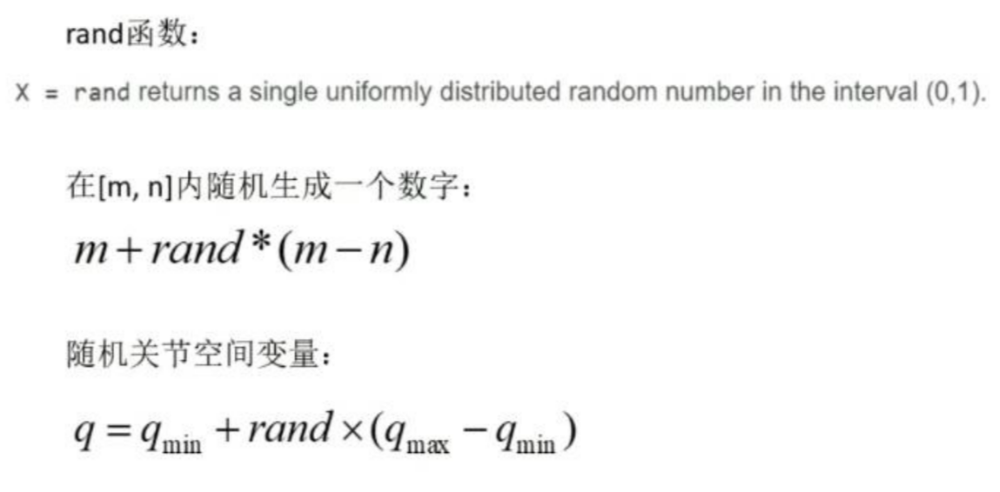


```matlab
%% plot
clear;
clc;
L(1) = Link('revolute','d',0.216,'a',0,'alpha',pi/2,'qlim',[-150,150]/180*pi);
L(2) = Link('revolute','d',0,'a',0.5,'alpha',0,'offset',pi/2,'qlim',[-100,90]/180*pi);
L(3) = Link('revolute','d',0,'a',sqrt(0.145^2+0.42746^2),'alpha',0,'offset',-atan(427.46/145),'qlim',[-90,90]/180*pi);
L(4) = Link('revolute','d',0,'a',0,'alpha',pi/2,'offset',atan(427.46/145),'qlim',[-100,100]/180*pi);
L(5) = Link('revolute','d',0.258,'a',0,'alpha',0,'qlim',[-180,180]/180*pi);
Five_dof = SerialLink(L,'name','5-dof');
Five_dof.base = transl(0,0,0.28);
% Five_dof.teach

%关节空间可视化
num=30000; %迭代次数
P = zeros(num,3);%首先声明的位置矩阵
for  i=1:num
    %相应生成五个关节随机变量
    q1 = L(1).qlim(1)+rand * (L(1).qlim(2)-L(1).qlim(1));
    q2 = L(2).qlim(1)+rand * (L(2).qlim(2)-L(2).qlim(1));
    q3 = L(3).qlim(1)+rand * (L(3).qlim(2)-L(3).qlim(1));
    q4 = L(4).qlim(1)+rand * (L(4).qlim(2)-L(4).qlim(1));
    q5 = L(5).qlim(1)+rand * (L(5).qlim(2)-L(5).qlim(1));

    q=[q1, q2, q3, q4, q5];%组合成1*5的关键向量变量

    T = Five_dof.fkine(q);%用正运动学函数求解末端的变换矩阵

    P(i,:)=transl(T);%提取末端的坐标点
end
plot3(P(:,1), P(:,2), P(:,3), 'b.','markersize',1);

%画上机械臂
hold on;grid on;
daspect([1 1 1]);
view([45 45]);
Five_dof.plot([0 0 0 0 0]);
```
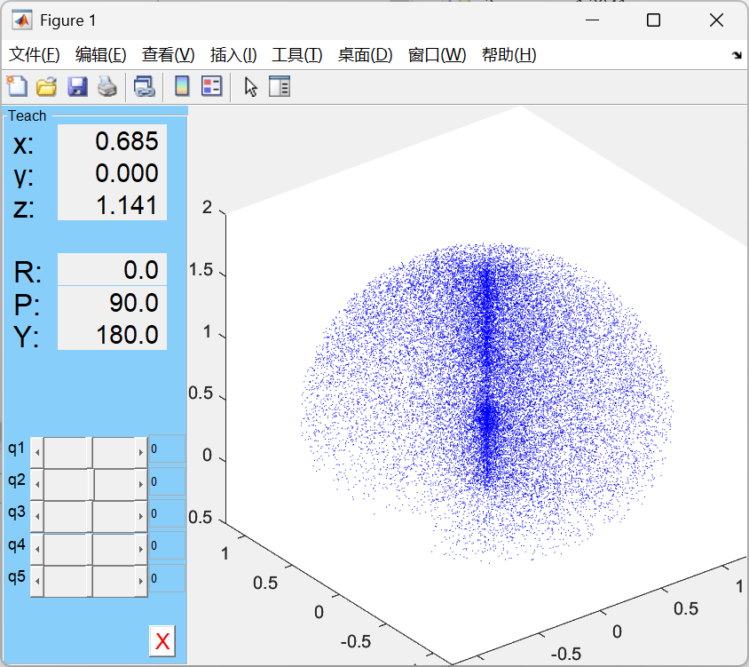
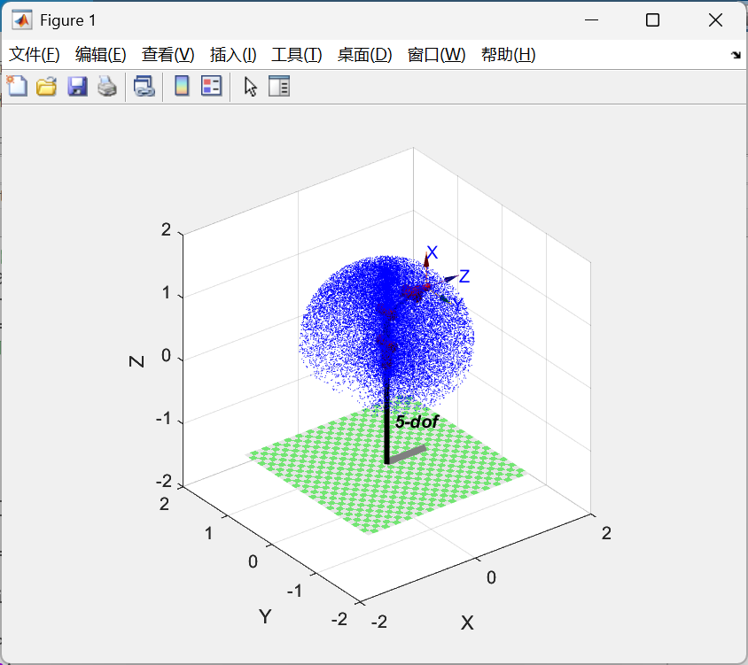