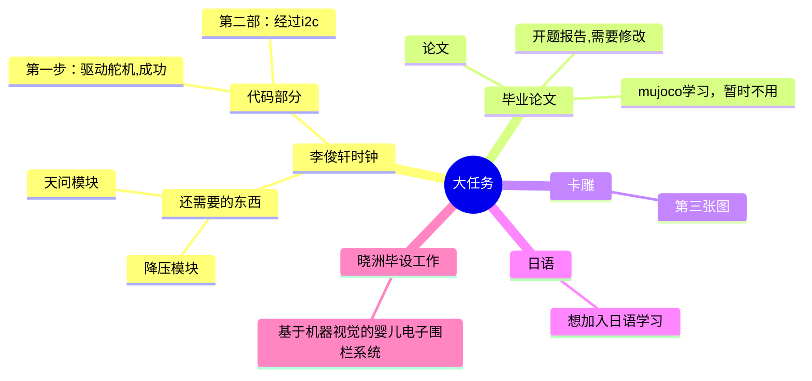
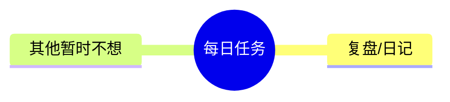
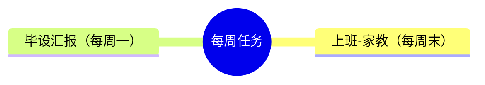
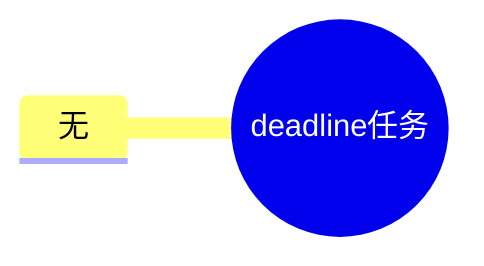

# 任务和事项

```mermaid  
mindmap
root((大任务))
    李俊轩时钟
        还需要的东西
            降压模块
            天问模块
        代码部分
            第一步：驱动舵机,成功
            第二部：经过i2c
    毕业论文
        论文
        开题报告,需要修改
        mujoco学习，暂时不用
    卡雕
        第三张图
    日语
        想加入日语学习
    晓洲毕设工作
        基于机器视觉的婴儿电子围栏系统  
```
- - -

```mermaid  
mindmap
root((每日任务))
    复盘/日记
    其他暂时不想
```
- - -

```mermaid  
mindmap
root((每周任务))
    上班-家教（每周末）
    毕设汇报（每周一）
```
- - -

```mermaid  
mindmap
root((deadline任务))
    无
```
- - -
- - -
- - -


# 梦
```
主机设备
    显卡
    机箱
    电源
3d打印机
ps5设备
vrchat设备
NAS设备
女装
书，书墙
单肩包-got
新双肩包
嘴唇手术或处理
化妆品

```