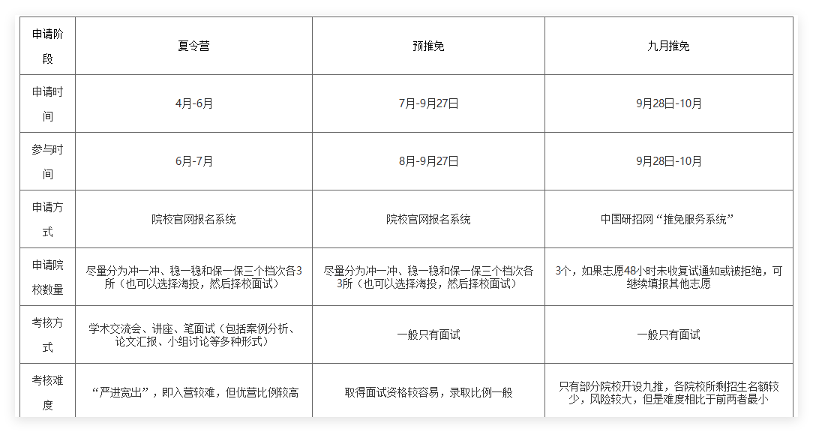

---
title: "2025_04_22"
date: "2025-04-22 13:34:27"
tags: "保研信息"
hidden: true
top: false
layout: post
---
<meta name="referrer" content="no-referrer"/>

<!-- more -->

#    2020级经验
- - -
通信工程  张旭婉  推免第一  国防科技大学
（蓝桥杯省一）
- - -
通信工程  钱顺  推免第二（绩点第一）  华南理工大学
（）
- - -
通信工程  卢浩  推免第三  中国科学院大学    
（智能车赛区一等奖，节能减排国三） 
- - -
通信工程  贾静妮 推免第四  中南大学
（大唐杯国三，大英赛三等奖）  
- - -
通信工程  游蕾  推免第五  天津大学
（大唐杯国一）
- - -
通信工程  涂腾辉 推免第六  中科院光电所
（大唐杯国三，挑战杯省三）
- - -
通信工程  陈诺  推免第七  中南大学
（SCI一篇）
- - -
通信工程  朱嘉明 推免第八  湖南大学
（智能车国一）
- - -
通信工程  唐明  推免第九  湖南大学 
（智能车国一*2）
- - -
通信工程  周豪杰  推免第十  中科院光电所
（蓝桥杯省一，电赛省二，大唐杯省二，智能导航省三，机器人省三，计算机设计省三）
- - -
通信工程  魏子硕  推免第十二（绩点第十）  西安电子科技大学
（智能车区二）
- - -
通信工程  陈霞 （绩点排名前五、综测排名十多名）   深圳大学（非985211）
（大学生统计建模竞赛国三）
- - -

- - -
电子信息  易鑫  推免第一  湖南大学   **QQ：2390417448。**
（智能车国二，电赛省二）
- - -
电子信息  刘雨晴 推免第二  中山大学
（智能车省一，大英赛三等奖）  
- - -
电子信息  康伟泉 推免第三（绩点第二）  国防科技大学
（华为杯国二，数学建模省一，北斗杯区一）
- - -
电子信息  程威  推免第四  湖南大学
（数模国赛省一，蓝桥杯省二/国二？）
- - -
电子信息  王依琳  推免第五  中南大学
（节能减排国三，物联网+省二）
- - -
电子信息  杨志豪  推免第五（绩点第九）  湖南大学
（数学竞赛省一）
- - -
电子信息  徐珂健  推免第六（绩点第十一）  湖南大学
（国奖*2，省奖10余）
- - -
电子信息  唐昊  推免第七（绩点第三）  湖南大学
（数模国赛省二）
- - -
电子信息  方欣璞  推免第八（绩点第七）  湖南大学
（华为杯省二）
- - -
电子信息  杨甜宇 绩点第八  湖南大学
（挑战杯省三，北斗杯省一，嵌入式大赛省三，物联网设计竞赛区二）
- - -
电子信息  周骏驰  推免第十  湖南大学
（）
- - -
电子信息  刘珩  推免第十一  深圳大学  
（大唐杯省二，蓝桥杯省三）
- - -
电子信息  杨晶晶 推免第十二  中科院光电所
（）
- - -

- - -
自动化  王惠东  推免第二   湖南大学
（智能车国一，电赛省二）
- - -
自动化  刘锐萍  （绩点第二） 天津大学  
（数模省二，北斗杯省三）  
- - -
自动化  赖缘川  （绩点第三） 中山大学
（智能车，电赛（没明说））
- - -
自动化  廖湘东  推免专四   湖南大学  
（西门子国特，蓝桥杯国二，高教社数模省一）
- - -
自动化  孙健伟  推免第五（绩点第四）  湖南大学
（工创银奖，嵌赛国三，机创省二，北斗省二）
- - -
自动化  周惠柔  推免第六  华南理工大学
（数学建模省一，美赛第二，大英赛三等奖，西门子特等奖）
- - -
自动化  邓钧午  推免第七  电子科技大学
（数模国赛三等奖，美赛二等奖？智能车区二）
- - -
自动化  曾凯  推免第十一  湖南大学  
（数模国赛二等奖）  
- - -
自动化  曹泽鹏 推免第十二  湖南大学  
（智能车赛区二等奖，数模美赛H奖，湖南机器人大赛二等奖）
- - -
自动化  王梓奇  推免第十二  湖南大学
（智能车区二，机器人大赛省一）
- - -
自动化  郑熠驰              湖南大学
（数学建模省一，数学竞赛省三，大英赛国二）
- - -
自动化  陈佳                湖南大学
（）
- - -
自动化  周文权  推免第十五  哈尔滨工程大学
（西门子省三，蓝桥杯省三，挑战杯省三）
- - -
自动化  周一顺  推免第十六   深圳大学
（西门子省二）
- - -
自动化  董骏博              南方科技大学（非985211）
（智能车区一，电赛省三，a类会议论文一篇）
- - -

- - -
3、4月 研前准备

综合考虑，我确定了一些目标院校，并咨询了上一届推免该院校的学长学姐。为了不打无准备的仗，开始着手准备专业课复习，重点放在模电、数电、信号、通信原理等专业主干课。英语方面，在面试前练习一些简单的口语问答：介绍自己的家乡、兴趣爱好、优缺点等。  

5、6月 投递夏令营

5月、6月很多院校开始陆续放出夏令营消息。建议：大家多花时间浏览下关注的保研公众号，以防错过任何一个消息。可以在手机上单独设置一个备忘录，用来记录需要投递的院校以及截止时间。同时，我为每一个需要投递的院校建立了一个单独的文件夹，并不断在里面补充相应的报名材料。就我的经验来看，夏令营能投就投，不要等预推免。
- - -
前期准备

①简历、证件照、个人陈述、联系导师邮件、荣誉奖项扫描件、自我介绍ppt等等；

②英语口语训练，可以提前准备常见的英文提问；

③保持自信，一些院校并没有想象中的那么难入营，可以大胆投递简历避免后悔，大胆尝试会有意想不到的收获，可能你入营没拿到优秀营员或者预推免未通过，但在9月29日那天也有可能收到这所学校的offer，所以先尝试最后再做选择；

④提前联系心仪院校的心仪导师，可以先与老师大致交流你感兴趣的研究方向，有利于双向选择。
- - -
面试提问其实不会问太多的专业题目刁难你，基础问题较多。**主要考你的简历，对于自己写的项目和比赛一定要清楚。英语自我介绍也是一定要准备的，可以准备一分钟版本和三分钟版本的。**
- - -
对自己的认知要准确。在面试时大多数老师都会问一句“你有读博的打算吗？”，我个人认为不是所有人都适合做科研，可能因为本科成绩不错恰好保送了研究生，但是这并不代表着具备了做科研的能力，所以在回答这个问题之前一定要对自己有清晰的认识，否则之后会很痛苦。   
- - -
其实夏令营才是保研的主战场，因为夏令营优营的效力是高于预推免的，预推免的时候就算表现得再好，录取的时候也是排在夏令营的后面，先录取夏令营的同学，再录取预推免的同学。  
- - -
建议做一个**Excel表，标明不同学校的申请条件、申请方式、面试申请系统、系统账号密码、所需材料、材料准备进度、是否邮寄材料、材料审核时间、联系人、是否入营、夏令营活动时间及形式、夏令营考核范围模式、offer时间等等，在日历上标注时间节点。**
- - -
夏令营面试主要分为**自我介绍、专业课提问、科研竞赛经历**提问三部分。针对**自我介绍，准备中文和英文两份，并且在夏令营开始前熟悉好（最好是能够全文背诵）**。**针对专业课提问部分，在准备期间，可以多看看相关的经验贴和知识总结**，有针对性的去准备。**针对科研竞赛部分，把自己做过的项目和科研经历做好总结，做成简历或者是自我介绍PPT，提前准备有可能的提问**。最后，在准备夏令营和预推免的过程中，不要过于焦虑，多看多学多问，及时的缓解自己心中的焦虑。  
- - -
关于院校线上的夏令营和预推免，我觉得只需要留一个保底院校，然后报几个想去院校的夏令营和预推免即可。**因为最后填志愿的时候只能填三个**，有些偏远学校你报了也一定不会去。但如果你有很想去的院校，就算有难度，你也一定要投。毕竟每年的保研难易情况都不同，有可能今年比较容易，你就入营了。不要给自己留遗憾。
- - -
**个人想法是，与其过分强调比赛成果，不如展示自己的参赛心得、科研体会。许多老师感兴趣的是你到底做了什么？有什么感悟？学到了什么？相比于结果，老师更看重过程。**
- - -
保研准备

保研所需要的材料十分多，包括**个人简历（中/英）、获奖证书、套磁信、研究陈述（ResearchStatement）、个人陈述、推荐信等等**。由于不同的学校会有不同的材料以及格式要求，因此有保研意向的同学应当早早准备做好。

1）不要忽视材料准备：在推免的四个阶段中，初筛（即材料审核与择优）是第一道门槛，如果学生的材料没有做好，很有可能达不到目标学校的要求。同样在联系导师的过程中也是如此；

2）以投代练：优化材料、准备材料最好的方式就是不断地投递材料！从冬令营投到春令营、从春令营投到夏令营、从夏令营投到九推。在这个过程中，你的材料会被不断优化、不断完善。这也是最有效、最省时省力的方式，其中我个人的简历就是从1月份改到了9月份。

**对于有大量科研竞赛经历的同学，参加面试前应对自己的经历有充分的认识与了解，并且有自己相应的看法。**

保研的同学在报名相应学校前，可适当了解学校是强com还是弱com。通俗来讲，**导师话语权是否大的问题**，因为有的学校学院是弱com，那么在报名该学院前同学们应先提前联系好导师，此时大概率是能够直接通过初筛，进而入选从而参加面试。如果了解不到该信息，最好的应对方法当然是在报名每个学校学院前都联系一下导师，这样既能事前选好心目中的导师，同时能够有机会提前与导师沟通交流；

在获得offer后，同学们务必需要确认offer的效力是否明确，这个希望大家能够引起重视。在我看来最有效力的当之无愧是导师与学生双选了，即导师与学生双方都十分有意愿进而签署双选表。（比如**华南理工大学电子与信息学院，不仅面试公开透明，而且还需要填写双选表，妥妥地十分讲信用**，在这里浅浅宣传一下）
- - -
在夏令营开始之前，可以看看目标院校去年的夏令营通知。**了解该院校夏令营开始的大概时间，加入相应的QQ、微信群，**可以方便我们了解其动向。同时，需要实时关注各个院校发布的夏令营通知，因为夏令营的报名时间一般只有半个月，错过了后悔也来不及了。另外，每个学校发布夏令营通知的地点不一样，学院官网、研究生招生网等都是有可能的，可以参考去年的夏令营通知，不要只盯着学院官网看，不然很容易错过。

尽可能多参加几个夏令营，虽然这样会辛苦一点，但是后面选择机会更多，**没拿到offfer也能增加你的保研面试经验**，从而提高你获得优营的概率。
- - -
夏令营基本在五六月报名，七月参加面试；预推免基本在八九月报名，九月参加面试；**建议大家在五月份左右，就把自己的竞赛奖励、个人荣誉、个人自述、个人简历、导师推荐信等文书工作准备好**。关于个人自述的写法可以去B站上搜，上面有挺多模板的，把自己的获奖证书、荣誉证书、身份证、学生证、四六级证书、计算机证书等扫描成电子版（为了美观可以使用扫描全能王等软件辅助）保存好，到时候填报系统时就可以直接往上填。报名成功之后，大家也一定要在报名网站上定时查看是否通过初审，有些学校会邮件、电话通知，有些学校是不会的，得自己去网站上看。  
目前我们在报名985学校夏令营的时候初审成功率可能只有30%。但也一定不要气馁，能投多少投多少。**个人认为夏令营的offer会比预推免“铁”一点**，所以能多报名夏令营就一定要多报名一些学校的夏令营。
- - -
参营基本流程

说明：夏令营通常是线下举行，不过仍有线上的夏令营，时间一般为一到两天，要到对应学校进行面试，可以提前了解目标院校的具体情况，下面根据天大自动化学院的面试流程给出介绍，以便参考。  
天大自动化专业的夏令营是“联系导师制”。首先联系导师，然后院里面进行审核，通过即可参加夏令营，建议尽量早一点去联系老师。天大是线上夏令营，具体流程是两天，第一天宣讲，一般是一个上午。入营之后要跟老师保持联系，第二天是线上面试，根据你的方向分组面试。  
面试内容（10分钟左右）：准备3分钟左右的（PPT报告）个人展示，包括教育背景（学习经历）、自身优势（获奖）、本学科的发展状况，并汇报意向导师的研究方向以及本人所感兴趣的课题研究等情况。  
- - -
夏令营一般在5-7月份，而预推免在8-9月份，
  
其中，简历的准备是最重要的，无论是在联系导师还是面试的时候，老师都会先通过简历来了解你。简历的设计不需要花里胡哨，简洁明了就好，重点展示自己的学习能力、科研竞赛能力以及抗压能力。当然，科研竞赛内容不丰富也没有关系，你们可以将课程设计的经历写进去。简历最好准备中文简历、英文简历以及中英文合并简历以备不同院校要求。由于有些院校老师在面试时会通过简历来问问题，所以你们需要对自己的各项经历都要了如指掌，那些模棱两可的经历最好不要写进简历。  

个人陈述作为简历的补充和说明，不仅可以让招生老师了解你选择该专业的明确性和强烈的动机，还可以让老师知道你已经具备充分的能力，可以完成该专业的学习，所以其重要性不比简历差。个人陈述的内容和简历差不多，主要将自己的学习能力、科研竞赛能力，以及对目标院校的向往详细而真诚地表达出来，字数建议先从1500字开始写，之后再按照要求进行添加以及删减即可。  

在准备材料的同时还要开始进入面试复习阶段，这里可分为两个阶段复习。
一是夏令营阶段，你们可以着重梳理自己的科研竞赛经历，毕竟还要准备期末考试（成绩是重中之重的），而且大部分的院校在夏令营的时候是很少考察专业课的知识点的，当然，如果时间足够的话，还是得复习下专业课的知识点。
二是预推免阶段，由于第一阶段你们已经梳理完自己的科研竞赛经历了，所以这个阶段你们得着重复习专业课的知识点，对于复习专业课，我的建议是结合上届学长学姐的复习资料以及目标院校考研复试科目对书本进行至少两轮的复习，复习资料的获取可以找学长学姐要，也可以在小红书上找，甚至在微博上找专门卖复习资料的博主购买。两个复习阶段都要着重准备中英文自我介绍、英语口语面试常见问题及回答，这些基本可以在小红书上找到模板然后根据自己的情况进行修改。中英文自我介绍最好准备1分钟、2分钟以及3分钟三个版本，以备不同院校的要求。  

在面试复习的阶段，大家可以尝试提前联系心仪的导师，并深入了解导师的研究方向（通过查阅导师论文了解）以及实验室情况等，也可以了解导师手中的招生名额，并大概估测自己被录取的概率。联系完导师后我们就耐心等待，由于时间的有限性，我们可以在发送邮件时将其设置为紧急状态、要求回执（就在邮件正文下面的选项），如果老师看过邮件，邮箱会自动反馈信息的（这里推荐网易163邮箱）。如果老师近一周内没看，你就可以发短信联系了（时间最好不要在晚8点以后和节假日期间）。老师的电话号码一般找该老师实验室的师兄师姐可以拿到，发短信时注意礼貌用语，表示打扰的歉意，并希望老师去看邮件等等。  
- - -

学习、竞赛、科研上述三者之中最重要的就是成绩。成绩并不等于绩点，所以不要抱着“90分万岁，89分就完了”的心态，在计算综测的时候二者并没有较大的区别  

- - -
有一些院校十分注重英语水平，因此，在夏令营之前有必要提前准备英语水平考试，确保自己能够用英语进行交流。  
写一份出色的简历也是至关重要的。有些学校会直接根据简历提问。在准备简历时，要突出自己的亮点和特色。

- - -
如果绩点排名和四六级没有那么突出可以把重心放在预推免。夏令营可以作为初步尝试阶段，用“海投”来判断自己的院校定位，如果通过了夏令营并且夏令营安排的时间没有与其它事件冲突，可以多去尝试一下就当提前练习面试。
- - -
海投策略：但我认为这并不是一个特别好的方式，原因有三：
1.投了过多学校，浪费精力（挤压复习专业课时间，大脑接受太多信息思维混乱）
2.无效功太多（要相信自己值得更好的选择）
3.会产生不必要的焦虑     
因此，我认为一个比较好的推免策略是：  
1.准备简历（做好简介并突出重点）  
2.结合自身背景并参考往届学长学姐去向定下自己心仪的学校和院系（10个左右）  
3.联系心仪学校的老师（千万不能太“模板”，态度要诚恳）  
4.关注心仪大学院系的招生通知  
5.准备面试   

推免前期踩了不少坑，错过了一些机会。回过头来看，阻碍我前进的最大障碍就是自己不爱认真思考，凡事想当然。同时，我也曾心高气傲，过于自信地认为自己比别人强。现在回想起来这些行为和想法的确有些幼稚。

对于研究方向和导师的选择，最理想的状态是选择一个自己喜欢的研究方向并且对应的导师也很nice。如果二者非要排个序的话，我更倾向于选导师，因为选择一个心仪的导师不仅能有助于解决我们研究生阶段的学习问题，还有可能影响我们的人生旅途。
- - -
有很重要的一点‼️一定要提前联系好导师！在夏令营开始前就联系！在拿到保研资格的同时，联系心仪学校的老师，参加对应学校的夏令营及预推免(一定要参加夏令营，夏令营能够选到更好的导师)。  
- - -
夏令营和预推免都要参加。有些学校的夏令营能够参加，但预推免却不一定有机会。因此，多一份准备，就多一份机会，而且越早准备越好。大概在五六月份的时候，就可以关注一些与保研相关的公众号，这些公众号会发布各种学校的夏令营信息，我建议，只要你觉得这个学校符合你的期望，不妨尝试投递申请。最好手里握有多份offer，这样可选择的范围更广。
- - -
保研政策里，绩点占比最高，甚至在报名一些学校的夏令营、预推免时也将其作为入营门槛。  

绩点排名前五、综测排名十多名，我成绩排名靠前，还是很有竞争力的。我在继续保持自己成绩排名的同时，积极寻找在大四开学前能出成绩的竞赛。    大三下学期，我面临多重挑战。既要全力以赴准备比赛，又要收集各个高校的推免信息，
  

- - -
夏令营面试中一般会有英语面试，务必准备好1min左右的英文自我介绍（具体看学校要求）并熟练背诵，流利的口语表达可以给老师留下不错的印象。在准备过程中注意对专业名词的记忆，尤其是自己感兴趣的领域，英文提问可能会问到。
- - -
比如**今年（20届）中南大学在预推免时只让自动化专业前五入营**，所以努力学习争取排名靠前很重要。

材料准备

1、提前准备好简历，通常为一页，简历通常用于提前联系老师。
2、专业课知识，通常是高数、线代、复变、数模电、自动控制原理等知识，需要提前复习。
3、面试PPT，在面试过程通常需要制作自我介绍的PPT，这个非常重要，很多院校如**天大自动化学院等都是根据PPT内容对你进行提问，内容要用心制作。**
4、中英文自我介绍和一些简单的英语问答题，部分院校要求进行英文的自我介绍，并且会有英文提问，最好提前做好充分的准备。
5、个人陈述、各类奖项证书扫描件。

“海投”也有策略，要收集好各院校的夏令营发布情况、截止时间等，根据自己的院校，排名、科研情况去投递院校。大部分学校只能选一个专业，所以这个选择是很关键的。它决定了入营的难度，一般来说冷门方向入营比较简单。对于自己的定位，可以多参考往年学长学姐的排名和去向。

很多学校都是需要联系导师才能入营。如果你的排名不够，而你的科研竞赛成果却比较丰富，老师就能直接推荐你入营，建议多找一点这样的学校，比如**电科自动化学院和天大自动化学院都是联系老师的，要注意的是不要一次性联系多个老师。**
- - -
英语水平。其实保研对英语水平的要求并不高，四六级仍然是许多学校夏令营招生的基本要求。希望大家不要因为英语条件，而与自己心仪的学校擦肩而过。  

小tips:在保研期间可以多加一些相关群聊、在知乎或者小红书上搜保研相关的帖子、**关注保研相关公众号比如保研岛等等**。多和周围的保研er交流，甚至可以在网上多认识几个大佬。保研也可以说是一场信息战，走出信息茧房才能羽化成蝶。
- - -

# 2021经验

- - -
通信工程 时溶     推免第一    中南大学
通信工程 杨四海    推免第一   国防科技大学
通信工程 李婉莹    推免第二   中国科学院大学
通信工程 邱智勇    推免专五   西安电子科技大学 （杭州研究院）
通信工程 冯明                中科院计算技术研究所
通信工程 徐怀刚               西安电子科技大学
通信工程 黄炜皓              西安电子科技大学
通信工程 黎鑫      推免专八  西安电子科技大学
通信工程 王君                西安电子科技大学
通信工程 孟璐                湖南大学
通信工程 李柏臻              湖南大学
通信工程 朱东健              南京理工大学
通信工程 黄希腾              南京航空航天大学
通信工程 蒋丽平               重庆大学
通信工程 江志勇              中科院光电所
通信工程 邓潇                中科院光电所
通信工程 叶嘉豪              中科院光电所
通信工程 熊建坤    推免十三   哈尔滨工程大学
通信工程 李嘉诺               湘潭大学
通信工程 鲁婕妤    绩点26     湘潭大学（三教授）

- - -
人工智能  彭献铖  推免第一   中南大学
人工智能  王康明             西安电子科技大学
人工智能  闫红强  推免第三   南京理工大学
人工智能  刘军    推免第四   湖南大学
人工智能  吴祥鹏  推免专五   湖南大学（电子信息专业）
人工智能  邱磊    推免专六   东北大学
人工智能  纪晓宇  推免专七   湖南大学
人工智能 刘雅琪             深圳大学
人工智能 欧阳鑫钰 推免专九   湖南大学（电子信息专业）
人工智能  童嘉雯  推免专十   湘潭大学
         