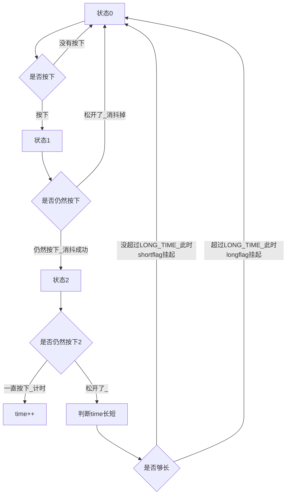
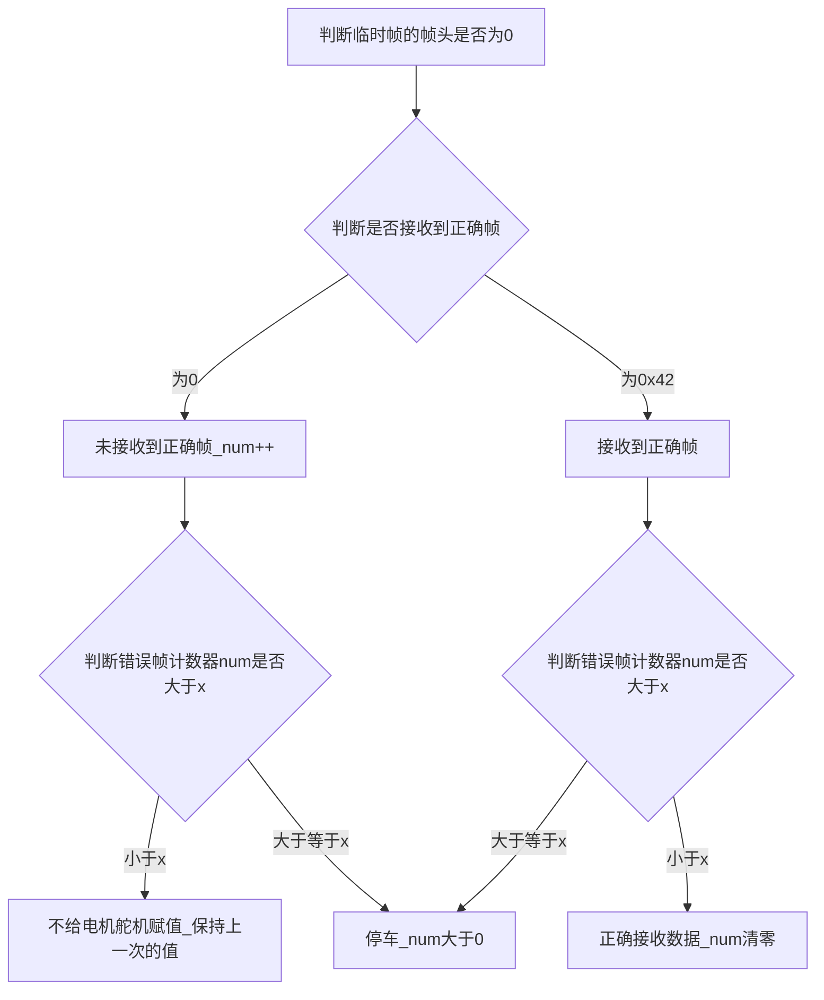

---
tags:
  - 嵌入式
date: 2024-12-28 00:08:00
publish: false
hidden: true
---

# 整体框架
https://www.cnblogs.com/shenleblog/p/18636937
密码：123  
- - -


## 软件框架
* 下位机 
1. 按键 （已实现）、
2. led指示灯（已实现）
3. 舵机的pwm驱动（已实现）
4. 串口通信（已实现）
5. 定时器（已实现）  
6. 编码器（我是想用两个能实现上升沿和下降沿外部中断的io口来软件模拟编码器的计数方式）（未实现）  
7. 电机（方向---两个pwm）（未实现）  
8. 无线串口 （没去看）    
9. 无线下载器（reset出问题，暂时搁置）  （https://www.stcaimcu.com/forum.php?mod=viewthread&tid=6796#lastpost）    
10. 屏幕（ips）(还没看)（8针脚屏幕）    
11. 菜单（还没写）    
- - -  
* 上位机  
1. ***视觉部分（写了一部分，还在移植）***  
2. ***控制部分（pid）（还没写）***  
3. 摄像头问题（两个摄像头的问题）  
4. linux自启动（没实现）（理论上来说可行）  
5. 大模型（图像识别）(这块我不看)  
- - -  
## 线上赛  
（（）） 约等于  大模型（图像识别）(这块我不看)    


# 要干甚么
## 吴小亮
1. 视觉  
2. 控制  
## 张中豪  
1. 论文  (1.30)  会议（b类，sci（加分：2.5）下面的那个东西（加分：1.5））
2. ai模型（以及线上赛）  
3. 地瓜    
4. 蓝桥杯（嵌入式）   
## 赵璟怡    
1. 主板，驱动，转接板（第三版）      
2. 3d打印固定板（edgeboard的固定板，航模插头的小电池的两头固定件）    
3. 摄像头碳素杆的3d固定件（可以有）  
4. 3d打印车壳（可以在杰哥的demo版上改）  
5. 蓝桥杯（eda赛道）  


# 一些注意事项 
## 硬件
1. 打板前最好还是让软件看看（原理图，pcb图）（方便的话在硬件电脑旁对着车看，不方便就截图）（队名，打板时间，学校，队伍logo(可选)，实验室logo（可选），人名（我看好多都没加，我是希望加上（可选）））
2. 3d打印件同上，打印前找队友和车检查一遍先
3. 
- - -
## ai

## 软件


# 下学期注意事项
## 大二下  
赵总比较忙，学业繁重，比较需要重视成绩  
按照说法，希望我给的任务要加上deadline，不然会拖很久  
- - -
总之我重心会在完模这块  
- - -


# 小事
## 硬件
按键 4.7改成其他的


- - - - - - - - 

# 日记
## 1.9
- - -
ok,开工
- - - 
* 21.12
成功下回了ADS,成功编译下进了一次代码。  
stm遥控器卡死在了“等待si24r1的中断接收信号拉低（表示si24r1接收完成）”  
找不着原因  
- - - 
## 1.10
现在是下午1.30  
- - - 
我们先继续研究ads  
- - - 
一般一个定时器可以输出四路占空比可调的频率相同的PWM信号  
- - - 
ATOM有8个通道，每个通道可以有不同的pwm输出
- - - 
怎么啥都没反应……
https://www.bilibili.com/video/BV1ha411A7zW
https://pan.baidu.com/s/1C19HQzTqqKKvYgJxL-axUw
- - - 
ads经常下载失败
- - - 
下载memtool来代替ads下载
- - - 
memtool怎么也这么多事
- - -
0  (0+0*10000/8)%(10000/2)+(10000/2)=0+5000=5000  
(0+1*10000/8)%(10000/2)+(10000/2)=1250+5000=6250

duty(max)=5000
- - - 
## 1.11
- - - 
* 13.01
先学c++
- - - 
板子有点麻烦
- - - 
先看看板子引脚
- - -
ai8051  
芯片flash-64kb    
芯片ram-34kb  
封装--lqfp48   )
***错了，这个是STC32的***
- - - - - -)   

- - -)

- - - 
利用光栅的衍射可以根据需要把光信号转换为电信号，光电编码器就是根据这个原理制造成的器件。
光电编码器可以将位移、角度的变化转换成光电脉冲或数字信号。该器件目前被广泛应用于长度、速度、加速度、振动等的测量以及精密定位中。    
根据产生脉冲的方式不同，光电编码器可以分为增量式、绝对式、混合式三种类型；  

增量式（用的是增量式）
增量式编码器的输出信号是A,B,Z三组方波脉冲。增量式编码器的组成结构和输出信号的波形如下图所示：)
码盘上等间距刻录了辐射状透光缝隙，相邻两个透光缝隙之间为一个增量周期。检测光栅上刻有A,B两组与码盘相对应的透光缝隙，来达到通过或遮挡光源与光电检测器件之间的光线的目的。检测光栅上透光缝隙的间距和码盘上的间距相等，并且两组透光缝隙之间相差1/4间距，这样使得光电检测器件输出的信号在相位上相差90度的电度角。编码器工作时检测光栅不动，码盘随被测转轴转动，光线透过码盘和检测光栅上的透光缝隙照射到光电探测器件上，光电检测器件就输出两组近似于正弦波的电信号（相位相差90度）电信号经过电路的转换处理，即可得到被测轴的转角或速度信息。  
增量式编码器结构简单、使用寿命长、受环境影响小、工作稳定。但它只能输出转轴的位置相对于前一个位置的增量，因此，实际工作时需要在一段区域内连续工作，不能中断。  

正交编码器（Quadrature Encoder）是一种用于测量旋转速度和方向的传感器，通过积分（累加）运算后，还可以用来测算距离。最常见的正交编码器有两个输出信号：A相 和 B相，有些编码器会有 Z相 的校准功能（用于消除累计误差）。「正交」一词来源于 AB 两个信号的特征，一般情况下 A相 和 B相 的输出信号总是有 π/2 的相位差。  
))


ui8051  
两个输入TI1,TI2做增量编码器接口， 

如果计数器同时在TI1和TI2边沿计数，则置PWMA_SMCR寄存器中的SMS=011.

若计数器已经启动（PWMA_CR1寄存器中的CEN=1）

计数器在每次TI1FP1或TI1FP2上产生有效跳变时计数（TI1FP1或TI1FP2是TI1或TI2通过输入滤波器和极性控制后的信号）  

（如果没有滤波和极性变换（TI1FP1=TI1,TI2FP2=TI2））  

根据两个跳变顺序，产生计数脉冲和方向信号。（依据两个输入喜好的跳变顺序，计数器向上计数或者向下计数，同时对PWMA_CR1的DIR位进行设置）  

每次跳变都会重新计算DIR

## 1.12
https://www.stcaimcu.com/forum.php?mod=viewthread&tid=1911&highlight=%E5%A4%96%E9%83%A8%E4%B8%AD%E6%96%AD&page=2&extra=#pid12736   
>stc分外部中断和普通IO中断    
* 外部中断  )  )))
>外部中断0（INT0）:P3.2 同时支持上下沿中断  
>外部中断1（INT1）:P3.3 同时支持上下沿中断  
>外部中断2（INT2）:P3.6 支持下降沿中断    
>外部中断3（INT3）:P3.7 支持下降沿中断     
>外部中断4（INT4）:P3.0 支持下降沿中断 


* 普通IO中断  
有四种中断模式，下降沿中断、上升沿中断、低电平中断和高电平中断。没个IO都可以独立设置中断模式。  
不能单个IO口配置中断优先级，只能配置某个IO端口的中断优先级  
**普通IO口中断号大于31，keil不支持，还需要写汇编映射到其他中断号（麻烦）**
- - -)
哈哈哈，其实算是我第一次实际用51（魔改版）
stc32g在用typec口下载的时候需要按reset))
- - -
来，无线下载)
- - - 
```
本帖最后由 王昱顺 于 2024-3-7 13:59 编辑


全自动蓝牙下载器, 使用STC8H2K08U和JDY33模块制作 ！
可通讯可下载，自动配置蓝牙模块
完美收尾！现在可以实现STC全系列单片机的无线下载，甚至包括STC8以上型号的检测MCU选项后自动切换正确型号的功能。
非常适合智能车参赛选手实现远程的下载，调试，停车。方便多多


前言：
早在之前调试智能车和一些较为恶劣坏境（非电磁环境恶劣，单纯温度比较高这种）的产品的时候，总是苦恼于没法远程下载程序，当时虽然研究过一段时间的远程OTA更新功能，但是这对单片机的型号又做出了一些限制，甚是苦恼。
其实之前也尝试过不少的无线模块，想直接用在下载上。可是尝试过的几款不是因为数据分包发送的巨大延迟导致的通信超时，就是因为STCISP操作串口时直接给端口干掉线了。
但是近来逛论坛的时候，发现有人推荐使用JDY33这款型号的蓝牙模块。马上看了一下淘宝，六块钱包邮。这不赶紧试试！
于是赶忙下订单、收货、测试一条龙。果然网友的消息就是灵通，这一试立马就成功了。
其实事情本该到此结束，毕竟我这无线下载的需求终于实现了。但是我又觉得这种手动断电的方式不大美妙了（串口不断电下载会因为调试程序时的卡死而罢工的，所以也没用）
这不，才有了这个小玩意，自动下载器。


介绍：
原理其实很简单，就是通过监听蓝牙TXD线路中的0x7F数据。因为STC-ISP下载用的是偶校验，所以单片机串口也要设置成偶校验。检测到足够数量的连续0x7F数据就进行一次自动断电操作（同样的，也可以在蓝牙的数据通道手动发送至少20个的0x7F完成一次冷启动复位）
然后我还加了个小功能，连接TypeC口或者Link1D-4P下载口并供电时，可以一键复位掉蓝牙模块，免去配置波特率和校验位的麻烦。
这个功能其实就是通过在所有波特率轮着发送恢复出厂设置的消息，全发送一遍。肯定就复位了。然后再通过默认的波特率进行通讯和配置。

这个是整套的样子
```)

- - - )
赵总作品   
## 1.13
先验证一下刚到的ai8051  

正在检测目标单片机 ...   
  下载板型号: USB-HID1CDC  
 
继续检测目标单片机 ...   
  单片机型号: AI8051U-34K64  

当前芯片的硬件选项为:  
  . 系统ISP工作频率: 23.909MHz  
  . 内部IRC振荡器的频率: 40.015MHz  
  . 掉电唤醒定时器的频率: 34.800KHz  
  . 振荡器放大增益使能   
  . 用户EEPROM大小被设置为 1 K  
  . P3.2和P3.3与下次下载无关   
  . 上电复位时增加额外的复位延时  
  . 复位引脚用作普通I/O口  
  . 检测到低压时复位  
  . 低压检测门槛电压 : 2.00 V  
  . 上电复位时,硬件不启动内部看门狗  
  . 上电自动启动内部看门狗时的预分频数为 : 256   
  . 空闲状态时看门狗定时器停止计数  
  . 下次下载用户程序时,将用户EEPROM区一并擦除  
  . 下次下载用户程序时,没有相关的端口控制485  
  . 下次下载时不需要校验下载口令  
  . 内部参考电压: 1186 mV (参考范围: 1100~1300mV)  

  单片机型号: AI8051U-34K64  

开始调节频率 ...			[0.891"]  
调节后的频率: 39.994MHz (-0.016%)  

正在重新握手 ... 成功			[0.187"]  
当前的波特率: 115200
正在擦除目标区域 ... 完成 !		[0.672"]  
正在下载用户代码 ... 完成 !		[23.797"]  
正在设置硬件选项 ... 完成 !		[0.031"]  

更新后的硬件选项为:  
  . 系统ISP工作频率: 23.909MHz  
  . 内部IRC振荡器的频率: 39.994MHz   
  . 掉电唤醒定时器的频率: 34.800KHz  
  . 振荡器放大增益使能  
  . 用户EEPROM大小被设置为 1 K  
  . P3.2和P3.3与下次下载无关  
  . 上电复位时增加额外的复位延时  
  . 复位引脚用作普通I/O口  
  . 检测到低压时复位  
  . 低压检测门槛电压 : 2.00 V  
  . 上电复位时,硬件不启动内部看门狗  
  . 上电自动启动内部看门狗时的预分频数为 : 256  
  . 空闲状态时看门狗定时器停止计数  
  . 下次下载用户程序时,将用户EEPROM区一并擦除  
  . 下次下载用户程序时,没有相关的端口控制485  
  . 下次下载时不需要校验下载口令  
  . 内部参考电压: 1186 mV (参考范围: 1100~1300mV)  
芯片出厂序列号 : 78B4CAA503C219  

  单片机型号: AI8051U-34K64  

  . 用户设定频率: 40.000MHz  
  . 调节后的频率: 39.994MHz ( 主时钟分频系数 = 1; )  
  . 频率调节误差: -0.016%  
  
## 1.14
车长30  
车宽22  
车高38  

没有适合的盒子大小
- - -
edgeboard DK-1B)
- - -
安装

想要使用libgpiod，需要在开发板上安装libgpiod库。

```bash
#安装libgpiod库及头文件
sudo apt install libgpiod-dev 
#安装gpiod 命令行工具
sudo apt install gpiod  
```
libgpiod  
libgpiod用于与Linux GPIO设备互动的C语言库和工具。 Linux提供了一种访问GPIO控制器的字符设备接口，通过操作字符设备文件（比如 /dev/gpiodchip0 ）实现的， 并通过libgpiod提供一些命令工具、c库以及python封装。      
板卡提供的GPIO扩展，使用的是/dev/gpiodchip4，对应GPIO端口号参考上文原理图图示，如：GPIO43_3V3表示端口号为43，支持电源3.3v。    
https://github.com/brgl/libgpiod  (libgpiod源码仓库)  
https://github.com/starnight/libgpiod-example  (libgpiod示例代码)  
- - -
服了，电池过放了，今天运气有点悲啊  
- - -
，，，電腦輸入發又突然變成繁體了，明明是簡體    )
- - -
这个windows没完没了了  
- - -
CmakeListLists.txt  (Cmake编译器)
```c++
#include <iostream>  //输入输出流头文件
#include <opencv2/highgui.hpp>  //gui人机交互界面
#include <opencv2/opencv.hpp>  //cv处理内容

using namespace std;//创建名称空间
using namspace cv;

Mat img,gray_img,binary_img;
int main(void)
{
    //获取摄像头图象
    //1.让办卡连接上摄像头：软件初始化摄像头
    VideoCapture cap("/dev/video0");  //实例化一个摄像头
    if(!cap.isOpened())
    {
        cout << "video failed" << endl;
        return 0;
    }

    //2.创建一个窗口来显示
    namedWindow("smartcar",(640,480));//创建了一个名为smartcar的窗口，大小为640*480

    //3.定义图象保存的矩阵
    /*3*3（0-255）越大该点越亮
        124   122  229
        111   11    22
        0    0   0
        uint8_t  img[3][3];
        Mat img;
    */
    Mat img;

    while(1)
    {
        //4.将摄像头获取的图象赋值给img
        cap >> img;

        //5.图像处理操作
        /*   
        1.图象rgb to gray
        2.图象二值化
        3.识别一个直道
        4.
         */

        //6.显示图象
        imshow("smartcar",img);//在smartcar窗口显示img图象

        //7.必要延时
        waitKey(10);//等待10ms，等待用户按键操作
    }
    close("smartcar");
    
}
```
- - -

free -h 查看内存  
lsblk 查看emmc  
- - -
今天大进展，但是头有点晕   
- - -
还是不能全部弃掉，主函数自己写可以，但是官方的封装还是得用  
明天任重道远   
- - -)
- - -)
## 1.15
无事
## 1.16
开三个窗口移植视觉部分
- - -
记录需要用到的接口部分  
1. 
- - -
两个摄像头直连出现问题    
1. 贵摄像头330fps太高速出现频闪，目前没有有效解决办法  
2. 无法同时开启两台摄像头
```
先说下原因，linux中为usb camera提供了一个标准的V4L2的驱动以方便使用，只要符合驱动规范就可以实现即插即用usb camera设备，即免驱动安装。 但市面上的USB 摄像头都是2.0的。usb bus的 bandwidth是有限的，而V4L2驱动采用的是贪心原则，即camera会要求获取最大带宽；因此将两个camera接入一路usb bus，打开第二个camera（尤其是采用YUV格式打开）就会出现”No space left on device”的错误。

```
- - -
直连usb  
```bash
root@paddlepi:~/workspace/sasu_icar2024_demo/build# lsusb  
Bus 002 Device 003: ID 0bda:8153 Realtek Semiconductor Corp.  
Bus 002 Device 002: ID 05e3:0626 Genesys Logic, Inc.
Bus 002 Device 001: ID 1d6b:0003 Linux Foundation 3.0 root hub
Bus 001 Device 005: ID 10bb:2b08 TM Technology, Inc.                          // 摄像头30fps
Bus 001 Device 004: ID 15aa:1555 Gearway Electronics (Dong Guan) Co., Ltd.   // 摄像头330fps
Bus 001 Device 003: ID 214b:7250
Bus 001 Device 002: ID 05e3:0610 Genesys Logic, Inc. 4-port hub  
Bus 001 Device 001: ID 1d6b:0002 Linux Foundation 2.0 root hub
root@paddlepi:~/workspace/sasu_icar2024_demo/build#

```
```c++

这种情况下，就会提示libv4l2: error turning on stream: No space left on device， 不管你用opencv 还是qt, 还是xawtv,luvcview, vlc打开，都没用的，这跟上层应用没关系。
因为这是Linux kernel里面的 uvc设备驱动的一个bug(or feature)。简单描述一下就是，YUV是非压缩的视频格式，对于USB2.0，一旦有一个设备插入，就会静态的占去80%的USB带宽，所以在控制器下再加一个USB设备，就会报错，带宽不够
```


- - -
capture.set 的所有可设置选项
在OpenCV中，VideoCapture 类的 set 方法用于设置视频捕获设备的各种属性。这些属性通常通过预定义的常量来标识，这些常量在 OpenCV 的 cv::VideoCaptureProperties 枚举中定义。以下是一些常见的 capture.set 可设置选项及其对应的枚举值：

CAP_PROP_POS_MSEC (0)：设置捕获视频的当前位置（以毫秒为单位）。

CAP_PROP_POS_FRAMES (1)：设置捕获视频的当前帧索引。

CAP_PROP_POS_AVI_RATIO (2)：设置捕获视频的当前位置（0 - 1之间的比例）。

CAP_PROP_FRAME_WIDTH (3)：设置捕获视频的帧宽度。

CAP_PROP_FRAME_HEIGHT (4)：设置捕获视频的帧高度。

CAP_PROP_FPS (5)：设置捕获视频的帧率。

CAP_PROP_FOURCC (6)：设置捕获视频的编解码器。注意，这个属性可能不被所有后端支持。

CAP_PROP_BUFFERSIZE (7)：查询或设置视频捕获的后端缓冲区大小。

CAP_PROP_MODE (8)：设置捕获设备的模式。

CAP_PROP_BRIGHTNESS (10)：设置捕获设备的亮度。

CAP_PROP_CONTRAST (11)：设置捕获设备的对比度。

CAP_PROP_SATURATION (12)：设置捕获设备的饱和度。

CAP_PROP_HUE (13)：设置捕获设备的色调。

CAP_PROP_GAIN (14)：设置捕获设备的增益。

CAP_PROP_EXPOSURE (15)：设置捕获设备的曝光时间。

CAP_PROP_CONVERT_RGB (16)：指示图像是否应该被转换为RGB颜色空间。

CAP_PROP_WHITE_BALANCE_BLUE_U (17)：设置白平衡蓝色分量。

CAP_PROP_RECTIFICATION (18)：设置摄像头的校正模式。

CAP_PROP_MONOCHROME (19)：以黑白模式捕获视频。

CAP_PROP_SHARPNESS (21)：设置捕获设备的锐度。

CAP_PROP_AUTO_EXPOSURE (25)：启用/禁用自动曝光。

CAP_PROP_GAMMA (26)：设置捕获设备的伽马值。

CAP_PROP_TEMPERATURE (27)：获取红外摄像头的温度读数。

CAP_PROP_BACKLIGHT (28)：启用/禁用背光补偿。

CAP_PROP_PAN (32)：设置摄像头的水平视角（平移）。

CAP_PROP_TILT (33)：设置摄像头的垂直视角（倾斜）。

CAP_PROP_ROLL (34)：设置摄像头的旋转角度。

CAP_PROP_ZOOM (35)：设置摄像头的缩放级别。

CAP_PROP_FOCUS (36)：设置摄像头的焦距。

CAP_PROP_GUID (37)：获取视频捕获设备的全局唯一标识符（GUID）。

CAP_PROP_ISO_SPEED (39)：设置ISO速度。

CAP_PROP_MAX_DC1394_CHUNK_SIZE (1074188417)：最大IEEE1394数据块大小。

CAP_PROP_AUTOGRAB (1074311296)：指示设备是否自动抓取帧。
- - -
折腾完一个下午也没解决问题  
只能再买一个了  
现在问题是  
选择30帧的还是60帧的呢？？？  
- - - 
遇到的问题和上次是一样的  

- - -

## 1.17
- - -)
- - -
)))
原来串口是可以设置中断优先级，但是由于建议采用的定时器不能设置优先级所以串口中断也跟随不设置高优先级，

stc很幽默
- - -

- - -
1. 封装舵机
2. 测试按键，不封装
3. 测试串口，封装
- - -
服了，逐飞写的封装库不知道为啥不行，我查手册对寄存器单独操作成功上拉了  
无语无语 
- - -
35    90   145  
   55    55  
- - - 
```c
//gpio_pin_enum keypin;
//    uint8_t judge;   //按键状态机，0进入;检测到按下到1;xms后却松开了就回到0（消抖），xms后仍然按下就进入2;xms后按键已经松开判断time分短，归0，xms后按键未松开，判断时间长短（一直未松）直接长按键触发
//    uint8 key_state;  //按键状态，0：按下，1：释放
//    uint8 shortflag;  //短按标志，0：未检测到短按，1：已检测到短按
//    uint8 longflag;  //长按标志，0：未检测到长按，1：已检测到长按
//    uint32_t time;  //按键时间，单位ms
```
- - -
```c
#include "isr.h"
#include <string.h>
#include <stdio.h>

#include "intrins.h"
//------STC32G SDK等
#include "AI8051u_32bit.h"
#include "zf_common_typedef.h"
#include "zf_common_clock.h"
#include "zf_common_fifo.h"
#include "zf_common_debug.h"
#include "zf_common_interrupt.h"
#include "zf_common_font.h"
#include "zf_common_function.h"

#include "zf_driver_gpio.h"
```
- - -
## 1.18
  )  
ai8051的上拉电阻是5.8k  )
- - -
串口做 类 封装    ))))
- - -
* 打印十六进制
```c++
#include <iomanip>：包含这个头文件以使用std::hex和std::uppercase流操纵器。

std::cout << std::hex：设置std::cout为16进制输出模式。

std::cout << std::uppercase：使16进制输出使用大写字母（可选）。

static_cast<int>(serialStr.buffFinish[0])：将uint8_t类型的值转换为int类型，因为std::cout默认不会直接处理uint8_t类型。

std::endl：插入换行符并刷新输出缓冲区。

// 通过这种方式，您可以确保serialStr.buffFinish[0]的值以16进制格式打印出来，并且是大写形式（如果您选择了std::uppercase）。
```
- - -
单边循迹  
四邻域  
- - -
))))
- - -
)
- - -

- - -
- - -
暂时回顾一下， 
7. 号 考完试  
8. 号 写报告  
9. 号 写报告  
10. 号 折腾ads,失败放弃    
11. 号 研究stc    
12. 号 赵总板子出了 重下keil能下进去stc了    
13. 号 AI8051到了，这会应该在学 c++和opencv    
14. 号 vscode惨遭windows迫害，（这里13到14好像通宵了）  这会一直想利用edgeboard上的io  
15. 号 落枕，没干活  
16. 号 试图移植视觉，但是两个摄像头的问题把我干死很久  
17. 号 封装测试stc，成绩出了  
18. 号 下午主要验证上下位机串口通信，晚上移植压缩+二值化
## 1.19
- - -
13.26  
继续移视觉部分  
- - -
看看蓝牙  
（蓝牙串口）  
SPP蓝牙串口  
- - -))
过    
- - -
0 1 2 3 4 5 6 . . . . . . . . . . . 78(LCDW-2) 79(LCDW-1)    
1  
2  
3  
.  
.    
.   
54    (LCDH-6)    
55    (LCDH-5)    
56    (LCDH-4)     
57    (LCDH-3)  
58    (LCDH-2)  
59    (LCDH-1)  
- - -
0 1 2 3 4 5 6 . . . . . . . . . . . 158(LCDW-2) 159(LCDW-1)    
1    
2    
3    
.  
.  
.  
114    (LCDH-6)    
115    (LCDH-5)    
116    (LCDH-4)     
117    (LCDH-3)  
118    (LCDH-2)  
119    (LCDH-1)  
- - -
底边异常  )

- - -
* 底边五行的搜索)
- - -)
- - -
大跳变重新处理))
- - -
宽度小于（），直接设置为这帧的最高处理行)

- - -)))
- - -
赵总作品  
- - -)
- - -
```c++
在C++中，static 关键字可以在多种上下文中使用，包括变量声明、函数声明和类成员声明。当 static 用于函数声明时，它改变了函数的链接性（linkage）。

2. static 函数的特点
内部链接（Internal Linkage）：static 函数具有内部链接，这意味着该函数只能在定义它的源文件内部被访问和调用。换句话说，其他源文件无法看到或调用这个 static 函数。

避免命名冲突：使用 static 关键字可以避免不同源文件中同名函数的命名冲突。每个源文件中的 static 函数都是独立的，互不影响。

隐藏实现细节：通过将函数声明为 static，可以隐藏函数的实现细节，使得函数的接口更加清晰，同时减少外部对函数内部逻辑的依赖。
```)  ))
集美大学17届  
- - -))
- - ))


- - -
***主板（stc绿色第一版）往外引出***  
1. 主板（stc绿色第一版）供电线  接到  红色驱动板（旧）  
2. 主板（stc绿色第一版）的电机线（三根）（dir,pwm,vcc）线   接到    红色驱动板（旧）  
3. 主板（stc绿色第一版）舵机线（三根）（pwm,vcc,gnd）   接到    舵机（引出线）  
4. 主板（stc绿色第一版）编码器线（四根）（A,B,gnd,vcc）(不知道线序)    接到  编码器（引出线）  **（第一版）这里需要跳线，将A,B跳到p3.3,p3.2，看手册，两个io口接同一个外设线是可行的**  
5. 主板（stc绿色第一版）串口接口  接到   edgeboardusb接口二
- - -
***红色驱动板（旧）往外引出***    
省去 连接到 主板 的    
1. 红色驱动板（旧）供电线  接到  电池    
2. 红色驱动板（旧）电机连接线（两根）  接到  电机（引出线）  
- - -
***edgeboard往外引出***  
1. usb接口一  接到  摄像头
2. usb接口二  接到  主板（stc绿色第一版）串口接口
3. （**第一版**）dc供电口  接到  红色驱动板（旧）
- - -)
- - -)
- - -
## 1.20
规划了一下   
- - -
把车装好了  
- - -
电机成功驱动
- - -
一个小问题，当占空比较低的时候，给电机轮胎一个反方向推力，很容易让电机停转  )
- - -)
- - -
我一开始使用的是逐飞例程的17khz，    
然后根据论坛的说法改到3khz，出现这个现象的最低占空比变低了，但是噪音变大了 】
- - -) 
- - -
最终采纳了4000Hz  ,还是有一定噪音，最低占空比能到11%    
- - -)
- - -)
串口发送数据，串口中断优先级要高于定时器中断优先级  

- - -))
串口3可选择定时器2，定时器3  （波特率发生器） 
串口4可选择定时器2，定时器4    
- - -
懵逼了好久，原来是更新后的p33按键脚变成了p23  
然后没反应过来  
把p33外部中断了，那个灯一直闪，   
一个个排除，还以为我程序没下进去  
- - -
把核心板的串口焊出来了  
- - -  )

## 1.21
真服了，停电了  
- - -
先写串口 类  
- - -
                    42 10 08 3F 51 70 85 DF 42 10 08 3F 49 0F DB CC   
                    42 10 08 3F 41 9D 7E F5 42 10 08 3F 3A 2B 20 1E   
                    42 10 08 3F 2E FF 94 5A 42 10 08 3F 21 09 25 E8   
                    42 10 08 3F 16 CB E4 5E 42 10 08 3F 0B A0 58 9C   
                    42 10 08 3E FF 0D 02 A6 42 10 08 3E EC 6F 17 0A   
                    42 10 08 3E D2 5E D0 98 42 10 08 3E B0 DC 2B 4F   
                    42 10 08 3E AE FF 94 D9 42 10 08 3E 89 C3 C1 A5    
                    42 10 08 3E 6E 4B AE FF 42 10 08 3E 7D 30 69 AE   
                    42 10 08 3D E6 D9 52 A8 42 10 08 3D C9 0F DB 4A   
                    42 10 08 3D 50 82 39 A2 42 10 08 3C 6E 4B AE FD   
- - -
```c

typedef struct{                     //发送帧就是一直在发送（编码测度）  接收帧就是匹配后再赋值给对应帧（打角，速度）
    uint8 Header;                   //帧头      （赋初值后不变）  
    uint8 Addr;                     //地址      （赋初值后不变）
    uint8 Len;                      //长度      （赋初值后不变）
    uint8 Data[USB_FRAME_LENMAX];   //数据      （一直在定时获取）
    uint8 CheckSum;                 //校验和    （一直在定时获取）
}UsbFrame;
extern UsbFrame Send_Encoder_Frame; // 通讯帧结构体---发送编码器数据


//////////////串口同edgeboard通讯--通讯协议设置//////////////
    Send_Encoder_Frame.Header=USB_FRAME_HEAD;
    Send_Encoder_Frame.Addr=USB_ADDR_ENCODER;
    Send_Encoder_Frame.Len=8;//头+地址+长度+4数据+校验和

//////////////串口同edgeboard通讯--通讯协议设置//////////////
```
***要考虑是大端序还是小端序***
大端序（Big-endian）：高位字节存储在低地址处，低位字节存储在高地址处。

小端序（Little-endian）：低位字节存储在低地址处，高位字节存储在高地址处。

ARM架构：大多数ARM处理器（如Cortex-M系列）使用小端序。^[1]^

AVR架构：AVR单片机（如ATmega系列）使用小端序。^[2]^

PIC架构：Microchip的PIC单片机通常使用小端序。^[3]^

x86架构：Intel和AMD的x86处理器使用小端序。^[4]^

某些DSP处理器：某些数字信号处理器（DSP）可能使用大端序，但这取决于具体的处理器型号。
- - -
x86架构：Intel和AMD的x86处理器及其64位扩展（x86-64或AMD64）广泛使用小端序。这意味着在大多数基于x86的PC和服务器上运行的Linux系统也将使用小端序。

ARM架构：ARM处理器支持大端序和小端序，但大多数ARM处理器（包括用于移动设备和许多嵌入式系统的Cortex-A和Cortex-M系列）默认配置为小端序。因此，基于ARM的Linux系统（如Raspberry Pi、NVIDIA Jetson等）通常也使用小端序。

其他架构：其他硬件架构（如MIPS、PowerPC等）可能支持不同的字节序配置，但大多数现代处理器默认使用小端序或提供配置选项以支持小端序。
- - -
回寝了
- - -
只要两个结构体具有相同的类型和定义，就可以将一个结构体直接赋值给另一个结构体。这种赋值是浅拷贝，对于包含指针成员的结构体需要特别注意。
- - -
```c
 switch (fifo4_get_data[1])
            {
            case USB_ADDR_HEART: // 通信心跳(W)（上位机下发心跳信号（掉线检测周期3s））（通信连接后进入PID闭环速控模式，否则开环）（发送其他信号也可以当作修那条信号保持连接状态）
            {
                // 帧长4
                uart_write_string(UART4_INDEX, "USB_ADDR_HEART:\r\n"); // 输出测试信息
            }
            break;
            case USB_ADDR_CONTROL: // 速度和方向控制（W）
            {
                // 帧长10
                // uart_write_string(UART4_INDEX, "USB_ADDR_CONTROL:\r\n");											// 输出测试信息
            }
            break;
            case USB_ADDR_SPEEDMODE: // 速控模式（W）：1开环，other闭环
            {
                // 帧长5
                // uart_write_string(UART4_INDEX, "USB_ADDR_SPEEDMODE:\r\n");											// 输出测试信息
            }
            break;
            case USB_ADDR_SERVOTHRESHOLD: // 舵机阈值（W/R）
            {
                // 帧长7
                // uart_write_string(UART4_INDEX, "USB_ADDR_SERVOTHRESHOLD:\r\n");											// 输出测试信息
            }
            break;
            case USB_ADDR_BUZZER: // 蜂鸣器音效（W）
            {
                // 帧长5
                printf("date:%x,%x,%x,%x,%x\r\n", fifo4_get_data[0], fifo4_get_data[1], fifo4_get_data[2], fifo4_get_data[3], fifo4_get_data[4]);
                // uart_write_string(UART4_INDEX, "USB_ADDR_BUZZER:\r\n");											// 输出测试信息
            }
            break;
            case USB_ADDR_LIGHT: // LED灯效（W）
            {
                // 帧长8
                // uart_write_string(UART4_INDEX, "USB_ADDR_LIGHT:\r\n");											// 输出测试信息
            }
            break;
            case USB_ADDR_KEYINPUT: // 按键信息（R）
            {
                // 帧长6
                // uart_write_string(UART4_INDEX, "USB_ADDR_KEYINPUT:\r\n");											// 输出测试信息
            }
            break;
            case USB_ADDR_BATTERY: // 电池信息（R）
            {
                // 帧长9
                // uart_write_string(UART4_INDEX, "USB_ADDR_BATTERY:\r\n");											// 输出测试信息
            }
            break;
            default:
                break;
            }
```




- - -
很好，上位机发给下位机的大小端是反的    
但是为什么前面下位机发给上位机的编码器是正确的    
待会重新测一下    
- - -  
舵机突然挂了    
测了好久没测出来   
电压不够    
带上去还是不够   )  
- - -
死区的原因    
需要一步一步转过去  
- - -
okk  
我觉得舵机的问题已经彻底解决了  


## 1.22
- - -
BUTTON(按下为1，松开是0)    
A--number:0  
B--number:1  
X--number:3   
Y--number:4   
L上--number:6  
R上--number:7  
L下--number:8（同时是AXIS）(松开是0，刚开始按下是1)  
R下--number:9（同时是AXIS）(松开是0，刚开始按下是1)  
logo左方按钮---number:10  
logo右方按钮---number:11  
- - -
AXIS(-32767~32767)
左摇杆X轴（从左到右）---number:0
左摇杆Y轴（从上到下）---number:1
右摇杆X轴（从左到右）---number:2
右摇杆Y轴（从上到下）---number:3
方向键左（按下-32767,松开0）---number:6
方向键右（按下32767,松开0） ---number:6
方向键上（按下-32767,松开0）---number:7
方向键下（按下32767,松开0） ---number:7
- - -
这个舵机，，，还需要研究研究  
没电了  
- - -


11111111000000000000000111111100000000000011111100000000000000
8  15  7  12  6  14

- - -
11100000000000000011111110000000000001111110000000000000011111111000000000000000111111100000000000011111100000000000000111111110000000000000001111111000000000000111111000000000000001111111100000000000000011111110000000000001111110000000000000011111111000000000000000111111100000000000011111100000000000000111111110000000000000001111111000000000000111111000000000000001111111100000000000000011111110000000000001111110000000000000011111111000000000000000111111100000000000011111100000000000000111111110000000000000001111111000000000000111111000000000000001111111100000000000000011111110000000000001111110000000000000011111111000000000000000111111100000000000011111100000000000000111111110000000000000001111111000000000000111111000000000000001111111100000000000000011111110000000000001111110000000000000011111111000000000000000111111100000000000011111100000000000000111111110000000000000001111111000000000000111111000000000000001111111100000000000000011111110000000000001111110000000000000011111111000000000000000111111100000000000011111100000000000000111111110000000000000001111111000000000000111111000000000000001111111100000000000000011111110000000000001111110000000000000011111111000000000000000111111100000000000011111100000000000000111111110000000000000001111111000000000000111111000000000000001111111100000000000000011111110000000000001111110000000000000011111111000000000000000111111100000000000011111100000000000000111111110000000000000001111111000000000000111111000000000000001111111100000000000000011111110000000000001111110000000000000011111111000000000000000111111100000000000011111100000000000000111111110000000000000001111111000000000000111111000000000000001111111100000000000000011111110000000000001111110000000000000011111111000000000000000111111100000000000011111100000000000000111111110000000000000001111111000000000000111111000000000000001111111100000000000000011111110000000000001111110000000000000011111111000000000000000111111100000000000011111100000000000000111111110000000000000001111111000000000000111111000000000000001111111100000000000000011111110000000000001111110000000000000011111111000000000000000111111100000000000011111100000000000000111111110000000000000001111111000000000000111111000000000000001111111100000000000000011111110000000000001111110000000000000011111111000000000000000111111100000000000011111100000000000000111111110000000000000001111111000000000000111111000000000000001111111100000000000000011111110000000000001111110000000000000011111111000000000000000111111100000000000011111100000000000000111111110000000000000001111111000000000000111111000000000000001111111100000000000000011111110000000000001111110000000000000011111111000000000000000111111100000000000011111100000000000000111111110000000000000001111111000000000000111111000000000000001111111100000000000000011111110000000000001111110000000000000011111111000000000000000111111100000000000011111100000000000000111111110000000000000001111111000000000000111111000000000000001111111100000000000000011111110000000000001111110000000000000011111111000000000000000111111100000000000011111100000000000000111111110000000000000001111111000000000000111111000000000000001111111100000000000000011111110000000000001111110000000000000011111111000000000000000111111100000000000011111100000000000000111111110000000000000001111111000000000000111111000000000000001111111100000000000000011111110000000000001111110000000000000011111111000000000000000111111100000000000011111100000000000000111111110000000000000001111111000000000000111111000000000000001111111100000000000000011111110000000000001111110000000000000011111111000000000000000111111100000000000011111100000000000000111111110000000000000001111111000000000000111111000000000000001111111100000000000000011111110000000000001111110000000000000011111111000000000000000111111100000000000011111100000000000000111111110000000000000001111111000000000000111111000000000000001111111100000000000000011111110000000000001111110000000000000011111111000000000000000111111100000000000011111100000000000000111111110000000000000001111111000000000000111111000000000000001111111100000000000000011111110000000000001111110000000000000011111111000000000000000111111100000000000011111100000000000000111111110000000000000001111111000000000000111111000000000000001111111100000000000000011111110000000000001111110000000000000011111111000000000000000111111100000000000011111100000000000000111111110000000000000001111111000000000000111111000000000000001111111100000000000000011111110000000000001111110000000000000011111111000000000000000111111100000000000011111100000000000000111111110000000000000001111111000000000000111111000000000000001111111100000000000000011111110000000000001111110000000000000011111111000000000000000111111100000000000011111100000000000000111111110000000000000001111111000000000000111111000000000000001111111100000000000000011111110000000000001111110000000000000011111111000000000000000111111100000000000011111100000000000000111111110000000000000001111111000000000000111111000000000000001111111100000000000000011111110000000000001111110000000000000011111111000000000000000111111100000000000011111100000000000000111111110000000000000001111111000000000000111111000000000000001111111100000000000000011111110000000000001111110000000000000011111111
- - -
逐飞的布丁真不行，一上来就撇责任给软件，我单一对照实验做给你看非要我展示pwm，一般  
- - -)
- - -
```
                    
[21:42:08.155]接收←speed_pwm:0.000000
                    Receibve_Speed:00_00_00_00
                    servo_pwm:130.000000
                    Receibve_Servo:00_00_02_43
                    
[21:42:08.525]接收←speed_pwm:0.000000
                    Receibve_Speed:00_00_00_00
                    servo_pwm:130.000000
                    Receibve_Servo:00_00_02_43
                    speed_pwm:0.000000
                    Receibve_Speed:00_00_00_00
                    servo_pwm:130.000000
                    Receibve_Servo:00_00_02_43
                    
[21:42:08.566]接收←speed_pwm:0.000000
                    Receibve_Speed:00_00_00_00
                    servo_pwm:130.000000
                    Receibve_Servo:00_00_02_43
```
第一次：7139  
第二次：1281
- - -
## 1.23
第一件事：先把通信整完，把其他中断打开看还有没有问题  
- - -
这是下载时串口接收的数据，一直在重复发送46 B9 68 00 08 02 54 00 C6 16，最后发送了46 B9 68 00 08 04 54 00 C8 16 00 00
```
46 B9 68 00 08 02 54 00 C6 16 46 B9 68 00 08 02 54 00 C6 16 46 B9 68 00 08 02 54 00 C6 16 46 B9 68 00 08 02 54 00 C6 16 46 B9 68 00 08 02 54 00 C6 16 46 B9 68 00 08 02 54 00 C6 16 46 B9 68 00 08 02 54 00 C6 16 46 B9 68 00 08 02 54 00 C6 16 46 B9 68 00 08 02 54 00 C6 16 46 B9 68 00 08 02 54 00 C6 16 46 B9 68 00 08 02 54 00 C6 16 46 B9 68 00 08 02 54 00 C6 16 46 B9 68 00 08 02 54 00 C6 16 46 B9 68 00 08 02 54 00 C6 16 46 B9 68 00 08 02 54 00 C6 16 46 B9 68 00 08 02 54 00 C6 16 46 B9 68 00 08 02 54 00 C6 16 46 B9 68 00 08 02 54 00 C6 16 46 B9 68 00 08 02 54 00 C6 16 46 B9 68 00 08 02 54 00 C6 16 46 B9 68 00 08 02 54 00 C6 16 46 B9 68 00 08 02 54 00 C6 16 46 B9 68 00 08 02 54 00 C6 16 46 B9 68 00 08 02 54 00 C6 16 46 B9 68 00 08 02 54 00 C6 16 46 B9 68 00 08 02 54 00 C6 16 46 B9 68 00 08 02 54 00 C6 16 46 B9 68 00 08 02 54 00 C6 16 46 B9 68 00 08 02 54 00 C6 16 46 B9 68 00 08 02 54 00 C6 16 46 B9 68 00 08 02 54 00 C6 16 46 B9 68 00 08 02 54 00 C6 16 46 B9 68 00 08 02 54 00 C6 16 46 B9 68 00 08 02 54 00 C6 16 46 B9 68 00 08 02 54 00 C6 16 46 B9 68 00 08 02 54 00 C6 16 46 B9 68 00 08 02 54 00 C6 16 46 B9 68 00 08 02 54 00 C6 16 46 B9 68 00 08 02 54 00 C6 16 46 B9 68 00 08 02 54 00 C6 16 46 B9 68 00 08 02 54 00 C6 16 46 B9 68 00 08 02 54 00 C6 16 46 B9 68 00 08 02 54 00 C6 16 46 B9 68 00 08 02 54 00 C6 16 46 B9 68 00 08 02 54 00 C6 16 46 B9 68 00 08 02 54 00 C6 16 46 B9 68 00 08 02 54 00 C6 16 46 B9 68 00 08 02 54 00 C6 16 46 B9 68 00 08 02 54 00 C6 16 46 B9 68 00 08 02 54 00 C6 16 46 B9 68 00 08 02 54 00 C6 16 46 B9 68 00 08 02 54 00 C6 16 46 B9 68 00 08 02 54 00 C6 16 46 B9 68 00 08 02 54 00 C6 16 46 B9 68 00 08 02 54 00 C6 16 46 B9 68 00 08 02 54 00 C6 16 46 B9 68 00 08 02 54 00 C6 16 46 B9 68 00 08 02 54 00 C6 16 46 B9 68 00 08 02 54 00 C6 16 46 B9 68 00 08 02 54 00 C6 16 46 B9 68 00 08 02 54 00 C6 16 46 B9 68 00 08 02 54 00 C6 16 46 B9 68 00 08 02 54 00 C6 16 46 B9 68 00 08 02 54 00 C6 16 46 B9 68 00 08 02 54 00 C6 16 46 B9 68 00 08 02 54 00 C6 16 46 B9 68 00 08 02 54 00 C6 16 46 B9 68 00 08 02 54 00 C6 16 46 B9 68 00 08 02 54 00 C6 16 46 B9 68 00 08 02 54 00 C6 16 46 B9 68 00 08 02 54 00 C6 16 46 B9 68 00 08 02 54 00 C6 16 46 B9 68 00 08 02 54 00 C6 16 46 B9 68 00 08 02 54 00 C6 16 46 B9 68 00 08 02 54 00 C6 16 46 B9 68 00 08 02 54 00 C6 16 46 B9 68 00 08 02 54 00 C6 16 46 B9 68 00 08 02 54 00 C6 16 46 B9 68 00 08 02 54 00 C6 16 46 B9 68 00 08 02 54 00 C6 16 46 B9 68 00 08 02 54 00 C6 16 46 B9 68 00 08 02 54 00 C6 16 46 B9 68 00 08 02 54 00 C6 16 46 B9 68 00 08 02 54 00 C6 16 46 B9 68 00 08 02 54 00 C6 16 46 B9 68 00 08 02 54 00 C6 16 46 B9 68 00 08 02 54 00 C6 16 46 B9 68 00 08 02 54 00 C6 16 46 B9 68 00 08 02 54 00 C6 16 46 B9 68 00 08 02 54 00 C6 16 46 B9 68 00 08 02 54 00 C6 16 46 B9 68 00 08 02 54 00 C6 16 46 B9 68 00 08 02 54 00 C6 16 46 B9 68 00 08 02 54 00 C6 16 46 B9 68 00 08 02 54 00 C6 16 46 B9 68 00 08 02 54 00 C6 16 46 B9 68 00 08 02 54 00 C6 16 46 B9 68 00 08 02 54 00 C6 16 46 B9 68 00 08 02 54 00 C6 16 46 B9 68 00 08 02 54 00 C6 16 46 B9 68 00 08 02 54 00 C6 16 46 B9 68 00 08 02 54 00 C6 16 46 B9 68 00 08 02 54 00 C6 16 46 B9 68 00 08 02 54 00 C6 16 46 B9 68 00 08 02 54 00 C6 16 46 B9 68 00 08 02 54 00 C6 16 46 B9 68 00 08 02 54 00 C6 16 46 B9 68 00 08 02 54 00 C6 16 46 B9 68 00 08 02 54 00 C6 16 46 B9 68 00 08 02 54 00 C6 16 46 B9 68 00 08 02 54 00 C6 16 46 B9 68 00 08 02 54 00 C6 16 46 B9 68 00 08 02 54 00 C6 16 46 B9 68 00 08 04 54 00 C8 16 00 00 
```


- - -
串口能正常接收，但是读取不对    
好吧，串口接收不正常  
不对，中间基本都是正常的  
偶尔会有一两帧出错，还是需要加上长度检验？  
```
30 2C 53 65 72 76 6F 5F 56 61 6C 75 65 3A 31 34 33 36 36 35 35 34 38 36 38 39 30 35 39 32 30 30 30 30 30 30 30 2E 30 30 30 30 30 30 0D 0A 00 00 00 00 00 B4 42 64 42 20 0C 00 00 00 00 00 00 B4 42 64 42 20 0C 00 00 00 00 00 00 B4 42 64 42 20 0C 00 00 00 00 00 00 B4 42 64 42 20 0C 00 00 00 00 00 00 B4 42 64 42 20 0C 00 00 00 00 00 00 B4 42 64 42 20 0C 00 00 00 00 00 00 B4 42 64 42 20 0C 00 00 00 00 00 00 B4 42 64 42 20 0C 00 00 00 00 00 00 B4 42 64 42 20 0C 00 00 00 00 00 00 B4 42 64 42 20 0C 00 00 00 00 00 00 B4 42 64 42 20 0C 00 00 00 00 00 00 B4 42 64 42 20 0C 00 00 00 00 00 00 B4 42 64 4D 6F 74 6F 72 5F 56 61 6C 75 65 3A 30 2E 30 30 30 30 30 30 2C 53 65 72 76 6F 5F 56 61 6C 75 65 3A 39 30 2E 30 30 30 30 30 30 0D 0A 42 20 0C 00 00 00 00 00 00 B4 42 64 42 20 0C 00 00 00 00 00 00 B4 42 64 42 20 0C 00 00 00 00 00 00 B4 42 64 42 20 0C 00 00 00 00 00 00 B4 42 64 42 20 0C 00 00 00 4D 6F 74 6F 72 5F 56 61 6C 75 65 3A 30 2E 30 30 30 30 30 30 2C 53 65 72 76 6F 5F 56 61 6C 75 65 3A 39 30 2E 30 30 30 30 30 30 0D 0A 00 00 00 B4 42 64 42 20 0C 00 00 00 00 00 00 B4 42 64 42 20 0C 00 00 00 00 00 00 B4 42 64 42 20 0C 00 00 00 00 00 00 B4 42 64 42 20 0C 00 00 00 00 00 00 B4 42 64 42 20 0C 00 00 00 00 00 00 B4 42 64 42 20 0C 00 00 00 00 00 00 B4 42 64 42 20 0C 00 00 00 00 00 00 B4 42 64 42 20 0C 00 00 00 00 00 00 B4 42 64 42 20 0C 00 00 00 00 00 00 B4 42 64 42 20 0C 00 00 00 00 00 00 B4 42 64 42 20 0C 00 00 00 4D 6F 74 6F 72 5F 56 61 6C 75 65 3A 30 2E 30 30 30 30 30 30 2C 53 65 72 76 6F 5F 56 61 6C 75 65 3A 30 2E 30 30 30 30 30 30 0D 0A 00 00 00 B4 42 64 42 20 0C 00 00 00 00 00 00 B4 42 64 42 20 0C 00 00 00 00 00 00 B4 42 64 42 20 0C 00 00 00 00 00 00 B4 42 64 42 20 0C 00 00 00 00 00 00 B4 42 64 42 20 0C 00 00 00 00 00 00 B4 42 64 42 20 0C 00 00 00 00 00 00 B4 42 64 42 20 0C 00 00 00 00 00 00 B4 42 64 42 20 0C 00 00 00 00 00 00 B4 42 64 42 20 0C 00 00 00 00 00 00 B4 42 64 42 20 0C 00 00 00 00 00 00 B4 42 64 42 20 0C 00 00 00 00 00 00 B4 42 64 42 20 0C 00 00 00 00 00 00 B4 42 64 42 20 0C 00 00 00 00 00 00 B4 42 64 42 20 0C 00 00 00 00 00 00 B4 42 64 42 20 0C 00 00 00 00 00 00 B4 42 64 42 20 0C 00 00 00 00 00 00 B4 42 64 42 20 0C 00 00 00 00 4D 6F 74 6F 72 5F 56 61 6C 75 65 3A 30 2E 30 30 30 30 30 30 2C 53 65 72 76 6F 5F 56 61 6C 75 65 3A 35 37 2E 30 36 34 38 33 35 0D 0A 00 00 B4 42 64 42 20 0C 00 00 00 00 00 00 B4 42 64 42 20 0C 00 00 00 00 00 00 B4 42 64 42 20 0C 00 00 00 00 00 00 B4 42 64 42 20 0C 00 00 00 00 00 00 B4 42 64 42 20 0C 00 00 00 00 00 00 B4 42 64 42 20 0C 00 00 00 00 00 00 B4 42 64 42 20 0C 00 00 00 00 00 00 B4 42 64 42 20 0C 00 00 00 00 00 00 B4 42 64 42 20 0C 00 00 00 00 00 00 B4 42 64 42 20 0C 00 00 00 00 00 00 B4 42 64 42 20 0C 00 00 00 00 00 00 B4 42 64 42 20 0C 00 00 00 00 00 00 B4 42 64 42 20 0C 00 00 00 00 00 00 B4 42 64 42 20 0C 00 00 00 00 00 00 B4 42 64 42 20 0C 00 00 00 00 00 00 B4 42 64 42 20 0C 00 00 00 00 00 00 B4 42 64 42 20 0C 00 00 00 00 00 00 B4 42 64 42 20 0C 00 00 00 00 00 00 B4 42 64 42 20 0C 00 00 00 00 00 00 B4 42 64 42 20 0C 00 00 00 00 00 00 B4 42 64 42 20 0C 00 00 00 00 00 00 B4 42 64 42 20 0C 00 00 00 00 00 00 B4 42 64 42 20 0C 00 00 00 00 00 00 B4 42 64 42 20 0C 00 00 00 00 00 00 B4 42 64 42 20 0C 00 00 00 00 00 00 B4 42 64 42 20 0C 00 00 00 00 00 00 B4 42 64 42 20 0C 00 00 00 00 00 00 B4 42 64 42 20 0C 00 00 00 00 00 00 B4 42 64 42 20 0C 00 00 00 00 00 00 B4 42 64 42 20 0C 00 00 00 00 00 00 B4 42 64 42 20 0C 00 00 00 00 00 00 B4 42 64 42 20 0C 00 00 00 00 00 00 B4 42 64 42 20 0C 00 00 00 00 00 00 B4 42 64 42 20 0C 00 00 00 00 00 00 B4 42 64 42 20 0C 00 00 00 00 00 00 B4 42 64 42 20 0C 00 00 00 00 00 00 B4 42 64 42 20 0C 00 00 00 00 00 00 B4 42 64 42 20 0C 00 00 00 00 00 00 B4 42 64 42 20 0C 00 00 00 00 00 00 B4 42 64 42 20 0C 00 00 00 00 00 00 B4 42 64 42 20 0C 00 00 00 00 00 00 B4 42 64 42 20 0C 00 00 00 00 00 00 4D 6F 74 6F 72 5F 56 61 6C 75 65 3A 30 2E 30 30 30 30 30 30 2C 53 65 72 76 6F 5F 56 61 6C 75 65 3A 30 2E 30 30 30 30 30 30 0D 0A B4 42 64 42 20 0C 00 00 00 00 00 00 B4 42 64 42 20 0C 00 00 00 00 00 00 B4 42 64 42 20 0C 00 00 00 00 00 00 B4 42 64 42 20 0C 00 00 00 00 00 00 B4 42 64 42 20 0C 00 00 00 00 00 00 B4 42 64 42 20 0C 00 00 00 00 00 00 B4 42 64 42 20 0C 00 00 00 00 00 00 B4 42 64 42 20 0C 00 00 00 00 00 00 B4 42 64 42 20 0C 00 00 00 00 00 00 B4 42 64 42 20 0C 00 00 00 00 00 00 B4 42 64 42 20 0C 00 00 00 00 00 00 B4 42 64 42 20 0C 00 00 00 00 00 00 B4 42 64 42 20 0C 00 00 00 00 00 00 B4 42 64 42 20 0C 00 00 00 00 00 00 B4 42 64 42 20 0C 00 00 00 00 00 00 B4 42 64 42 20 0C 00 00 00 00 00 00 B4 42 64 42 20 0C 00 00 00 00 00 00 B4 42 64 42 20 0C 00 00 00 00 00 00 B4 42 64 42 20 0C 00 00 00 00 00 00 B4 42 64 42 20 0C 00 00 00 00 00 00 B4 42 64 42 20 0C 00 00 00 00 00 00 B4 42 64 42 20 0C 00 00 00 00 00 00 B4 42 64 42 20 0C 00 00 00 00 00 00 B4 42 64 42 20 0C 00 00 00 00 00 00 B4 42 64 42 20 0C 00 00 00 00 00 00 B4 42 64 42 20 0C 00 00 00 00 00 00 B4 42 64 42 20 0C 00 00 00 00 00 00 B4 42 64 42 20 0C 00 00 00 00 00 00 B4 42 64 42 20 0C 00 00 00 00 00 00 B4 42 64 42 20 0C 00 00 00 00 00 00 B4 42 64 42 20 0C 00 00 00 00 00 00 B4 42 64 42 20 0C 00 00 00 00 00 00 B4 42 64 42 20 0C 00 00 00 00 00 00 B4 42 64 42 20 0C 00 00 00 00 00 00 B4 42 64 42 20 0C 00 00 00 00 00 00 B4 42 64 42 20 0C 00 00 00 00 00 00 B4 42 64 42 20 0C 00 00 00 00 00 00 B4 42 64 42 20 0C 00 00 00 00 00 00 B4 42 64 42 20 0C 00 00 00 00 00 00 B4 42 64 42 20 0C 00 00 00 00 00 00 B4 42 64 42 20 0C 00 00 00 00 00 00 B4 42 64 42 20 0C 00 00 00 00 00 00 B4 42 64 42 20 0C 00 00 00 00 00 00 B4 42 64 42 20 0C 00 
```
- - -
长度 26                          15长度16  
0 1 2 3 4 5 6 7 8 9 10 11 12 13 14 15 16 17 18 19 20 21 22 23 24 25  
            i   
            0 1 2 3 4 5 6 7 8 9 10 11   
            帧头  
            i=6;16=i+10  
- - -  
i+0 i+1 i+2   i+3 i+4 i+5 i+6     i+7 i+8 i+9 i+10     i+11 (12个数字)  
从0 到 i+11 总共i+12个数字
- - -
```c
      //uart_write_byte(UART1, fifo4_get_data[i]); // 将读取到的数据发送出去
                if(fifo4_get_data[i]==USB_FRAME_HEAD&&fifo4_data_count>=(i+12))//找到帧头同时判断fifo剩余数据长度长于一帧
                {
                    if(fifo4_get_data[i+1]==USB_ADDR_CONTROL&&fifo4_get_data[i+2]==0x0C&&fifo4_get_data[i+11]==USB_ADDR_CONTROL_TAIL)
                    {
                        data_ptr=fifo4_get_data+i+3; //将数据指针指向
                        ReverseBytesAndStoreAsFloat(data_ptr,&InterDeviceParams.Motor_Value);
                        data_ptr=fifo4_get_data+i+7; //将数据指针指向
                        ReverseBytesAndStoreAsFloat(data_ptr,&InterDeviceParams.Servo_Value);
                        printf("Motor:%f,Servo:%f\r\n",InterDeviceParams.Motor_Value,InterDeviceParams.Servo_Value);
                    }
```
- - -
解决了通讯延时慢的问题，是我代码的问题，逐飞用的是fifo缓冲存储式的方式，我照搬usb帧的解析成功识别率比较低。  
- - -
屏幕能正常使用
由于我使用的是我之前自行购买的169屏幕，和逐飞的114和200都不一样，显示区域需要偏移
1. 正常竖屏，最终y轴向下偏移20个像素点
```c
    if(ips169_display_dir==IPS169_PORTAIT)
    {
        ips169_write_index(0x2a);                                               // 列地址设置
        ips169_write_16bit_data(x1);
        ips169_write_16bit_data(x2);
        ips169_write_index(0x2b);                                               // 行地址设置
        ips169_write_16bit_data(y1+20);
        ips169_write_16bit_data(y2+20);
        ips169_write_index(0x2c);                                               // 储存器写
    }
```


2. 反转横屏)  
红色区域是未偏移  )  
蓝色区域是x轴偏移20个像素点后的效果    
也就是说x轴还得继续向右偏移    )  
x轴向右偏移50后，左边没有完全覆盖？甚么道理，横屏没法全部覆盖    
怀疑是宽高没有随方向变化的问题，逐飞写了但是注释了，不知道为什么    )  
将宽高随方向变化后，x轴偏移50，目前不能确定，把颜色改一下再看看  )  
宽高正确后未偏移的效果  )
成了，宽高正确后，x轴偏移20

3. 反转竖屏  
同正常竖屏  
4. 正常横屏 
同反转横屏    

- - -
```c
/*
横屏完全覆盖---8*16字体
		for(i=0;i<35;i++)
		{
			for(j=0;j<15;j++)
			{
				ips169_show_char(i*8,j*16,'A'+i);
			}
		}
由于使用的屏幕是圆角的，所以四个角显示不完全
（x,y）(第y行第x列)
起点是以下的8*16显示不完全（横屏）
（0，0） （8，0）  （16，0）-----------------------------------------------------（256，0）  （264，0）  (272,0)  
（0，16）--------------------------------------------------------------------------------------------（272，16）   
    -                                                                                                     -
    -                                                                                                     -
    -                                                                                                     -
    -                                                                                                     -
    -                                                                                                     -
    -                                                                                                     -
（0，208）------------------------------------------------------------------------------------------（272，208） 
（0，224）（8，224）（16，224）-------------------------------------------------（256，224）（264，224）(272,224)  


*/
```
```
总结如下：

data: 0.0082KB

edata+hdata: 0.2578KB

xdata: 6.5283KB

const: 3.2441KB

code: 38.6292KB
```
NET-{20ADAEED-0290-494E-AA80-3B8B25A563C8}-088E901C681B
- - -
0
16  1
32  2
48  3
64   =16*(3+1)
- - -
```c
/*
(0,0)   （24，0）   （48，0）   （72，0）   （96，0)    (120,0)     (144,0)     (168,0)    (192,0)  


0   24  48  72  96   120    144    168    192   216   240   
24
48
72
96
120
144
168
192
216
*/
```
0 24 48 72+8*4
- - -
Program Size: data=8.4 edata+hdata=264 xdata=6797 const=3467 code=41554  
放图片前  
Program Size: data=8.4 edata+hdata=264 xdata=6797 const=3467 code=49962    
放图片后
## 1.24
连上屏幕后就出问题了，舵机转不动  )
- - -
临时杜邦线连核心板的5V供电，勉强能用  
- - -
采样完了普通赛道  
- - -
回去睡了一觉，醒来先赶着天亮把一些特殊赛道采样了下  )    
这个200cm我觉得是真大了，严重怀疑虚标  )  
这个采了，  )  
这个没采，我觉得这个可能是斜着的，没确定，觉得有点麻烦  )   
没找着锥桶，而且这个需要ai吧，先看看，看能不能“三值化”  )  
这个经典，采了  )  )  )  
我刚刚实测了一下，按这个电压用核心板上的供电的方法，舵机和屏幕都正常  
- - -)
- - -
舵机的瞬时电流很大，会触发电源芯片的过流保护    
- - -
需要设置的标志位,上电后首先从eeprom读取上次的残留值，如果成功与上位机通信则再获取上位机的设定值  
是否开启舵机（1开启，0关闭）  
是否开启电机（1开启，0关闭）//可以手动，所以始终置为1  
是否发送编码器读取值的标志位（1开启，0关闭）  
是否发送陀螺仪数据的标志位（1开启，0关闭）（没写，实际就是关闭）  
是否开启debug模式（从串口四接收的数据会全部打印在串口1（纯粹数据流打印））（1开启，0关闭）    
是否接收遥控器返回值作为按键输入值的标志位（1接收，0不接收）
- - -
从上位机获取的标志位： 
是否与上位机成功联通的标志位（及时接收到心脏信号就是1，长时间没有接收到心脏信号就是0）（这个不用从eeprom中读取，初始为0）  

- - -
```c
// AI8051U-34K64内部的RAM分为:
// 2K字节内部SRAM(EDATA)
// 32K字节内部RAM(XDATA)
// 64K字节的FLASH

int8 test1[10] = {0};			//将变量存入EDATA区域
int8 edata test2[10] = {0};		//将变量存入EDATA区域
int8 xdata test3[10] = {0};		//将变量存入XDATA区域

//内部拥有128K的FALSH
int8 code test4[10] = {0,1,2,3,4,5,6,7,8,9};	//将常量存入FLASH区域
```)
- - -
eeprom  
如果清除了扇区，则所有的数据都被清除了  
读取的都是0XFF)  )  
eeprom下载时的相关设定  )
- - -
接下来尝试不擦除扇区的情况下写入数据  )
写入出错，想要成功写入必须先擦除扇区，看看手册  )  
手册说明如此  
以字节为单位进行读写    
以512字节的扇区为页进行擦除   
原因如下：  )
只能从0写1，不能从1写0，  
解决办法：程序进入后，先将需要保留的数据读出，然后擦除整个扇区，再将数据写回  )
eeprom在64k的存储空间中 
结束地址时钟是FF:FFFFh  
1K是1024是两个512，就是两个扇区  )  
```c
//逐飞擦除扇区的例程函数
//-------------------------------------------------------------------------------------------------------------------
//  @brief      EEPROM擦除目标地址所在的一页（1扇区/512字节）
//  @param      addr			需要写的eeprom地址
//  @return     void
//  Sample usage:       		iap_erase_page(0x20);
//								擦除0x00-0x200的数据
//-------------------------------------------------------------------------------------------------------------------
void iap_erase_page(uint32 addr)
{
	bit flag = 0;

	flag = EA;
	EA = 0;
    IAP_CMD = 3; 				//设置 IAP 擦除命令
    IAP_ADDRL = addr; 			//设置 IAP 低地址
    IAP_ADDRH = addr >> 8;  	//设置 IAP 高地址
    IAP_ADDRE = addr >> 16;		//设置 IAP 最高地址
    eeprom_trig();
    
   	EA = flag;
    system_delay_ms(10);		//擦除1扇区(512字节)：约4-6ms
}

```
从上图可以看出iap读取写入的地址是从0:0000h到0：03ffh----->就是从0到1023（3*16*16+15*16+15）  
说明两个扇区，一个是从地址0到地址511，另一个是从地址512到地址1023  
实际实验一下，我擦除iap_erase_page(512);看是否不影响第一个扇区  )
未写入，擦除，数值没变化，说明是两个扇区了。    
- - -)
是菜单序列表写错了，没有退出条件，给芯片干懵逼了，盲猜从21加到255再回到0  
- - -
旧：
进来直接判断新旧页面是否相等来判断更新，不适用  
新：
定义一个const flag=0;
今来先判断flag  
如果是0，则说明页面需要更新，  
       先判断last_num和当前num是否相等，
            如果不相等则先按普通逻辑更新一波
                 再判断功能符是否为2或者3，如果是2或者3则显示01值
                                         如果不是则不显示01值
            如果相等
                再判断功能符是否为2或者3，如果是2或者3则显示01值
                                         如果不是则不显示01值


进来先判断flag  
如果是0，则说明页面需要更新，  
    先判断last_num和当前num是否相等，
        如果不相等则先按普通逻辑更新一波
                 
    再判断功能符是否为2或者3，如果是2或者3则显示01值
        如果不是则不显示01值

如果是1，则说明页面不需要更新
- - -
47 72 6F 75 70 5F 46 6C 61 67 5B 30 5D 3A 30 63 
0D 0A 47 72 6F 75 70 5F 46 6C 61 67 5B 30 5D 3A 
30 63 0D 0A 47 72 6F 75 70 5F 46 6C 61 67 5B 30 
5D 3A 30 63 0D 0A 47 72 6F 75 70 5F 46 6C 61 67 
5B 30 5D 3A 30 63 0D 0A 47 72 6F 75 70 5F 46 6C 
61 67 5B 30 5D 3A 30 63 0D 0A 47 72 6F 75 70 5F 
46 6C 61 67 5B 30 5D 3A 30 63 0D 0A 47 72 6F 75 
70 5F 46 6C 61 67 5B 30 5D 3A 30 63 0D 0A 47 72 
6F 75 70 5F 46 6C 61 67 5B 30 5D 3A 30 63 0D 0A 
47 72 6F 75 70 5F 46 6C 61 67 5B 30 5D 3A 30 63 
0D 0A 47 72 6F 75 70 5F 46 6C 61 67 5B 30 5D 3A 
30 63 0D 0A 47 72 6F 75 70 5F 46 6C 61 67 5B 30 
5D 3A 30 63 0D 0A 47 72 6F 75 70 5F 46 6C 61 67 
5B 30 5D 3A 30 63 0D 0A 47 72 6F 75 70 5F 46 6C 
61 67 5B 30 5D 3A 30 63 0D 0A 47 72 6F 75 70 5F 
46 6C 61 67 5B 30 5D 3A 30 63 0D 0A 47 72 6F 75 
70 5F 46 6C 61 67 5B 30 5D 3A 30 63 0D 0A 47 72 
6F 75 70 5F 46 6C 61 67 5B 30 5D 3A 30 63 0D 0A 
47 72 6F 75 70 5F 46 6C 61 67 5B 30 5D 3A 30 63 
0D 0A 47 72 6F 75 70 5F 46 6C 61 67 5B 30 5D 3A 
30 63 0D 0A 47 72 6F 75 70 5F 46 6C 61 67 5B 30 
5D 3A 30 63 0D 0A 47 72 6F 75 70 5F 46 6C 61 67 
5B 30 5D 3A 30 63 0D 0A 47 72 6F 75 70 5F 46 6C 
61 67 5B 30 5D 3A 30 63 0D 0A 47 72 6F 75 70 5F 
46 6C 61 67 5B 30 5D 3A 30 63 0D 0A 47 72 6F 75 
70 5F 46 6C 61 67 5B 30 5D 3A 30 63 0D 0A 47 72 
6F 75 70 5F 46 6C 61 67 5B 30 5D 3A 30 63 0D 0A 
47 72 6F 75 70 5F 46 6C 61 67 5B 30 5D 3A 30 63 
0D 0A 47 72 6F 75 70 5F 46 6C 61 67 5B 30 5D 3A 


- - - )
变了!!!  
- - -
```bash
#!/bin/bash

# 脚本名称
SCRIPT_NAME=$(basename "$0")

# 检查参数数量
if [ "$#" -ne 1 ]; then
    echo "使用方法: $SCRIPT_NAME <参数>"
    echo "参数可以是:"
    echo "  1 - 跳转到第一个目录"
    echo "  2 - 跳转到第二个目录"
    exit 1
fi

# 根据参数执行不同的操作
case "$1" in
    1)
        TARGET_DIR="/root/workspace/sasu_icar2024_demo/build/"
        ;;
    2)
        TARGET_DIR="/root/workspace/sasu_icar2024_demo/res/samples/train/"
        ;;
    *)
        echo "未知参数: $1"
        echo "请使用 $SCRIPT_NAME 1 或 $SCRIPT_NAME 2"
        exit 1
        ;;
esac

# 跳转到目标目录
if [ -d "$TARGET_DIR" ]; then
    cd "$TARGET_DIR"
    echo "已成功跳转到目录: $TARGET_DIR"
else
    echo "目录不存在: $TARGET_DIR"
    exit 1
fi
exec bash
```
一个用来跳转的bash  )


## 1.25
   
- - -
1. 命令行清除一个文件里面的内容（linux）:    
```bash
> filename
```
2. 删除Linux的history记录  
```bash
> ~/.bash_history
```
3. exec bash
```
exec：这是一个内建命令，用于替换当前shell进程。当您使用exec执行一个命令时，当前的shell进程会被新命令的进程所替换。这意味着，一旦新命令执行完毕，它不会返回到原来的shell，而是直接退出。

当您输入exec bash时，您实际上是在告诉系统用一个新的bash进程替换当前的shell进程。这通常用于以下几种情况：

启动一个新的bash会话：当您想从一个非bash的shell环境切换到bash时，可以使用exec bash。

修复损坏的shell环境：有时shell环境可能会因为某些原因而损坏，使用exec bash可以启动一个新的、干净的bash会话。

脚本中的用途：在shell脚本中，exec bash可以用于确保脚本的剩余部分在一个新的bash环境中执行，这对于脚本的兼容性和稳定性可能是有益的。
```
4. 查看linux进程
```bash
#这个命令会列出所有用户的所有进程，包括进程ID、CPU使用率、内存使用率、进程状态等信息。
ps aux

#htop提供了类似top的功能，但具有更友好的用户界面和更多的交互选项。例如，您可以使用箭头键在进程之间导航，并使用F9键杀死进程。同样，您可以通过按F10键退出htop界面。
htop(edgeboard中没有)

#执行这个命令后，您将看到一个实时更新的进程列表。默认情况下，它会按CPU使用率排序。您可以通过按q键退出top界面。
top
```
实际情况如下：  )


```bash
root@paddlepi:~# ps aux
USER       PID %CPU %MEM    VSZ   RSS TTY      STAT START   TIME COMMAND
root         1  5.0  0.2 162348  9308 ?        Ss   21:12   0:08 /sbin/init
root         2  0.0  0.0      0     0 ?        S    21:12   0:00 [kthreadd]
root         3  0.0  0.0      0     0 ?        I    21:12   0:00 [kworker/0:0]
root         4  0.0  0.0      0     0 ?        I<   21:12   0:00 [kworker/0:0H]
root         5  0.0  0.0      0     0 ?        I    21:12   0:00 [kworker/u16:0]
root         6  0.0  0.0      0     0 ?        I<   21:12   0:00 [mm_percpu_wq]
root         7  0.0  0.0      0     0 ?        R    21:12   0:00 [ksoftirqd/0]

root      5295  0.0  0.0   5340  2644 ?        Ss   21:13   0:00 /usr/sbin/cron -f
root      5298  0.1  0.2  17764  8048 ?        Ss   21:13   0:00 /usr/sbin/cupsd -l
root      5300  0.3  0.4  99408 16696 ?        Ssl  21:13   0:00 /usr/bin/python3 /usr/bin/networkd-dispatcher --run-startup-triggers
root      5302  0.8  0.0   5332  3164 ?        Ss   21:13   0:01 /bin/bash /usr/bin/wifi-s.sh
root      5306  0.3  0.0  10184   512 ?        Ssl  21:13   0:00 /usr/bin/powerd
root      5314  0.3  0.1 230016  5388 ?        Ssl  21:13   0:00 /usr/sbin/iio-sensor-proxy
root      5318  1.0  0.3 743704 14620 ?        Ssl  21:13   0:01 /usr/lib/udisks2/udisksd
root      5323  0.7  0.2 313608  9460 ?        Ssl  21:13   0:01 /usr/sbin/ModemManager --filter-policy=strict
avahi     5324  0.2  0.0   6192  3180 ?        Ss   21:13   0:00 avahi-daemon: running [paddlepi.local]
avahi     5354  0.0  0.0   5968   340 ?        S    21:13   0:00 avahi-daemon: chroot helper
root      5375  0.3  0.2 235884  7992 ?        Ssl  21:13   0:00 /usr/lib/accountsservice/accounts-daemon
root      5382  0.2  0.1  10360  5048 ?        Ss   21:13   0:00 /lib/systemd/systemd-logind
message+  5396  5.0  0.1   8404  5504 ?        Ss   21:13   0:08 /usr/bin/dbus-daemon --system --address=systemd: --nofork --nopidfile --systemd-activation --
root      5484  6.5  0.4 404428 19176 ?        Ssl  21:13   0:10 /usr/sbin/NetworkManager --no-daemon
mosquit+  5557  0.1  0.1   7704  4936 ?        S    21:13   0:00 /usr/sbin/mosquitto -c /etc/mosquitto/mosquitto.conf
root      5564  0.4  0.2 236568  9844 ?        Ssl  21:13   0:00 /usr/lib/policykit-1/polkitd --no-debug

root      5780  0.1  0.0      0     0 ?        I<   21:13   0:00 [kworker/u17:3]
root      5791  0.1  0.1   9772  6852 ?        Ss   21:13   0:00 /sbin/wpa_supplicant -u -s -O /run/wpa_supplicant
xrdp      5812  0.0  0.0   7728   580 ?        S    21:13   0:00 /usr/sbin/xrdp
root      5936  0.0  0.1   8368  5580 ?        S    21:13   0:00 /sbin/dhclient -d -q -sf /usr/lib/NetworkManager/nm-dhcp-helper -pf /run/dhclient-wlan0.pid -
root      5961  0.1  0.2  33660 11048 ?        Ss   21:13   0:00 /usr/sbin/nmbd --foreground --no-process-group
whoopsie  5964  0.0  0.3 247952 11844 ?        Ssl  21:13   0:00 /usr/bin/whoopsie -f
root      5983  0.8  1.7 1737832 66028 ?       Ssl  21:13   0:01 /usr/bin/dockerd -H fd:// --containerd=/run/containerd/containerd.sock
kernoops  5986  0.0  0.0   9476   428 ?        Ss   21:13   0:00 /usr/sbin/kerneloops --test
root      6912  0.0  0.2 238404  8924 ?        Sl   21:13   0:00 /usr/lib/gnome-online-accounts/goa-identity-service
root      6914  0.0  0.1 230528  5208 ?        Ssl  21:13   0:00 /usr/lib/gvfs/gvfs-goa-volume-monitor
root      6925  0.0  0.1 230408  5500 ?        Ssl  21:13   0:00 /usr/lib/gvfs/gvfs-mtp-volume-monitor
root      7037  0.0  0.2 332112 11448 ?        Sl   21:13   0:00 /usr/lib/gnome-settings-daemon/gsd-printer
root      7052  0.0  0.1 229856  6428 ?        Sl   21:13   0:00 /usr/lib/gnome-disk-utility/gsd-disk-utility-notify
root      7065  2.7  1.4 763888 56196 ?        Sl   21:13   0:03 nautilus-desktop
root      7071  0.1  0.2 310880  8952 ?        Sl   21:13   0:00 /usr/lib/aarch64-linux-gnu/indicator-messages/indicator-messages-service
root      7091  0.1  0.2 310928  8876 ?        Sl   21:13   0:00 /usr/lib/gvfs/gvfsd-trash --spawner :1.7 /org/gtk/gvfs/exec_spaw/0
root      7120  0.6  1.6 850816 61864 ?        Sl   21:13   0:00 /usr/lib/evolution/evolution-calendar-factory-subprocess --factory all --bus-name org.gnome.e
root      7135  0.1  0.6 518732 23468 ?        Ssl  21:13   0:00 /usr/lib/evolution/evolution-addressbook-factory
root      7136  0.0  0.1 160400  6956 ?        Sl   21:13   0:00 /usr/lib/ibus/ibus-engine-simple
root      7152  0.2  0.6 813560 25908 ?        Sl   21:13   0:00 /usr/lib/evolution/evolution-addressbook-factory-subprocess --factory all --bus-name org.gnom
root      7214  0.0  0.0      0     0 ?        I<   21:13   0:00 [ext4-rsv-conver]
root      7216  0.0  0.0      0     0 ?        I<   21:13   0:00 [ext4-rsv-conver]
root      7217  0.0  0.0      0     0 ?        S    21:13   0:00 [jbd2/mmcblk0p37]
root      7220  0.0  0.0      0     0 ?        I<   21:13   0:00 [ext4-rsv-conver]
root      7222  0.0  0.0      0     0 ?        S    21:13   0:00 [jbd2/mmcblk0p1-]
root      7223  0.0  0.0      0     0 ?        I<   21:13   0:00 [ext4-rsv-conver]
root      7225  0.0  0.0      0     0 ?        S    21:13   0:00 [jbd2/mmcblk0p29]
root      7226  0.0  0.0      0     0 ?        I<   21:13   0:00 [ext4-rsv-conver]
root      7236  0.0  0.0      0     0 ?        S    21:13   0:00 [jbd2/mmcblk0p31]
root      7237  0.0  0.0      0     0 ?        I<   21:13   0:00 [ext4-rsv-conver]
root      7464  0.0  0.0      0     0 ?        I    21:14   0:00 [kworker/1:4]
root      7682 10.7  4.0 926472 154488 ?       SLl  21:14   0:07 /usr/bin/gnome-software --gapplication-service
root      7719  0.5  0.6 373448 23936 ?        Ssl  21:14   0:00 /usr/lib/fwupd/fwupd
root      7779  0.0  0.0      0     0 ?        I<   21:14   0:00 [kworker/u17:4]
root      7971  0.1  0.1  20728  5752 ?        Ss   21:15   0:00 /usr/bin/x11vnc -auth guess -forever -loop -noxdamage -repeat -rfbauth /root/.vnc/passwd -rfb
root      7975  0.4  0.4  46324 16808 ?        S    21:15   0:00 /usr/bin/x11vnc -auth guess -forever -loop -noxdamage -repeat -rfbauth /root/.vnc/passwd -rfb
root      8373  1.5  0.8 518120 33112 ?        Sl   21:15   0:00 /usr/lib/deja-dup/deja-dup-monitor
root      8472  0.0  0.0   3468   456 ?        S    21:15   0:00 sleep 1
root      8473  0.0  0.0   6964  2764 pts/0    R+   21:15   0:00 ps aux
root@paddlepi:~#

```

5. 开机自启动脚本实现目录跳转)
- - -
6. 开机自启动脚本
```shell
#!/bin/bash

echo 2097152 > /proc/sys/net/core/rmem_max
echo 2097152 > /proc/sys/net/core/wmem_max

#nmcli g logging level debug
#nmcli g logging domain all

echo 1 > /proc/sys/kernel/printk

if [ -f /usr/sbin/ppboard.py ]; then
    mac=$(ppboard.py -m | grep '^PPMAC' | awk '{print $2}')
    if [ $mac != "None" ]; then
        ip link set eth0 down
        ip link set eth0 address $mac
        ip link set eth0 up
        nmcli device reapply eth0
    fi
    info=`ppboard.py`
    logger -t "rc.local" "${info}"
fi
source /root/bin/jiaoben1
/usr/sbin/factorymode &


```)
- - -


- - -
通讯  
上位机部分  
上位机需要发送的信息汇总    
1. 舵机+电机    
2. 心脏信息    
3.  标志位汇总（电机on,舵机on,编码on,陀螺off,DEBUGon,摇杆off）  （有空写）
4. Beep+Led   （有空写）
上位机做一个UART_SEND挂起发送，当需要发送（1，2，3，4）的时候，对应的uard_send挂起为1，发送总线程实时检测uart_send,如果为1（挂起），发送完置0  
- - -
- - -
2秒827帧，1秒413帧(计数100)(放在了串口发送子线程)
- - -
2秒611帧 1秒315帧（计数60000）(放在了串口发送子线程)

16秒77帧 1秒5帧左右（计数10）（放在了图像处理线程）（说明图像处理线程1秒能处理48.125次，但是摄像头只有30帧哈） 
- - -
顺便测一下不开显示画面能处理多少帧
如果没有摄像头帧率的影响，和不开画面显示，500帧的处理速度（目前图像处理代码的处理速度）
- - -
这样看，心跳帧不适合放在图像处理的线程中，最好还是独立  
- - -
再单开了一个线程给心跳    
95/48约等于一秒2帧的心跳  
代码有误，重新计算  
- - -
出了一点小bug，咱先写下下位机部分的心跳功能  
- - -
上位机的心跳频率还是要高一点才行  
- - -

cmake -DCMAKE_BUILD_TYPE=RELEASE -D WITH_FFMPEG=ON ..
make -j4
sudo make install
- - -
opencv出了点大问题  
- - -
真够提神的  
sudo apt-get install build-essential libgtk2.0-dev libavcodec-dev libavformat-dev libjpeg.dev libtiff4.dev libswscale-dev libjasper-dev
- - -)
我没有想到这两行代码威力这么大，居然注释掉就能让我打不开摄像头和视频  
- - -
本来下午敲代码翘的好好的，然后突然就打不开摄像头和视频了。我把几乎所有代码都注释掉，就剩个图像显示都不行。就很懵逼
由于前面我刚往代码里面加了一些新的.h，然后下午还在倒腾一些系统配置。我就往链接编译和配置里面找bug。  
然后搜出来的说法大半是opencv对ffmpeg库的依赖之类的。  
试了好久配置无果，我就把板卡里面的opencv库删了又去学着重下。  
下完还是这个现象差点崩溃。  

真的是偶然间把这两行代码注释去掉。心累了  
- - -


20秒369帧   18.45fps(带显示)
30秒893帧   29.766fps(不带显示)
[04: 01: 54 477]收：42 21 02 03 04 05 06 07 08 09 0A 0B 
[04: 01: 54 507]收：42 21 02 03 04 05 06 07 08 09 0A 0B 
[04: 01: 54 536]收：42 21 02 03 04 05 06 07 08 09 0A 0B 
[04: 01: 54 577]收：42 21 02 03 04 05 06 07 08 09 0A 0B 
[04: 01: 54 607]收：42 21 02 03 04 05 06 07 08 09 0A 0B 
[04: 01: 54 637]收：42 21 02 03 04 05 06 07 08 09 0A 0B 


## 1.26
这摄像头还真有问题  
只有30帧，但是收两个摄像头的问题没解决  
- - -
休息  
- - -
* LADRC(线性自抗扰控制器)  )
1. 跟踪系数 r(定值，设置一次)   （r值越大，跟踪的越快，类比于比例系数？）   
2. 补偿系数 b0(b0越大，输出系数的增益越小，作用力越弱（在数学公式中是放到分母的）)
3. (3.1)系统调节时间（ts:（依据系统判断））(这个确定了之后下面的两个也确定了) (网络系统从启动到达稳定的时间,需要自己进行一些测试判断)  
3. (3.2)控制器带宽wc=10/ts  
3. (3.3)观测器带宽w0=4wc(一般取四倍的关系)  )

- - -
LADRC中的TD跟踪微分器  以及参数r的调节方式  
1. 快速跟踪因子：r>=0  
2. 结论：r越大，跟踪（逼近）期望值的速度越快，r增大到一定程度逼近速度便无明显变化  
3. 结论2：r仅仅作用于系统初期，系统第一次到达稳态后，逼近结束，r的使命也到此结束  


td跟踪微分器可以动态地输出一个期望值（避免初期系统超调量过大）
这个动态的期望值最终还是会和我们给定的静态期望值达到一致（在这个过程中有一个逼近过程，涉及到一个时间问题，r越大，这个逼近就快；r仅仅是用来干这个的）  ))  
r可以理解为一个滤波系数，r越小滤波效果就越好    
TD目的是抑制初期超调，削去波峰    


扩张状态观测器  
1. 问题1：控制的手段是什么？（控制算法采用了什么方法使得我们的系统按期望运行）（我们用控制器到底干了什么事？）  
2. 问题2：输出是什么？（为什么输出是这样的），输入是什么？（为什么输入是这样的？）  
3. 问题3: （状态观测器到底解决了什么问题？）（不用观测器可以吗）（扩张观测器是什么）  

传统pid)  )
2个输入  （一个是控制器的输出，一个是系统的输出）  
3个输出  （期望状态计算值，期望状态微分计算值，总扰动计算值）  

控制的方法和手段是什么：  
控制的方法和手段就是**观测**，**观察**，不停的观察，比如用眼睛看，  
反馈，把看到的告诉你    
根据反馈回来的数据（ESO），做出相应的判断（控制率运算部分），把判断的结果给了执行器，执行器去调节期望的量。  ))


## 1.27  

下位机两秒(2000ms)内无通信视为断开连接。  
- - -
上位机每100ms发送一次心脏信号  
- - -
21s  210帧 1s10帧的心跳帧
- - -
[19: 01: 54 752]收：42 21 02 03 04 05 06 07 08 09 0A 0B 
[19: 01: 54 852]收：42 21 02 03 04 05 06 07 08 09 0A 0B 
[19: 01: 54 951]收：42 21 02 03 04 05 06 07 08 09 0A 0B 
[19: 01: 55 052]收：42 21 02 03 04 05 06 07 08 09 0A 0B 
- - -
心脏信号接收没问题  
- - -
由LCDH-1变到ImageStatus.ONLine
LCDH-2-->ImageStatus.ONLine-1
LCDH-3-->ImageStatus.ONLine-2
LCDH-4-->ImageStatus.ONLine-3
LCDH-5-->ImageStatus.ONLine-4
LCDH-6-->ImageStatus.ONLine-5
- - -)
```c
void My_local_adaptive(Mat* srcImage, Mat* dstImage, int areas_of_H, int areas_of_W)		//局部自适应法   基于大津阈值areas_of_H：竖直方向分割的个数  areas_of_W：横坐标方向分割的个数
{
	int height = (*srcImage).rows/ areas_of_H;			//每一小块的height
	int width = (*srcImage).cols/ areas_of_W;			//每一小块的width
	int Ostu_Threshold = 0; //大津阈值
	int size = height * width/ areas_of_H/ areas_of_W;		//每一小块的size
	//一行一行地来
	for (int y = 0; y < areas_of_H; y++)	
	{
		for (int x = 0; x < areas_of_W; x++)
		{
			float variance = 0;   //类间方差
			float maxVariance = 0, w1 = 0, w2 = 0, avgValue = 0;
			float u0 = 0, u1 = 0, u2 = 0;
			//生成areas_of_W*areas_of_H个局部灰度直方图
			int pixels[256];
			float histgram[256];
			for (int i = 0; i < 256; i++)
			{
				pixels[i] = 0;
			}
			//【处理每个小区域并且二值化】
			//【计算直方图】
			for (int j = y* height; j < ((y + 1 == areas_of_H) ? (*srcImage).rows : (y + 1) * height); j++) //? : 是一个三目运算符，也是唯一的一个三目运算符。？前面表逻辑条件，：前面也就是？后面表示条件成立时的值，：后面表条件不成立时的值。例如，当a > b时，x = 1否则x = 0，可以写成x = a > b ? 1 : 0。
			{
				for (int i = x * width; i < ((x + 1 == areas_of_W) ? (*srcImage).cols : (x + 1) * width); i++)
				{
					pixels[(*srcImage).at<uchar>(j, i)]++;
				}
			}
			//【直方图归一化】
			for (int i = 0; i < 256; i++)
			{
				histgram[i] = pixels[i] * 1.0f / size;
			}
			//遍历找出类间方差最大（maxVariance）的阈值（Ostu_Threshold）
			for (int i = 0;i <= 255;i++)
			{
				w1 = 0;
				w2 = 0;
				u1 = 0;
				u2 = 0;
				//计算背景像素占比,平均灰度
				for (int j = 0;j <= i;j++)
				{
					w1 += histgram[j];
					u1 += histgram[j] * j;
				}
				u1=u1/w1;
				//计算前景像素占比,平均灰度
				w2 = 1 - w1;
				if (i == 255)
				{
					u2 = 0;
				}
				else
				{
					for (int j = i + 1;j <= 255;j++)
					{
						u2 += histgram[j] * j;
					}
				}
				u2=u2/w2;
				//计算类间方差
				variance = w1 * w2 * (u1 - u2) * (u1 - u2);
				if (variance > maxVariance)
				{ //找到使灰度差最大的值
					maxVariance = variance;
					Ostu_Threshold = i;            //那个值就是阈值
				}
			}
			cout << "大津法阈值为：" << Ostu_Threshold << endl;
			//【3】二值化
			for (int j = y * height; j < ((y + 1 == areas_of_H) ? (*srcImage).rows : (y + 1) * height); j++) //? : 是一个三目运算符，也是唯一的一个三目运算符。？前面表逻辑条件，：前面也就是？后面表示条件成立时的值，：后面表条件不成立时的值。例如，当a > b时，x = 1否则x = 0，可以写成x = a > b ? 1 : 0。
			{
				for (int i = x * width; i < ((x + 1 == areas_of_W) ? (*srcImage).cols : (x + 1) * width); i++)
				{
					if ((*srcImage).at<uchar>(j, i) >= Ostu_Threshold)
					{
						(*dstImage).at<uchar>(j, i) = 255;
					}
					else
					{
						(*dstImage).at<uchar>(j, i) = 0;
					}
				}
			}
		}
	}
}
int main()
{
		//Mat srcImage = imread("D:\\opencv_picture_test\\新垣结衣\\test2.jpg", 0);	//读入的时候转化为灰度图
		//Mat srcImage = imread("D:\\opencv_picture_test\\miku\\miku2.jpg", 0);	//读入的时候转化为灰度图
		Mat srcImage = imread("D:\\opencv_picture_test\\阈值处理\\带噪声阴影的图.png", 0);	//读入的时候转化为灰度图
		namedWindow("原始图", WINDOW_NORMAL);//WINDOW_NORMAL允许用户自由伸缩窗口
		imshow("原始图", srcImage);
	
		Mat dstImage;
		dstImage.create(srcImage.rows, srcImage.cols, CV_8UC1);
		double time0 = static_cast<double>(getTickCount());	//记录起始时间
		//阈值处理+二值化
		//My_P_tile(&srcImage,&dstImage,20);			//设P为20
		//My_Iteration(&srcImage, &dstImage,0.01);
		//My_Ostu(&srcImage, &dstImage);
		My_local_adaptive(&srcImage, &dstImage, 1, 2);
		//一系列处理之后
		time0 = ((double)getTickCount() - time0) / getTickFrequency();
		cout << "此方法运行时间为：" << time0 << "秒" << endl;	//输出运行时间
		namedWindow("效果图", WINDOW_NORMAL);//WINDOW_NORMAL允许用户自由伸缩窗口
		imshow("效果图", dstImage);
		dstImage = My_Rraw_histogram(&srcImage);
		namedWindow("一维直方图", WINDOW_NORMAL);//WINDOW_NORMAL允许用户自由伸缩窗口
		imshow("一维直方图", dstImage);
		waitKey(0);
		return 0;
}

```
## 1.28


0       1       2       3…………………………………………………………LCDW-3  LCDW-2  LCDW-1  
LCDW  LCDW+1  LCDW+2  LCDW+3………………………………………………2LCDW-3 2LCDW-2 2LCDW-1  
- - -       )
- - -
0   1   2   3   ………………………………………………………………LCDW-3  LCDW-2  LCDW-1
1
2
3
^
^
^
LCDH-3
LCDH-2
LCDH-1
- - -
第一个想法：对每行独立进行大津法：变化太多，很容易出现全色行扰乱全图结果  
第二个想法：只取中间部分进行大津法，去掉四周看的太广的赛道外的因素：其实情况同上，还是会出现中间一块全色导致阈值不理想的情况
第三个想法：分四个象限各自大津法，))))))))
感觉还是只能看原版  
- - -
废啊
- - -
白列高度：white  
用于计算动态前瞻的过渡值whitehigh_float:whitehigh_float = (float)(whitehigh - 40)/(55 - 5)  --直线（-1.25~1.25，）  )
长白列前瞻因子WhiteGain=9whitehigh_float:(-11.25  ---   11.25)(当白列高度是图像高度的一半的时候是0))
- - -
- - -
## 1.29
过  
- - -
## 1.30
