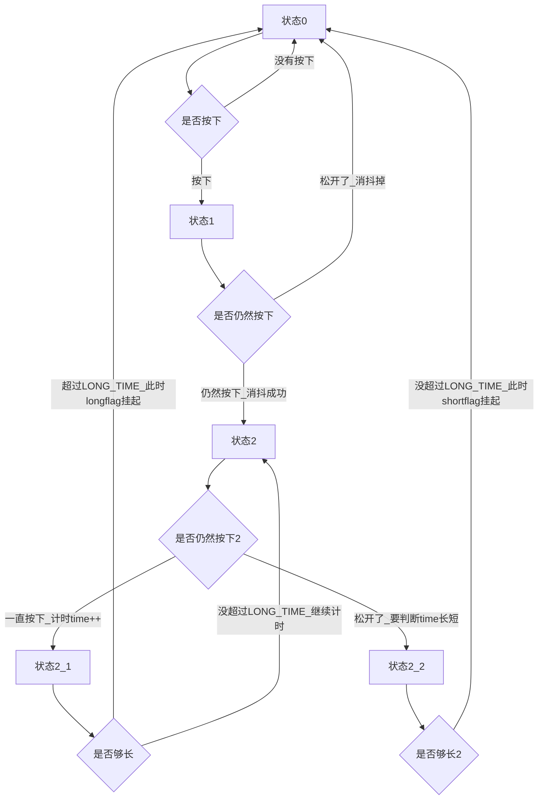
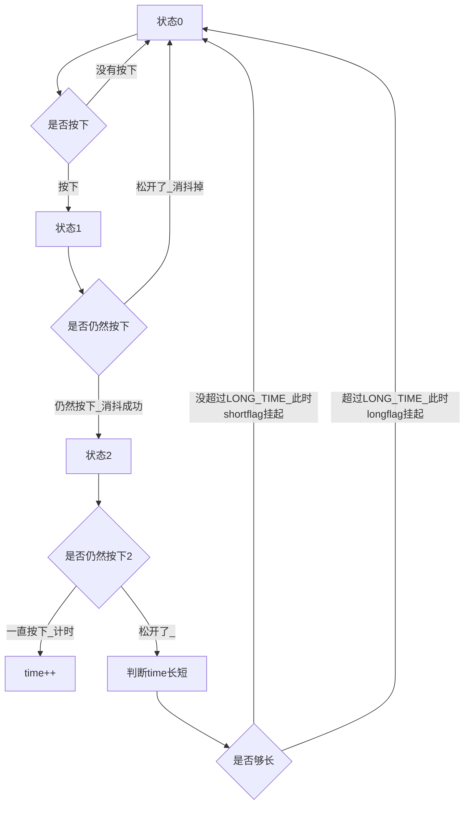

---
publish: true
tags:
  - 嵌入式
date: 2024-12-26 15:21:00
---
---
title: "蓝桥杯STM32G431RBT6"
date: 2025-02-14 21:17:00
tags: "嵌入式32"
---
<meta name="referrer" content="no-referrer"/>

# 蓝桥杯

## 注意事项
1. 移植lcd之后要记得在main函数内LCD_Init();开启lcd。
2. 如果lcd显示时led全亮大概率是PD2锁存器出问题
3. lcd显示最好都各自带一个char text[30];
4. 按键按下表启动，进入下一步
5. adc一定要在main开启校准函数HAL_ADCEx_Calibration_Start(&hadc2,ADC_SINGLE_ENDED);记住Calibration和ADC_SINGLE_ENDED
6. adc自写函数里每一次最好都开启一遍HAL_ADC_Start(hadc);
7. adc自写函数里value=HAL_ADC_GetValue(hadc);用uint32_t存储，之后转换到float数
8. adc的转换先乘以3.3再除以4096，顺序反了就归零了
9. 串口发送简单，接收需要中断函数void HAL_UART_RxCpltCallback(UART_HandleTypeDef *huart)；
10. 把串口接收单数据和数据数组分开写，用于接收的单数据是uint8_t类型，不是char类型
11. 接收的数据数组是char类型
12. 单数据接收函数HAL_UART_Receive_IT(&huart1,&data,1);最后接收的长度是1，而且中间的单数据必须取地址，这里接收函数最好用中断模式
13. 要先在主函数写一个HAL_UART_Receive_IT(&huart1,&data,1);用来开启

14. 
``` c
//串口接收函数，没有写道串口中断函数内部，注意
if(接收到的数据>0)
{
    if(接收到的数据==正常长度)
    {
        if(接收到的数据==正常值)
        {
            操作；
        }
        else
        {
            异常标记；
        }
    }
    else
    {
       异常标记；
    }
    数据数组清零；
    标记长度清零；
}

```
15. 
```c
//主函数串口接收处理
if(接收长度！=0)
{
    int 临时长度=接收长度；
    延时1ms；
    if(临时长度==接收长度)
    {
        串口接收处理函数；
    }
}

```

16. 发送数据函数HAL_UART_Transmit(&huart1,(uint8_t *)text1,strlen(text1),50);中间的char类型text要强制转换（uint8 *）,发送函数最好别用中断模式，第三个长度用strlen,最后一个数记为50

17. memset函数用法memset(datas,0,30);最后一个直接写数字就好

18. 主函数需要开启pwm定时器HAL_TIM_PWM_Start(&htim17,TIM_CHANEL_1); 

19. 改变占空比函数__HAL_TIM_SET_COMPARE

20. 基础定时器（定时中断功能）：开启示例HAL_TIM_Base_Start_IT(&htim3);使用中断模式

```c
//main.h补全头文件
#include "stdbool.h"
#include "string.h"
#include "stdio.h"
#include "stdlib.h"
//cubemx生成代码要注意把部分头文件从main.c复制到main.h


```


## 产品手册)
)
)
)
)
)
)
)
)
)


## 初始配置)
)
)
)
)

然后创建工程代码

## LED)
)

```c
//led.c
#include "led.h"

void LED_Disp(uchar t)
{
    HAL_GPIO_WritePin(GPIOC,GPIO_PIN_ALL,GPIO_PIN_SET);//先把所有的都关上
    HAL_GPIO_WritePin(GPIOC,t<<8,GPIO_PIN_RESET);//再把高八位设置
    HAL_GPIO_WritePin(GPIOD,GPIO_PIN_2,GPIO_PIN_SET);//先开启PD2锁存器
    HAL_GPIO_WritePin(GPIOD,GPIO_PIN_2,GPIO_PIN_RESET);//信息储存完后再关上PD2锁存器
}

void LED_Init(void)
{
    LED_Disp(0x00);全部关上为初始化
}
```

```c
//led.h
#ifndef _LED_H_
#define _LED_H_

#include "main.h"

void LED_Disp(uchar t);
void LED_Init(void);

#endif

```

## LED第二种写法
```c
void Led_Set(unsigned char t)
{
		HAL_GPIO_WritePin(GPIOC,GPIO_PIN_All,GPIO_PIN_SET);
		HAL_GPIO_WritePin(GPIOD,GPIO_PIN_2,GPIO_PIN_SET);
		HAL_GPIO_WritePin(GPIOD,GPIO_PIN_2,GPIO_PIN_RESET);
	
		HAL_GPIO_WritePin(GPIOC,t<<8,GPIO_PIN_RESET);
		HAL_GPIO_WritePin(GPIOD,GPIO_PIN_2,GPIO_PIN_SET);
		HAL_GPIO_WritePin(GPIOD,GPIO_PIN_2,GPIO_PIN_RESET);
}
```

## key按键
选用基本定时器的定时功能来实现延时操作和检验按键状态)
)
)
)

```c
//interrupt.c
#include "interrupt.h"

struct keys key[4]={0,0,0,0};

void  HAL_TIM_PeriodElapsedCallback(TIM HandleTypeDef *htim)//中断回调函数，中断都会到这里
{
    if(htim->Instance==TIM3)//判断是TIM3引发的中断
    {
        key[0].key_sta=HAL_GPIO_ReadPin(GPIOB,GPIO_PIN_0);//PB0
        key[1].key_sta=HAL_GPIO_ReadPin(GPIOB,GPIO_PIN_1);//PB1
        key[2].key_sta=HAL_GPIO_ReadPin(GPIOB,GPIO_PIN_2);//PB2
        key[3].key_sta=HAL_GPIO_ReadPin(GPIOA,GPIO_PIN_0);//PA0
        for(int i=0;i<4;i++)
        {
            switch(key[i].judge)
            {
                case 0:
                    {
                        if(key[i].key_sta==0)//按键按下
                        {
                            key[i].time=0;//按键按下，计时开始
                            key[i].judge=1;//进入第二步
                        }
                    }break;
                case 1:
                    {
                        if(key[i].key_sta==0)//延时10ms后仍然是按下状态，确认按下，进入第三步
                        {
                            key[i].judge=2;
                        }
                        else  //延时10ms后按键却处于没有按下状态，消抖，回到第一步
                        {
                            key[i].judge=0;
                        }
                    }break;
                case 2:
                    {
                        if(key[i].key_sta==1)//20ms后按键已经松开
                        {
                            key[i].judge=0;//下次判断回到第一步
                            if(key[i].time<70)
                            {
                             key[i].flag=1;//按键短按过一次的标志位置为1
                            }
                        }
                        else //20ms后按键仍然未松开
                        {
                            key[i].time+=10;//计时+10ms
                            if(key[i].time>=70)
                            {
                                key[i].longflag=1;//大于70ms,长按标志位置为1（一直按着直接启动反应）
                            }
                        }
                    }break;
            }
        }
    }
}
```

```c
//interrupt.h

#ifndef _interrupt_H_
#define _interrupt_H_

#include "main.h"
#include "stdbool.h" //想要使用bool类型必须包含这个头文件
struct keys{
    uchar judge;
    bool key_sta;
    bool flag;
    uint32_t time;
    bool longflag;
};
void HAL_TIM_PeriodElapsedCallback(TIM_HandleTypeDef *htim);

#endif
```

```c
//main.c
#include "interrupt.h"

extern struct keys key[];

int main(void)
{
    HAL_TIM_Base_Start_IT(&htim3);  //这个必须打开，这个表示打开定时器3
    while(1)
    {
        if(key[0].flag==1)//如果按键按下
        {
            //咋样咋样咋样咋样……
            key[0].flag=0;//标志位用完了置为0
        }
    }
}
```
- - -


后面修改了下逻辑，松开后再判断长短，上面的代码没改哦  


## 按键第二种写法（滴答定时器）
```c
#define 	KB1 HAL_GPIO_ReadPin(GPIOB,GPIO_PIN_0)
#define 	KB2 HAL_GPIO_ReadPin(GPIOB,GPIO_PIN_1)
#define 	KB3 HAL_GPIO_ReadPin(GPIOB,GPIO_PIN_2)
#define 	KB4 HAL_GPIO_ReadPin(GPIOA,GPIO_PIN_0)
#define KBGET KB1 | (KB2<<1) | (KB3<<2) | (KB4<<3) | 0XF0

uint16_t short_key=0;
uint16_t long_key=0;
__IO uint32_t KeyTick=0;

void Key_Process(void)
{
	if(uwTick-KeyTick<10)return;//10ms
	KeyTick=uwTick;
	
	uint16_t temp=(KBGET)^0XFF;
	short_key=temp&(temp^long_key);
	long_key=temp;
	
	if(short_key&0x01)//B1
	{
		//Menu_Flag=!Menu_Flag;
		//Led_Set(0x01);
	}
	if(short_key&0x02)//B2
	{
		//Led_Set(0x02);
		//PWM_Set(1000,40);	
	}
	if(short_key&0x04)//B3
	{
		//Led_Set(0x04);
		//PWM_Set(2000,30);
	}
	if(short_key&0x08)//B4
	{
		//Led_Set(0x08);
		//PWM_Set(3000,20);
	}
}
```

## 按键双击)

```c
//双击
if(短按)
{
    标志位++;
    if(标志位==1)
    {
        //开始计时
    }
    if(标志位==2&&时间<0.5s)
    {
        双击操作；
        标志位=0；
    }
}
if(时间>=0.5)
{
    标志位=0；
}
```
### 按键长按)

## LCD)

LCD的cubemx配置配置对应IO口为输出即可，也可以不配置，直接copy数据包代码
)
)

```c
//main.c
int main(void)
{
    LCD_Init();
	LCD_Clear(Blue);
	LCD_SetBackColor(Blue);
	LCD_SetTextColor(White);    
    char text[30];
    sprintf(text,"  frq_eep:%d            ",temp);
    LCD_DisplayStringLine(Line1, (uint8_t *)text);   
    while(1)
    {
        
    }
}
```

## 定时器输出PWM
共10个定时器分别为  
2个基本定时器（TIM6和ITIM7)  。
3个通用定时器（TIM2~TIM4) :全功能通用定时器。  
3个通用定时器（TIM15~TIM17):只有1个或者2个通道。  
2个高级控制定时器（TIM1和ITIM8) 。
 
以下是基本定时器的输出PWM配置 )))
```c
//main.c

uchar duty=20;  //uchar是unsigned char ,main.h里面define一下

int main(void)
{
    HAL_TIM_PWM_Start(&htim17,TIM_CHANEL_1);                //记住开启输出PWM的定时器
    while(1)
    {
        
    }
}
void key_proc(void)
{
    if(key[3].flag==1)//按键来回切换PA7输出PWM
    {
        duty=(（duty==20）?0:20);
        __HAL_TIM_SetCompare(&htim17,TIM_CHANEL_1,duty);     //记住改占空比
        key[3].flag=0;
    }
}
```
## 输入捕获定时器
共10个定时器分别为
2个基本定时器（TIM6和ITIM7) 。
3个通用定时器（TIM2~TIM4) :全功能通用定时器。
3个通用定时器（TIM15~TIM17):只有1个或者2个通道。
2个高级控制定时器（TIM1和ITIM8) 。

两个555定时器生成占空比为50%的脉冲通过IO口PA15和PB4输入，电阻R40,R39调节可以改变信号脉冲的频率。
))
)
)
```c
//interrupt.c

#include "interrupt.h"
double val=0;//直接输入捕获定时值
double val2=0;//间接输入捕获定时值
float frq=0;//输入捕获频率
float ca_duty=0;//输入捕获占空比

void HAL_TIM_IC_CaputureCallback(TIM_HandleTypedef *htim)//输入捕获定时器回调函数
{
    if(htim->Instance==TIM2)//如果起作用的是TIM2
    {
        if(htim->Channel==HAL_TIM_ACTIVE_CHANNEL_1)//中断消息来源，选择直接输入的通道
        {
            val=HAL_TIM_ReadCapturedValue(htim,TIM_CHANNEL_1);//读取TIM2直接捕获的定时器计数值
            val2=HAL_TIM_ReadCapturedValue(htim,TIM_CHANNEL_2);//读取TIM2间接捕获的定时器计数值
            __HAL_TIM_SetCounter(htim,0);//读取完成后将计数器清零
            frq=(80000000/80/val);//这里的val相当于是TIM2直接捕获的重装载值，计算出频率
            ca_duty=(val2/val)*100;//计算占空比
            HAL_TIM_IC_Start(htim,TIM_CHANNEL_1);//重新开启输入捕获定时器的通道一
            HAL_TIM_IC_Start(htim,TIM_CHANNEL_2);//重新开启输入捕获定时器的通道二
        }
    }
}
```
```c
//interrupt.h

#ifndef _interrupt_H_
#define _interrupt_H_

#include "main.h"

void HAL_TIM_IC_CaptureCallback(TIM_HandleTypeDef *htim);//输入捕获定时器回调函数

#endif
```
```c
//main.c

extern float frq;//输入捕获频率
extern float ca_duty;//输入捕获占空比

int main(void)
{
    HAL_TIM_IC_Start_IT(&htim2,TIM_CHANNEL_1);
    HAL_TIM_IC_Start_IT(&htim2,TIM_CHANNEL_2);//打开输入捕获定时器
    while(1)
    {
        
    }
}

void show_proc(void)
{
        sprintf(text,"      FRQ:%.2f        ",frq);
  	LCD_DisplayStringLine(Line8, (uint8_t *)text);
		sprintf(text,"   DUTY:%.2f          ",ca_duty);
  	LCD_DisplayStringLine(Line9, (uint8_t *)text);
}
```

## ADC数模转换
电压从0v到3.3v的变化))

```c
//psbadc.c

#include "bspadc.h"

double GetADC(ADC_HandleTypeDef *pin)
{
    uint32_t adc;
    HAL_ADC_Start(pin);//开启这个ADC对应引脚的adc
    adc=HAL_ADC_GetValue(pin);//获取ADC值
    return adc*3.3/4096; //读取到的adc是2的12次方内的量化值，将其变成3.3V内的量化值
}
```
```c
//bspadc.h

#ifndef _bspadc_H_
#define _bspadc_H_

#include "main.h"

double GetADC(ADC_HandleTypeDef *pin);

#endif
```
```c
//main.c

int main(void)
{
	HAL_ADCEx_Calibration_Start(&hadc1,ADC_SINGLE_ENDED);//ADC校准函数 使用后测量更准确
    while(1)
    {
        
    }
}

void show_proc(void)
{
    sprintf(text,"    R37:%.2lf         ",GetADC(&hadc2));
  	LCD_DisplayStringLine(Line9, (uint8_t *)text);
}
```
## I2C读写eeprom

需要将PB6,PB7设置为输出模式
)
)
)

0XA0:写，0XA1:读（01与MPC相同，看手册）

I2C读取写入eeprom、MPC

```c
uint8_t MPC_read(void)
{
	uint8_t temp;
	I2CStart();//开启I2C
	I2CSendByte(0X5F);//发送读
	I2CWaitAck();//等待
	temp=I2CReceiveByte();//接收数据
	I2CSendNotAck();//发送非应答
	I2CStop();//关闭I2C
	return temp;
}

void MPC_write(uint8_t data)
{
	I2CStart();//开启I2C
	I2CSendByte(0X5E);//发送写
	I2CWaitAck();//等待
	I2CSendByte(data);//发送数据
	I2CWaitAck();//等待
	I2CStop();//关闭I2C
}

void eeprom_write(uint8_t add,uint8_t data)
{
	I2CStart();//开启I2C
	I2CSendByte(0Xa0);//发送写
	I2CWaitAck();//等待
	I2CSendByte(1);//发送add
	I2CWaitAck();//等待
	I2CSendByte(data);//发送数据
	I2CWaitAck();//等待
	I2CStop();//关闭I2C
}

uint8_t eeprom_read(uint8_t add)
{
	uint8_t temp;
	I2CStart();//开启I2C
	I2CSendByte(0Xa0);//发送写
	I2CWaitAck();//等待
	I2CSendByte(1);//发送add
	I2CWaitAck();//等待
	
	I2CStart();//开启I2C
	I2CSendByte(0Xa1);//发送读
	I2CWaitAck();//等待
	temp=I2CReceiveByte();///接收数据
	I2CSendNotAck();//发送非应答
	I2CStop();//关闭I2C
	
	return temp;
}
```
在main中的实际操作
```c
//main.c
int main(void)
{
    I2CInit();
    while(1)
    {
        
    }
}

void key_proc(void)
{
    if(key[1].key_flag==1&&view==0)//eeprom写入数据
    {
        uchar frq_h=frq>>8;//at24c02只能读取8位，而frq是16位
        uchar frq_l=frq&0xff;//把at24c02拆分成上八位和下八位
        eeprom_write(1,frq_h);
        HAL_Delay(10);//操作之间需要延时
        eeprom_write(2,frq_l);
        key[1].key_flag=0;
    }
}
void show_proc(void)
{
    if(view==0)
	{
		uint16_t temp=(eeprom_read(1)<<8)+eeprom_read(2);//把8位数据恢复成16位
		sprintf(text,"  frq_eep:%d            ",temp);
    	LCD_DisplayStringLine(Line1, (uint8_t *)text);
    }
}
```

## USART通信)))

USART发送
```c
//main.c
int main(void)
{
    while(1)
    {
        char temp[20];
        sprintf(temp,"frq=%d\r\n",frq);
	    HAL_UART_Transmit(&huart1,(uint8_t *)temp,strlen(temp),50);
    }
}
```

UART接收
```c
//main.c
extern char rxdata[30];
extern uint8_t rxdat;
extern uchar rx_pointer;

char car_type[5];
char car_data[5];
char car_time[24];

void uart_rx_proc(void);

int main(void)
{
    HAL_UART_Receive_IT(&huart1, &rxdat, 1);//打开uart
    while(1)
    {
        if(rx_pointer!=0)
		{
			int temp=rx_pointer;
			HAL_Delay(1);
			if(temp==rx_pointer)
				uart_rx_proc();
		}    
    }
}

void shoe_proc(void)
{
    //……
    else if(view==2)
	{
		sprintf(text,"      Car_Messege                  ");
  	LCD_DisplayStringLine(Line1, (uint8_t *)text);
		sprintf(text,"Car_type=%s                        ",car_type);
  	LCD_DisplayStringLine(Line2, (uint8_t *)text);
		sprintf(text,"Car_data=%s                        ",car_data);
  	LCD_DisplayStringLine(Line4, (uint8_t *)text);
		sprintf(text,"t=%s                        ",car_time);
  	LCD_DisplayStringLine(Line6, (uint8_t *)text);
		sprintf(text,"                        ");
  	LCD_DisplayStringLine(Line8, (uint8_t *)text);
		sprintf(text,"                        ");
  	LCD_DisplayStringLine(Line9, (uint8_t *)text);
		
	}
}

void uart_rx_proc(void)
{
	if(rx_pointer>0)
	{
		if(rx_pointer==22)
		{
			 sscanf(rxdata,"%4s:%4s:%12s",car_type,car_data,car_time);
		}
		else
		{
			 char temp[20];
			 sprintf(temp,"Error\r\n"); 
	     HAL_UART_Transmit(&huart1,(uint8_t *)temp,strlen(temp),50); 
		}
		rx_pointer=0;
	  memset(rxdata,0,30);
	}
}
```  

```c
//interrupt.c
char rxdata[30];
uint8_t rxdat;
uchar rx_pointer;
void HAL_UART_RxCpltCallback(UART_HandleTypeDef *huart)
{
	rxdata[rx_pointer++]=rxdat;
	HAL_UART_Receive_IT(&huart1, &rxdat, 1);
}
```
## RTC时钟)
```c
void RTC_Process(void)
{
	HAL_RTC_GetTime(&hrtc,&sTime1, RTC_FORMAT_BIN);
	HAL_RTC_GetDate(&hrtc,&sDate1, RTC_FORMAT_BIN);
}

void HAL_RTC_AlarmAEventCallback(RTC_HandleTypeDef *hrtc)
{
	Menu_Flag=!Menu_Flag;
}
```
## 滴答计时器使用方法
```c
//定时50ms发送---代码格式
if(uwTick-UARTTick<50)return;//50ms
UARTTick=uwTick;

```
[客观题](https://blog.csdn.net/nullccc/article/details/128420921)