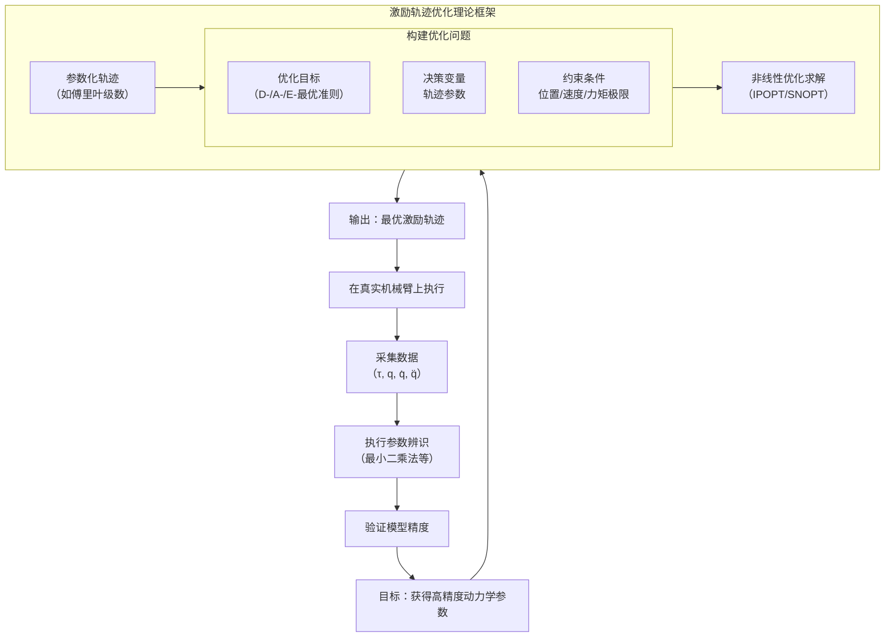
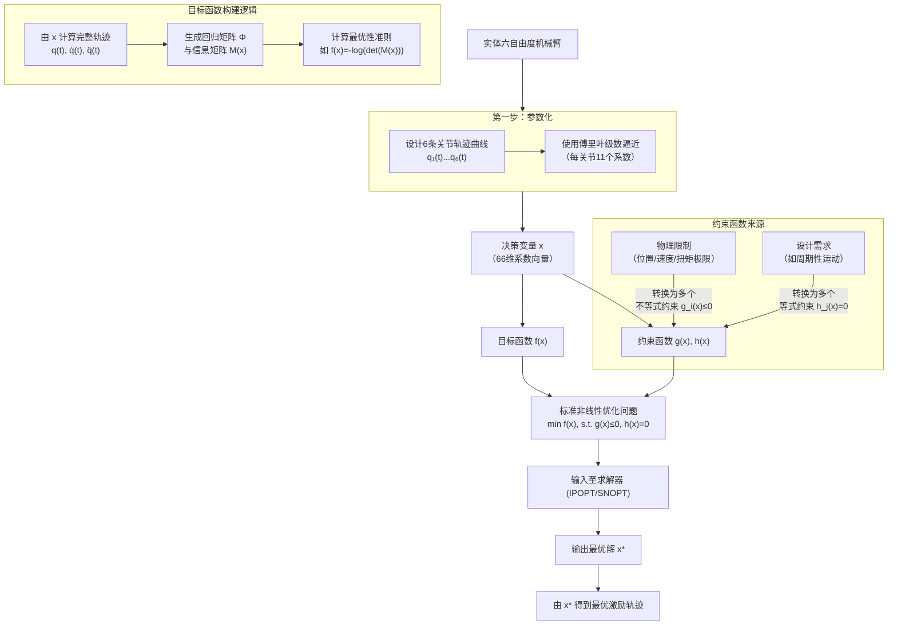
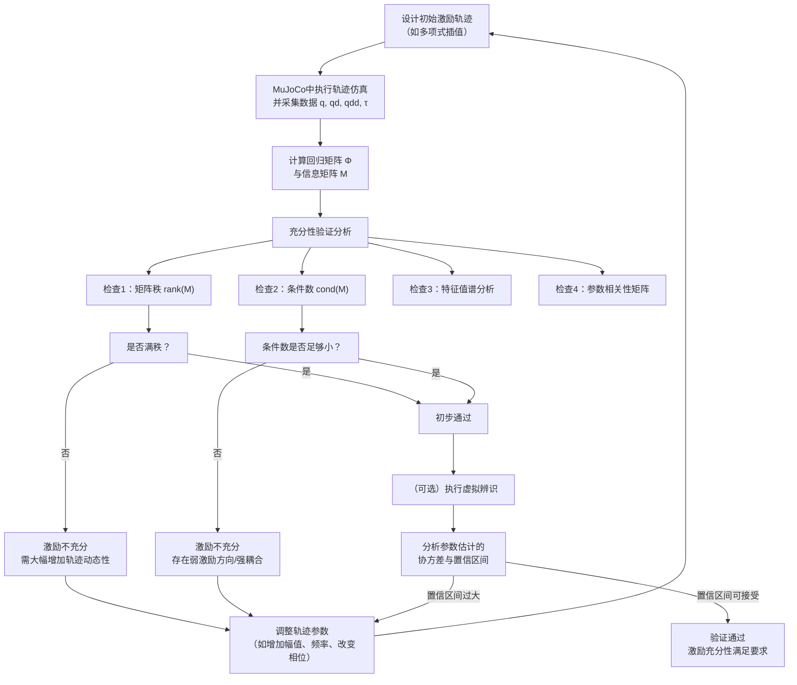

---
tags:
  - 本科毕设论文相关
date: 2026-01-12 19:17:00
---
[toc]
# 激励轨迹优化
激励轨迹优化的目的就是让机械臂执行一段运动，使其关节经历足够丰富的位置、速度、加速度组合，从而让所有动力学效应（如惯性力、科氏力、摩擦力、重力）都被充分激发并体现在电机扭矩数据中。  
- - -
优化目标：设计一条在物理约束（位置、速度、加速度、扭矩极限）下的轨迹，使得由其产生的回归矩阵（观察矩阵）满足特定的信息性准则，即该矩阵能提供关于系统参数的最大信息量，同时最小化参数估计的统计不确定性。  
## 1.标准优化问题建模
激励轨迹优化通常被表述为一个约束非线性优化问题，其数学框架如下：  
### 决策变量
是轨迹本身。通常将每个关节的轨迹参数化，决策变量就是这些参数。  
> 常用参数化方法
>1. 傅里叶级数  
>2. B样条曲线
>3. 多项式插值

### 目标函数
衡量轨迹“激励”能力强弱的准则。目标是最大化这些准则函数。  
>关键信息矩阵:回归矩阵Φ，  
动力学模型可线性化为：τ = Φ(q, q̇, q̈) * π  
其中 τ 是力矩向量，π 是待辨识的动力学参数向量。  
- - -
>主流优化准则
>1. D-最优准则：最大化回归矩阵信息矩阵 M = (1/N) * Φ^T * Φ 的行列式。max det(M)  
>2. A-最优准则：最小化信息矩阵 M 的逆的迹（即参数估计的方差和）。min trace(M^{-1})  
>3. E-最优准则：最大化信息矩阵 M 的最小特征值。max λ_min(M)  
>4. T-最优准则：最大化信息矩阵 M 的迹。max trace(M)  

### 约束条件
确保轨迹在物理上是可行的，不违反任何动力学或运动学限制。  
>1. 位置约束：q(t) ∈ Q  
>2. 速度约束：q̇(t) ∈ Q̇  
>3. 加速度约束：q̈(t) ∈ Q̈  
>4. 扭矩约束：τ(t) ∈ T  

## 2. 优化求解流程与算法
1. 参数化轨迹：选择基函数（如傅里叶级数），将连续轨迹离散为有限维决策变量 x。

2. 前向动力学计算：给定一组决策变量 x，计算各时间步的 q(t), q̇(t), q̈(t)。

3. 构建回归矩阵：根据动力学模型，计算整个轨迹对应的 Φ。

4. 计算信息矩阵与准则：形成 M(x)，计算目标函数 f(x) = -criteria(M(x))（转化为最小化问题）。

5. 评估约束：计算约束函数 g(x) ≤ 0。

6. 调用优化求解器：求解带约束的非线性优化问题。

7. 常用求解器：fmincon (MATLAB)，IPOPT (开源)，SNOPT (商业)，结合 CasADi 等自动微分工具进行高效梯度计算。

8. 收敛验证：检查优化结果是否满足约束，并分析其信息矩阵。
- - -

# 激励轨迹优化理解
## 第一步:物理世界 → 我想让机械臂“怎么动”
你有一个六自由度机械臂，你想设计它的运动来激发它的动力学特性。本质上，你是要设计 6条随时间变化的关节位置曲线 `q₁(t), q₂(t), ..., q₆(t)。`  
- 这就是你的物理目标：找到最好的6条运动曲线。  
## 第二步:曲线无限多 → 用有限参数来描述曲线
`q(t)` 是一个连续函数，有无限种可能。为了优化，我们必须用一个 ___有限维的参数集合___ 来代表它。这就是 ___“参数化”___。 

- 常用方法：傅里叶级数
我们决定用 __5__ 个正弦/余弦项（基函数）来近似每一条关节轨迹。  
`q₃(t) = a₃₀ + Σ [a₃ₖ·sin(kωt) + b₃ₖ·cos(kωt)]`，其中 k=1 到 5。  
> a₃₀, a₃₁, b₃₁, ..., a₃₅, b₃₅ 就是描述关节3运动曲线的系数。  

- 决策变量 x 诞生了
> 关节1：有 (1+2*5)=11 个系数 [a₁₀, a₁₁, b₁₁, ..., a₁₅, b₁₅]  
> 关节2：同样11个系数  
> ...
> 关节6：同样11个系数  
`x`就是把所有这 `6*11 = 66 `个系数按顺序拼接起来的一个大向量！  
`x = [a₁₀, a₁₁, b₁₁, ..., a₆₅, b₆₅]^T`  
>物理意义：x 决定了整个机械臂的运动模式。优化 x，就是在所有能用这66个参数描述的“运动模式家族”里，寻找最好的那一个。
- - -
## 第三步：“好”的标准是什么？ → 目标函数 f(x)  
我们希望运动能最大程度地“激励”系统。在数学上，这等价于让我们从数据中能最准确地反推出动力学参数。  
> 关键桥梁：信息矩阵 `M(x)`    
>>1. 给定一组系数 `x`，我们能算出整个时间段内所有关节的 `q(t), q̇(t), q̈(t)`（位置、速度、加速度）。  
>>2. 将这些运动数据代入动力学方程，可以生成一个巨大的回归矩阵 `Φ`。`Φ` 的“信息量”决定了参数辨识的精度。  
>>3. `M(x) = Φ^T Φ` 被称为信息矩阵（或Fisher信息矩阵）。`M` 的“大小”直接衡量了信息量。 

>目标函数`f(x)` 的具体化  
>>- D-最优准则：我们希望 M(x) 的行列式 det(M(x)) 最大。行列式大，意味着参数估计的联合置信椭球体积小，总体精度高。  
>>- 因此，我们定义目标函数为：f(x) = -det(M(x)) 或 f(x) = -log(det(M(x)))。优化问题变成了 最小化 f(x)。  
## 第四步：机械臂不能乱动 → 约束函数 `g_i(x)` 和 `h_j(x)`
机械臂有物理限制，这些限制就是优化问题的 __约束__。

- __不等式约束__ `g_i(x) ≤ 0`（通常很多）

- 1. __关节位置限位__：`q₃_min ≤ q₃(t) ≤ q₃_max`。这可以写成两个不等式：
`g₁(t) = q₃(t) - q₃_max ≤ 0`
`g₂(t) = q₃_min - q₃(t) ≤ 0`
因为轨迹是连续的，我们需要在__离散的多个时间点__（如1000个）上都满足，所以这一个关节的位置约束就会产生 `2 * 1000 = 2000` 个不等式约束 `g_i`。

- 2. __关节速度/加速度/扭矩限制__：同理，每个限制在每个时间点都会产生不等式约束。

- 等式约束 `h_j(x) = 0`

- - __周期性边界条件__：为了让激励充分且数据好处理，我们通常希望轨迹是 __周期性的__，即终点状态回到起点。
`h₁: q₁(T) - q₁(0) = 0`
`h₂: q̇₁(T) - q̇₁(0) = 0`
`h₃: q₂(T) - q₂(0) = 0`
... 依此类推。这会产生 6 (位置) + 6 (速度) = 12 个等式约束。
- - -

- - -
## 最终，你的问题变成了
“寻找一个66维的系数向量 x，在可能高达数万个不等式约束和十几个等式约束下，最小化一个由矩阵行列式对数定义的、高度非线性的目标函数 f(x)。”  
这就是非线性优化求解器（如IPOPT）所要处理的问题。它将自动处理这些复杂的数学关系，为你搜索出那个最好的 x，从而得到那条最“激动人心”的机械臂运动轨迹。  

# 激励充分性
__它指的是一条激励轨迹能够有效激发并区分机器人所有待辨识的动力学参数特性的能力。__  
一条“激励充分”的轨迹，必须让机器人在运动过程中，将每一个动力学参数（如连杆质量、质心位置、惯性张量、摩擦系数等）的 __独立影响__ 都清晰地“烙印”在电机反馈的力矩数据上，从而让后续的参数估计算法能够无歧义地、高精度地将它们反推出来。  
如果激励不充分，会导致参数估计出现 __病态问题__，例如多个不同参数组合产生几乎相同的力矩输出，导致算法无法区分，最终得到错误或物理意义不合理的参数。  
##  激励充分性的核心评价标准（数学指标
1. 可辨识性
    - 要求:信息矩阵` M` 必须是满秩的。  
    - 物理意义：矩阵的秩等于独立可辨识的线性参数的数量。如果 `M` 不满秩（奇异），则意味着至少有一个参数（或其线性组合）对输出力矩完全没有影响，或者其影响可以被其他参数的组合完全替代，导致该参数在数学上不可辨识。
    - 检查方法:计算 M 的秩 rank(M)。理想情况下，rank(M) 应等于你期望辨识的最小参数集（基参数） 的数目。如果小于，则激励不充分。
2. 条件数 
    - 定义：信息矩阵 M 的最大特征值与最小特征值之比，即 cond(M) = λ_max / λ_min。
    - 物理意义：衡量参数估计问题的数值稳定性和参数间的耦合程度。
        - 条件数过大（如 > 1000）：意味着 M 是“病态”的。最小特征值对应的参数方向上的信息极其微弱，该方向的微小测量噪声会被极度放大，导致对应参数的估计结果方差巨大、不可信。这也反映了某些参数之间存在强相关性（耦合）。
    - 目标：通过优化激励轨迹，最小化 cond(M)，使其尽可能接近1。

3. 最优实验设计准则  
这些是用于轨迹优化的目标函数，同时也是评价充分性的高级指标
    - D-最优性：最大化信息矩阵 M 的行列式 det(M)。这等价于最小化所有参数联合置信椭球的体积，追求整体精度最优。  
    - A-最优性：最小化 M⁻¹ 的迹 trace(M⁻¹)。这等价于最小化所有参数估计方差之和。  
    - E-最优性：最大化 M 的最小特征值 λ_min。这直接强化最弱可辨识方向，改善条件数。
    - G-最优性：最小化参数预测方差的最大值。
- - -
## 在MuJoCo仿真中的验证流程与方法

- - -

algorithms(算法)  
estimating（评估）  
validating （确认）  
application(应用、申请)  
manufacturers(制造商)   
advanced(先进的)  
simulation （模拟，假装，仿真）   
accurate(精确的)  
path plannning(路径规划)  
mechatronics（机电一体化）  
crucial（至关重要的）  
precision and reliability（精确性和可靠性）  
severe（十分严重的）  
considerable（相当大的）  
vast(巨大的)  
procedure（手续，流程）  
modeling（建模）, experiment design（实验设计）, data acquisition（数据采集）, signal processing（信号处理）, parameter estimation（参数评估） and model validation（模型验证）   
specifications（规格，指标）  
verifies（证实、核实）  
propose（提议）  
reconsidered（重新考虑）  
inertial（惯性的、不活泼的）  
contrast（对比）  
adaptive（适应的）  

# 论文2 - Huang et al. - 2023 - Dynamic Parameter Identification of Serial Robots Using a Hybrid Approach.pdf

解决问题：  
如何更准确地辨识机器人动力学参数（尤其是摩擦 + 惯性），并保证结果“物理合理”  

- - -
## 传统方法的问题  
### 问题1 LS不够好（对噪声敏感，不保证物理合理（可能出现负质量））
### 问题2 摩擦模型太粗糙（低速区域存在stribeck效应（粘滑））
### 问题3 误差没有被充分利用

## 该论文创新点
__IHLS-BPNN框架__    
分三层  
###  一、IHLS  
Iterative Hybrid Least Squares  
"改进版最小二乘 + 迭代优化 + 物理约束"  

1. 
引入物理约束（LMI-SDP）  
避免负数质量和非物理惯性  
->  把参数辨识变成“带约束优化问题”  

2. 
引入“加权最小二乘”（关键思想）  
权重矩阵：
$$
\mathbf{W} = \mathbf{C}^{-1/2}
$$
其中C是误差协方差  
表示误差大的数据权重小  

3. 双循环结构  
内循环： 优化惯性参数
求解带约束LS，再更新误差  再更新协方差  再更新权重矩阵  
直到收敛  

外循环： 优化摩擦参数  
先把惯性力矩算出来，
剩余
$$
\tau_{rest} = \tau - \tau_{inertia}
$$
用这个去拟合摩擦  

### 二、引入stribeck摩擦模型
模型  

能描述低速粘滑，非线性更加真实  
但是 非线性不能直接LS  
解决：转成hcu“可优化形式+数值优化”  

### 三、BPNN
神经网络补偿  
因为即使stribeck，仍然有误差  
BPNN学习
$$
F_{model} -> F_{real}
$$
输入 速度 加速度 摩擦预测  
输出 实际摩擦  
是在__用数据驱动补偿模型误差__  

- - -

