- - -
**摘　要**

由于工业机器人动力学参数的精确辨识是实现高精度控制和高保真数字孪生建模的基础，因此传统离线辨识方法的种种不足变得十分明显：这些方法所得到的参数是静态的，不能进行动态更新，并且对低速摩擦、关节柔性等非线性因素极为敏感，从而无法直接满足数字孪生系统中虚实一致性持续改进的需求。

本设计选取UR12e六自由度工业机器人为研究对象，提出一种基于数字孪生闭环驱动的"离线标定—在线更新—残差补偿"一体化的动力学参数辨识框架。首先，详细阐述了动力学参数辨识问题，并基于牛顿-欧拉递推动力学建立了包含连杆惯性和库仑-黏性摩擦参数的线性回归模型。通过奇异值分解技术，将原始72维参数压缩至大约48维的最小参数集，有效解决了辨识病态问题；同时，设计了五阶傅里叶级数激励轨迹以提供充分的激励数据。进一步深入研究辨识方法并实现了批量加权最小二乘、带遗忘因子的在线递推最小二乘以及在线递推最小二乘-神经网络分层融合补偿策略——利用在线递推最小二乘保留物理可解释性，而神经网络专门吸收结构化残差。在此基础上，构建了一个涵盖物理实体层、数据计算层与虚拟模型层的数字孪生双向闭环系统，从而实现了从真实机器数据驱动辨识到参数回注孪生体、再到虚实一致性验证的全流程闭环操作。

实验结果表明，引入摩擦模型进行了离线辨识之后，力矩预测的R²从0.8803提高到了0.9842；再使用在线递推最小二乘法后，均方根误差达到了0.3368Nm；而在引入神经网络残差补偿后，均方根误差进一步降低到0.2365Nm，决定系数提升至0.9922。更重要的是，三轮迭代工程验证了各辨识子模块具备良好的可迁移性及可复用性，因此本文自然且合理地提供了构建可以在线持续校准的工业机器人高保真数字孪生体的理论依据。

**关键词：** 工业机器人；动力学参数辨识；数字孪生；在线递推最小二乘；神经网络；虚实闭环

---

**Abstract**

Accurate dynamic parameter identification underpins both high-precision robot control and faithful digital twin modeling — yet traditional offline methods fall short. Their parameters are static, update-blind, and brittle against nonlinearities like low-speed friction and joint flex, making them a poor fit for digital twins that need to track reality continuously.

This work takes the UR12e 6-DOF robot and builds a three-stage pipeline: offline calibration, online update, and residual compensation, all wired into a closed-loop digital twin. A Newton-Euler recursive model captures link inertia and Coulomb-viscous friction as a linear regression; SVD then trims the parameter space from 72 to roughly 48 dimensions, removing ill-conditioning. A fifth-order Fourier trajectory handles excitation. Three identification layers sit on top of each other — batch weighted least squares for the offline pass, forgetting-factor recursive least squares for real-time tracking (keeping physical interpretability intact), and a neural network that absorbs whatever structured residuals the physics model misses. The twin itself runs a bidirectional loop across hardware, computation, and virtual-model layers: real data drives re-identification, updated parameters flow back in, and virtual-real consistency is checked on the fly.

Results are straightforward. Adding friction to the offline model lifted R² from 0.8803 to 0.9842. Online recursive least squares brought RMSE to 0.3368 Nm; stacking the neural network residual layer pushed it to 0.2365 Nm with R² at 0.9922. Three validation rounds across different configurations confirmed the modules transfer cleanly — meaning this isn't a one-off calibration but a reusable framework for digital twins that stay accurate as long as the robot runs.

**Key words:** industrial robot; dynamic parameter identification; digital twin; online recursive least squares; neural network; virtual-real closed loop

---

数字孪生驱动的工业机器人关键动力学参数辨识  
[toc]
# 1. 绪论  
## 1.1 研究背景与意义  
在全球制造业向智能化、柔性化加速演进的浪潮中，工业机器人已超越传统简单重复的劳动替代，成为实现精密装配、高端加工、协同作业等复杂任务的核心装备。随着任务精度与动态性能要求的跃升，其控制系统的“模型依赖性”日益凸显。一个精确的机器人动力学模型，如同其数字世界的“灵魂”，是实现高精度轨迹跟踪、振动主动抑制与外力动态补偿的基石。然而，构成这一模型的关键动力学参数——包括连杆的质心、惯性张量、关节的摩擦系数等——在机器人的全生命周期中并非恒定不变。它们受到装配误差、长期磨损、负载变化及温度波动等因素的深刻影响，导致基于理想图纸和出厂设计的静态模型难以匹配物理实体的真实状态，从而形成制约机器人性能突破的“模型失配”瓶颈。

传统的动力学参数辨识方法主要依赖于精心设计的离线实验。通过激励轨迹规划采集数据，再运用最小二乘等算法进行批量估计。这类方法虽成熟，但存在显著局限：其一，实验过程需机器人专用空载运行，可能中断生产；其二，辨识结果仅为某一特定时刻与状态下的“静态快照”，难以直接用于后续的模型更新；其三，对测量噪声和模型结构误差较为敏感。当前，虽有研究引入神经网络、深度学习等数据驱动方法以期提升精度，但其“黑箱”特性带来的可解释性差、泛化能力弱及海量数据依赖问题，在强调可靠性的工业场景中应用受阻。因此，如何利用有限的实测数据，实现动力学模型的高精度离线校准，并使其能够作为数字孪生模型的可靠初始状态，成为学术界与工业界共同关注的基础性问题。

数字孪生技术的兴起与成熟，为解决上述问题提供了新的思路与工具。数字孪生通过构建与物理实体几何、运动学、动力学特性相映射的高保真虚拟模型，在信息空间开辟了一个可重复、可验证的“试验场”。在本研究中，数字孪生主要扮演以下角色：其一，提供高保真仿真环境，用于生成理想训练数据并验证辨识算法；其二，作为数据融合载体，支持仿真数据与实测数据联合分析；其三，作为参数校准目标模型，支撑虚实一致性持续提升。

需要说明的是，本文题目中的“数字孪生驱动”并非单向作用，而是“真机数据输入—参数辨识更新—孪生体参数回注”的双向反馈闭环驱动过程。真实机械臂运行数据经数字孪生联动平台进入辨识算法，辨识得到的动力学参数再经平台回注至 Isaac Sim 层面的仿真机械臂，从而持续修正孪生体动力学特性并推动其向真机高保真演进。基于此，本文采用“离线初始化 + 在线更新”的技术路线：先利用批量采集数据完成基础参数标定，再通过在线递推辨识实现参数动态更新，使虚拟模型在运行过程中持续贴合物理实体状态。

本研究旨在探索数字孪生框架下工业机器人关键动力学参数“离线建模-在线辨识”一体化方法，其意义体现在理论与实践两个层面：

在理论层面，本研究有望：（1）构建一个融合仿真数据与实测数据的离线-在线统一参数辨识框架，阐明虚拟模型、实测数据与优化算法之间的相互作用机制；（2）提出针对实际工业机器人数据特性的改进最小二乘与在线递推辨识方法，提高参数估计的鲁棒性与精度；（3）利用数字孪生仿真平台生成理想数据集，为离线与在线算法的性能评估提供基准。

在实践层面，本研究的成果可直接服务于智能制造中的机器人校准与维护。精确的动力学参数能够提升机器人的绝对定位精度与轨迹跟踪性能，满足精密加工等高端应用需求；基于辨识参数的健康状态评估可为预测性维护提供依据；同时，经过校准的高保真动力学孪生模型可作为虚拟调试、工艺优化的可靠平台。

综上，开展数字孪生框架下工业机器人关键动力学参数“离线建模 + 在线辨识”研究，既是对传统离线辨识方法的深化，也是推动高可信度数字孪生模型在线运行的关键工作，具有明确的科学价值与工程应用前景。

## 1.2 国内外研究现状
工业机器人动力学参数辨识是实现高精度控制的基础，而数字孪生则为该领域注入了新的研究范式。本节将从传统动力学参数辨识方法和数字孪生闭环驱动的建模与优化方法两方面，对国内外研究现状进行梳理与评述。
### 1.2.1 工业机器人动力学参数辨识的传统方法研究
动力学参数辨识的核心目标是获取机器人连杆的惯性参数（如质量、质心、惯性张量）以及关节的摩擦参数。传统方法已形成一套较为成熟的技术体系，其基本流程通常包括基于牛顿-欧拉法或拉格朗日法建立线性化动力学模型、设计激励轨迹激发动力学特性、采集数据，并最终利用最小二乘法等进行参数估计。该领域的研究焦点主要集中在提升辨识的精度、效率与工程实用性上。

在提升精度与效率方面，研究者们致力于优化模型与算法。例如，通过QR分解等方法提取最小惯性参数集，以消除模型中的冗余参数，提高数值稳定性。同时，针对机器人动力学中的强非线性摩擦环节，发展了多种摩擦模型（如Stribeck、LuGre模型）及其辨识方法，以更精确地描述低速爬行等现象。在工程化方面，研究趋向于开发模块化、可编程的辨识流程，甚至有研究基于机器人操作系统开发了参数辨识工具箱，旨在简化工程实施步骤。

然而，传统离线辨识方法仍存在一些固有局限：其一，辨识结果依赖于特定的激励轨迹和数据质量，对噪声较为敏感；其二，模型参数通常只辨识一次，缺乏后续的校准与更新机制；其三，高精度辨识往往依赖额外的关节扭矩传感器，增加了成本与复杂性。这些局限促使学者们探索能够融合仿真与实测数据、支持模型校准的新方法。 
### 1.2.2 数字孪生闭环驱动的机器人建模与参数优化研究

数字孪生通过构建与物理实体实时映射、交互与共生的高保真虚拟模型，为机器人建模与参数优化提供了新路径。在机器人领域，数字孪生的应用正从运动学仿真向高保真动力学建模、参数辨识与闭环更新深化。
1. 数字孪生的建模范式与动力学融合  
当前，构建机器人数字孪生体主要有两种技术路径：纯数据驱动模型和数据与机理融合模型。前者依赖人工智能算法与大数据，建模效率高但可解释性差、数据需求量大；后者则结合物理定律与实测数据，在模型可解释性、精度与数据需求间取得平衡，被认为是构建高可信度动力学孪生体的主流方向。例如，有研究明确指出，为数字孪生建立精确的机理动力学模型是集成状态监测、误差补偿等多种应用的基础。
2. 动力学参数在线补偿与优化  
数字孪生的核心优势在于其虚实映射能力，这使得利用实测数据对虚拟模型进行参数校准成为可能。国内外学者已在此方向展开积极探索：  
  - 在移动机器人领域，研究者提出了基于数字孪生的可视化监控框架，并利用神经网络对非线性动力学模型参数进行校准，实验表明该方法可提升机器人的定位精度。  
  - 在并联机器人领域，研究构建了集成运动学模型与改进智能算法的数字孪生系统，实现了离线参数校准与位置误差预测补偿。另有研究建立了刚柔耦合动力学模型作为孪生体核心，并提出了基于卡尔曼滤波数据融合的分布式力/位交互方法，实现了动态误差校正。  
  - 前沿探索方面，大语言模型等AI技术与仿真平台的结合为未来动力学模型的自动优化提供了新工具。同时，在软机器人等复杂系统建模中，有限元分析与机器学习的结合也为数字孪生提供了精细化建模思路。

上述研究多聚焦于利用数字孪生实现参数校准与误差补偿，且大量工作采用离线批量辨识作为模型初始化的手段，这与本文的研究定位一致。
## 1.3 存在的难点问题
综上所述，当前学术研究有十分明确、自然的发展趋势：从单一离线辨识转向数据结构融合，从独立算法转向系统框架集成，但是毋庸讳言，其中还存在几个值得重视的难点问题：第一，在模型校准的精度及鲁棒性方面，针对实际工业机器人，尚缺少利用有限含噪实测数据及仿真生成数据来提高动力学参数辨识精度、保证辨识鲁棒性的有效方法[17]。第二，在数字孪生框架下的闭环流程方面，目前所见的数字孪生相关工作多未给出从虚拟建模、激励设计、数据采集到在线参数更新、模型持续校准的完整、严谨的闭环框架[18]。第三，在工程实用性及可复现性方面，目前多数研究仍处在实验室原型阶段，故面向工业现场易于部署的标准化辨识流程及工具尚十分稀缺。因此，本文的主要目标是构建数字孪生闭环驱动框架下的工业机器人动力学参数离线建模与在线辨识方法，系统、扎实地解决高保真动力学建模问题，设计基于仿真与实测数据融合的离线/在线辨识算法，并建立参数回注驱动下的虚实一致性持续优化流程，由此真正为提高数字孪生模型与真机的一致性提供可行方案。

## 1.4 研究内容与结构安排
本研究采用“离线辨识奠基、在线辨识增强”的技术范式：基于牛顿-欧拉线性化动力学模型，设计激励轨迹并采集 UR12e 关节运动与力矩数据，先通过离线最小二乘建立参数基线，再通过在线递推与机理-数据融合方法实现参数动态更新。同时，利用数字孪生联动平台形成“真机数据驱动辨识—辨识参数回注孪生体”的双向闭环链路，以 MuJoCo/Isaac Sim 侧仿真数据与真实机器人采集数据开展分层验证。本文的研究内容与章节安排如下：

第1章 绪论：阐述研究背景与意义，综述国内外研究现状，明确研究定位与内容。

第2章 动力学参数辨识问题建模：严格定义辨识问题，给出待辨识参数的物理意义与数学表述，建立线性回归模型框架。

第3章 工业机器人运动学与动力学建模：整合位姿描述、D-H 建模、雅可比矩阵、牛顿-欧拉推导、线性回归矩阵与最小参数集，为参数辨识提供统一建模基础。

第4章 基于数字孪生闭环驱动的参数辨识方法：阐述“数据输入—辨识更新—参数回注”总体框架与离线-在线辨识流程，给出离线最小二乘、在线递推 IHLS 及 IHLS-BPNN 融合辨识算法。

第5章 实验结果分析：分别进行仿真环境下的算法验证与真实机器人数据下的参数辨识，对比分析辨识结果与误差。

第6章 工作总结：总结全文工作，归纳创新点，并对在线辨识能力的持续优化与工程扩展方向进行展望。


# 2 动力学参数辨识问题描述与建模 
为建立后续辨识方法与实验设计的理论前提，本章对工业机器人动力学参数问题进行严格的定义与数学表述。首先阐明辨识问题的基本内涵，继而系统给出待辨识参数的物理定义与量纲，最后建立辨识问题的数学描述形式，并指出其与数字孪生框架相结合时所面临的扩展挑战。  
## 2.1 辨识问题的基本定义  
工业机器人动力学参数辨识，是指在已知机器人结构几何与关节运动状态的前提下，利用关节驱动力矩的测量值或者估计值，反向确定动力学模型中的未知物理参数的过程。该问题属于非线性灰箱辨识问题的一类特例：其结构由牛顿-欧拉或者拉格朗日力学严格确定，但是模型中的惯性参数与摩擦参数未知。
设一台具有$n$个转动关节的串联工业机器人，其动力学行为可由如下标准形式描述：
$$
\begin{align}
\boldsymbol{\tau} =\mathbf{M}(\mathbf{q})\ddot{\mathbf{q}}+\mathbf{C}(\mathbf{q},\dot{\mathbf{q}})\dot{\mathbf{q}}+\mathbf{G}(\mathbf{q})+ \boldsymbol{\tau}_{\text{fric}}(\dot{\mathbf{q}})
\end{align}
\tag{2-1}
$$
其中：  
- $\boldsymbol{\tau} \in \mathbb{R}^n$ 为关节驱动力矩向量；  
- $\mathbf{q}, \dot{\mathbf{q}}, \ddot{\mathbf{q}} \in \mathbb{R}^n$ 分别为关节位置、速度与加速度；  
- $\mathbf{M}(\mathbf{q}) \in \mathbb{R}^{n \times n}$ 为惯性矩阵；  
- $\mathbf{C}(\mathbf{q},\dot{\mathbf{q}}) \in \mathbb{R}^{n \times n}$ 为科里奥利力与离心力矩阵；  
- $\mathbf{G}(\mathbf{q}) \in \mathbb{R}^n$ 为重力项；  
- $\boldsymbol{\tau}_{\text{fric}}(\dot{\mathbf{q}}) \in \mathbb{R}^n$ 为摩擦力矩。   

在式(2.1)中，$\mathbf{M}(\cdot)$、$\mathbf{C}(\cdot)$、$\mathbf{G}(\cdot)$ 的具体形式取决于各连杆的惯性参数（质量、质心位置、惯性张量），而 $\boldsymbol{\tau}_{\text{fric}}(\cdot)$ 则取决于关节摩擦系数。这些参数统称为动力学参数，记作向量 $\boldsymbol{\theta}$。辨识任务可形式化地表述为：给定一组测量数据 ${\mathbf{q}_k, \dot{\mathbf{q}}_k, \ddot{\mathbf{q}}_k, \boldsymbol{\tau}k}{k=1}^{N}$，寻求参数估计 $\hat{\boldsymbol{\theta}}$，使得模型预测力矩与实际力矩之间的某种误差度量最小化。  

## 2.2 待辨识参数的物理定义

### 2.2.1 连杆惯性参数
对于每个连杆 $i$（$i = 1, \dots, n$），其刚体惯性特性由以下10个独立参数完整刻画。    
1. 质量 $m_i$（单位：$\mathrm{kg}$）。质量是决定连杆平动惯性的基本量，直接影响惯性力 $\mathbf{F}i = m_i \dot{\mathbf{v}}{c_i}$ 以及重力项。  

2. 质心位置矢量 $\mathbf{r}i = [r_{ix},; r_{iy},; r_{iz}]^\mathrm{T}$（单位：$\mathrm{m}$）  
质心位置定义在连杆 $i$ 的固连坐标系中。该参数决定了重力对关节轴产生的力矩，以及惯性力对关节轴的力矩臂。在动力学方程中，质量与质心通常以乘积 $m_i \mathbf{r}_i$ 的形式出现。  

3. 惯性张量 $\mathbf{I}_i$（单位：$\mathrm{kg \cdot m^2}$）    
惯性张量描述了连杆绕不同轴旋转时的质量分布，其矩阵表示为对称正定形式：   
$$
\mathbf{I}_i = 
\begin{bmatrix}
I_{ixx} & I_{ixy} & I_{ixz} \\
I_{ixy} & I_{iyy} & I_{iyz} \\
I_{ixz} & I_{iyz} & I_{izz} 
\end{bmatrix}
\tag{2-2}
$$   
其中对角元 $I_{ixx}, I_{iyy}, I_{izz}$ 称为惯性矩，非对角元 $I_{ixy}, I_{ixz}, I_{iyz}$ 称为惯性积。惯性张量决定了连杆在旋转运动中抵抗角加速度的能力，并引起不同旋转轴之间的动力学耦合。  
综上，每个连杆的原始惯性参数向量为：  
$$
\boldsymbol{\theta}^{inertia}_{i} =
\begin{bmatrix}
m_i, & m_i r_{ix}, & m_i r_{iy}, & m_i r_{iz}, & I_{ixx}, & I_{ixy}, & I_{ixz}, & I_{iyy}, & I_{iyz}, & I_{izz} 
\end{bmatrix}^{T}
\tag{2-3}
$$
采用 $m_i \mathbf{r}_i$ 而非 $\mathbf{r}_i$ 作为待估变量，是为了在后续线性回归中保持方程关于参数的线性性质。   

### 2.2.2 关节摩擦参数
关节摩擦力矩是影响低速跟踪精度与稳态误差的关键因素。本文采用工程中广泛使用的库仑 + 黏性摩擦模型：  
$$
\tau_{\mathrm{fric},i}(\dot{q}_i) = f_{c,i} \, \mathrm{sgn}(\dot{q}_i) + f_{v,i} \dot{q}_i
\tag{2-4}
$$
其中：
- $f_{c,i}$（单位：$\mathrm{Nm}$）为库仑摩擦系数，表征与运动方向相反的恒定阻力矩，其符号函数 $\operatorname{sgn}(\cdot)$ 在零速度处需适当正则化；
- $f_{v,i}$（单位：$\mathrm{Nm \cdot s / rad}$）为黏性摩擦系数，表征与速度成正比的阻尼力矩。  

该模型以线性形式纳入待估参数，每个关节引入两个摩擦参数。对于需要更精确刻画低速Stribeck效应的场景，可在此基础上扩展，但本文后续研究以式(2-4)为基础。  

### 2.2.3 完整参数向量  
将全部 $n$ 个连杆的惯性参数与 $n$ 个关节的摩擦参数排列为一个列向量，得到全局参数向量：  
$$
\boldsymbol{\theta} =
\left[
\boldsymbol{\theta}_1^{\mathrm{inertia\;T}},
\;\dots,
\;\boldsymbol{\theta}_n^{\mathrm{inertia\;T}},
\;f_{c,1},
\;f_{v,1},
\;\dots,
\;f_{c,n},
\;f_{v,n}
\right]^\mathrm{T}
\tag{2-5}
$$
对于六自由度串联工业机器人（$n=6$），原始参数总数 $n_\theta = 10n + 2n = 72$。  

## 2.3 辨识问题的数学表述  
### 2.3.1 线性回归形式
根据动力学建模理论，机器人动力学方程均可整理为关于参数向量 $\boldsymbol{\theta}$ 的线性形式： 
$$
\boldsymbol{\tau} = \mathbf{Y}(\mathbf{q},\dot{\mathbf{q}},\ddot{\mathbf{q}})\boldsymbol{\theta}
\tag{2-6}
$$
其中 $\mathbf{Y} \in \mathbb{R}^{n \times n_\theta}$ 称为回归矩阵regressor matrix。其每一行对应一个关节力矩，每一列对应一个待辨识参数，矩阵元素仅依赖于 $\mathbf{q}, \dot{\mathbf{q}}, \ddot{\mathbf{q}}$，而不依赖于 $\boldsymbol{\theta}$。这一线性化性质是参数辨识能够采用标准最小二乘类方法的理论基石。  

### 2.3.2 批量数据下的超定系统  
设通过激励轨迹实验采集 $N$ 个采样点（$N$ 远大于参数个数），每个采样点 $k$ 的回归矩阵为 $\mathbf{Y}_k$，力矩向量为 $\boldsymbol{\tau}_k$。将所有样本纵向堆叠，定义总回归矩阵 $\boldsymbol{\Phi}$ 与总力矩向量 $\mathbf{T}$：  
$$
\boldsymbol{\Phi} =
\begin{bmatrix}
\mathbf{Y}_1 \\
\mathbf{Y}_2 \\
\vdots \\
\mathbf{Y}_N
\end{bmatrix}
\in \mathbb{R}^{(Nn) \times n_\theta},
\quad
\mathbf{T} =
\begin{bmatrix}
\tau_1 \\
\tau_2 \\
\vdots \\
\tau_N
\end{bmatrix}
\in \mathbb{R}^{Nn}
\tag{2-7}
$$
于是辨识问题化为求解超定线性方程组：
$$
\boldsymbol{\Phi} \boldsymbol{\theta} = \mathbf{T}
\tag{2-8}
$$
求解该方程以获得参数估计$\theta$的方法将在第4章给出。  


# 3. 工业机器人运动学与动力学建模
本章整合了运动学与动力学建模的核心内容，按位姿与坐标变换、D-H 建模 、 雅可比矩阵 、 动力学方法选择 、 牛顿-欧拉推导 、 线性化回归 、 最小参数集的顺序展开，为后续参数辨识提供统一的建模基础。各部分均直接针对辨识所需的关键公式与概念。

## 3.1 位姿描述与空间变换
为统一后续 D-H 建模与递推动力学的符号语言，本节先给出位姿与空间变换的基础数学表达。

空间中任意点的位置可用三维向量描述：
$$
\mathbf{P} =
\begin{bmatrix} p_x \\ p_y \\ p_z \end{bmatrix}
\tag{3-1}
$$

刚体的姿态采用旋转矩阵表示，例如坐标系B相对于坐标系A的姿态为：
$$
^{A}_{B}\mathbf{R} = \begin{bmatrix}
n_x & p_x & a_x \\
n_y & p_y & a_y \\
n_z & p_z & a_z
\end{bmatrix}
\tag{3-3}
$$
将位置与姿态合并，即得到齐次变换矩阵，它完整描述了一个坐标系在另一个坐标系中的位姿：  
$$
\mathbf{T} = \begin{bmatrix}
n_x & o_x & a_x & p_x \\
n_y & o_y & a_y & p_y \\
n_z & o_z & a_z & p_z \\
0 & 0 & 0 & 1
\end{bmatrix}
\tag{3-4}
$$
若两个坐标系之间存在旋转和平移的复合变换，则有：  
$$
^A P = {^A_B R} {^B P} + {^A P_B}
\tag{3-7}
$$
该关系可统一写为齐次矩阵形式：
$$
T = \begin{bmatrix} R & p \\ 0 & 1 \end{bmatrix}
\tag{3-8}
$$

平移变换矩阵为：
$$
Trans(p_x, p_y, p_z) = \begin{bmatrix}
1 & 0 & 0 & p_x \\
0 & 1 & 0 & p_y \\
0 & 0 & 1 & p_z \\
0 & 0 & 0 & 1
\end{bmatrix}
\tag{3-9}
$$

绕 $X$、$Y$、$Z$ 轴旋转的齐次矩阵分别为：
$$
R(X, \theta) = \begin{bmatrix}
1 & 0 & 0 & 0 \\
0 & \cos\theta & -\sin\theta & 0 \\
0 & \sin\theta & \cos\theta & 0 \\
0 & 0 & 0 & 1
\end{bmatrix}
\tag{3-10}
$$

$$
R(Y, \theta) = \begin{bmatrix}
\cos\theta & 0 & \sin\theta & 0 \\
0 & 1 & 0 & 0 \\
-\sin\theta & 0 & \cos\theta & 0 \\
0 & 0 & 0 & 1
\end{bmatrix}
\tag{3-11}
$$

$$
R(Z, \theta) = \begin{bmatrix}
\cos\theta & -\sin\theta & 0 & 0 \\
\sin\theta & \cos\theta & 0 & 0 \\
0 & 0 & 1 & 0 \\
0 & 0 & 0 & 1
\end{bmatrix}
\tag{3-12}
$$
以上变换是机器人运动学建模的基础，也是 D-H 参数法的直接数学工具。  
## 3.2 机器人 D-H 建模
D-H 参数法将相邻连杆之间的位姿关系标准化为四个参数：连杆长度 $a_{i-1}$、连杆扭转角 $\alpha_{i-1}$、连杆偏距 $d_i$和关节角 $\theta_i$。这四个参数中，只有关节角$\theta_i$随时间变化，其余由机械结构固定。图3-1给出了建系示意图，本文不再重复其详细几何解释，仅给出变换矩阵。
<div align="center">
  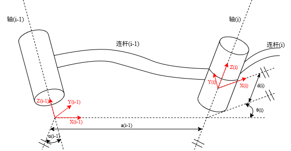
</div>

<div align="center">
图3-1
</div>  

由坐标系 $i-1$到坐标系 $i$ 的齐次变换矩阵为：
$$
\begin{split}
^{i-1}_{i}\mathbf{T} &= R(X, \alpha_{i-1})Trans(a_{i-1},0,0)R(Z, \theta_i)Trans(0,0,d_i) \\
&= \begin{bmatrix}
\cos\theta_i & -\sin\theta_i & 0 & a_{i-1} \\
\sin\theta_i\cos\alpha_{i-1} & \cos\theta_i\cos\alpha_{i-1} & -\sin\alpha_{i-1} & -d_i\sin\alpha_{i-1} \\
\sin\theta_i\sin\alpha_{i-1} & \cos\theta_i\sin\alpha_{i-1} & \cos\alpha_{i-1} & d_i\cos\alpha_{i-1} \\
0 & 0 & 0 & 1
\end{bmatrix}
\end{split}
\tag{3-13}
$$
本文以 UR12e 机器人为研究对象，其 D-H 参数如表3-1所示。
### 表3-1 UR12e机器人D-H参数表

| 连杆$i$ | 扭转角$\alpha_{i-1}$ | 连杆长度$a_{i-1}$/m | 连杆偏距$d_i$/m | 关节角度$\theta_i$ |
|---------|----------------------|----------------------|---------------|--------------------|
| 1       | $\frac{\pi}{2}$      | 0                    | 0.1807        | $\theta_1$         |
| 2       | $0$                  | -0.6127              | 0             | $\theta_2$         |
| 3       | $0$                  | -0.57155             | 0             | $\theta_3$         |
| 4       | $\frac{\pi}{2}$      | 0                    | 0.17415       | $\theta_4$         |
| 5       | $-\frac{\pi}{2}$     | 0                    | 0.11985       | $\theta_5$         |
| 6       | $0$                  | 0                    | 0.11655       | $\theta_6$         |
表中  $\alpha_{i-1}$出现负值是由坐标系方向定义不同导致的，不影响正运动学计算的正确性。
## 3.3 雅可比矩阵
雅可比矩阵描述了末端执行器速度与关节速度之间的线性映射关系，是连接运动学与动力学的桥梁：
$$
\dot{\mathbf{X}} = \mathbf{J}(\mathbf{q})\dot{\mathbf{q}}
$$

基于 D-H 参数，可通过微分变换法直接对正运动学方程求导得到：
$$
\mathbf{J}(\mathbf{q}) = 
\frac{\partial \mathbf{X}(\mathbf{q})}
{\partial \mathbf{q}}
$$

其中$\mathbf{X}(\mathbf{q})$为末端执行器的位姿函数。  
在动力学参数辨识中，雅可比矩阵有两方面作用：其一，它为操作空间动力学模型提供变换基础；其二，雅可比矩阵的行列式为零对应奇异位形，激励轨迹设计时应避开奇异区，以保证回归矩阵的条件数可控，从而确保参数辨识的数值稳定性。本研究基于表3-1的 D-H 参数，利用符号计算工具获得了雅可比矩阵的解析表达式，用于后续的动力学建模。

## 3.4 动力学建模方法对比与选择
常用的机器人动力学建模方法主要有拉格朗日法和牛顿-欧拉法。

拉格朗日法从系统的总动能和总势能出发，通过欧拉-拉格朗日方程导出动力学模型。该方法的物理意义清晰，自然给出线性化参数结构，适合离线符号推导。然而，对于六自由度机器人，符号计算量巨大，实时计算负担重，不利于在线辨识。

牛顿-欧拉法则基于牛顿第二定律和欧拉方程，采用“外推计算速度/加速度—内推计算力/力矩”的递推形式，计算效率极高，且程序实现简单。更重要的是，其递推过程能够直接提取各惯性参数前的系数，便利地构造线性回归矩阵。基于本文“离线标定奠基、在线更新增强”的技术路线，且需要同时支持批量处理和流式数据，因此选择牛顿-欧拉法作为动力学建模的基本方法。

## 3.5 牛顿-欧拉动力学方程推导
设机器人具有 $n$ 个转动关节，基座编号为0，末端连杆编号为 $n$。递推过程分为外推和内推两步。

1. 外推递推$(i = 1,2,…,n)$  

外推从基座开始，依次计算各个连杆的运动学量。基座初始条件为：  
$$
\boldsymbol{\omega}_0 = 0, \dot{\boldsymbol{\omega}}_0 = 0,\dot{\mathbf{v}}_0 = 0
$$
对于转动关节$i$,其角速度、角加速度和线加速度递推公式为： 
$$
\begin{align}
\boldsymbol{\omega}_{i} &= \boldsymbol{\omega}_{i-1} + \dot{\theta}_i \mathbf{z}_{i-1}  \\
\dot{\boldsymbol{\omega}}_{i} &= \dot{\boldsymbol{\omega}}_{i-1} + \ddot{\theta}_{i}\mathbf{z}_{i-1} + \dot{\theta}_{i} \boldsymbol{\omega}_{i-1} \times \mathbf{z}_{i-1} \\
\dot{\mathbf{v}}_i &= \dot{\mathbf{v}}_{i-1} + \dot{\boldsymbol{\omega}}_{i-1} \times \mathbf{P}_i  + \boldsymbol{\omega}_{i-1} \times
(\boldsymbol{\omega}_{i-1} \times \mathbf{P}_i) + \ddot{\theta}_{i}\mathbf{z}_{i-1} + 2\dot{\theta}_{i}\boldsymbol{\omega}_{i-1} \times \mathbf{z}_{i-1} 
\end{align}
\tag{3-14}
$$  
连杆质心的线加速度为： 
$$
\begin{align}
\dot{\mathbf{v}}_{c_{i}} &= \dot{\mathbf{v}}_{i} + \dot{\boldsymbol{\omega}}_{i} \times \mathbf{r}_{i} + \boldsymbol{\omega}_{i} \times 
(\boldsymbol{\omega}_{i} \times \mathbf{r}_{i}) 
\end{align}
\tag{3-15}
$$

2. 内推递推$(i = n,n-1,…,1)$    

内推从末端开始，计算各个连杆之间的相互作用力和力矩，末端为：  
$$
\mathbf{f}_{n+1}=0,\mathbf{n}_{n+1}=0
$$
作用在连杆$i$质心上的惯性力和惯性力矩为：
$$
\begin{align}
\mathbf{F}_i &= m_i \dot{\mathbf{v}}_{c_i}  \\
\mathbf{N}_i &= \mathbf{I}_i \dot{\boldsymbol{\omega}}_i + \boldsymbol{\omega}_i \times (\mathbf{I}_i \boldsymbol{\omega}_i)
\end{align}
\tag{3-16}
$$

连杆$i-1$对连杆$i$的作用力和力矩递推公式为：  
$$
\begin{align}
\mathbf{f}_i &= \mathbf{F}_i + \mathbf{f}_{i+1}  \\
\mathbf{n}_i &= \mathbf{N}_i + \mathbf{n}_{i+1} + \mathbf{r}_i \times \mathbf{F}_i + \mathbf{p}_{i+1} \times \mathbf{f}_{i+1}
\end{align}
\tag{3-17}
$$

最终关节$i$的驱动力矩为$n_{i}$在关节轴方向上的投影加上摩擦力矩： 
$$
\begin{align}
	\tau_i = \mathbf{n}_i^T \mathbf{z}_{i-1}+ \tau_{\text{fric},i}
\end{align}
\tag{3-18}
$$

将上述递推结果整理为标准矩阵形式：  
$$
\begin{align}
\boldsymbol{\tau} = \mathbf{M}(\mathbf{q})\ddot{\mathbf{q}}+ \mathbf{C}(\mathbf{q},\dot{\mathbf{q}})\dot{\mathbf{q}} + \mathbf{G}(\mathbf{q}) + \boldsymbol{\tau}_{\text{fric}}(\dot{\mathbf{q}})
\end{align}
\tag{3-19}
$$

为准确描述关节摩擦特性，摩擦力矩采用工程中常用的库仑+黏性模型：  
$$
	au_{\text{fric},i} = f_{c,i} \operatorname{sgn}(\dot{q}_i) + f_{v,i}\dot{q}_i
\tag{3-20}
$$
其中 $f_{c,i}$ 为库仑摩擦系数，$f_{v,i}$ 为黏性摩擦系数，$\text{sgn}(\cdot)$ 为符号函数。

## 3.6 动力学方程的线性化与回归矩阵
动力学方程（3-19）关于惯性参数和摩擦参数呈线性关系，这是参数辨识能够采用最小二乘类方法的理论基础。将每个连杆的惯性参数组合为标准形式：
$$
	\tilde{\boldsymbol{\theta}}_i = \big[ m_i,\; m_i r_{ix},\; m_i r_{iy},\; m_i r_{iz},\; I_{ixx},\; I_{ixy},\; I_{ixz},\; I_{iyy},\; I_{iyz},\; I_{izz} \big]^{\mathrm{T}}
\tag{3-21}
$$
其中 $m_i\mathbf{r}_i$ 而非 $\mathbf{r}_i$ 作为待估变量，是为了在牛顿-欧拉递推过程中保持线性关系。
记全局参数向量 $\theta \in \mathbb{R}^{n_\theta}$，其含所有连杆的10个参数及每个关节的两个摩擦参数，对于六自由度机器人 $n_\theta = 72$。则动力学方程可写为回归形式：
$$
\boldsymbol{\tau} = \mathbf{Y}(\mathbf{q}, \dot{\mathbf{q}}, \ddot{\mathbf{q}})\;\boldsymbol{\theta}
\tag{3-22}
$$

其中 $\mathbf{Y} \in \mathbb{R}^{n \times n_\theta}$ 称为回归矩阵，其元素仅依赖于 $\mathbf{q}, \dot{\mathbf{q}}, \ddot{\mathbf{q}}$，而与 $\theta$ 无关。本文借助开源动力学库 Pinocchio 高效计算回归矩阵：
```python
Y = pinocchio.computeJointTorqueRegressor(model, data, q[i], dq[i], ddq[i])
```
对于包含摩擦的模型，该函数返回的矩阵维度为 $n \times (10n + 2n)$。设采集 $N$ 个采样点，每个采样点的回归矩阵为 $\mathbf{Y}_k$，力矩向量为 $\boldsymbol{\tau}_k$，则可堆叠为全局超定系统： 
$$
\underbrace{
\begin{bmatrix}
\mathbf{Y}_1 \\
\mathbf{Y}_2 \\
\vdots \\
\mathbf{Y}_N
\end{bmatrix}
}_{\boldsymbol{\Phi} \in \mathbb{R}^{(Nn) \times n_\theta}}
\boldsymbol{\theta}
=
\underbrace{
\begin{bmatrix}
\boldsymbol{\tau}_1 \\
\boldsymbol{\tau}_2 \\
\vdots \\
\boldsymbol{\tau}_N
\end{bmatrix}
}_{\mathbf{T} \in \mathbb{R}^{Nn}}
\tag{3-23}
$$

式(3-23)即后续辨识算法的输入形式。

## 3.7 最小参数集
由于机器人结构的几何约束和运动学耦合，回归矩阵 $\boldsymbol{\Phi}$ 通常是列亏秩的，即 $\text{rank}(\boldsymbol{\Phi}) = r < n_\theta$。若直接估计原始参数 $\theta$，会面临解不唯一和数值不稳定的问题。为此，需要在可辨识子空间中提取最小参数集。

本文采用奇异值分解（SVD）方法进行降维。对 $\boldsymbol{\Phi}$ 做 SVD：  
$$
\boldsymbol{\Phi} = \mathbf{U}\boldsymbol{\Sigma}\mathbf{V}^{\mathrm{T}}
$$

设阈值 $\varepsilon = 10^{-6}\sigma_1$，$\sigma_1$ 为最大奇异值，保留前 $r$ 个满足 $\sigma_i > \varepsilon$ 的右奇异向量构成 $\mathbf{V}_r \in \mathbb{R}^{n_\theta \times r}$。则
最小参数集及其对应的回归矩阵为：  
$$
\boldsymbol{\theta}_{\text{base}} = \mathbf{V}_r^{\mathrm{T}}\boldsymbol{\theta}, \quad
\boldsymbol{\Phi}_{\text{base}} = \boldsymbol{\Phi}\mathbf{V}_r
$$

变换后得到列满秩系统 $\boldsymbol{\Phi}_{\text{base}} \boldsymbol{\theta}_{\text{base}} = \mathbf{T}$。该过程不仅消除了冗余参数，还提供了参数的可辨识性分析，且完全基于数值计算，便于与数字孪生框架中的批量数据处理流程集成。对于 UR12e 机器人，含摩擦时 $r \approx 48$。  


# 4. 基于数字孪生闭环驱动的参数辨识方法
在第3章中，基于牛顿-欧拉法建立了六自由度串联工业机器人的动力学模型，并通过线性化处理将其表示为关于惯性参数与摩擦参数的线性回归形式：$\boldsymbol{\Phi} \boldsymbol{\theta} = \mathbf{T}$。其中，$\boldsymbol{\Phi}$ 为堆叠的回归矩阵，$\mathbf{T}$ 为关节力矩向量，$\boldsymbol{\theta}$ 为待辨识的含72个分量的原始参数向量。进一步，通过SVD奇异值分解提取了最小参数集，消除了回归矩阵的列亏秩问题。  
本章在上述工作基础上，将参数辨识问题形式化为超定线性系统的求解问题，并给出基于最小二乘的估计方法。同时，为提高辨识精度与工程适用性，进一步讨论回归矩阵的性质、摩擦参数的显式处理，并在此基础上引入在线递推最小二乘（IHLS）与机理-数据融合（IHLS+BPNN）两类扩展方法。本章将“真机数据输入—参数辨识更新—参数回注孪生体”的闭环驱动关系纳入方法定义，并在第5章通过仿真数据与真实机器人数据进行分层验证。  
## 4.1 数字孪生闭环框架定义
### 4.1.1 工业机器人数字孪生系统的内涵
数字孪生(Digital Twin)的核心思想就是——在虚拟空间中对物理实体建立一个完整的、高保真的数字映像，包括几何尺寸、运动关系、力学特性都要一一对应，而且映像与物理实体的运行要同步，演化要同步，一并穿越生命史；Tao等在文献中将数字孪生的描述概括为物理实体、虚拟模型、服务、数据、连接五个层面——这5个层面后来也被业界公认为数字孪生的基础理论体系[2]。

本设计的数字孪生系统并非通用仿真平台，而是专门服务于工业机器人动力学参数辨识的闭环系统。其核心目标是：以虚拟动力学模型为载体，通过真机数据驱动参数辨识，辨识结果回注虚拟模型，持续提升虚拟模型与物理机器人之间的一致性。

### 4.1.2 工业机器人数字孪生系统组成及闭环驱动机制
本设计的数字孪生系统可以概括成由物理实体层、数据与计算层、虚拟模型层的三个层次构成。其中物理实体层是UR12e机器人本体，关节编码器与伺服驱动器通过实时数据交换接口（Real-Time Data Exchange，RTDE）接口提供实时关节位置、速度与力矩数据；数据与计算层是承载数据采集、信号处理、回归矩阵构建与参数辨识求解（离线LS、在线IHLS及IHLS-BPNN残差补偿）；而虚拟模型层则是基于Pinocchio动力学库构建的参数化动力学模型，接收辨识参数更新后，可输出仿真力矩并评估虚实一致性。

本系统的核心运行逻辑为"双向闭环驱动"，正向驱动是物理机器人的关节运动与力矩数据经数据层进入辨识算法，辨识出的动力学参数回注至虚拟模型，使虚拟模型的动力学特性趋近真实机器人；而反向验证则是更新后的虚拟模型生成仿真力矩，与真机实测力矩进行对比，输出均方根误差(Root Mean Square Error，RMSE)与决定系数( Coefficient of Determination，$R^2$)等一致性指标。当指标不满足精度要求时，触发新一轮数据采集与参数更新。

该闭环使得虚拟模型不是一次性标定的静态快照，而是一个能够在运行过程中持续校准的动态模型。图4-1给出了双向闭环驱动的总体流程[24]。


图4-1 数字孪生双向闭环驱动流程图

### 4.1.3 辨识精度评价指标
为对动力学参数辨识所得结果展开定量评价工作，该设计方案立足于误差幅度与方差解释这两个维度，选用均方根误差（RMSE）以及确定系数$R^2$，将二者共同作为核心评价指标。

均方根误差（RMSE）所反映的是模型预测力矩与实测力矩之间偏差的平均水平，其具体定义为：
$$
\text{RMSE} = \sqrt{\frac{1}{N} \sum_{k=1}^{N} (\tau_k^{\text{real}} - \tau_k^{\text{pred}})^2}
$$

确定系数$R^2$则用来度量模型对数据波动规律的捕捉能力，该系数越是趋近于1这一上限，便表明模型的拟合质量越为理想，其定义为：
$$
R^2 = 1 - \frac{\sum_{k=1}^{N} (\tau_k^{\text{real}} - \tau_k^{\text{pred}})^2}{\sum_{k=1}^{N} (\tau_k^{\text{real}} - \bar{\tau}^{\text{real}})^2}
$$

其中$N$为采样点总数，$\tau_k^{\text{real}}$为第$k$个样本的实测力矩，$\tau_k^{\text{pred}}$为对应的模型预测力矩，$\bar{\tau}^{\text{real}}$为实测力矩的均值。

## 4.2 参数辨识问题的数学形式  
由第3.6节可知，对于单个采样点，动力学方程可写为：
$$
\boldsymbol{\tau}_k \equiv \mathbf{Y}_k(\mathbf{q}_k, \dot{\mathbf{q}}_k, \ddot{\mathbf{q}}_k) \boldsymbol{\theta}, \quad k = 1,2,\dots,N
\tag{4-1}
$$
其中 $\mathbf{Y}k \in \mathbb{R}^{n \times n\theta}$ 为第 $k$ 个采样点的回归矩阵，$n=6$，$n_\theta=72$。将所有 $N$ 个采样点纵向堆叠，得到全局超定系统：
$$

\underbrace{
\begin{bmatrix}
\mathbf{Y}_1 \\
\mathbf{Y}_2 \\
\vdots \\
\mathbf{Y}_N
\end{bmatrix}
}_{\boldsymbol{\Phi} \in \mathbb{R}^{(Nn) \times n_\theta}}
\boldsymbol{\theta}
=
\underbrace{
\begin{bmatrix}
\boldsymbol{\tau}_1 \\
\boldsymbol{\tau}_2 \\
\vdots \\
\boldsymbol{\tau}_N
\end{bmatrix}
}_{\mathbf{T} \in \mathbb{R}^{Nn}}
\tag{4-2}

$$

由于 $Nn \gg n_\theta$，该方程通常无精确解，需在某种优化准则下寻求最优近似解。这就是参数辨识问题的核心：给定测量数据 $(\boldsymbol{\Phi}, \mathbf{T})$，估计 $\boldsymbol{\theta}$ 使得模型预测力矩与实际力矩之间的误差最小。

如第3.7节所述，原始回归矩阵 $\boldsymbol{\Phi}$ 是列亏秩的，$\text{rank}(\boldsymbol{\Phi}) = r < n_\theta$，直接求解式(4-2)会导致解不唯一且数值不稳定。通过SVD获得降维映射矩阵 $\mathbf{V}r \in \mathbb{R}^{n\theta \times r}$，将原始参数变换为最小参数集 $\boldsymbol{\theta}_{\text{base}} = \mathbf{V}r^{\mathrm{T}} \boldsymbol{\theta}$，相应的回归矩阵降维为 $\boldsymbol{\Phi}_{\text{base}} = \boldsymbol{\Phi} \mathbf{V}_r$，满足：

$$
\boldsymbol{\Phi}_{\text{base}} \boldsymbol{\theta}_{\text{base}} = \mathbf{T}, \quad \operatorname{rank}(\boldsymbol{\Phi}_{\text{base}}) = r
\tag{4-3}
$$

因此，实际辨识过程中求解的是最小参数向量 $\boldsymbol{\theta}_{\text{base}}$，而非原始参数 $\boldsymbol{\theta}$。获得 $\hat{\boldsymbol{\theta}}_{\text{base}}$ 后，可通过 $\hat{\boldsymbol{\theta}} = \mathbf{V}r \hat{\boldsymbol{\theta}}_{\text{base}}$ 恢复原始参数空间的估计值，部分不可辨识分量的值取决于冗余方向的选取，但不影响力矩预测精度。

## 4.3 标准最小二乘辨识方法
### 4.3.1 最小二乘问题的建立
针对式(4-3)所示的超定系统，最常用的估计方法是最小二乘法。其基本思想是：寻找参数向量 $\boldsymbol{\theta}_{\text{base}}$，使得模型预测力矩与实际测量力矩之差的欧几里得范数平方最小。优化问题表述如下：

$$
\hat{\boldsymbol{\theta}}_{\text{base}} = \underset{\boldsymbol{\theta}_{\text{base}}}{\arg\min} \left\| \boldsymbol{\Phi}_{\text{base}} \boldsymbol{\theta}_{\text{base}} - \mathbf{T} \right\|_2^2
\tag{4-4}
$$

定义残差向量 $\mathbf{e} = \mathbf{T} - \boldsymbol{\Phi}_{\text{base}} \boldsymbol{\theta}_{\text{base}}$，则目标函数为 $J = \mathbf{e}^{\mathrm{T}} \mathbf{e}$。  

### 4.3.2 解析解的推导
将目标函数展开：  
$$
J \equiv (\mathbf{T} - \boldsymbol{\Phi}_{\text{base}} \boldsymbol{\theta}_{\text{base}})^\mathrm{T} (\mathbf{T} - \boldsymbol{\Phi}_{\text{base}} \boldsymbol{\theta}_{\text{base}}) = \mathbf{T}^\mathrm{T} \mathbf{T} - 2 \boldsymbol{\theta}_{\text{base}}^\mathrm{T} \boldsymbol{\Phi}_{\text{base}}^\mathrm{T} \mathbf{T} + \boldsymbol{\theta}_{\text{base}}^\mathrm{T} \boldsymbol{\Phi}_{\text{base}}^\mathrm{T} \boldsymbol{\Phi}_{\text{base}} \boldsymbol{\theta}_{\text{base}}
\tag{4-5}
$$
对 $\boldsymbol{\theta}_{\text{base}}$ 求梯度并令其为零：  
$$
\frac{\partial J}{\partial \theta_{\mathrm{base}}} = -2 \Phi_{\mathrm{base}}^T T + 2 \Phi_{\mathrm{base}}^T \Phi_{\mathrm{base}} \theta_{\mathrm{base}} = 0 \tag{4-6}
$$
得到正规方程：  
$$
\Phi_{\mathrm{base}}^T \Phi_{\mathrm{base}} \theta_{\mathrm{base}} = \Phi_{\mathrm{base}}^T T \tag{4-7}
$$
由于 $\boldsymbol{\Phi}_{\text{base}}$ 列满秩，$\boldsymbol{\Phi}_{\text{base}}^{\mathrm{T}} \boldsymbol{\Phi}_{\text{base}}$ 正定可逆，最小二乘解为：  
$$
\hat{\theta}_{\text{base}} = \left( \Phi_{\text{base}}^\text{T} \Phi_{\text{base}} \right)^{-1} \Phi_{\text{base}}^\text{T} \mathbf{T} \tag{4-8}
$$
该解是线性无偏最小方差估计，当测量噪声为独立同分布零均值高斯白噪声时，最小二乘估计达到克拉美-罗下界。
在实际计算中，为避免显式求逆带来的数值问题，通常采用Cholesky、QR分解或者SVD奇异值分解求解，本研究采用Python中的numpy.linalg.lstsq函数，使用SVD奇异值分解进行求解，兼顾精度与效率。  

## 4.4 回归矩阵性质与可辨识性分析  
### 4.4.1 信息矩阵与条件数  
定义信息矩阵 $\mathbf{H} = \boldsymbol{\Phi}{\text{base}}^{\mathrm{T}} \boldsymbol{\Phi}{\text{base}} \in \mathbb{R}^{r \times r}$。该矩阵的条件数 $\kappa(\mathbf{H})$ 反映了辨识问题的病态程度：  

$$
\kappa(\mathbf{H}) = \frac{\sigma_{\max}(\mathbf{H})}{\sigma_{\min}(\mathbf{H})} \tag{4-9}
$$

条件数越大，表明回归矩阵列向量之间存在近似线性相关，参数估计对测量噪声越敏感。当 $\kappa(\mathbf{H}) > 10^6$ 时，一般认为系统严重病态，需通过激励轨迹优化或正则化方法改善。

本研究在第5.2节激励轨迹设计时，通过优化算法使 $\boldsymbol{\Phi}_{\text{base}}$ 的条件数最小化，从而保证最小二乘解的数值稳定性。典型地，经优化后的条件数可控制在 $10^3 \sim 10^4$ 量级。

### 4.4.2 参数可辨识性  
最小参数集 $\boldsymbol{\theta}_{\text{base}}$ 中的每个参数都是原始参数的线性组合，其物理意义可能不如原始参数直观，但在数学上保证了唯一可辨识性。需要注意的是：

部分原始参数，如单个连杆的质量 $m_i$等可能无法独立辨识，只能辨识 $m_i \mathbf{r}_i$ 的组合。

绕关节轴方向的惯性矩分量对关节力矩无贡献，因此永远无法辨识，在最小参数集中被自动消除。

通过对称性假设或附加实验，可以从最小参数集中反推部分原始参数。

在实际工程中，用户更关心的是力矩预测精度而非单个参数的物理真实性。只要辨识后的模型能够准确预测关节力矩，即可用于控制与仿真。

## 4.5 在线递推最小二乘辨识方法（IHLS）
### 4.5.1 从最小二乘到在线递推
第4.2节给出的最小二乘解属于批量辨识范式，要求在求解前获得完整数据集。在数字孪生在线监控场景中，机器人状态与力矩数据持续流入，若每次都重新构建全局矩阵并求解，不仅计算开销高，而且难以及时反映参数漂移。

为此，本文引入在线递推最小二乘思想，将每个时刻的辨识模型写为：

$$
y_k = \boldsymbol{\phi}_k^{\mathrm{T}} \boldsymbol{\theta} + v_k  
\tag{4-10}
$$

其中，$y_k$ 表示第 $k$ 个观测力矩，$\boldsymbol{\phi}_k$ 为由 $(\mathbf{q}_k,\dot{\mathbf{q}}_k,\ddot{\mathbf{q}}_k)$ 构造的回归向量，$v_k$ 为噪声项。若引入遗忘因子 $\lambda \in (0,1]$，则在线代价函数可写为：

$$
J_k(\boldsymbol{\theta}) = \sum_{i=1}^{k} \lambda^{k-i} \left(y_i-\boldsymbol{\phi}_i^{\mathrm{T}}\boldsymbol{\theta}\right)^2
\tag{4-11}
$$

该形式通过指数衰减机制提高新样本权重，使辨识器能够更快跟踪系统时变特性。

### 4.5.2 IHLS递推更新公式
设第 $k$ 时刻参数估计为 $\hat{\boldsymbol{\theta}}_k$，协方差矩阵为 $\mathbf{P}_k$，则 IHLS 的核心递推关系为：

$$
\mathbf{K}_k = \frac{\mathbf{P}_{k-1}\boldsymbol{\phi}_k}{\lambda + \boldsymbol{\phi}_k^{\mathrm{T}}\mathbf{P}_{k-1}\boldsymbol{\phi}_k}
\tag{4-12}
$$

$$
\hat{\boldsymbol{\theta}}_k = \hat{\boldsymbol{\theta}}_{k-1} + \mathbf{K}_k\left(y_k-\boldsymbol{\phi}_k^{\mathrm{T}}\hat{\boldsymbol{\theta}}_{k-1}\right)
\tag{4-13}
$$

$$
\mathbf{P}_k = \frac{1}{\lambda}\left(\mathbf{I}-\mathbf{K}_k\boldsymbol{\phi}_k^{\mathrm{T}\!}\right)\mathbf{P}_{k-1}
\tag{4-14}
$$

其中，$\mathbf{K}_k$ 为增益向量，$y_k-\boldsymbol{\phi}_k^{\mathrm{T}}\hat{\boldsymbol{\theta}}_{k-1}$ 为先验预测误差。工程实现中通常取 $\hat{\boldsymbol{\theta}}_0=\mathbf{0}$、$\mathbf{P}_0=\alpha\mathbf{I}$，其中$\alpha$ 一般取较大值，如 $10^6$），以体现“初始不确定、后续自适应收敛”的估计逻辑。

### 4.5.3 动力学-摩擦分块建模与稳定化处理
为与第3章动力学线性参数化一致，本文采用动力学项与摩擦项分块回归：

$$
\boldsymbol{\Phi}_k = \left[\boldsymbol{\Phi}_{\mathrm{dyn},k}\;\;\boldsymbol{\Phi}_{\mathrm{fric},k}\right],\quad
\boldsymbol{\theta} = \left[\boldsymbol{\theta}_{\mathrm{dyn}}^{\mathrm{T}}\;\;\boldsymbol{\theta}_{\mathrm{fric}}^{\mathrm{T}}\right]^{\mathrm{T}}
\tag{4-15}
$$

其中摩擦子模型采用黏性摩擦与库仑摩擦组合：

$$
\boldsymbol{\tau}_{\mathrm{fric},j} = f_{v,j}\dot{q}_j + f_{c,j}\,\operatorname{sgn}_{\varepsilon}(\dot{q}_j)
\tag{4-16}
$$

$$
\operatorname{sgn}_{\varepsilon}(\dot{q}_j)=
\begin{cases}
\operatorname{sign}(\dot{q}_j), & |\dot{q}_j|>\varepsilon \\
0, & |\dot{q}_j|\le\varepsilon
\end{cases}
\tag{4-17}
$$

其中 $\varepsilon$ 为低速阈值，本文取 $10^{-3}$ 量级。该分段激活策略能够在低速区间抑制符号函数引起的数值抖动，提高在线递推的稳定性。

### 4.5.4 算法流程
IHLS 在线辨识流程可概括为：

1. 初始化参数估计 $\hat{\boldsymbol{\theta}}_0$ 与协方差矩阵 $\mathbf{P}_0$；
2. 实时采集 $(\mathbf{q}_k,\dot{\mathbf{q}}_k,\ddot{\mathbf{q}}_k,\boldsymbol{\tau}_k)$ 并构建回归向量；
3. 按式(4-12)至式(4-14)更新参数；
4. 基于当前参数实时计算预测力矩并输出 RMSE、$R^2$ 等指标；
5. 在滑动窗口或检查点保存参数快照，用于后续分析与融合建模。

相较批量 LS，IHLS 兼具在线性、可解释性与工程可部署性，能够作为数字孪生系统中的主辨识器。第5.4节将从仿真与真实机器人两类数据对该方法进行收敛性和精度验证。

## 4.6 IHLS+BPNN作为辨识方法的改进与扩展
尽管 IHLS 已能较好刻画惯性、重力与一阶摩擦等主导动力学项，但真实系统中仍存在未建模非线性因素，如复杂摩擦细节、柔性效应与驱动链时变扰动。这些因素通常表现为具有结构性的残差，导致单一机理模型在局部工况下出现系统性偏差。

因此，本文在 IHLS 主模型基础上引入 BPNN 残差学习器，形成“机理模型 + 数据补偿”的融合辨识框架。

### 4.6.1 融合模型与数学表达
设 IHLS 输出为 $\hat{\tau}_k^{\mathrm{IHLS}}$，实测力矩为 $\tau_k^{\mathrm{real}}$，定义残差：

$$
r_k = \tau_k^{\mathrm{real}} - \hat{\tau}_k^{\mathrm{IHLS}}
\tag{4-18}
$$

对每个关节构建 BPNN 映射 $f_{\mathrm{BPNN}}(\cdot)$，输入为状态向量
$\mathbf{x}_k=[q_k,\dot{q}_k,\ddot{q}_k]$，输出残差估计 $\hat{r}_k^{\mathrm{BPNN}}$。则融合预测为：

$$
\hat{\tau}_k^{\mathrm{fusion}} = \hat{\tau}_k^{\mathrm{IHLS}} + \hat{r}_k^{\mathrm{BPNN}}
\tag{4-19}
$$

网络训练目标为最小化残差均方误差：

$$
\mathcal{L}_{\mathrm{BPNN}} = \frac{1}{N}\sum_{k=1}^{N}\left(r_k-\hat{r}_k^{\mathrm{BPNN}}\right)^2
\tag{4-20}
$$

该结构将“可解释主干”与“高表达补偿”解耦，有助于在不破坏物理一致性的前提下提升力矩拟合精度。

### 4.6.2 实施策略与工程流程
IHLS+BPNN 在工程上采用“两阶段”策略：

1. 先运行 IHLS 获得稳定参数与基线预测力矩；
2. 基于式(4-18)构造残差数据集，按关节训练 BPNN；
3. 在线推理时由 IHLS 给出主预测，BPNN 输出残差补偿并按式(4-19)融合。

这种分阶段设计使主模型与补偿模型职责清晰：IHLS 负责全局物理趋势，BPNN 负责局部高阶误差。对应的脚本流程与评估指标在第5.5节给出。
与单一 IHLS 相比，IHLS+BPNN 的主要优势在于对保持参数物理可解释性的同时，显著降低结构化残差； 对低速换向、小力矩区间等难建模工况具有更强补偿能力；可直接复用 IHLS 的在线架构，便于在数字孪生系统中增量部署。
其边界在于BPNN 的补偿能力依赖训练数据覆盖范围，若工况分布发生明显外推，补偿效果可能下降。因此，融合方法需配合跨轨迹验证与持续数据更新机制。第5.5节将通过真实机器人数据给出 IHLS 与 IHLS+BPNN 的定量对比结果。


# 5. 实验结果分析
本章围绕"模型构建—离线辨识—在线辨识—融合补偿—系统实现"的主线，对本设计提出的方法进行分层验证。首先说明实验平台与数据来源；随后给出离线与在线辨识结果；在此基础上进一步验证IHLS-BPNN残差补偿方法；最后给出在线系统实现情况，以支撑方法的工程可用性。

## 5.1 实验对象：UR12e工业机器人
### 5.1.1 机器人平台概述
本设计以Universal Robots公司的UR12e六自由度协作机器人作为实验对象。UR12e 属于e-Series系列，是UR10e的升级型号，其实物图如图5-1所示。

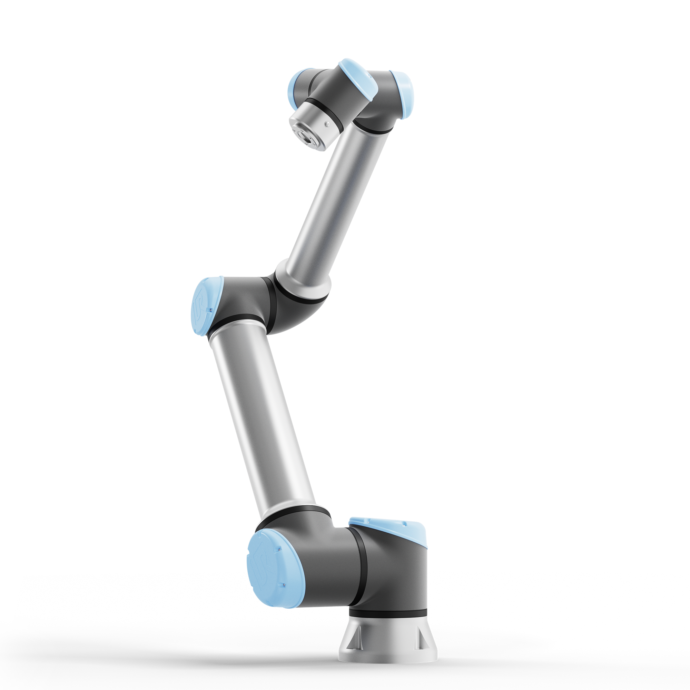

图5-1 UR12e机器人实物图

其关键性能参数如表5-1所示。

表5-1 UR12e关键性能参数

UR12e采用六轴全旋转构型，六个关节均独立配置永磁同步伺服电机与谐波减速器。电机本身输出转速偏高而扭矩有限，经谐波减速器降速增扭后，恰好匹配各关节在低速工况下对驱动力矩的实际需求，整套驱动系统在有限体积内实现了动力密度与传动效率的平衡。得益于此，UR12e在工作半径和负载自重比两方面表现不俗：臂展足以覆盖中等规模的作业区间，整机自重又相对可控，对产线安装空间及地面承重的苛刻程度有所降低。从应用端来看，焊接任务对轨迹重复精度要求严苛，码垛作业则强调节拍与负载能力，UR12e在这两类需求差异明显的场景中均有成熟的部署案例。UR系列的连杆坐标系建立方式及D-H参数定义见图5-2。

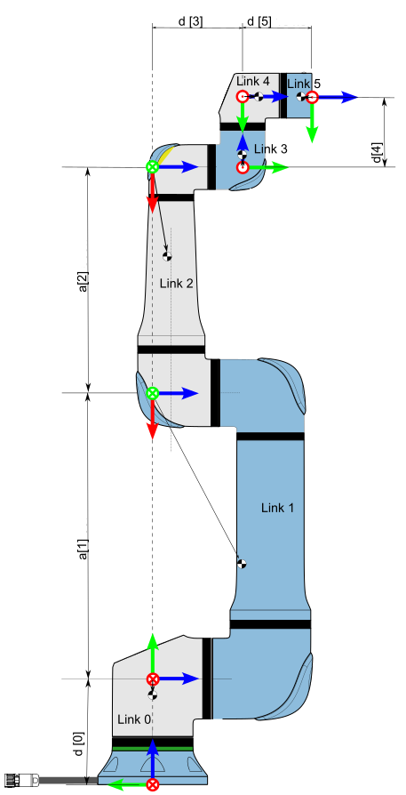

图5-2 UR系列机器人D-H建模图

### 5.1.2 动力学辨识实验数据采集
本研究基于UR12e实验平台展开动力学参数的辨识工作，所需数据包括各关节的位置、速度以及驱动力矩。这三类数据在辨识过程中同步获取，并作为算法输入的基础。

UR12e各关节的驱动力矩由伺服电机产生，经谐波减速器传递至连杆端。记第个关节电机输出力矩为，电机电流为，力矩常数为（单位Nm/A），则式(5-1)直接给出三者的定量关系——力矩与电流呈线性比例。

经减速比为的谐波减速器进行力矩放大处理后，第个关节输出力矩为：

按式(5-1)，电机电流与关节力矩存在明确的线性换算关系。然而该关系在真机上的直接套用存在障碍：UniversalRobots未公开各关节力矩常数与减速比；且力矩常数随温度、转速及磁饱和程度变化，并非常量。电流换力矩时还需处理摩擦与重力补偿——笔者试过以固定比例系数直接估算，误差过大，不可用。最终采用RTDE接口的actual_current_as_torque字段，该字段由控制器内部完成非线性补偿后直接输出可用力矩。

鉴于上述问题，该设计方案转而选用控制器内置的转换接口加以实现。UR控制器在PolyScope 5.23.0及以上版本当中，借助RTDE接口开放了actual_current_as_torque字段，该字段在控制器内部已综合考量电机力矩常数、减速比、摩擦补偿以及重力补偿等多方面因素，自动将伺服驱动器电流环的测量值映射为各关节驱动力矩（单位Nm）。该设计方案借助RTDE Python客户端订阅该字段，直接读取经控制器换算后的力矩数值，无需另行开展电流—力矩推算工作。相较于外部近似常数法，这一方式以制造商内置标定结果为依托，转换精度更有保障，与此同时也省去了自行标定电机参数所带来的额外工作量。

针对UR机器人的部分核心端口定义如下表5-2所示：

表5-2 UR机器人核心端口定义

## 5.2 仿真平台搭建
在仿真平台的构建过程中，本研究经历了多次选型与迭代，最终确定了适合本研究的动力学仿真辨识验证方案。

### 5.2.1 基于MATLAB的初步尝试
研究初期，为快速验证机器人运动学与基本控制算法，首先选用MATLAB作为仿真环境。借助其Robotics System Toolbox，可较方便地完成机器人建模、运动学求解与基础动力学分析。以下是MATLAB环境搭建以及初期测试结果。

安装MATLAB R2022b，不推荐R2019及更早，因为优化工具箱旧，动力学函数不全；不推荐R2025及更新，因为兼容性未知。

勾选工具箱：Optimization Toolbox用于最小二乘、非线性辨识优化；Control System Toolbox用于系统辨识、模型验证；Signal Processing Toolbox用于角度/速度滤波、微分降噪；Robotics System Toolbox用于MathWorks官方机器人动力学、DH/MDH建模、逆动力学计算；Simulink用于联合仿真辨识、实物在线辨识。

使用ver命令查看已安装工具箱，核对前文勾选的工具箱是否存在，结果显示安装成功。

测试代码，使用标准DH参数构建5自由度机器人，绘制其工作空间，工作空间显示结果如图5-3所示：

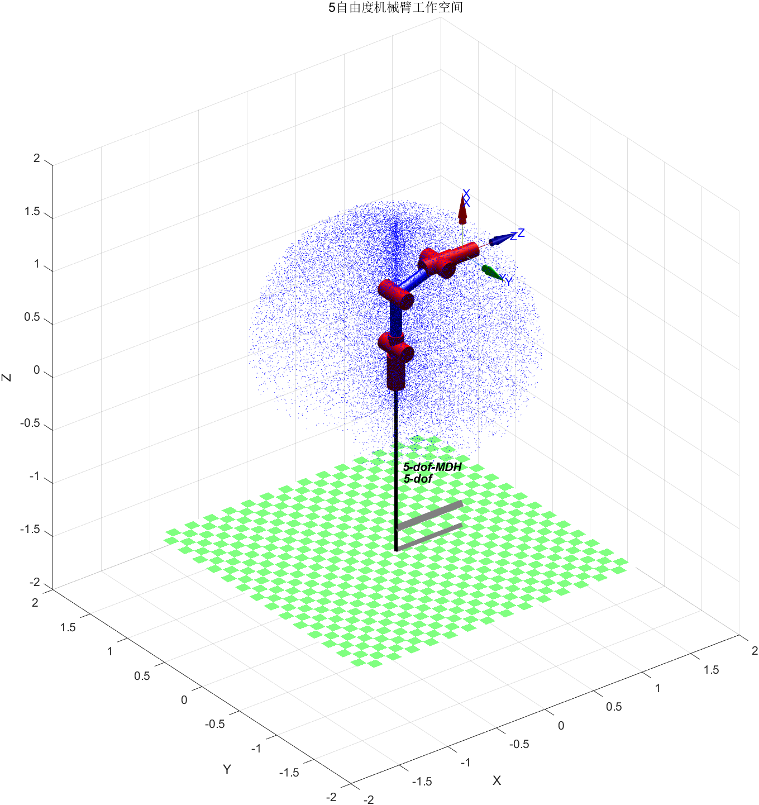

图5-3 Matlab测试绘制工作空间图

该设计方案前期借助MATLAB完成了工作空间可视化、正逆运动学验证以及初步轨迹仿真等工作——Robotics System Toolbox几行代码即可搭建，效率较高。但随着研究推进，MATLAB在若干方面的局限性逐渐暴露：接触与摩擦等非线性现象的仿真精度与真实机器人相比存在明显差距，与真实控制架构对接的开发成本偏高；更关键的是，其动力学接口封装较深，辨识所需的关节力矩回归矩阵难以直接提取，这对参数辨识构成实质障碍。因此，MATLAB的定位更为适合前期概念验证环节，而难以胜任后续高保真参数辨识主平台的需求——笔者已在第5.2.1节之后将平台整体切出。

### 5.2.2 基于ROS2与Gazebo的仿真平台搭建
考虑到机器人领域对ROS生态存在广泛依赖，该设计方案进一步在Windows Subsystem for Linux环境下，立足于ROS 2 Humble与Gazebo Classic，搭建起一套分布式仿真平台。具体的部署路径为：在WSL当中安装Ubuntu 22.04发行版，随后完成ROS 2与Gazebo的联调配置工作。Gazebo内置了多种动力学引擎，具备对摩擦、碰撞等物理交互过程进行模拟的能力。

ROS 2与Gazebo的安装与桥接步骤如下：

安装WSL子系统Ubuntu22.04发行版，如图5-4所示：

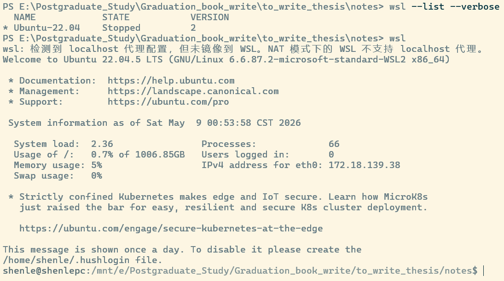

图5-4 WSL子系统安装过程输出

Fishros 一键脚本安装 ROS2 Humble，验证ROS2成功安装，如图5-5所示：

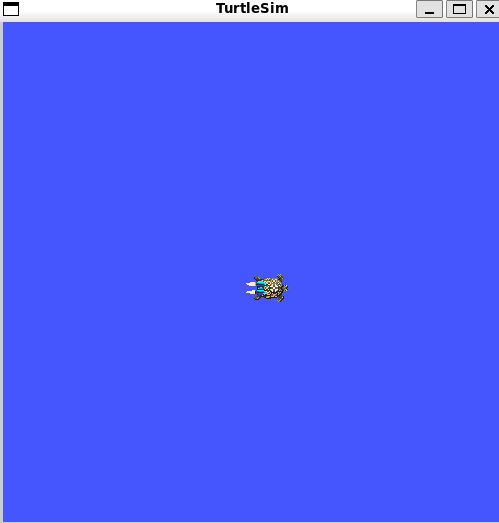

图5-5 ROS2安装过程输出

安装gazebo及其开发库，启动图形界面验证成功安装，其图形界面如图5-6所示：

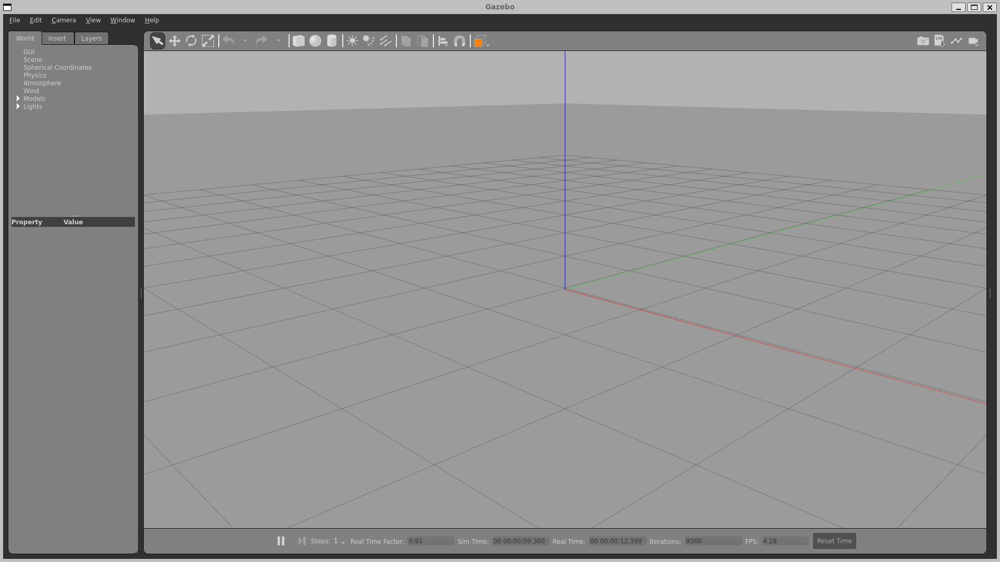

图5-6 gazebo图形界面

尝试使用统一机器人描述格式(Unified Robot Description Format, URDF)创建基础机器人，创造出的pdf结构图如图5-7所示：

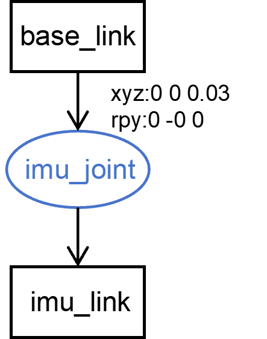

图5-7 机器人生成pdf结构图

使用rviz显示的结果如图5-8所示：

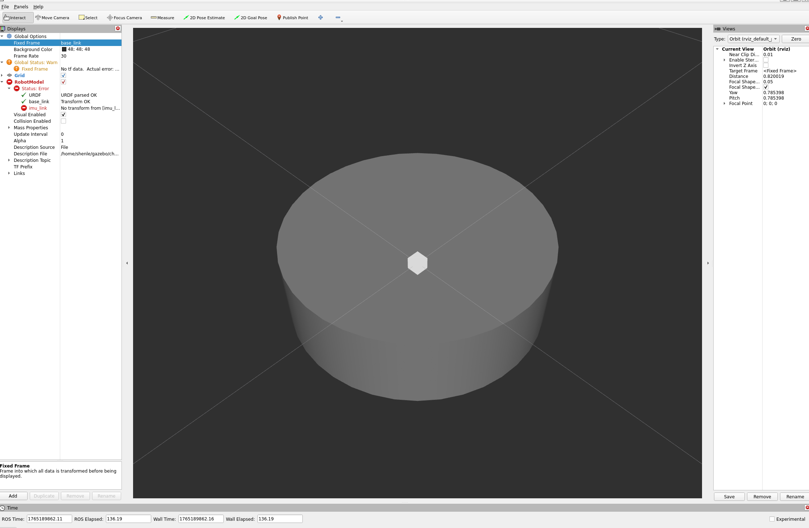

图5-8 机器人rviz显示结果图

该方案选用ROS 2话题机制承担仿真数据的通信传输工作，由Gazebo物理引擎负责开展刚体动力学的解算。在turtlesim等基础节点运行正常、通信链路验证无误之后，该设计方案进一步尝试加载UR10e机器人模型以开展仿真测试工作。然而在实际使用过程中，暴露出了若干问题：WSL环境下的图形渲染依赖软件光栅化，帧率与效率均受到较为明显的制约；Gazebo与ROS 2之间的时钟同步以及关节状态反馈存在可察觉的延迟现象，对力矩数据的高精度同步采集造成了一定干扰；此外，Gazebo对URDF模型的解析流程以及自定义动力学参数的注入方式较为繁琐，在调整辨识算法所需的回归矩阵结构时灵活性明显不足。综合上述原因，该设计方案决定另行选择更为合适的仿真平台。

### 5.2.3 基于MuJoCo物理引擎的仿真环境
原平台在动力学仿真时存在效率瓶颈，本方案遂将仿真环境切至Windows原生的MuJoCo。这套引擎出自DeepMind之手，接触求解做得扎实，渲染管线又相对轻量——对需要反复跑动力学正逆解、不断调整轨迹参数的系统辨识任务而言，算力开销可控，迭代起来不吃力。

MuJoCo的环境安装与依赖配置步骤如下：

官网/GitHub安装MuJoCo本体。

安装VS Build Tools，给Mujoco提供底层C/C++编译，链接、运行支持。安装时勾选"使用C++的桌面开发""MSVC v143生成工具"等开发组件。

Conda虚拟环境配置，创建python环境隔离，如图5-9所示：

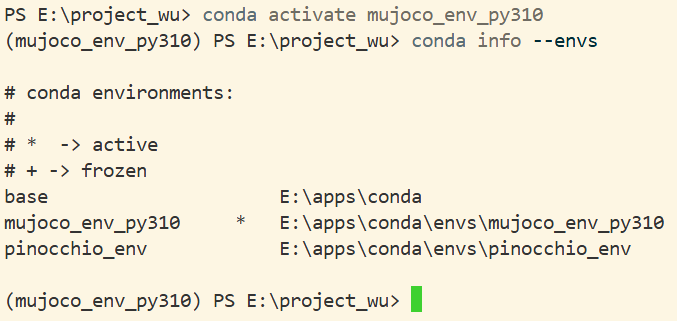

图5-9 Conda环境配置过程输出

后续所有依赖均在此环境安装，实现与系统环境完全隔离。

安装MuJoCo Python接口，在激活的Conda环境中，直接安装官方Python绑定，期间创建MuJoCo环境依赖出现问题，如图5-10所示：

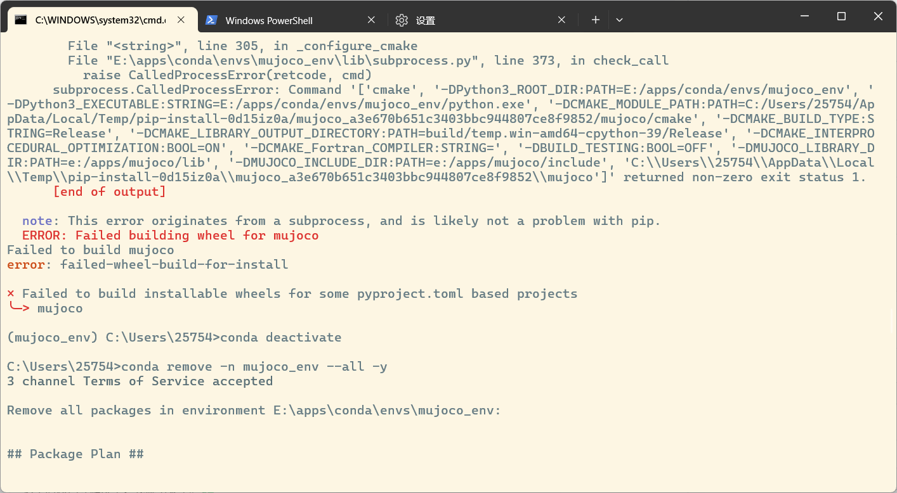

图5-10 MuJoCo环境依赖报错

经排查，将python版本从3.14降到3.10得以解决问题，其原因是新版本对MuJoCo的依赖支持不够充足，如图5-11所示：

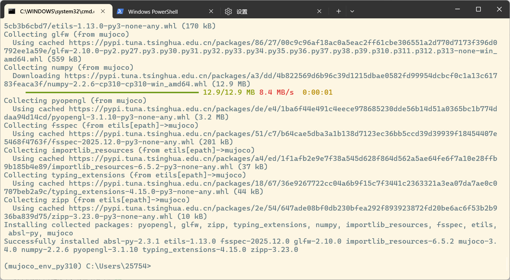

图5-11 解决MuJoCo环境依赖报错

安装完成后使用python脚本进行测试，结果如图5-12显示成功安装：

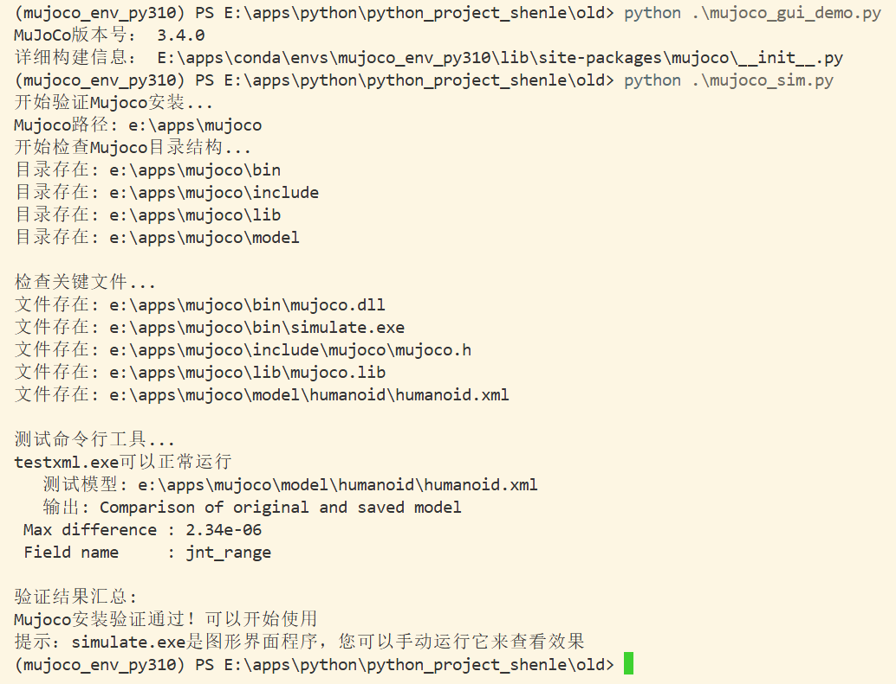

图5-12 MuJoCo安装验证过程输出

代码测试，成功使用MuJoCo的UI界面显示了"rm_65_b_description"这一机器人urdf模型，如图5-13和图5-14所示。

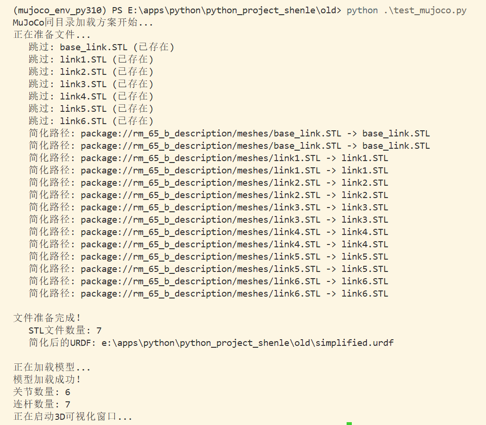

图5-13 MuJoCo-UI测试过程输出

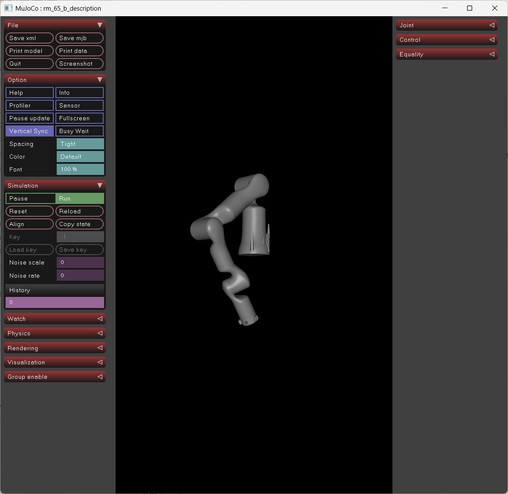

图5-14 MuJoCo-UI导入机器人显示

该设计方案立足于MuJoCo，完成了机器人模型加载、运动学约束配置以及基础动力学前向仿真等工作，并借助其Python API实现了关节位置、速度以及力矩数据的实时读取。然而，在实际使用过程中出现了两方面问题，使其难以继续作为主仿真平台加以使用。

mj_rne的求解效率本身不是问题，动力学正解跑得并不慢。真正卡住脖子的是力矩对惯性参数的回归矩阵——这数据被压在MuJoCo的封装层底下，辨识代码读不出来。加权最小二乘也好，IHLS也罢，都指着这张矩阵做参数估计，拿不到它，后续的辨识工作便根本推不下去，整条链路在这里断掉。

其二在于格式兼容性，MuJoCo的可视化系统对MJCF（MuJoCo XML Format）格式支持最好。但业内一般默认URDF建模，两套体系。官方给了转换工具，本设计前期也尝试使用Python脚本做二次处理，结果不尽如人意。具体在于关节类型映射错位——revolute和continuous难以区分；传感器、执行器属性丢失；碰撞几何体解析出来的跟与原模型有误。没有一个成熟完善的解决方案。手动调参数的工作量太大，实验准备阶段的负担陡增。

综合上述两点——动力学计算灵活性受限以及模型格式兼容性不足——MuJoCo单独作为仿真平台，仍难以满足该设计方案对动力学参数辨识算法验证的实际需求。

### 5.2.4 Pinocchio动力学计算与MuJoCo可视化协同仿真
考虑到单一平台往往难以同时兼顾求解效率与渲染开销，本方案没有追求在单一框架内塞入全部功能，而是将数值运算与图形显示拆开处理：Pinocchio负责动力学相关的所有数值解算，MuJoCo则只管三维可视化输出，两边独立进程，互不拖累。Pinocchio本身针对刚体多体问题做了深度优化，Python接口暴露得较为充分，正逆动力学求解、运动学计算、回归器构建等底层功能均可直接调用。其中computeJointTorqueRegressor接口直接输出的线性参数化观测矩阵与逆动力学力矩，恰好可作为加权最小二乘与IHLS辨识算法的原始输入，无需额外转换。

Pinocchio的安装如下：

先进入6.1.3节创建的conda虚拟隔离环境。

通过conda安装Pinocchio。

验证安装环境，结果如图5-15所示，显示版本号表示成功安装。

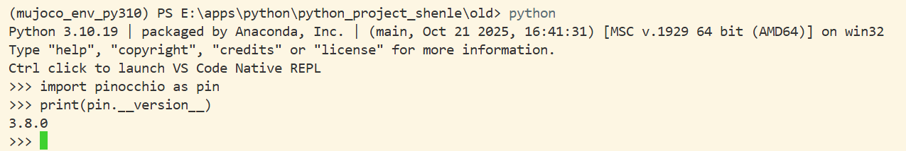

图5-15 Pinocchio安装测试过程输出显示

可视化仍由MuJoCo承担，主要处理渲染和物理状态呈现。为此单独写了一个数据同步模块，把Pinocchio算出来的力矩预测值和参数辨识的中间结果，实时映射到MuJoCo画面里机器人的运动状态上。两边各自跑各自的进程，靠时间戳对齐来保证计算端和显示端的数据是同步的，不会因为帧率或者计算延迟出现对不上号的情况。

计算和可视化是分离实现的：Pinocchio完成动力学计算，每个时刻回传关节力矩回归系数矩阵和关节力矩；MuJoCo实现作画面渲染。Pinocchio和MuJoCo又是用同一个共享模块同步之后才由计算机同时调度各时刻的数据。这个结构可以避免陷入两种困境：要么将计算放在MuJoCo里面去，回归矩阵比较深层地封装于MuJoCo内部，无法直接回传。要么使用Pinocchio，没有可视化图形界面，调试很困难。在下面的激励轨迹优化、在线参数辨识、结果推论等工作中，这个结构都完全正常地发挥作用，它是本设计实验工作的重要基础平台。

## 5.3 实验总体设计
### 5.3.1 数据来源激励轨迹设计
根据上一章建立的机器人动力学线性方程，为了获得线性方程的观测矩阵，需要设计合理的激励轨迹使得所获得的参数值更为精确。合适的激励轨迹不仅应当保证机器人平稳运行，还应该保证可以尽可能激发机器人的动力学特性并且遍布机器人的工作空间。激励轨迹的设计主要包含激励轨迹类型的选择和激励轨迹参数的优化两方面的工作。目前学者大多选用多项式或傅里叶级数生成轨迹，其中多项式轨迹的计算较为简便，易于实现，且容易满足轨迹边界位置的约束条件，但该方法在信号处理过程中辨识效率较低。傅里叶级数轨迹通过叠加基频整数倍的信号组成激励轨迹，傅里叶轨迹具有较好的周期性和连续性，在单次辨识实验中可以连续运行激励轨迹，由此可以保证多次激励轨迹的运行工况相同，提高了信号的信噪比，减少了噪声对辨识结果的影响；傅里叶级数多阶可导，求导运算简单，极大地提高了机器人关节角速度和角加速度的求解速度；通过使用有限项可以设计频率范围，可以有效地减少高频噪声和关节柔性效应对辨识结果的影响。本文选用五次傅里叶级数生成激励轨迹表达式。针对位置、速度、加速度的轨迹公式如下：

$$
q_j(t)=q_{0,j}+\sum_{k=1}^{K} \left[\frac{a_{j,k}}{k\omega}\sin(k\omega t)-\frac{b_{j,k}}{k\omega}\cos(k\omega t)\right]
$$

$$
\dot q_j(t)=\sum_{k=1}^{K}\left[a_{j,k}\cos(k\omega t)+b_{j,k}\sin(k\omega t)\right]
$$

$$
\ddot q_j(t)=\sum_{k=1}^{K}\left[-k\omega a_{j,k}\sin(k\omega t)+k\omega b_{j,k}\cos(k\omega t)\right]
$$

其中 K=5 为傅里叶级数阶数，\omega = 0.1\pi rad/s 为基频，j=1,\dots,6 对应各关节。待确定的参数包括傅里叶系数 a_{j,k}、b_{j,k} 及关节初始偏置 q_{0,j}，共计 66 个参数。

为获得一组满足激励性要求的轨迹参数，本设计采用蒙特卡洛随机搜索策略：在关节位置、速度、加速度的约束范围内随机生成大量候选参数组，以回归矩阵的条件数作为激励性评价指标，选取条件数最小、激励性最优的一组参数作为最终激励轨迹[28]。经搜索得到的一组满足激励性要求的五级傅里叶级数参数。

在仿真环境与真实机器人环境分别采集关节位置、速度、加速度与力矩数据，构建统一格式的基础数据集。理想仿真环境下的激励轨迹曲线如图5-16所示：

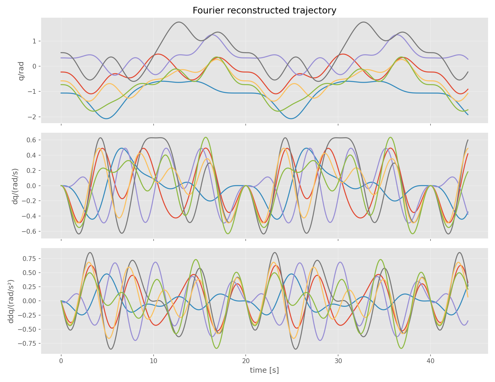

图5-16 理想仿真环境激励轨迹曲线

这条激励轨迹在机器人操作空间中的三维显示图如5-17所示：

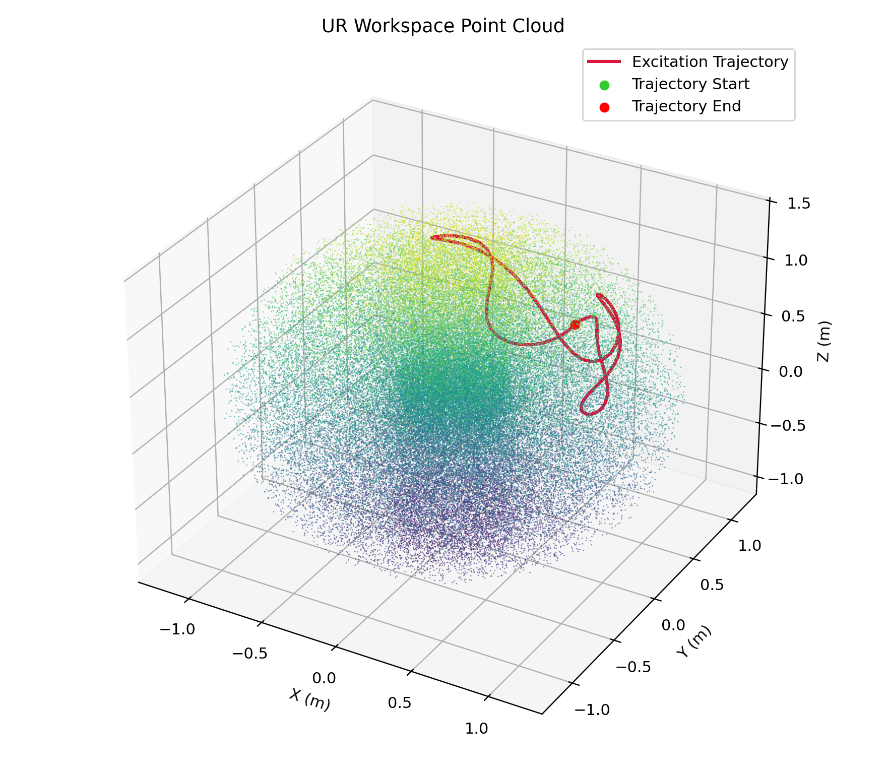

图5-17 在操作空间下的激励轨迹曲线

图5-18给出了真实UR12e机器人按理论激励轨迹运行期间采集到的各关节位置与速度曲线。这里有一点需要说明：真实机器人的数据来源仅限于关节编码器，可直接获取q与dq，并不具备加速度传感器，因此无法通过硬件直接量测。本设计的处理思路是先对dq施以数值微分得到粗糙的加速度序列，再依次经过Savitzky-Golay滤波与低通滤波进行平滑，借此压制数值微分固有的噪声放大效应所引入的高频毛刺，最终得到质量可接受、可直接用于辨识的ddq序列。

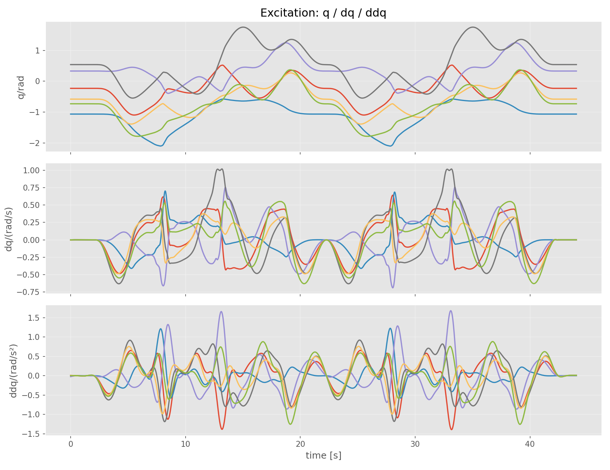

图5-18 真实环境滤波处理下的激励轨迹曲线

### 5.3.2 实验技术路线
本设计所设计的辨识与验证方法遵循"由简入繁、虚实结合、动态演进"的原则，整体技术路线如图5-19所示，其中第一阶段先在无摩擦仿真环境中验证建模与回归矩阵的正确性，再切换至含摩擦的实机数据完成批量标定，输出的参数向量作为后续在线递推的初始值，参数质量直接影响收敛速度；第二阶段将静态估计推进为流式更新，IHLS以离线结果为起点，利用遗忘因子对历史数据施以指数衰减，使参数估计能够跟踪关节磨损、温升、负载变化等引发的缓变漂移；第三阶段针对IHLS线性模型难以覆盖的结构性残差进行补偿——低速Stribeck效应、减速器弹性变形等非线性成分由BPNN专项吸收，形成"物理主干+数据补丁"的分层架构，即使BPNN泛化失效，IHLS仍可作为可解释的保底输出；第四阶段是工程落地，辨识参数经接口回注至Isaac Sim孪生体，校正后的虚拟模型再为下一轮实验提供更可靠的物理基准，形成持续迭代的闭环驱动。


图5-19 整体实验方法路线图

该路线图涵盖了从离线结构化参数标定到在线非结构化扰动补偿的完整过程，最终通过参数回注实现虚实系统的闭环驱动。

## 5.4 离线最小二乘辨识
### 5.4.1 无摩擦LS辨识（仿真环境）
为验证最小二乘方法在理想条件下的有效性，首先在无摩擦仿真环境中开展参数辨识实验。具体做法是利用动力学模型正向生成各关节力矩数据，构建回归矩阵后求解最小参数集。

整个流程通过PowerShell集成脚本实现一键运行，各步骤说明如下：

生成激励轨迹：脚本从 ../real_robot_data/ 读取预存的傅里叶系数 a.npy、b.npy、q0.npy，以\omega=0.1\pi rad/s为基频生成两个完整周期的激励轨迹，结果写入 ../data/ur10e_trajectory.npz。

采集仿真数据：加载上一步骤所输出的轨迹文件，调用Pinocchio逆动力学接口对各时刻的关节力矩tau展开计算，将q,dq,ddq,tau,t打包输出至npz文件。

数据格式转换：将npz格式数据转存为CSV文件，以便于后续辨识脚本加以读取。

参数辨识：使用Pinocchio调用回归矩阵计算函数，得到观测矩阵和力矩向量，选用最小二乘对动力学参数展开求解，并计算秩与条件数以对激励轨迹质量进行评估。输出theta.npy参数向量，与此同时在控制台打印RMSE、R^2等质量指标，打印结果如表5-3所示：

表5-3 仿真数据集下无摩擦的LS模型辨识结果

| 样本数 | 参数维度 | 可辨识秩 | 条件数 | RMSE/Nm | R^2 |
|--------|----------|----------|--------|----------|-----|
| 10001 | 60 | 36 | 351.6000 | 0.004935 | 1.0000 |

当条件数小于 10^3 时，可认为该激励轨迹具备较好的辨识激励性。

模型验证：将辨识参数代入模型，用Pinocchio重新计算力矩，与实测值对比，计算拟合度；输出力矩对比图，如图5-20所示。控制台打印逐关节验证指标如表5-4所示：

表5-4 各关节RMSE和R^2指标结果

| 关节 | RMSE | R^2 |
|------|------|-----|
| J1 | 0.004628 | 0.999996 |
| J2 | 0.010502 | 1.000000 |
| J3 | 0.003780 | 1.000000 |
| J4 | 0.000345 | 1.000000 |
| J5 | 0.000072 | 1.000000 |
| J6 | 0.000044 | 0.972068 |

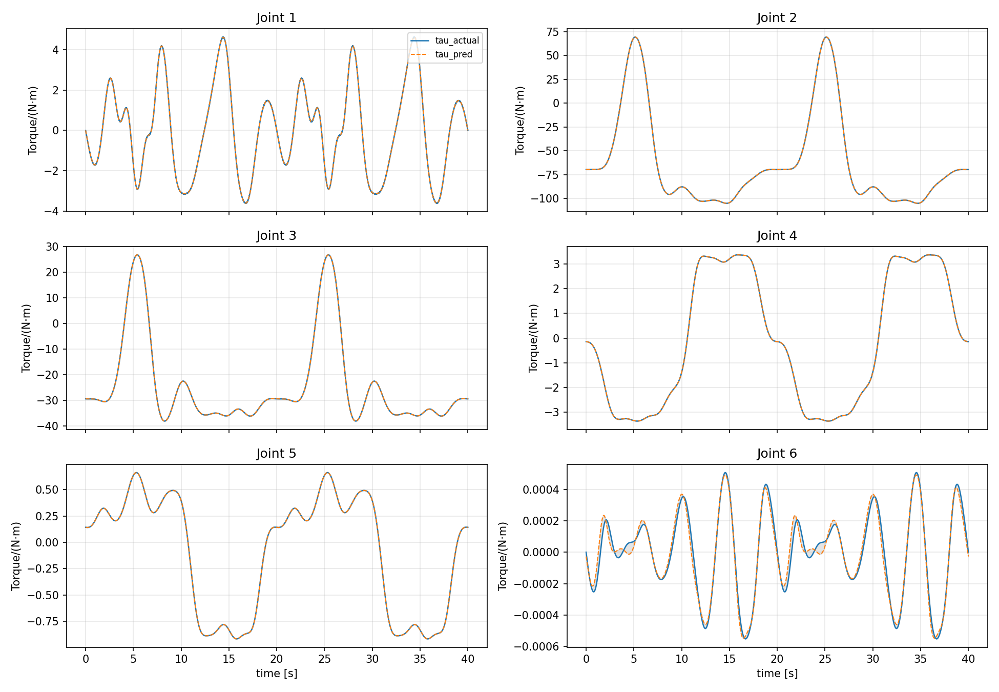

图5-20 仿真无摩擦的LS辨识结果力矩对比图

实验结果表明，在无噪声且模型完全匹配的前提条件下，LS方法能够取得较为理想的力矩拟合精度，各关节预测力矩与真实值之间吻合良好，整体RMSE处于较低水平，决定系数亦趋近于1。

然而仔细观察数据，各关节力矩幅值相差较大——J6的力矩只有J1的几十分之一。末端关节力矩小，在总误差里权重低。表示即使末端某些参数已经偏离真值了，对整体残差的拉动也有限。参数方向上存在冗余自由度，权重低的关节即使产生大比例偏差，LS模型也难以察觉。整体力矩拟合度高，参数估计却有问题。这是一种典型的"轻权重关节拟合不充分"——J4～J6的参数实际上没被充分辨识出来。但这个仿真结果给出了一个性能上界：无噪声、模型完全匹配的情况下，后面真实数据实验性能的上限不会超过此处得到的性能数据。

### 5.4.2 真实数据集上的离线LS辨识：无摩擦与有摩擦模型对比
为验证离线最小二乘辨识方法在真实系统中的有效性，并考察摩擦建模对辨识精度的影响，本节基于同一组真实机器人采集数据（13199个采样点），分别采用无摩擦模型与引入摩擦模型进行辨识，在同一图中对比两者的力矩拟合效果。

**无摩擦模型辨识**

将仅含惯性参数（60维）的无摩擦动力学模型直接套用于真实数据，辨识流程与前文仿真实验保持一致：构建惯性参数回归矩阵，经SVD提取最小参数集后，以最小二乘求解。

整体来看，R^2=0.8803有所下降，RMSE达到0.9274 Nm，较仿真环境明显偏高。从分关节曲线来看，靠近基座的关节（J1～J3）拟合情况尚可，而末端关节（J4～J6）的预测偏差则要突出得多。

**引入摩擦模型辨识**

为解决模型失配问题，需在回归矩阵中引入库仑摩擦与黏性摩擦两项因素。对于各个关节，新增了f_c与f_v两个摩擦参数，使得总参数维度由原先的60扩展至72；尽管如此，辨识过程依旧遵循无摩擦条件下所设定的步骤不变，仅对回归矩阵的列数及最小参数集规模进行相应调整。

加入摩擦项后，大大提升了辨识性：RMSE从0.9274 Nm降低到0.3368 Nm，同时R^2值也由0.8803上升到了0.9842，提升力度大。通过对比分析可以得到结论，摩擦效应是导致真实世界系统与数学建模预测间存在差别的主要影响之一。

表5-5 真实数据集下有无摩擦的两种LS模型辨识结果对比

| 模型 | 参数维度 | 可辨识秩 | 条件数 | RMSE/Nm | R^2 |
|------|----------|----------|--------|----------|-----|
| 无摩擦LS | 60 | 36 | 277.3632 | 0.9274 | 0.8803 |
| 有摩擦LS | 72 | 48 | 299.9941 | 0.3368 | 0.9842 |

两种模型的力矩拟合对比如图5-21所示。

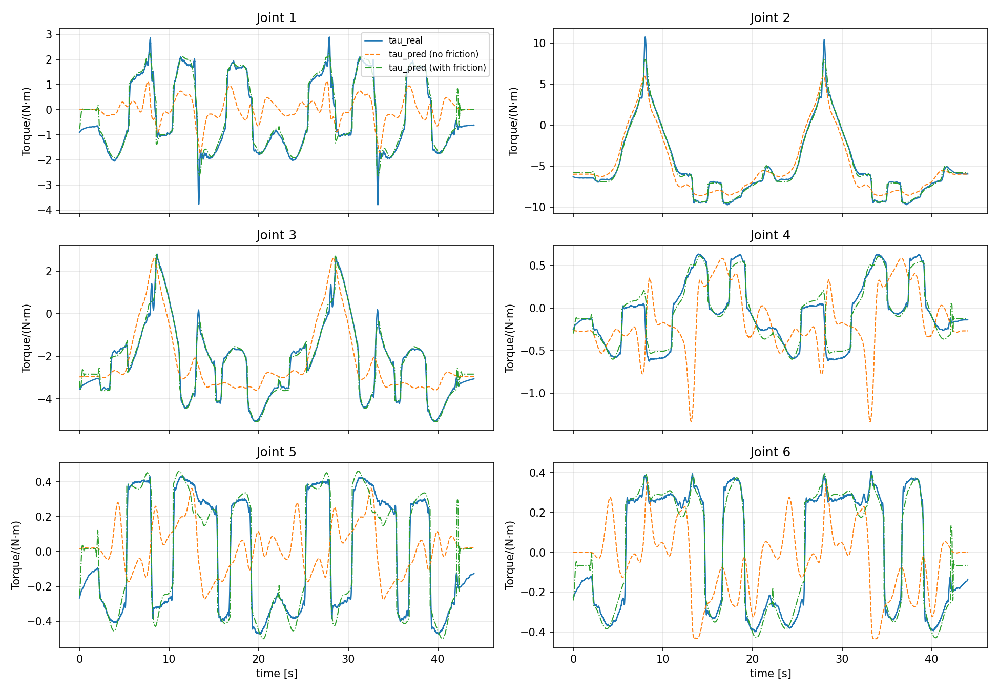

图5-21 真实数据集下LS辨识结果力矩对比图

忽略摩擦的模型在实际使用中暴露出不少问题，比较突出的是低速换向时的估计失真。关节快要停下来或者刚要反方向运动的那一瞬间，库仑摩擦力会剧增，这时候力矩的方向说变就变，波动幅度也相当大。这种非线性很强的物理过程，光靠一个不含摩擦的简化模型根本无法反应实际情况，所以在运动换向的那片区域里，系统性的偏差一直压不下去。

其二，末端关节误差偏大的问题。靠近基座的关节所承受的惯性力矩远超摩擦力矩，后者被前者所"淹没"，即便忽略摩擦也能取得尚可的拟合效果；而末端关节负载较轻、惯性力矩占比偏低，摩擦非线性的影响在力矩曲线当中相对突出，无摩擦模型的预测误差因此被进一步放大。

引入摩擦项后，前述两类问题均得到实质性改善，预测力矩与实测数据贴合度明显提高。摩擦建模在真实系统辨识中不是可选项，而是必要条件。同时也为后续IHLS递推工作标定了一条可靠的基准线。

### 5.4.3 辨识参数对其他数据集的重复验证
为考察离线辨识参数在新数据上的泛化表现，本设计另行采集了一组独立的真实RTDE数据集用于验证。将已辨识的惯性参数与摩擦参数直接作用于新数据集，借助Pinocchio动力学库完成预测力矩的计算，随后以RMSE与R^2两项指标定量评估预测精度，并绘制力矩时序对比曲线加以直观呈现。

1. 准备新数据集：对新采集的RTDE日志运行build_identification_dataset.py，生成格式一致的identification_dataset.csv。

2. 加载已辨识参数进行验证：使用identified_params.py加载工程根目录下identified_parameters/theta_base.npy的参数，对新数据集进行验证。从指定的数据集CSV读取运动状态信息(q,qd,qdd)和实测力矩tau_real；使用Pinocchio针对新数据计算回归矩阵惯性参数部分Phi_dyn和摩擦参数部分Phi_fric；使用已辨识的参数theta_base计算预测力矩；对比实测与预测力矩，计算全局及每关节的RMSE、R^2等指标；输出验证报告、详细指标CSV和力矩对比图。

得到的新数据集的验证报告和力矩对比图如表5-6和图5-22所示：

表5-6 已有模型对其他数据集的辨识结果

| 样本数 | RMSE/Nm | R^2 |
|--------|----------|-----|
| 4563 | 0.362092 | 0.974513 |

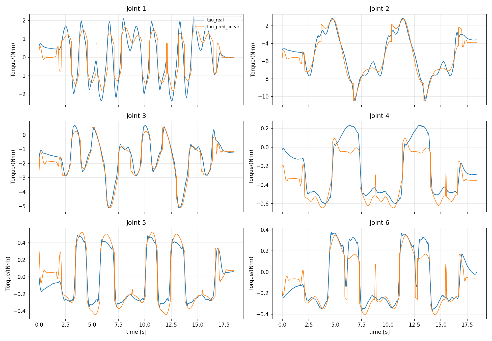

图5-22 辨识结果对其他数据集的验证力矩对比图

结果表明，经过离线批量最小二乘辨识得到的参数不仅能精确拟合训练数据，还能在独立真实数据集上保持良好的泛化性能，力矩预测误差均在可接受范围以内。

## 5.5 在线递推最小二乘辨识
### 5.5.1 仿真环境下IHLS验证
为考察IHLS在理想条件下的收敛性与参数跟踪能力，本节先在仿真环境中开展验证实验——以已知真实参数为基准，向仿真数据中人为叠加测量噪声后，再执行在线递推辨识流程。

准备仿真数据集：数据集按五级傅里叶激励轨迹采样，包含完整的(t,q,dq,ddq,tau)序列，不含任何测量噪声干扰。

运行仿真环境下的IHLS参数辨识：首先将参数初值设定为0，同时把协方差矩阵初始化为10^6*I，随后针对每一个时刻k，依据Pinocchio所输出的回归向量，借助前述递推更新关系，对theta_k以及P_k进行迭代更新处理。在达到预先设定的checkpoint节点后，将当前时刻对应的参数结果进行固化保存，并且利用该阶段得到的参数快照，对截至当前时刻的全部数据重新开展力矩预测计算，从而得到RMSE与R^2两项评价指标。最终输出整体辨识结果以及各个关节对应的验证指标，具体结果如表5-7与表5-8所示：

表5-7 仿真数据集下无摩擦的IHLS模型辨识结果

| 样本数 | 参数维度 | 可辨识秩 | 条件数 | RMSE/Nm | R^2 |
|--------|----------|----------|--------|----------|-----|
| 10001 | 60 | 36 | 351.6173 | 0.004935 | 1.000000 |

表5-8 IHLS方法各关节RMSE和R^2指标结果

| 关节 | RMSE | R^2 |
|------|------|-----|
| J1 | 0.004628 | 0.999996 |
| J2 | 0.010502 | 1.000000 |
| J3 | 0.003780 | 1.000000 |
| J4 | 0.000345 | 1.000000 |
| J5 | 0.000072 | 1.000000 |
| J6 | 0.000044 | 0.971247 |

以及力矩拟合图如图5-23所示：

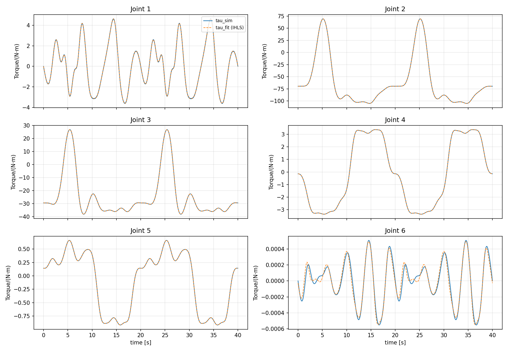

图5-23 仿真无摩擦的IHLS辨识结果力矩对比图

实验结果表明，在无噪声仿真条件下IHLS可稳定收敛，在线递推得到的参数能够高精度拟合仿真力矩。

### 5.5.2 真实机器人数据集上IHLS辨识
1. 数据预处理

真实RTDE数据通过python脚本进行预处理，得到identification_dataset.csv，包含平滑后的(t,q,dq,ddq,tau)。

2. IHLS辨识脚本运行

读入CSV，提取(t,q,dq,ddq,tau)，初始化参数theta_0=0，协方差P_0=10^6*I，计算checkpoint分割点。

对第k个样本从Pinocchio计算Phi_dyn(k)，构造摩擦回归矩阵块Phi_fric(k)，对n_joint=6个关节分别执行递推更新，每个关节一个观测 y_k^{(j)} = tau_j(k)，周期性输出进度信息。

在每个checkpoint，冻结当前参数theta，使用Pinocchio和摩擦模型重新预测tau_hat = tau_hat_dyn + tau_hat_fric，计算全局与按关节的RMSE、R^2，保存参数、报告、图表。

输出总体和逐关节验证指标如表5-9和表5-10所示：

表5-9 真实数据集下的IHLS模型辨识结果

| 样本数 | 参数维度 | 可辨识秩 | 条件数 | RMSE/Nm | R^2 |
|--------|----------|----------|--------|----------|-----|
| 13199 | 72 | 48 | 299.9941 | 0.336793 | 0.984216 |

表5-10 IHLS方法各关节指标结果

| 关节 | RMSE | R^2 | 粘性摩擦系数 | 库仑摩擦系数 |
|------|------|-----|-------------|-------------|
| J1 | 0.543599 | 0.872026 | 2.339011 | 0.826089 |
| J2 | 0.539252 | 0.982953 | 0.830283 | 1.021232 |
| J3 | 0.277597 | 0.976398 | 2.061779 | 0.758863 |
| J4 | 0.080516 | 0.953399 | 0.333710 | 0.181147 |
| J5 | 0.086612 | 0.931764 | 0.244392 | 0.279628 |
| J6 | 0.056929 | 0.962248 | 0.294836 | 0.196042 |

以及力矩拟合图如5-24所示：

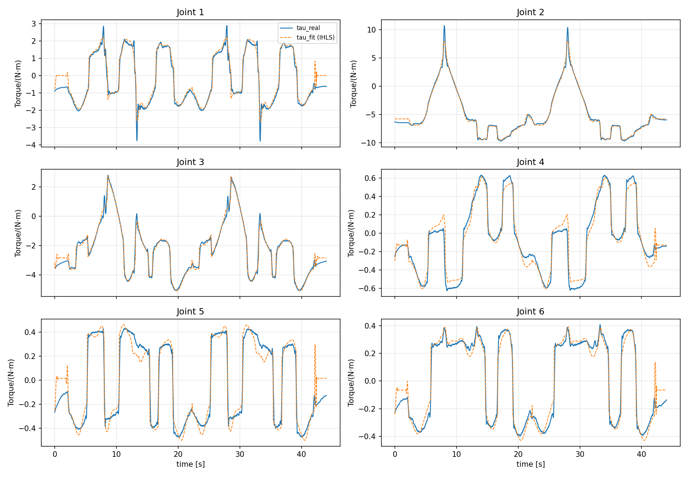

图5-24 真实数据集下IHLS辨识结果力矩对比图

在存在噪声干扰，无法完全滤除的实际采集过程中，IHLS的递推过程展现了稳定的收敛特性，力矩预测RMSE为0.3368 Nm，R^2达到了0.9842。这组结果表示在线递推辨识框架在真实机械系统应用上是可行的[29]。

跑完辨识，各关节的表现差距很大。J1～J3这三个大关节，RMSE落在0.28～0.54 Nm之间——数值不低。但R^2都在0.97以上。说明力矩的整体变化趋势被抓住了，剩下的误差主要是惯性参数估计里那点细小偏差点出来的。J4～J6就不一样了。RMSE只有0.06～0.09 Nm，小得多。但R^2反而掉到了0.93～0.96。因为末端关节力矩幅值本身就低。摩擦项占的比例一高，辨识难度跟着往上走——这是一方面。另一方面，减速比差异摆在那儿：J1～J3配的谐波减速器尺寸大、减速比高，对应的黏性摩擦系数自然也大。末端关节没这个条件。最后看摩擦参数——物理意义上是说得通的。基座端关节负载重、摩擦大，参数值偏高；末端负载轻，摩擦小，参数值偏低。这跟UR12e各关节的实际结构差异基本对得上。

在仿真与真机的结果放在一起对比，差异十分明显：仿真的RMSE只有0.0049 Nm，而真机实验指标则有0.3368 Nm，两者之间的差距接近七十倍。这种偏差主要是由于现实环境中存在的非理想因素，包括关节柔性、温度漂移、传感器噪声及数值微分误差等，这些在理想的仿真环境中难以完全演示。然而，尽管真机测试的RMSE值为0.3368 Nm且决定系数为0.9842，仍可以认为该结果具备了不错的工程实用性，表明了IHLS在实际工况下展现的鲁棒性。

## 5.6 IHLS-BPNN残差补偿辨识验证
### 5.6.1 实验目标与工程接口
考虑到第4章已经系统说明了融合辨识的理论基础，本节不再展开原理推导，而是聚焦IHLS-BPNN在工程代码中的落地流程。

实验目标主要是以5.5节输出的IHLS参数文件为输入，自动构建残差学习数据集；随后以"单关节一个网络"的方式完成BPNN训练，并保存可复用模型；最后在统一验证脚本中输出融合前后指标、图像和文本报告，形成可复现实验闭环。

### 5.6.2 实验流程及验证结果
1. 残差数据集构建

本步骤其核心作用是把"IHLS已解释部分"和"待学习残差部分"在数据层明确分离。脚本内部执行流程是首先读取真实数据与URDF模型：加载(t,q,dq,ddq,tau_real)；随即调用Pinocchio构建动力学回归矩阵，并同步构建粘性+库仑摩擦回归块；随后读取IHLS参数向量theta，计算模型预测力矩tau_model；然后计算残差tau_residual=tau_real-tau_model；生成每关节训练样本：输入X_j=[q_j,dq_j,ddq_j]，标签Y_j=tau_residual_j；最后打包保存为npz文件。

该文件同时包含tau_meas、tau_model、tau_residual、X_per_joint、Y_per_joint等字段，后续训练与验证均直接复用，避免重复预处理。

2. 每关节残差网络训练

本步骤由采用"关节解耦"的训练策略，即6个关节分别训练6个MLP。训练脚本的关键实现流程是：首先按时间顺序划分训练集/验证集，避免随机切分导致时间信息泄漏；随即对输入特征做标准化，并保存mean/std供验证阶段一致使用；随后让网络结构为线性整流函数(Rectified Linear Unit，ReLU)激活的多层感知机输出标量残差，确保以验证损失最小的参数作为最佳模型，而不是仅以最后一轮结果作为输出；最后每个关节输出模型参数的pt格式文件和标准化器的npz格式文件。

从工程角度看，这种拆分方式的优点是调参和排错都更直接，若某一关节残差拟合偏差较大，可独立重训该关节模型，而无需整体回滚。

3. 融合验证与结果生成

本步骤将IHLS基线与IHLS+BPNN融合结果在同一套数据上进行并行对比。脚本处理链路是首先读取残差数据集，取出tau_meas（实测）、tau_model（IHLS）；随即按关节加载模型与标准化器，得到BPNN残差预测tau_hat_bpn；计算融合预测tau_hat_fusion=tau_model+tau_hat_bpn，统一计算全局RMSE、全局R^2以及逐关节RMSE/R^2；最后生成输出文本报告、力矩曲线图、关节柱状图，其中力矩曲线图和关节柱状图如图5-25、5-26所示。

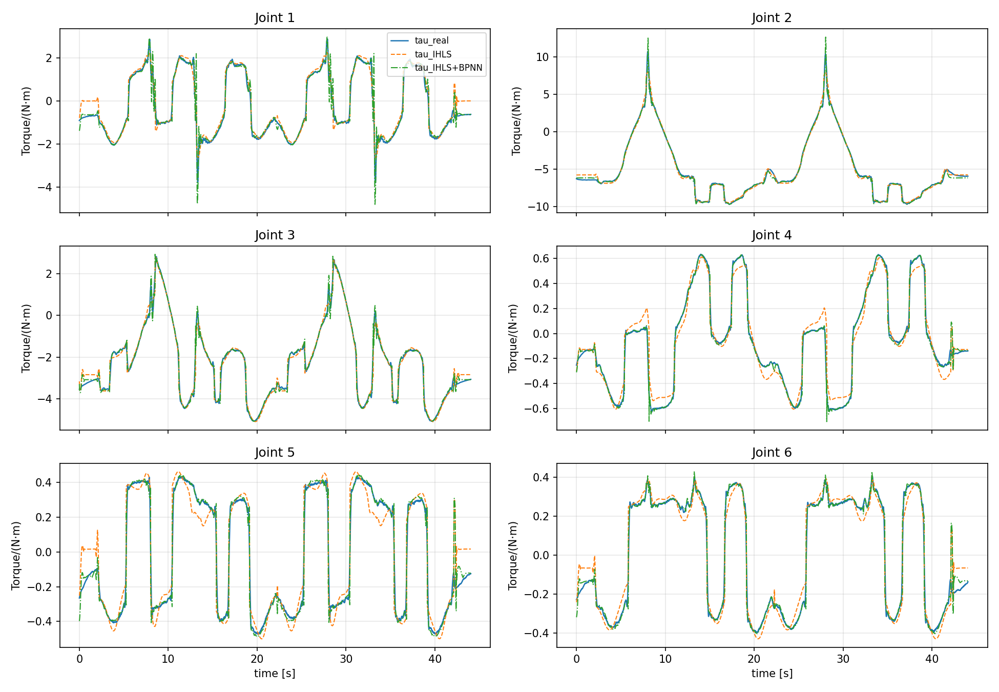

图5-25 有无BPNN残差补偿的IHLS辨识结果力矩对比图

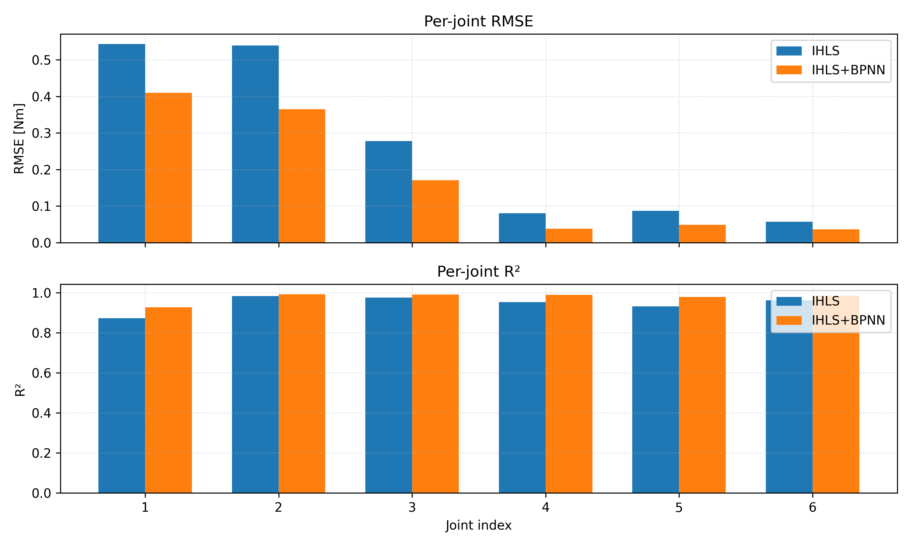

图5-26 有无BPNN残差补偿的IHLS辨识结果指标变化图

基于输出报告，IHLS与IHLS+BPNN的全局结果如表5-11所示：

表5-11 IHLS与IHLS-BPNN模型辨识结果对比

| 方法 | RMSE(Nm) | R^2 |
|------|-----------|-----|
| IHLS | 0.336793 | 0.984216 |
| IHLS+BPNN | 0.236481 | 0.992218 |

在IHLS主线之外，增加了一条BPNN残差补偿支路。效果上，全局RMSE从0.3368 Nm降到了0.2365 Nm；而R^2则从0.9842提高到了0.9922。值得注意的是，整个IHLS的递推框架本身没动，只是在后面加了一段残差提取、各个关节独立MLP训练、再拼回来验证的代码，改动很小，提升却很大。力矩预测误差和整体拟合度都有改善，具体每个关节的RMSE以及R^2的变化百分比幅度见表5-12。

表5-12 各关节RMSE降低百分比与R^2增益百分比

| 关节 | RMSE降低% | R^2增益% |
|------|-----------|----------|
| J1 | 24.61 | 6.34 |
| J2 | 32.28 | 0.94 |
| J3 | 38.58 | 1.51 |
| J4 | 52.80 | 3.80 |
| J5 | 43.19 | 4.96 |
| J6 | 36.03 | 2.33 |

其中末端关节（J4-J6）的下降幅度较为明显，表明在小力矩工况下，残差补偿流程对细粒度误差更敏感，能够有效修正IHLS基线中较难通过线性参数项直接吸收的偏差。

## 5.7 可视化在线监控与参数辨识系统实验
### 5.7.1 系统架构与闭环驱动设计理念
本节需先明确工作边界：本设计实现的是"参数辨识子模块在数字孪生监控系统中的可注入与可运行验证"，并非独立完成整个Isaac Sim与真实机器人联调系统。项目组已先期完成Isaac Sim侧数据采集与系统联调的初始版本；本设计在此基础上，围绕Node.js架构下的模块集成能力开展三轮迁移与验证。

本节主要从工程实现角度，对论文题目中"数字孪生驱动"的具体含义进行说明。这里所强调的"驱动"，并不是简单意义上的单向数据传输，而是构建了一条"真机数据→辨识算法→孪生体参数回注"的双向反馈闭环链路。在前向驱动过程中，数字孪生联动平台首先会建立统一的数据流框架，并将真实机器人或Isaac Sim仿真机器人采集得到的关节运动状态数据以及力矩信息，借助SSE实时通信通道持续推送至参数辨识模块，以此来驱动在线辨识或批量辨识算法不断更新动力学参数估计结果。

反向驱动具体体现在辨识出来的惯性参数、摩擦系数直接写回Isaac Sim层的仿真模型。孪生体的动力学特性跟着刷新，逐渐与真机参数一致。真机数据实时输入，参数与之实时调整，自身在校准自身。实现了一个动态映射体。R^2接近1的过程，就是这个"对齐"过程在数值上的投影。每一轮闭环迭代，虚拟力矩和实测力矩的贴合度都更高。

图5-27把这条双向反馈闭环的数据通路表示了出来。数据从IsaacSim仿真环境里产生，先走SSE协议实时推到前端Widget；Widget不直接碰IHLS，而是把请求丢给Node.js后端，由后端桥接到辨识引擎做参数计算。算完的结果不是主动推回来的——前端要靠GET轮询定时去后端取，取到之后再刷新界面显示，整个数据流就闭合成环了[30]。


图5-27 项目数据流与辨识系统架构

启动顺序：Isaac Sim(data.py:9000) → npm run ihls-backend(:8300) → npm run dev(:5173)。

从系统分层看，完整链路仍为从Isaac Sim/data.py的数据源层到Node.js代理与路由的中间层再到Widget仪表盘的前端展示层。本设计贡献集中在参数辨识模块工程化和前端可扩展机制优化。其中参数辨识模块是将最初离线分段LS方案迭代为IHLS在线辨识方案，并整理为可接入前端交互的数据接口；而前端可扩展机制优化是将原先新增Widget需修改多文件的方式，重构为注册式接入机制，降低后续协作开发的耦合度。

由于个人设备不具备Isaac Sim运行与实机联调条件，本节全部验证采用"伪造SSE数据流"进行本地闭环测试：以CSV文件作为外部输入代理，模拟Isaac Sim/data.py的推流行为，验证子模块在不同项目版本中的可迁移性与可运行性。

### 5.7.2 关键状态多机器人采集
多机器人状态采集的主流程由项目组初始版本提供，核心职责是将Isaac Sim中各机器人的运行状态统一封装后对外发布，为后续参数辨识注入提供规范化的数据入口。针对配置列表中的每条机器人记录(robot_prim_path, ee_link_path)，采集侧分别创建对应对象，并在仿真循环中持续更新关节与末端状态。

在Isaac Sim事件流回调on_update(event)中，每帧触发一次get_state(sim_time)调用，将关键量写入统一数据结构后经SSE通道输出。可供辨识模块直接取用的核心数据包括：

关节配置：q_i(t) ∈ R^n，由Articulation.get_joint_positions()直接获取，其中n为关节数

关节速度：dq_i(t) ∈ R^n，由get_joint_velocities()读取；若接口不可用则补零

关节力矩：tau_i(t) ∈ R^n，由get_measured_joint_efforts()采样

关节加速度：ddq_i(t) ∈ R^n，优先调用get_joint_accelerations()；若不可用采用向后差分：ddq_{j,k} = (dq_{j,k} - dq_{j,k-1})/Δt，其中 Δt = max(sim_time_k - sim_time_{k-1}, 1e-4) 秒，下界防护避免除零风险。

末端位姿：(p_ee, q_ee) ∈ R^3 × R^4，从XFormPrim.get_world_poses()取得世界坐标系下的位置与四元数

所有状态值经互斥保护后写入共享缓存，形成统一的SSE推送单元。本设计在后续三次迁移中均复用了这一"数据输入协议"，从而保证辨识子模块可在不同前后端版本间平滑接入。

### 5.7.3 在线参数辨识模块
本设计实现的子模块核心是将辨识算法封装为可在线接入的计算单元。输入为关节位置、速度、加速度与实测力矩，输出为参数估计及误差指标。动力学形式为：

tau = A(q,dq,ddq) · theta

其中 A ∈ R^{m×n_p} 为动力学回归矩阵，theta ∈ R^{n_p} 为参数向量，m为样本数。工程实现中先经历"分段LS离线"版本，后迭代为IHLS在线更新版本，使其能够持续接收流式数据并输出当前窗口辨识结果。

滑动时间窗在线更新：维护固定大小的样本缓冲，每新增一条即完成一次窗口内最小二乘求解：theta_ls = (A^T A)^{-1} A^T tau_real

为改善低速工况稳定性，针对库仑摩擦项采用分段激活策略：|dq_j| > epsilon_coulomb（默认 1e-3）时激活库仑项，否则置零。

完成每个时间窗后，根据式(4-1)与式(4-2)计算当前窗口内的拟合指标：均方根误差RMSE与确定系数R^2。

每个时间窗的辨识结果如参数向量、误差指标、实测/预测力矩对比等，统一封装为identification字段，供前端Widget直接消费并可视化。

### 5.7.4 SSE实时数据流与Node.js代理
在完整的系统联调环境下，每完成一轮参数辨识更新后，所得参数向量都会借助反向接口重新写回Isaac Sim仿真模型。具体实现方式包括调用Isaac Sim所提供的动力学属性配置API，或者直接对关节与连杆对应的inertia、mass等参数字段进行修改。由于个人本地实验环境存在一定限制，因此本节在验证阶段并未直接开展真实在线回注，而是采用了"回注存根"的替代实现方案，即先将辨识得到的参数结果保存为文件，并对回注过程进行模拟；后续真实的在线参数注入工作，则由共同开发者在主机环境中进一步完成联调。

实际设备采集的数据送进IHLS，算出动力学参数和摩擦系数，再把结果丢回IsaacSim的数字孪生模型里。虚拟模型吃进去这些真机数据，动力学特性便一点点接近实物。每跑完一轮辨识，仿真力矩和实测力矩之间的偏差就收窄一些，R^2也相应地往高处走。数据在真机和孪生体之间来回修正，虚实两边逐步收敛到同一个基准。这个靠迭代让仿真逼近现实的过程，就是方案想要实现的"虚实动态对齐"。

为在无Isaac Sim条件下验证集成可行性，本设计采用"伪造数据源+SSE推流"策略进行本地调试。以CSV作为输入，使用fake_data.py按既有协议广播SSE数据流，从而模拟上游data.py的行为。SSE输出格式保持一致：data: {"robots": [...], "sim_time": 12.34, "timestamp": 1713010000.123, "identification": {...}}。

在Node.js架构版本中，中间层/stream路由代理上游SSE。浏览器发起EventSource('/stream')后，Node侧向Python侧发起http.get('127.0.0.1:9000/stream')请求，并透传数据块，Node层负责错误捕获、连接生命周期管理和跨域头配置，确保辨识模块在本地模拟条件下与前端保持稳定联通。

### 5.7.5 前端Widget注册与实时可视化：孪生一致化展示
迁移到第二版时，前端把Widget接入方式整个重做了一遍。原先每新增一个Widget，开发者得同时改好几个文件——工具栏配置、容器管理、生命周期绑定这些逻辑被拆得七零八落，开发负担重不说，多人协作时还经常撞车，维护和扩展的成本一直居高不下。针对这个状况，第二版引入了一套统一注册机制：开发者只需调用一次registerWidget()，后续工具栏按钮的生成、DOM容器的创建、生命周期的初始化与绑定等操作均由系统自动完成。原本分散在各处的接入逻辑被收束到单一入口，流程标准化以后，加新Widget不再像原来那样牵一发而动全身。

在辨识可视化方面，Widget从SSE的identification字段中得到参数辨识结果，并在画布Canvas上实时画出实测力矩和模型计算力矩的对比曲线，同时实时显示出各关节的RMSE和R^2等相关评价指标。随着不断地在线更新，决定系数R^2在数值上有如趋近1的趋势，这种变化本身有明显的物理和工程含义：初始上，数字孪生和真机器人有比较明显的差异，随着"数据更新-参数辨识-参数回注"这一循环周而复始的过程，数字孪生对真力矩拟合准确性的提高，不断"虚实"彼此靠拢这一过程，最终"虚"逐渐更接近"实"。因此在本程序中R^2不单纯只是一个通常意义上的拟合程度，它是一个"虚实"双向收敛程度逐渐"追纵"的指标。

针对趋势展示和历史回看，本设计选用了Canvas API。后台维护了一个循环缓冲区historyData[i]，历史帧数据往里堆，想往回看的时候直接拖。拖动图表区域，任意时间段的数据都能展示。手一松开，界面自动弹回最新实时状态。这么做既能翻历史，又不会耽误实时数据刷新——两者兼顾。

### 5.7.6 版本演进：从离线分析到闭环在线监控
本研究中的"系统实现"不是一次性开发，而是围绕参数辨识子模块完成的三轮迁移验证。三轮过程对应三个工程版本：

1. 第一轮隔离验证，在digital_works/nodejs_identification中建立隔离验证工程。该阶段目标不是联调整个平台，而是验证"参数辨识模块能否注入Node.js前后端框架"。初版以分段LS离线辨识为主，后续在同工程中升级为IHLS在线辨识。此阶段已初步形成数据流驱动辨识的单向能力，网页展示界面如图5-28所示：

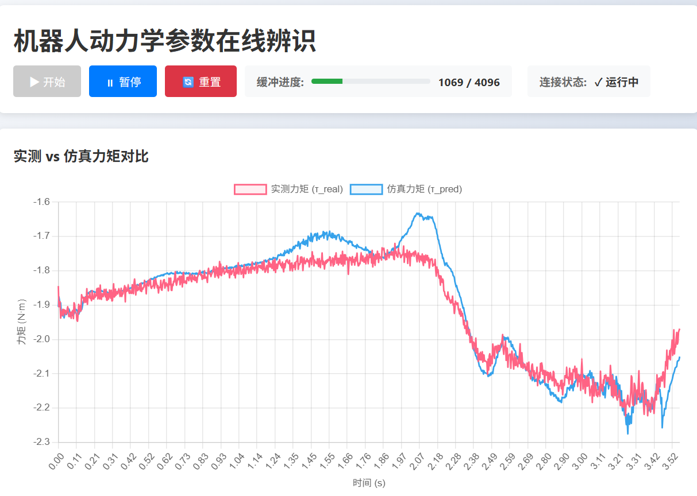

图5-28 第一轮隔离验证前端展示

2. 第二轮Node.js集成，项目组发布Node.js架构版本后，本设计将参数辨识模块迁移至该版本，并同步完成前端Widget注册系统改造，降低多人协作时新增模块的修改成本。该轮不仅在本地模拟了SSE数据流，还设计了参数回注的接口存根，首次实现了双向闭环的工程雏形，网页展示界面如图5-29所示：

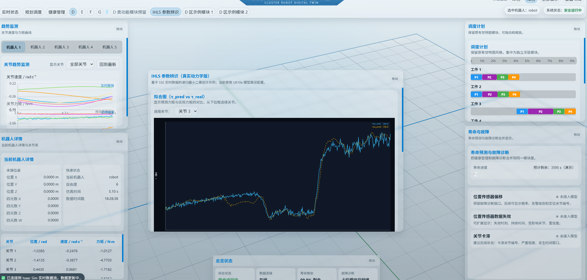

图5-29 第二轮项目集成前端展示

3. 第三轮TypeScript重构，项目版本更新为TypeScript架构后，本设计再次完成参数辨识模块移植，复用注册式Widget机制，并延续SSE伪造数据流方法进行本地验证。通过该轮验证，证明子模块可在更完善的前端工程中稳定接入，且闭环驱动逻辑可跨架构复用，网页展示界面如图5-30所示：

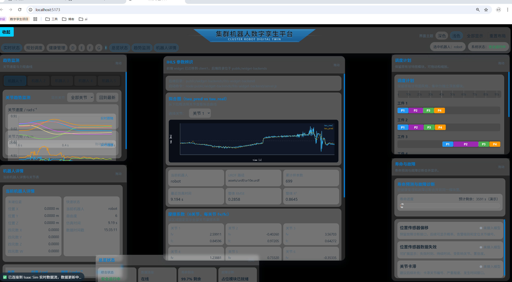

图5-30 第三轮项目重构前端展示

三轮验证完成后，移植版本交由共同开发者在主电脑环境中完成联调并跑通，进一步说明本设计实现的参数辨识子模块具备可集成性与可复用性。

## 5.8 本章小结
本章依托于"离线辨识—在线递推—融合补偿—工程集成"这四个层面，开展了分层验证工作。离线含摩擦LS在真实数据上的表现情况显著优于无摩擦模型；IHLS在流式数据条件下保持着稳定的收敛特性；IHLS-BPNN在此基础上进一步对残差进行了压缩，全局以及逐关节拟合指标均得到了提高，这充分表明"结构化主模型+数据补偿层"这一组合式路线，在精度以及鲁棒性这两方面均表现出实际价值。

工程实现层面的结论，需要结合边界条件来加以理解。本设计所完成的是参数辨识子模块在数字孪生监控框架中的集成工作以及迁移验证，而并非从零搭建完整平台。经过隔离验证、Node.js集成、TypeScript重构这三轮迭代，本设计实现了模块接口的统一、注册式Widget的接入，以及依托于伪造SSE数据流的本地闭环测试，联调跑通由共同开发者在主环境完成。如此一来，该工程链路已具备了"数据流驱动辨识、辨识结果驱动孪生体参数修正"这样的双向反馈特征。

回顾全章，算法的可用性及模块的可复用性都已经通过实验得以验证。希望引起读者重视的是，论文题目是"数字孪生驱动"，在本设计中驱动的结果就是真正一整套有效运行的闭合算法：真实机器人运行的数据经过实验平台上驱动参数辨识得到结果，再次回路注入数字孪生体，驱动数字孪生体的动力学特性不断地推敲生成，虚实对应随着这个闭合、双向运行的循环结构不断提高，这样的结构设计本身就意味着我们所提出算法的可行性和鲁棒性的正确性实现，为所论述内容之后更高层面的在线优化和多机协调等潜在应用留有明显的开发接口。


# 6. 总结与展望

## 6.1 总结
本课题综合应用了《机器人技术基础》《机器人动力学与控制》[4]《自动控制原理》《神经网络》等课程知识，解决了数字孪生驱动的工业机器人动力学参数辨识中的相关复杂工程问题，具体体现在：动力学回归矩阵存在列亏秩问题，须经奇异值分解提取最小参数集方可求解，不经深入分析难以得出合理方案；本设计涉及刚体动力学建模、在线递推辨识、神经网络残差补偿、数字孪生系统集成等多方面技术，各子问题相互依赖、综合性较强；设计过程中存在摩擦建模精度与参数线性化要求之间的冲突、物理可解释性与数据驱动灵活性之间的冲突，需结合工程实际作出权衡取舍。本课题最终构建了"离线建模—在线辨识—数字孪生闭环校准"的一体化框架，在真实UR12e机器人数据上完成了从算法验证到系统集成的全链条研究。

从算法以及系统这两个层面出发，本设计提出了"离线LS奠基—在线IHLS增强—BPNN残差补偿"这样的分层辨识策略：含摩擦离线LS与无摩擦模型相比，RMSE下降了约63.7%，这一结果验证了摩擦建模的必要性；带遗忘因子的IHLS在真实数据上达到了RMSE=0.3368 Nm、R^2=0.9842的水平，具备了流式数据条件下的实时跟踪能力；叠加BPNN残差补偿层之后，RMSE进一步降至0.2365 Nm，R^2升至0.9922，末端关节方面的改善表现尤为突出。从系统工程这一层面来看，围绕参数辨识子模块，完成了隔离验证、Node.js集成以及TypeScript重构这三轮迭代工作，设计出了注册式Widget的接入机制，经伪造SSE数据流本地闭环测试之后，由共同开发者在主环境联调跑通，得以实现"真机数据驱动辨识—辨识参数回注孪生体"这样的双向闭环。

## 6.2 展望
该设计在建模与验证方面开展了系统工作，但短板也同样明显——值得在后续研究中持续加以改进。

IHLS现在用的是固定遗忘因子——负载突变、关节加速磨损这种场景，跟踪能力跟不上。基于此情景后续可以试试自适应遗忘因子或者协方差重置。本设计中的BPNN泛化全靠训练数据覆盖了多少工况。应对新工况的补偿精度可能就会一定程度降低。在线增量学习、元学习——这些方法能让补偿层在新环境下快速适应，而不是长期固定一个权重。

从工程层面来看，参数回注目前仍然依靠存根接口来进行模拟，尚未实现辨识结果到Isaac Sim的自动写入。将回注接口加以标准化封装，并且打通"辨识—回注—验证"的无人值守流程，这是让闭环真正跑通的关键一步。在建模这一方面，一阶摩擦模型对低速Stribeck效应以及减速器柔性的刻画表现得不够精细，引入LuGre模型或者柔性关节动力学，可以针对性地把这块短板补上。

更值得加以期待的方向，是将辨识参数真正地接入前馈补偿或者自适应控制回路，借助于轨迹跟踪精度的实际提升来检验辨识质量，把"辨识"以及"控制"这条链路彻底打通。随着边缘计算以及智能感知技术的不断进步，这套持续进行校准的数字孪生辨识框架，在多机器人协同、人机协作等更为复杂的场景中，应当还存在着更大的发挥空间。

---

# 参考文献

[1] WU J, WANG J, YOU Z. An overview of dynamic parameter identification of robots[J/OL]. Robotics and Computer-Integrated Manufacturing, 2010, 26(5): 414-419. DOI:10.1016/j.rcim.2010.03.013.

[2] 陶飞, 刘蔚然, 刘检华, 等. 数字孪生及其应用探索[J]. 计算机集成制造系统, 2018, 24(1): 1-18.

[3] HUANG Y, KE J, ZHANG X, 等. Dynamic Parameter Identification of Serial Robots Using a Hybrid Approach[J/OL]. IEEE Transactions on Robotics, 2023, 39(2): 1607-1621. DOI:10.1109/TRO.2022.3211194.

[4] 霍伟. 机器人动力学与控制[M]. 高等教育出版社, 2005.

[5] 边宇枢, 高志慧, 贠超. 6 自由度水下机器人动力学分析与运动控制[J]. 机械工程学报, 2007, 43(7): 87-92.

[6] JIN H, LIU Z, ZHANG H, 等. A dynamic parameter identification method for flexible joints based on adaptive control[J]. IEEE/ASME Transactions on Mechatronics, 2018, 23(6): 2896-2908.

[7] 王宏伟, 刘向利, 马广富. 基于正交最小二乘估计的非线性系统模糊辨识[J]. 计算机学报, 2004, 27(8): 1143-1146.

[8] 赵杰, 张春元, 刘超, 等. 递归最小二乘循环神经网络[J]. 自动化学报, 2022, 48(8): 2050-2061.

[9] YANG X, DU Y, LI L, 等. Physics-informed neural network for model prediction and dynamics parameter identification of collaborative robot joints[J]. IEEE Robotics and Automation Letters, 2023, 8(12): 8462-8469.

[10] 肖敏, 陆云翔, 虞文武, 等. 神经网络分岔动力学综述[J]. 自动化学报, 2025, 51(1): 72-89.

[11] TAO F, ZHANG H, LIU A, 等. Digital twin in industry: State-of-the-art[J]. IEEE Transactions on industrial informatics, 2018, 15(4): 2405-2415.

[12] TAO F, ZHANG M, NEE A Y C. Digital twin driven smart manufacturing[M]. Academic press, 2019.

[13] RAISSI M, PERDIKARIS P, KARNIADAKIS G E. Physics-informed neural networks: A deep learning framework for solving forward and inverse problems involving nonlinear partial differential equations[J]. Journal of Computational physics, 2019, 378: 686-707.

[14] BAEK D, PENG B, GUPTA S, 等. Online learning-based inertial parameter identification of unknown object for model-based control of wheeled humanoids[J]. IEEE Robotics and Automation Letters, 2024, 9(12): 11154-11161.

[15] LOU H, ZHANG M, GENG H, 等. D-REX: Differentiable Real-to-Sim-to-Real Engine for Learning Dexterous Grasping[J]. arXiv e-prints, 2026: arXiv-2603.

[16] TRINH M, GEIST A R, MONNET J, 等. Newtonian and Lagrangian neural networks: a comparison towards efficient inverse dynamics identification[J]. IFAC-PapersOnLine, 2025, 59(18): 31-36.

[17] QIN Y, YIN Z, YANG Q, 等. Dynamics parameter identification of articulated robot[J]. Machines, 2024, 12(9): 595.

[18] 赵玲玲, 马培军, 苏小红. 一种快速准蒙特卡罗粒子滤波算法[J]. 自动化学报, 2010, 36(9): 1351-1356.

[19] 王田苗, 陶永. 我国工业机器人技术现状与产业化发展战略[J]. 机械工程学报, 2014, 50(9): 1-13.

[20] 段书用, 李昌洛, 韩旭, 等. 机械臂动力学分析及关节非线性摩擦模型建立[J]. 机械工程学报, 2020, 56(9): 18-28.

[21] 王明昊, 汪满新. 一种新型五自由度混联机器人动力学建模与性能评价[J]. 机械工程学报, 2023, 59(9): 63-75.

[22] 梁斌, 刘良栋, 李庚田. 空间机器人的动力学等价机械臂[J]. 自动化学报, 1998, 24(6): 761-767.

[23] LI C, QIAN H, LI Z, 等. An Excitation Trajectory for Dynamic Parameter Identification of Robot Using Logistic Function and Depth-First Search[J]. Journal of Dynamic Systems, Measurement, and Control, 2025, 147(4): 041011.

[24] 康瑞浩, 胡俊山, 田威, 等. 面向工业机器人的数字孪生建模精度补偿方法[J]. 航空制造技术, 2023, 66(6): 50-59.

[25] VANTILBORGH V, DE WITTE S, OSTYN F, 等. Probabilistic Latent Variable Modeling for Dynamic Friction Identification and Estimation[C/OL]//2025 IEEE International Conference on Robotics and Automation (ICRA). IEEE, 2025: 16081-16087. https://ieeexplore.ieee.org/abstract/document/11128668/.

[26] 张涛, 何家豪, 施永平, 等. 基于改进 Stribeck 摩擦的协作机器人动力学参数辨识[J]. 机械工程学报, 2026, 62(5): 151-167.

[27] ZHONG F, LIU G, LU Z, 等. Dynamic parameter identification based on improved particle swarm optimization and comprehensive excitation trajectory for 6R robotic arm[J]. Industrial Robot: the international journal of robotics research and application, 2024, 51(1): 148-166.

[28] 房立金, 党鹏飞. 基于量子粒子群优化算法的机器人运动学标定方法[J]. 机械工程学报, 2016, 52(7): 23-30.

[29] SHAN S, PHAM Q C. Fast payload calibration for sensorless contact estimation using model pre-training[J]. IEEE Robotics and Automation Letters, 2024, 9(10): 9007-9014.

[30] 刘怀兰, 赵文杰, 李世壮, 等. 数字孪生车间机器人虚实驱动系统构建方法[J]. 中国机械工程, 2022, 33(21): 2623-2632.

---

# 致　谢

行文至此，大学四年的这趟旅程也即将到达终点。

感谢各位导师和师兄师姐在毕设期间给予我的指导与帮助。感谢我的同学朋友与我并肩走过难忘时光。感谢我的家人，为我提供的支持。

此时的夏日，正好似高考前的那个夏日，我回顾那时的自己，对高考成绩的忐忑、对大学四年的憧憬。这一路走来，有欢乐喜悦，也有苦涩失落；期间遇到了很多好心人，也都影响改变了我不少；有好几次为了目标去通宵奋斗，有好几次揣揣不安地等待那些用来证明努力的结果，有成功有失败。这些都统共构成了我的大学四年，就以此作为给四年前自己的一份没有分数的答卷。

落幕的是我的大学生活，还需迎接人生下一幕。

