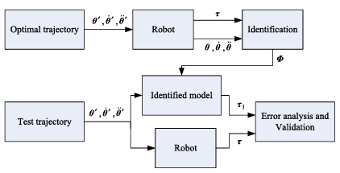
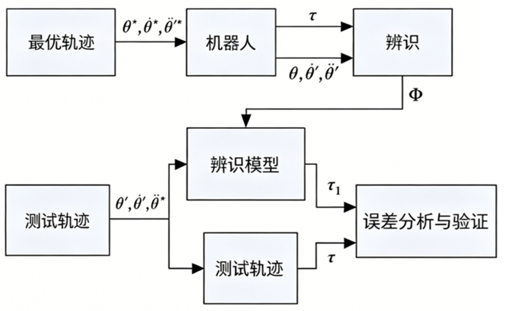

2010) 414- 419

# Robotics and Computer-Integrated Manufacturing

journal homepage: www.elsevier.com/locate/rcim

Review

# An overview of dynamic parameter identification of robots

Jun Wua,*, Jinsong Wanga, Zheng Youb

aInstitute of Manufacturing Engineering, Department of Precision Instruments and Mechnology, Tsinghua University, Beijing 100084, PR China  
bInstitute of Instrument Science and Technology, Department of Precision Instruments and Mechnology, Tsinghua University, Beijing 100084 PR China

# 机器人动力学参数辨识综述

Jun Wua,*, Jinsong Wanga, Zheng Youb

a 清华大学精密仪器与机械学系制造工程研究所，北京 100084，中国  
b 清华大学精密仪器与机械学系仪器科学与技术研究所，北京 100084，中国

---

## ARTICLEINFO

Article history:  
Received 30 June 2009  
Received in revised form 15 February 2010  
Accepted 30 March 2010

Keywords:  
Identification  
Dynamic parameters  
Robot  
Trajectory optimization

## 文章信息

文章历史：  
2009年6月30日收稿  
2010年2月15日收到修订稿  
2010年3月30日录用

关键词：  
辨识  
动力学参数  
机器人  
轨迹优化

---

## ABSTRACT

Due to the importance to model- based control, dynamic parameter identification has attracted much attention. However, until now, there is still much work for the identification of dynamic parameters to be done. In this paper, an overview is given of the existing work on dynamic parameter identification of serial and parallel robots. The methods for estimating the dynamic parameters are summarized, and the advantages and disadvantages of each method are discussed. The model to be identified and the trajectory optimization are reviewed. Further, the methods for validating the estimated model are summarized and the application of dynamic parameter identification is mentioned. The results of this review are useful for manufacturers of robots in selecting proper identification method and also for researchers in determining further research areas.

2010 Elsevier Ltd. All rights reserved.

## 摘要

由于动力学参数辨识对基于模型的控制具有重要意义，该领域一直备受关注。然而，迄今为止，动力学参数的辨识仍有许多工作有待完成。本文综述了串联及并联机器人动力学参数辨识的现有研究成果。总结了估计动力学参数的方法，并讨论了各种方法的优缺点。回顾了待辨识的模型及轨迹优化方法。此外，还总结了估计模型的验证方法，并提及了动力学参数辨识的应用。本综述的成果有助于机器人制造商选择合适的辨识方法，也有助于研究人员确定未来的研究方向。

© 2010 Elsevier Ltd. 版权所有。

---

## Contents

1. Introduction. 414
2. Methods of dynamic parameter identification. 415
    2.1. Off-line identification. 415
    2.2. On-line identification. 415
3. Model and identification algorithm. 416
    3.1. Identification model. 416
    3.2. Identification algorithm. 416
4. Optimal trajectory. 417
    4.1. Trajectory optimization. 417
    4.2. Sequential identification. 417
5. Validation and application. 418
6. Conclusions. 418
Acknowledgements. 418
References. 418

## 目录

1. 引言......................................................................................................................414  
2. 动力学参数辨识方法..........................................................................................415  
    2.1. 离线辨识..................................................................................................415  
    2.2. 在线辨识..................................................................................................415  
3. 模型与辨识算法..................................................................................................416  
    3.1. 辨识模型..................................................................................................416  
    3.2. 辨识算法..................................................................................................416  
4. 最优轨迹..............................................................................................................417  
    4.1. 轨迹优化..................................................................................................417  
    4.2. 分步辨识..................................................................................................417  
5. 验证与应用..........................................................................................................418  
6. 结论......................................................................................................................418  
致谢..........................................................................................................................418  
参考文献..................................................................................................................418  

---

## 1. Introduction

The dynamic parameters that describe the dynamic model are important for the advanced model- based control algorithms, the validation of the simulation results and the accurate path planning algorithms [1]. Especially in the special mechatronics area of robotics, model- based control is crucial for the increase of the system's precision and reliability. However, the dynamic model of the robot contains uncertainties in many parameters and many control methods are sensitive to their values. Sensitivity to parameter uncertainty is especially severe in high speed operations. Dynamic parameter identification methods have gained importance for developing model based controllers. In general, a standard robot identification procedure consists of modeling, experiment design, data acquisition, signal processing, parameter estimation and model validation [2]. The last step of the identification procedure is model validation, where the user verifies that the model satisfies the accuracy specifications. If the obtained model does not pass the validation tests, one or several steps of the procedure are repeated and some of the choices are reconsidered. The identification of dynamic parameters has attracted considerable attention from numerous researchers. Atkeson et al. [3] proposed the estimation of inertial parameters. Gautier et al. [4] proposed a dynamic identification method from only the torque data. Grotjahn et al. [5] used the two- step approach to perform the friction and rigid body identification of robot dynamics.

## 1. 引言

描述动力学模型的动力学参数对于先进的基于模型的控制算法、仿真结果的验证以及精确的路径规划算法都至关重要[1]。尤其是在机器人这一特殊机电一体化领域，基于模型的控制对于提高系统的精度和可靠性至关重要。然而，机器人的动力学模型在许多参数上存在不确定性，而许多控制方法对这些参数值十分敏感。在高速操作中，对参数不确定性的敏感性尤为严重。动力学参数辨识方法对于开发基于模型的控制器已变得日益重要。通常，标准的机器人辨识流程包括建模、实验设计、数据采集、信号处理、参数估计和模型验证[2]。辨识流程的最后一步是模型验证，用户在此确认模型是否满足精度指标。若所得模型未能通过验证测试，则需重复流程中的一个或多个步骤，并重新考虑某些选择。动力学参数辨识吸引了众多研究者的广泛关注。Atkeson 等人[3]提出了惯性参数的估计方法。Gautier 等人[4]提出了一种仅基于力矩数据的动力学辨识方法。Grotjahn 等人[5]采用两步法对机器人动力学中的摩擦和刚体部分进行辨识。

---

In contrast to the vast amount of literature concerning the identification of serial robots, there are only a few publications dealing with experimental identification of the dynamics of fully parallel mechanisms. Most of these publications apply no real- time identification approaches but adaptive control algorithms. Further, the parameter determination is restricted to very simple models. There are different reasons for this lack of identification algorithms for the dynamics of complex parallel mechanisms. In comparison to serial robots, the workspace constraints strongly restrict the experimental possibilities. Furthermore, an independent investigation of local influences like joint friction is impossible since single joint motions cannot be carried out.

与串联机器人辨识方面的海量文献相比，关于全并联机构动力学实验辨识的文献为数不多。这些文献大多未采用实时辨识方法，而是采用自适应控制算法。此外，参数确定仅限于非常简单的模型。造成复杂并联机构动力学辨识算法匮乏的原因有多种。与串联机器人相比，工作空间的约束极大地限制了实验的可能性。再者，由于无法执行单关节运动，像关节摩擦这样的局部影响无法进行独立研究。

---

This paper reviews the work on dynamic parameter identification of serial and parallel robots. Due to the lack of identification algorithms for the dynamics of complex parallel mechanisms, dynamic parameter identification of parallel robot is emphasized. Identification method, linear model, trajectory optimization, validation and application are discussed, and the relevant research work is reviewed. The results of this review are useful for manufacturers of robots and researchers.

本文回顾了串联及并联机器人动力学参数辨识的相关工作。鉴于复杂并联机构动力学辨识算法的匮乏，本文将重点放在并联机器人的动力学参数辨识上。文中讨论了辨识方法、线性模型、轨迹优化、验证及应用，并对相关研究工作进行了回顾。本综述的成果对机器人制造商和研究人员均具有参考价值。

---

## 2. Methods of dynamic parameter identification

The accuracy of dynamic model depends on the geometrical parameters and dynamic parameters. High- precision geometrical parameters can be obtained by kinematic calibration, and the dynamic parameters should be estimated by identification methods. Many different methods, which can be categorized as on- line identification and off- line identification methods, are proposed to determine the dynamic parameter values. In the off- line procedure, all the input- output data can be collected prior to analysis and do not impose any limits on the computation time. In contrast, the on- line procedure deals with real- time updates of the parameters to be identified during robot operations.

## 2. 动力学参数辨识方法

动力学模型的精度取决于几何参数和动力学参数。高精度的几何参数可通过运动学标定获得，而动力学参数则需通过辨识方法进行估计。目前已有多种方法用于确定动力学参数值，这些方法可归类为在线辨识方法和离线辨识方法。在离线流程中，所有输入-输出数据均可在分析之前收集完毕，且对计算时间没有任何限制。相反，在线流程则涉及在机器人操作过程中对待辨识参数进行实时更新。

---

### 2.1. Off-line identification

There are three main off- line methods for estimating the dynamic parameters of a robot.

(1) Physical experiments: the robot is disassembled to isolate each link, some inertial parameters can be obtained by experiments. For example, the mass could be evaluated directly, the coordinates of the center-of-mass could be obtained by determining counterbalanced points of the link and the diagonal elements of the inertia tensor could be obtained by pendular motions [6]. Based on physical experiments, some other methods are developed [7-11]:

(a) Frequency response function: the vibration response of the links is used to determine the inertial parameters.
(b) Modal model method: the modal model of the link is utilized to determine the inertial parameters.
(c) Inertia restricted method: the method is developed based on the residual inertia of the rigid body, which is computed from the measuring value of frequency response experiment.
(d) Direct system identified method: the inertial parameters are identified to minimize the error between the measuring value and the theoretic value of frequency response.

In physical experiments, the special measuring devices are necessary and the joint characteristic is neglected. The identification accuracy depends on the accuracy of measuring devices. Further, physical experiments are very tedious and should be realized by the manufacturer before assembling the robot.

### 2.1. 离线辨识

估计机器人动力学参数主要有三种离线方法。

(1) 物理实验：将机器人拆解以分离每个连杆，通过实验可获得部分惯性参数。例如，质量可直接测量；质心坐标可通过确定连杆的平衡点获得；惯性张量的对角元素可通过摆动运动获得[6]。基于物理实验，还发展出其他一些方法[7–11]：
    (a) 频率响应函数法：利用连杆的振动响应确定惯性参数。
    (b) 模态模型法：利用连杆的模态模型确定惯性参数。
    (c) 惯性约束法：基于从频率响应实验测量值计算得到的刚体残余惯性。
    (d) 直接系统辨识法：通过最小化频率响应测量值与理论值之间的误差来辨识惯性参数。

物理实验需要专门的测量设备，且忽略了关节特性。辨识精度取决于测量设备的精度。此外，物理实验非常繁琐，应由制造商在机器人装配之前完成。

---

(2) Computer aided design (CAD) techniques: these approaches find the required dynamic parameters of a link by using its geometric and material characteristics. All robotics CAD/CAM packages provide tools to calculate the inertia parameters from 3-dimensional models. It is easy to obtain the independent parameter value. In the design phase of a robot, the dynamic performance and model-based control performance of the robot can be investigated based on the estimated dynamic parameters, and the performance analysis can be used further to improve the design. However, the precision of the link model in CAD system determines the accuracy of the estimated parameter. Due to the manufacturing error of the link, the CAD model is not identical with the real part and the accuracy of the estimated parameter values is effected. Moreover, estimates of friction parameters are not provided by the manufacturers and are not predictable from CAD drawing.

(2) 计算机辅助设计技术：这类方法通过使用连杆的几何和材料特性来获取所需的动力学参数。所有机器人 CAD/CAM 软件包都提供从三维模型计算惯性参数的工具。获取独立参数值较为容易。在机器人的设计阶段，可以基于估计的动力学参数研究其动力学性能及基于模型的控制性能，并利用性能分析进一步改进设计。然而，CAD 系统中连杆模型的精度决定了估计参数的准确性。由于连杆存在制造误差，CAD 模型与真实零件并不完全相同，这会影响估计参数值的精度。此外，摩擦参数的估计值不由制造商提供，也无法从 CAD 图纸中预测。

---

(3) Identification: this approach is based on the analysis of the "input/output" behavior of the robot on some planned motion and on estimating the parameter values by minimizing the difference between a function of the real variables and its mathematical model. This method has been used extensively and was found to be the best in terms of ease of experimentation and precision of the obtained values [12]. Using this method, Guegan et al. [13] identified the 43 base dynamic parameters of Orthoglide parallel kinematic machine. Vivas et al. [14] identified the base dynamic parameters of H4 parallel robot, which are necessary for the dynamic model, and pointed out the use of the accelerometer and rotation sensor was not very necessary. Compared to the above two methods, identification approach can obtain good accuracy of identification, and the measurement is relatively easy. This method gives better results than the physical experiment and CAD technique.

(3) 辨识法：该方法基于对机器人在某些规划运动下的“输入/输出”行为进行分析，并通过最小化实际变量函数与其数学模型之间的差异来估计参数值。该方法已被广泛使用，并被认为在实验便利性和所得参数值的精度方面是最优的[12]。利用该方法，Guegan 等人[13]辨识了 Orthoglide 并联运动机床的 43 个基础动力学参数。Vivas 等人[14]辨识了 H4 并联机器人的基础动力学参数（这些参数对动力学模型是必需的），并指出使用加速度计和旋转传感器并非十分必要。与上述两种方法相比，辨识法可以获得良好的辨识精度，且测量相对容易。该方法比物理实验和 CAD 技术能获得更好的结果。

---

### 2.2. On-line identification

On- line identification is a classical and well studied problem: finding values of the parameters in the mathematical model of a system from on- line measured data such that the predicted dynamic response coincides with that of the real system [15]:

(1) Adaptive control algorithms: the method has been investigated extensively as an interesting approach to estimate or adjust on- line the dynamic parameter values used in the control. For parallel robots, the workspace constraints and the complexity of the dynamic equations make an independent excitation of different parameters extremely difficult. If also friction in passive joints of the structure is taken into account, the parameter space will be much larger. These problems are reduced with adaptive control algorithms, since a sufficient excitation is not as crucial as for identification approaches. Based on the Jacobian matrix, Burdet and Codourey [16] projected the force and torque of each moving part onto the Cartesian space. This is the base for the nonlinear adaptive control algorithm to be used for the identification of dynamic parameters. Honegger et al. [17] used a nonlinear adaptive control algorithm to identify the base dynamic parameters of the Hexaglide parallel kinematic machine. In this algorithm, however, parameter convergence cannot be guaranteed.

### 2.2. 在线辨识

在线辨识是一个经典且被广泛研究的问题：根据在线测量的数据，寻找系统数学模型中参数的值，使得预测的动力学响应与真实系统的响应一致[15]。

(1) 自适应控制算法：该方法作为一种有趣的途径已被广泛研究，用于在线估计或调整控制中所用的动力学参数值。对于并联机器人，工作空间约束和动力学方程的复杂性使得对不同参数的独立激励变得极其困难。如果再考虑结构中被动关节的摩擦，参数空间将变得更为庞大。采用自适应控制算法可以缓解这些问题，因为其对于激励充分性的要求不像辨识方法那样苛刻。Burdet 和 Codourey [16] 基于雅可比矩阵，将每个运动部件的力和力矩投影到笛卡尔空间。这为用于动力学参数辨识的非线性自适应控制算法奠定了基础。Honegger 等人[17] 使用非线性自适应控制算法辨识了 Hexaglide 并联运动机床的基础动力学参数。然而，在该算法中，参数收敛性无法得到保证。

---

(2) On-line approach based on neural network: neural networks have received considerable attention in the control and identification fields. It has been demonstrated that neural networks can be used effectively for the identification of nonlinear systems [18]. The identified parameters are regarded as the weights of the network, and the weights approach the actual values of the identified parameters by training the weights. Neural network can realize the on- line identification since the sampled real- time data are input to the network to obtain the real- time parameter value. Jiang et al. [19] proposed an identification approach with neural network based compensation of uncertain dynamics, and the dynamic parameter identification process is divided into two steps.

(2) 基于神经网络的在线方法：神经网络在控制和辨识领域受到了相当大的关注。已证明神经网络可有效用于非线性系统的辨识[18]。辨识的参数被视为网络的权重，通过训练权重使其逼近待辨识参数的真实值。由于采样的实时数据被输入网络以获得实时参数值，神经网络可以实现在线辨识。Jiang 等人[19]提出了一种带有不确定动力学神经网络补偿的辨识方法，并将动力学参数辨识过程分为两个步骤。

---

Although dynamic parameter values of a robot can be obtained by off- line and on- line methods, all of them involve approximations and errors. This means that the dynamic parameters are only known with some uncertainties. In these parameters, static moments and diagonal terms of the inertia matrices should be estimated with a good accuracy, and the other terms are not so important and could be estimated with a lower accuracy.

尽管可以通过离线和在线方法获得机器人的动力学参数值，但所有方法都包含近似和误差。这意味着动力学参数仅在一定的不确定性下被认知。在这些参数中，静矩和惯性矩阵的对角项应以良好的精度进行估计，而其他项则不那么重要，可以较低的精度进行估计。

---

## 3. Model and identification algorithm

### 3.1. Identification model

The identification of dynamic parameters of robot is based on the use of the inverse dynamic model, which is linear with respect to the dynamic parameters. Not all the inertial parameters have an effect on the dynamic model, while others appear to have an effect in linear combinations. The dynamic parameters of a robot can be classified into three groups: fully identifiable, identifiable in linear combinations only and unidentifiable [20], and it is impossible to estimate all the link dynamic parameter values from the data of link motions and joint torques or forces since the link dynamic parameters are redundant to determine the manipulator dynamic model uniquely. The non- redundant and identifiable dynamic parameters can be termed a minimum set of dynamic parameters whose values can determine the dynamic model uniquely. Such a set of dynamic parameters is called base dynamic parameters or minimum dynamic parameters, which is sufficient to describe the dynamic behavior of the mechanical system along with the reduced observation matrix [21,22].

## 3. 模型与辨识算法

### 3.1. 辨识模型

机器人动力学参数的辨识基于逆动力学模型，该模型关于动力学参数是线性的。并非所有惯性参数都对动力学模型产生影响，而有些参数则以线性组合的形式产生影响。机器人的动力学参数可分为三类：完全可辨识的、仅能以线性组合形式辨识的和不可辨识的[20]。由于连杆动力学参数对于唯一确定机械手动力学模型是冗余的，因此无法仅从连杆运动和关节力矩或力的数据中估计出所有连杆动力学参数的值。非冗余且可辨识的动力学参数可称为最小动力学参数集，其值可以唯一确定动力学模型。这样一组动力学参数被称为基础动力学参数或最小动力学参数，它们连同简化后的观测矩阵足以描述机械系统的动力学行为[21,22]。

---

After the base dynamic parameters are determined, the model to be identified should be derived with different methods such as Newton- Euler method, Lagrangian equation and virtual work principle. The dynamic model can be easily derived and expressed from Lagrange equation as follows:

$$
\boldsymbol{M}(\theta)\ddot{\boldsymbol{\theta}} +\boldsymbol{H}(\theta ,\dot{\theta}) + \boldsymbol{g}(\theta) = \boldsymbol{\tau} \quad (1)
$$

where $\theta$ and $\tau$ are joint variable and torque, respectively, $\boldsymbol{M}(\theta)$ is inertia matrix, $\boldsymbol{H}(\theta ,\theta)$ contains Coriolis and centrifugal force, and $\boldsymbol{g}(\theta)$ denotes gravitational force.

确定基础动力学参数后，需采用不同的方法（如牛顿-欧拉法、拉格朗日方程、虚功原理）推导待辨识的模型。动力学模型可通过拉格朗日方程方便地导出并表示如下：

$$
\boldsymbol{M}(\theta)\ddot{\boldsymbol{\theta}} + \boldsymbol{H}(\theta,\dot{\theta}) + \boldsymbol{g}(\theta) = \boldsymbol{\tau} \quad (1)
$$

其中，$\theta$ 和 $\tau$ 分别为关节变量和力矩，$\boldsymbol{M}(\theta)$ 为惯性矩阵，$\boldsymbol{H}(\theta,\dot{\theta})$ 包含科里奥利力和离心力，$\boldsymbol{g}(\theta)$ 表示重力。

---

The dynamic model can be written into a set of linear equations of the unknown parameters as follows:

$$
\boldsymbol{y}(\boldsymbol{\tau},\dot{\boldsymbol{\theta}}) = \boldsymbol{\phi}(\boldsymbol{\theta},\dot{\boldsymbol{\theta}},\ddot{\boldsymbol{\theta}})\boldsymbol{p} \quad (2)
$$

where $\boldsymbol{p}$ is the dynamic parameters.

动力学模型可改写为关于未知参数的线性方程组形式，如下所示：

$$
\boldsymbol{y}(\boldsymbol{\tau},\dot{\boldsymbol{\theta}}) = \boldsymbol{\phi}(\boldsymbol{\theta},\dot{\boldsymbol{\theta}},\ddot{\boldsymbol{\theta}})\boldsymbol{p} \quad (2)
$$

其中，$\boldsymbol{p}$ 为动力学参数。

---

The model to be identified can be classified into three forms: explicit dynamic model, implicit dynamic model and energy model. Gautier [24] and Gautier and Khalil [23] compared the 3 models and the results show that the 3 models give close estimations and accuracy, and the filtered power model is very attractive for its simplicity and accuracy. The other two dynamic models give the same results, then there is no advantage in using the dynamic model with implicit acceleration because its expression is more complicated than that of the dynamic model with explicit acceleration.

待辨识的模型可分为三种形式：显式动力学模型、隐式动力学模型和能量模型。Gautier [24] 以及 Gautier 和 Khalil [23] 对这三种模型进行了比较，结果表明三者的估计值和精度接近，并且滤波后的功率模型因其简洁性和准确性而极具吸引力。另外两种动力学模型给出的结果相同，因此使用具有隐式加速度的动力学模型并无优势，因为其表达式比具有显式加速度的动力学模型更复杂。

---

Although many methods have been used to derive the dynamic model, much work has been concentrated on serial robots. Due to the complex and coupled dynamics, the task for parallel robots still remains challenging. In fact, dynamic modeling of parallel robots has been studied extensively by using general approaches, however, it is difficult to rewrite the dynamic model into the linear form. Most applications for dynamic parameter identification use very simplified models. Some other approaches are presented to derive the linear dynamic model. Khalil and Guegan [25] derived the inverse and direct dynamics modeling of GoughStewart robots. Grotjahn et al. [26] used Newton- Euler equation in combination with Jourdain's principle to derive the linear dynamic model of a Gough- Stewart platform. Using the virtual work principle, Wu et al. [27] presented a method to derive the dynamic formulation of redundant and non- redundant parallel manipulators for dynamic parameter identification.

尽管已有许多方法用于推导动力学模型，但大量工作集中在串联机器人上。由于动力学复杂且耦合性强，并联机器人的任务仍然具有挑战性。事实上，尽管已有通用方法对并联机器人的动力学建模进行了广泛研究，但将其动力学模型改写为线性形式仍然困难。大多数动力学参数辨识应用都使用非常简化的模型。也有一些其他方法用于推导线性动力学模型。Khalil 和 Guegan [25] 推导了 Gough-Stewart 机器人的逆动力学和正动力学模型。Grotjahn 等人[26] 使用牛顿-欧拉方程结合 Jourdain 原理推导了 Gough-Stewart 平台的线性动力学模型。Wu 等人[27] 利用虚功原理，提出了一种推导冗余和非冗余并联机械手动力学公式的方法，用于动力学参数辨识。

---

For the identification of dynamic parameter, the parameters crucial for accurate position control are to be modeled. Modeling the nonlinear dynamic effects of friction, actuator characteristics or closed kinematic chains pose challenges in modeling for identification and are examples of areas where further research and development work are needed.

对于动力学参数辨识，需要为精确的位置控制建立关键参数的模型。对摩擦、执行器特性或闭式运动链等非线性动力学效应进行建模，在辨识建模中提出了挑战，是未来需要进一步研究和开发工作的领域。

---

### 3.2. Identification algorithm

The input/output signals of the robot are sampled while the robot is tracking trajectories that excite the system dynamics in order to get an overdetermined linear system. Then it is solved to estimate the base parameters using numerical optimization methods such as weighted least squares estimation method, Kalman filtering method and maximum- likelihood estimation. The selection of a parameter estimation algorithm is a compromise between accuracy and complexity of implementation.

### 3.2. 辨识算法

当机器人跟踪能激励系统动力学的轨迹时，对其输入/输出信号进行采样，以获得一个超定的线性系统。然后，使用加权最小二乘估计法、卡尔曼滤波法和最大似然估计法等数值优化方法求解该系统，以估计基础参数。参数估计算法的选择需要在精度和实现复杂度之间进行权衡。

---

In the class of estimation algorithms, the weighted least squares estimation method takes a particular place for robot manipulator identification [28]. Based on the use of the inverse model linear in relation to the parameters, it allows to estimate the base inertial parameters providing measurement or estimation of the joint torques and the joint positions. The weighted least square method, which is a noniterative method that finds the parameter estimates in a single step using the singular value decomposition, optimizes the root- mean square residual error of the model under the assumption that the measurement errors are negligible. However, one problem for the parameter estimates of the weighted least square method is the sensitivity to measurement noise [29]. Noise will limit the accuracy of parameters obtained by the least squares, and will limit the convergence rate of the recursive least squares algorithm. To overcome this problem, one can generate the so- called exciting trajectories and/or use data filtering. By using such "input data improvement", a lot of excellent parameter estimations using the least squares method have been obtained [30,31].

在估计算法中，加权最小二乘估计法在机器人机械手辨识中占据特殊地位[28]。基于线性于参数的逆模型，该方法能够估计基础惯性参数，前提是提供或估计关节力矩和关节位置。加权最小二乘法是一种非迭代方法，利用奇异值分解在单步中求得参数估计值，并在假设测量误差可忽略不计的情况下，优化模型的均方根残差。然而，加权最小二乘法参数估计的一个问题是对测量噪声敏感[29]。噪声会限制最小二乘法所得参数的精度，并限制递归最小二乘算法的收敛速度。为克服此问题，可以生成所谓的激励轨迹和/或使用数据滤波。通过这种“输入数据改进”，使用最小二乘法已获得许多出色的参数估计结果[30,31]。

---

Applying the identification model (2) at a sufficient number of points on some trajectories, the following overdetermined linear system of equations in $p$ is obtained:

$$
\boldsymbol{Y}(\boldsymbol{\tau},\dot{\boldsymbol{\theta}}) = \boldsymbol{\Phi}(\boldsymbol{\theta},\dot{\boldsymbol{\theta}},\ddot{\boldsymbol{\theta}})\boldsymbol{p} + \boldsymbol{\rho} \quad (3)
$$

where $\Phi$ is an observation matrix and $\boldsymbol{\rho}$ is the residual error vector.

在轨迹上足够多的点处应用辨识模型(2)，可得到如下关于 $p$ 的超定线性方程组：

$$
\boldsymbol{Y}(\boldsymbol{\tau},\dot{\boldsymbol{\theta}}) = \boldsymbol{\Phi}(\boldsymbol{\theta},\dot{\boldsymbol{\theta}},\ddot{\boldsymbol{\theta}})\boldsymbol{p} + \boldsymbol{\rho} \quad (3)
$$

其中，$\boldsymbol{\Phi}$ 为观测矩阵，$\boldsymbol{\rho}$ 为残差向量。

---

The estimated values $\hat{p}$ can be obtained as

$$
\hat{\boldsymbol{p}} = \underset {\boldsymbol{p}}{\min}\left\| \boldsymbol{\rho}\right\|^{2} \quad (4)
$$

Namely

$$
\hat{\boldsymbol{p}} = (\boldsymbol{\Phi}^{T}\boldsymbol{\Phi})^{-1}\boldsymbol{\Phi}^{T}\boldsymbol{\tau} \quad (5)
$$

估计值 $\hat{\boldsymbol{p}}$ 可通过下式获得：

$$
\hat{\boldsymbol{p}} = \underset{\boldsymbol{p}}{\min}\left\| \boldsymbol{\rho}\right\|^{2} \quad (4)
$$

即

$$
\hat{\boldsymbol{p}} = (\boldsymbol{\Phi}^{T}\boldsymbol{\Phi})^{-1}\boldsymbol{\Phi}^{T}\boldsymbol{\tau} \quad (5)
$$

---

An alternative method, more common in the automatic control community, is the use of Kalman filtering algorithm. Based on the direct dynamic model, which is nonlinear in relation to the state and the parameters, an extended state containing the physical parameters is considered. Gautier and Poignet [32,33] presented an experimental comparison on a two degrees- of- freedom robot using weighted least squares estimation and extended Kalman filtering approach. The comparison shows that estimations of the parameters are very close for both methods, but extended Kalman filtering algorithm is very sensitive to the initial conditions and the convergence speed is slower. Thus, the weighted least squares method with the inverse dynamic model appears to be better than the extended Kalman filtering approach for off- line identification.

另一种在自动控制领域更常见的方法是使用卡尔曼滤波算法。基于关于状态和参数为非线性的正动力学模型，构建一个包含物理参数的扩展状态。Gautier 和 Poignet [32,33] 在一个二自由度机器人上对加权最小二乘估计法和扩展卡尔曼滤波法进行了实验比较。比较结果表明，两种方法的参数估计值非常接近，但扩展卡尔曼滤波算法对初始条件非常敏感，且收敛速度较慢。因此，对于离线辨识，采用逆动力学模型的加权最小二乘法似乎优于扩展卡尔曼滤波法。

---

In addition, Swevers et al. [34] presented a new approach toward the design of optimal robot excitation trajectories, and formulated the maximum- likelihood estimation of dynamic model parameters. But the models used often encompass significant deterministic structural errors that cannot be accounted for by random variables [35]. Olsen et al. [36] pointed out that the use of the maximum- likelihood method should only be considered in cases where both the measured positions and torques are noisy. In the practical case, they are considered additive noise that leads to a weighted least squares estimation. Besides, Calafiore and Indri [37] used linear matrix inequalities to account for the uncertainties in the observation matrix due to modeling error or measurement noise.

此外，Swevers 等人[34] 提出了一种设计最优机器人激励轨迹的新方法，并公式化了动力学模型参数的最大似然估计。但是，所使用的模型通常包含显著的确定性结构误差，这些误差无法用随机变量来解释[35]。Olsen 等人[36] 指出，仅在测量位置和力矩都存在噪声的情况下，才应考虑使用最大似然法。在实际情况下，它们被视为导致加权最小二乘估计的加性噪声。此外，Calafiore 和 Indri [37] 使用线性矩阵不等式来处理由于建模误差或测量噪声引起的观测矩阵不确定性。

---

## 4. Optimal trajectory

In order to improve the convergence rate and the noise immunity of the least squares estimation, the trajectory used in the identification must be carefully selected. Such a trajectory is known as a persistently exciting trajectory [38]. To obtain an exciting trajectory, two schemes are generally used: (1) calculation of a trajectory satisfying some optimization criteria and (2) use of sequential sets of special test motions, where each motion will excite some dynamic parameters.

## 4. 最优轨迹

为了提高最小二乘估计的收敛速度和抗噪声能力，必须精心选择辨识所用的轨迹。这样的轨迹被称为持续激励轨迹[38]。为了获得激励轨迹，通常采用两种方案：(1) 计算满足某些优化准则的轨迹；(2) 使用一系列特定的测试运动，其中每种运动将激励某些动力学参数。

---

### 4.1. Trajectory optimization

When designing an identification experiment for a system, it is necessary to consider the sufficiency of excitation [39]. It is shown that the convergence rate and noise immunity of a parameter identification experiment depend directly upon the condition number of the persistent excitation matrix computed from the inverse dynamic model. It is important to emphasize that the configurations for which measurements are taken must correspond to a well- conditioned reduced observation matrix since the condition number represents an upper limit for input/output error transmissibility [40]. In the literature, other criteria have also been used to define the exciting condition [41]:

### 4.1. 轨迹优化

在设计系统辨识实验时，必须考虑激励的充分性[39]。研究表明，参数辨识实验的收敛速度和抗噪声能力直接取决于由逆动力学模型计算得到的持续激励矩阵的条件数。必须强调的是，进行测量的构型必须对应一个良态的简化观测矩阵，因为条件数代表了输入/输出误差传递的上限[40]。文献中还使用了其他准则来定义激励条件[41]：

---

(1) the sum of the condition number of observation matrix with a parameter equilibrating the values of the elements of observation matrix:

$$
C = \mathrm{cond}(\Phi) + \frac{\max |\phi_{ij}|}{\min |\phi_{ij}|},\quad \min |\phi_{ij}|\neq 0, \quad (6)
$$

where $\phi_{ij}$ is the $(ij)$ element of $\Phi$.

(1) 观测矩阵条件数与平衡观测矩阵元素值的参数之和：

$$
C = \mathrm{cond}(\boldsymbol{\Phi}) + \frac{\max |\phi_{ij}|}{\min |\phi_{ij}|},\quad \min |\phi_{ij}|\neq 0, \quad (6)
$$

其中，$\phi_{ij}$ 为 $\boldsymbol{\Phi}$ 的第 $(ij)$ 元素。

---

(2) The sum of the condition number of observation matrix and the inverse of the smallest singular value of observation matrix:

$$
C = \mathrm{cond}(\Phi) + k_1\frac{1}{\sigma_{\min}} \quad (7)
$$

where $k_{1} > 0$ is a weighting scalar parameter and $\sigma_{\min}$ is the minimum singular value of $\Phi$.

(2) 观测矩阵条件数与其最小奇异值倒数之和：

$$
C = \mathrm{cond}(\boldsymbol{\Phi}) + k_1\frac{1}{\sigma_{\min}} \quad (7)
$$

其中，$k_{1} > 0$ 为加权标量参数，$\sigma_{\min}$ 为 $\boldsymbol{\Phi}$ 的最小奇异值。

---

(3) The condition number of a weighted observation matrix:

$$
C = \mathrm{cond}(\Phi \mathrm{diag}(Z)) \quad (8)
$$

where $Z$ is a weighting vector.

(3) 加权观测矩阵的条件数：

$$
C = \mathrm{cond}(\boldsymbol{\Phi} \mathrm{diag}(Z)) \quad (8)
$$

其中，$Z$ 为加权向量。

---

The use of the condition number of the observation matrix is subject to statistical assumptions as was pointed out by Presse and Gautier [42]. It is known that such a condition ensures that the parameters to be identified are well- excited and have a balanced effect on the external forces. Consequently, Armstrong [43] and Presse and Gautier [42] dealt with these configurations directly, at the generalized accelerations level in the first and the generalized velocities and positions in the second, proposing the use of an optimization process with the aim of minimizing the condition number of the observation matrix. However, this process has some disadvantages. To overcome these disadvantages, Swevers et al. [44] suggested considering the configurations governed by a single global trajectory. This trajectory is parameterized using a finite Fourier series function to guarantee periodic excitation. Periodic excitation enables time- domain data averaging and estimation of the characteristics of the measurement noise, which is useful for maximum- likelihood parameter estimation. This method has received more attention [45]. Park [46] has proposed the use of parameterization based on a combined Fourier series and polynomial functions to overcome the disadvantages of the Fourier series parameterization.

如 Presse 和 Gautier [42] 所指出的，使用观测矩阵的条件数需要满足统计假设。众所周知，这样的条件确保了待辨识参数被良好激励，并且对外部力有均衡的影响。因此，Armstrong [43] 以及 Presse 和 Gautier [42] 分别从广义加速度层面和广义速度及位置层面直接处理这些构型，提出使用优化过程，旨在最小化观测矩阵的条件数。然而，此过程存在一些缺点。为克服这些缺点，Swevers 等人[44] 建议考虑由单一全局轨迹控制的构型。该轨迹使用有限傅里叶级数函数进行参数化，以保证周期性激励。周期性激励使时域数据平均和测量噪声特性估计成为可能，这对最大似然参数估计很有用。此方法已受到更多关注[45]。Park [46] 提出了使用基于傅里叶级数与多项式函数相结合的参数化方法，以克服傅里叶级数参数化的缺点。

---

Based on the determination of a sequence of optimal joint position velocity couples, Caccavale and Chiacchio [47] proposed a method to determine the optimal trajectory where a continuous smooth "optimal" trajectory is found by interpolating optimal joint position velocity couples via fixed order polynomials. The number of decision variables and the computational effort in this case are dependent on the number of samples along the trajectory. An alternative solution to the above- described methods, which are gradient based, where a random search approach is used to determine the set of optimal points to be interpolated, is proposed by Van and Can [48]. Based on the parameterization of the class of joint position time functions, Calafiore et al. [49] proposed a method and the key idea underlying this method is to restrict attention to some parameterized family of possible trajectories, thus reducing the original infinite- dimensional problem to a more tractable finitely parameterized optimization problem.

基于确定一系列最优关节位置-速度对，Caccavale 和 Chiacchio [47] 提出了一种确定最优轨迹的方法，即通过固定阶多项式插值最优关节位置-速度对，从而找到连续光滑的“最优”轨迹。在这种情况下，决策变量的数量和计算量取决于沿轨迹的采样点数量。Van 和 Can [48] 提出了上述基于梯度的方法的一种替代方案，该方案使用随机搜索方法来确定要插值的最优点集。Calafiore 等人[49] 基于关节位置时间函数类的参数化提出了一种方法，其核心思想是将注意力限制在某个参数化的可能轨迹族上，从而将原本的无限维问题简化为更易处理的有限参数优化问题。

---

In particular, a new method is developed for the determination of optimal joint trajectories for the identification experiment, which is based on evolutionary optimization techniques. A genetic algorithm is used to determine excitation trajectories that minimize either the condition number of the regression matrix or the algorithmic determinant of the Fisher information matrix.

特别地，一种基于进化优化技术的新方法被开发出来，用于确定辨识实验的最优关节轨迹。使用遗传算法来确定激励轨迹，以最小化回归矩阵的条件数或费舍尔信息矩阵的算法行列式。

---

### 4.2. Sequential identification

Sequential identification is proposed to use a set of different trajectories where each trajectory excites some parameters. For example, we can move some joints while locking some others. This technique simplifies the identification equations. However, an accumulation of errors may occur since the values of some estimated parameters will be assumed to be known in subsequent identification. In serial robots, some joints can be locked to estimate the dynamic parameters of certain links. However, this approach is not suitable for parallel robots since the motion of a single joint cannot be realized due to the structural limit. Vandanjon et al. [50] has proposed to avoid this drawback by generating four different trajectories to excite four different physical phenomena, which are: inertial effect, centrifugal coupling, inertial coupling and gravity effect. The trajectories are periodic between two points (except for gravity). The experiments are designed in order to ensure optimal condition number of the observation matrix. These trajectories are then combined in a global identification system of equations.

### 4.2. 分步辨识

分步辨识是指使用一组不同的轨迹，其中每条轨迹激励某些参数。例如，可以在锁定部分关节的同时移动其他关节。这种技术简化了辨识方程。然而，由于某些已估计参数的值在后续辨识中被假定为已知，可能会产生误差累积。在串联机器人中，可以锁定某些关节来估计特定连杆的动力学参数。然而，由于结构限制，无法实现单关节运动，因此该方法不适用于并联机器人。Vandanjon 等人[50] 提出通过生成四条不同的轨迹来激励四种不同的物理现象，从而避免这一缺点，这四种现象分别是：惯性效应、离心耦合、惯性耦合和重力效应。这些轨迹（除重力外）在两点之间是周期性的。实验设计旨在确保观测矩阵具有最优的条件数。然后将这些轨迹组合在一个全局辨识方程组中。

---

Based on the above discussion, it can be concluded that excitation trajectories are generally obtained by means of nonlinear optimization with motion constraints. The mathematical description of the motion is crucial for success and computational efficiency of the optimization, because the trajectory parameters are the degrees- of- freedom of the problem. For serial robots, several approaches have been presented, which use different trajectory parameterizations. Due to the compliance with strong workspace constraints, the optimization problem in the case of parallel robot is generally very challenging.

基于上述讨论，可以得出结论：激励轨迹通常是通过带有运动约束的非线性优化获得的。运动的数学描述对于优化的成功和计算效率至关重要，因为轨迹参数是问题的自由度。对于串联机器人，已有几种使用不同轨迹参数化的方法被提出。而对于并联机器人，由于严格的工作空间约束，优化问题通常极具挑战性。

---
<figure style="text-align:center; margin:20px 0;">
    
    <figcaption style="margin-top:6px; font-style:italic;">Fig. 1. Identification and validation scheme.</figcaption>
</figure>

<figure style="text-align:center; margin:20px 0;">
    
    <figcaption style="margin-top:6px;">图 1. 辨识与验证方案</figcaption>
</figure>

---

## 5. Validation and application

The aim of the model validation is to obtain confidence in the estimated robot model in view of its intended application. Obviously, the most appropriate validation test is to use the model in the application and evaluate its success. The validation scheme is shown in Fig. 1. The validation of the estimated values can be carried out using the following methods: (1) carrying out another experiment with a different validation trajectory by comparing the measured torques and an estimate of these torques based on the model and the measured position data; (2) carrying out the identification process using the energy model and then by using the dynamic model and comparing the obtained values; (3) direct validation on the identification trajectory by calculating the error vector and (4) reidentify the parameters of the robot while it is loaded by a known load. In this case the values of some base parameters will be changed as a function of the load parameters. The values calculated from the base parameters identified without load plus the load effect are the same as those of the identified values with the load. For example, Gautier et al. [51] used two methods to verify the identification results: (1) carrying out the identification process using the energy model and then by using the dynamic model and comparing the obtained values and (2) reidentify the parameters of the robot while it is loaded by a known load. All these tests show very good results.

## 5. 验证与应用

模型验证的目的是在考虑其预期应用的情况下，对估计的机器人模型建立信心。显然，最合适的验证测试是在其应用中使用该模型并评估其成功与否。验证方案如图 1 所示。估计值的验证可以通过以下几种方法进行：(1) 使用不同的验证轨迹进行另一实验，比较测量力矩与基于模型和测量位置数据估计的力矩；(2) 分别使用能量模型和动力学模型执行辨识过程，并比较所得参数值；(3) 通过计算误差向量在辨识轨迹上进行直接验证；(4) 在机器人加载已知负载的情况下重新辨识其参数。在这种情况下，某些基础参数的值将随负载参数的变化而改变。根据无负载时辨识的基础参数加上负载效应计算出的值，应与带负载时辨识出的值相同。例如，Gautier 等人[51] 使用两种方法验证辨识结果：(1) 分别使用能量模型和动力学模型进行辨识过程，并比较所得值；(2) 在机器人加载已知负载的情况下重新辨识其参数。所有这些测试均显示出非常好的结果。

---

It is known that accurate modeling and precise parameterization and identification are very important for the improvement of robot control. Thus, the identified dynamic model should be used in a robotic system to improve the motion performance of the robot. Honegger et al. [52] identified the dynamic parameters on- line and then the identified parameters were used in the dynamic feedforward control system of Hexaglide parallel kinematic machine. A good tracking performance is obtained. Kakizaki et al. [53] presented an experimental study on the dynamic parameter identification of a typical industrial robotic manipulator, and the effectiveness of dynamic control based on the identified parameters was demonstrated through high speed trajectory control experiments. Abdellatif et al. [54] used the identified parameters to the feedforward control system of PaLiDA machine tool, and the control performance was improved. Wu et al. [55,56] added the identified and unidentified dynamic parameters to the position/force switching control system of a redundant machine tool and the same experiments were performed. The results that the tracking errors are reduced by using the identified dynamic parameters show that the identified results are more accurate.

众所周知，精确的建模以及精确的参数化和辨识对于改进机器人控制至关重要。因此，辨识出的动力学模型应用于机器人系统中，以提高机器人的运动性能。Honegger 等人[52] 在线辨识了动力学参数，然后将辨识出的参数用于 Hexaglide 并联运动机床的动力学前馈控制系统，获得了良好的跟踪性能。Kakizaki 等人[53] 对一个典型工业机器人机械手的动力学参数辨识进行了实验研究，并通过高速轨迹控制实验证明了基于辨识参数的动力学控制的有效性。Abdellatif 等人[54] 将辨识出的参数应用于 PaLiDA 机床的前馈控制系统，提高了控制性能。Wu 等人[55,56] 将已辨识和未辨识的动力学参数加入一台冗余机床的位置/力切换控制系统中，并进行了相同的实验。结果表明，使用辨识出的动力学参数减小了跟踪误差，证明了辨识结果更为精确。

---

## 6. Conclusions

In this paper, the existing work on dynamic parameter identification of serial and parallel robots has been reviewed. The methods for the identification of dynamic parameters are classified as off- line identification methods and on- line identification methods. The identification model and trajectory optimization are discussed. Further, we have pointed out that the validation of the estimated values can be carried out using a few different methods. Since the identification algorithms for the dynamics of complex parallel mechanisms are few, the dynamic parameter identification of parallel robot is emphasized. The results of this review are useful for manufacturers of robots and researchers.

## 6. 结论

本文回顾了串联及并联机器人动力学参数辨识的现有工作。动力学参数辨识方法被分类为离线辨识方法和在线辨识方法。文中讨论了辨识模型和轨迹优化。此外，我们指出，估计值的验证可以通过几种不同的方法进行。鉴于复杂并联机构动力学辨识算法的稀缺，本文重点强调了并联机器人的动力学参数辨识。本综述的成果对机器人制造商和研究人员均具有参考价值。

---

## Acknowledgements

This work is supported by the China Postdoctoral Science Foundation (Grant no. 200902098).

## 致谢

本工作得到中国博士后科学基金资助（批准号：200902098）。

---

## References

[1] Bernhardt R, Albright SL. Robot calibration. London, UK: Chapman & Hall; 1993.  
[2] Swevers J, Verdonck W, Schutter JD. Dynamic model identification for industrial robots. IEEE Control Systems Magazine 2007;27(5):58–71.  
[3] Atkeson CG, An CH, Hollerbach JM. Estimation of inertial parameters of manipulator loads and links. International Journal of Robotics Research 1986;5(3):101–19.  
[4] Gautier M, Janot A, Vandanon. DIDIM: a new method for the dynamic identification of robots from only torque data. In: Proceedings of the IEEE international conference on robotics and automation, Pasadena, CA, USA, 2008. p. 2122–7.  
[5] Grotjahn M, Daemi M, Heimann B. Friction and rigid body identification of robot dynamics. International Journal of Solids and Structures 2001;38(10–13):1889–902.  
[6] Armstrong B, Khatib O, Burdick J. Explicit dynamic model and inertial parameters of the PUMA 560 arm. In: Proceedings of the IEEE international conference on robotics and automation, 1986. p. 510–8.  
[7] Tourassis VD, Neuman CP. The inertial characteristics of dynamic robot models. Mechanism and Machine Theory 1985;20(1):41–52.  
[8] Da LM, Doria A, Lot R. Spatial mechanism for the measurement of the inertia tensor: theory and experimental results. Journal of Dynamic Systems, Measurement and Control 1999;121(1):111–6.  
[9] Fregolent A, Sestieri A, Falzetti, M. Identification of rigid body inertia properties from experimental frequency response. 10th International modal analysis conference, San Diego, CA, 1992. p. 219–25.  
[10] Toivola J, Nuutila O. Comparison of three methods for determining rigid body inertia properties from frequency response functions. In: Proceedings of the 11th International modal analysis conference, Kissimmee, FL, 1997. p. 1126–32.  
[11] Hu PS. Determination of rigid body characteristics from time domain modal analysis. Journal of Sound and Vibration 1994;177(1):31–41.  
[12] Khalil W, Dombre E. Modeling, identification and control of robots. London: Hermes Penton Ltd.; 2002.  
[13] Guegan S, Khalil W, Lemoine P. Identification of the dynamic parameters of the Orthoglide. In: Proceedings of the IEEE international conference on robotics and automation, Taipei, Taiwan, 2003. p. 3272–7.  
[14] Vivas A, Poignet P, Marquet F, Pierrot F, Gautier M. Experimental dynamic identification of a fully parallel robot. IEEE international conference on robotics and automation, Taipei, Taiwan, 2003. p. 3278–83.  
[15] Serban R, Freeman JS. Identification and identifiability of unknown parameters in multibody dynamic systems. Multibody System Dynamics 2001;5(4):335–50.  
[16] Burdet E, Codourey A. Evaluation of parametric and nonparametric nonlinear adaptive controllers. Robotica 1998;16(1):59–73.  
[17] Honegger M, Codourey A, Burdet E. Adaptive control of the Hexaglide, a 6 dof parallel manipulator. In: Proceedings of the IEEE international conference on robotics and automation, Albuquerque, NM, USA, 1997. p. 543–8.  
[18] Narendra KS, Parthasarathy K. Identification and control of dynamical systems using neural network. IEEE Transaction on Neural Network 1990;1(1):5–27.  
[19] Jiang ZH, Ishida T, Sunawada M. Neural network aided dynamic parameter identification of robot manipulators. In: Proceedings of the IEEE international conference on systems, man and cybernetics, Taipei, Taiwan, 2007. p. 3298–303.  
[20] Radkhah K, Kulic D, Croft E. Dynamic parameter identification for the CRS A460 robot. In: Proceedings of the IEEE/RSJ international conference on intelligent robots and systems, San Diego, CA, USA, 2007. p. 3842–7.  
[21] Mayeda H, Yoshida K, Osuka K. Base parameters of manipulator dynamic models. IEEE Transactions on Robotics and Automation 1990;6(3):312–21.  
[22] Farhat N, Mata V, Page A, Valero F. Identification of dynamic parameters of a 3-DOF RPS parallel manipulator. Mechanism and Machine Theory 2008;43(1):1–17.  
[23] Gautier M, Khalil W. Direct calculation of minimum inertial parameters of serial robots. IEEE Transaction on Robotics and Automation 1990;6(3):368–73.  
[24] Gautier M. A comparison of filtered models for dynamic identification of robots. In: Proceedings of the 35th conference on decision and control Kobe, Japan, 1996. p. 875–80.  
[25] Khalil W, Guegan SD. Inverse and direct dynamics modeling of Gough-Stewart robots. IEEE Transactions on Robotics 2004;20(4):754–62.  
[26] Grotjahn M, Heimann B, Kuehn J, Grendel H. Dynamics of robots with parallel kinematic structure. In: Proceedings of the 11th world congress on theory of machines and mechanisms, Tianjin, China, 2004. p. 1689–93.  
[27] Wu J, Wang JS, Wang LP, Li TM. Dynamic formulation of redundant and nonredundant parallel manipulators for dynamic parameter identification. Mechatronics 2009;19(4):586–90.  
[28] Khalil W, Gautier M, Lemoine P. Identification of the payload inertial parameters of industrial manipulators. In: Proceedings of the IEEE international conference on robotics and automation, Roma, Italia, 2007. p. 4943–8.  
[29] Kozlowski K. Modeling and identification in robotics. New York: Springer-Verlag; 1998.  
[30] Ha IJ, Ko MS, Kwon SK. An efficient estimation algorithm for the model parameters of robotic manipulators. IEEE Transactions on Robotics and Automation 1989;5(3):386–94.  
[31] Kawasaki H, Nishimura K. Terminal-link parameter estimation and trajectory control of robotic manipulators. IEEE Journal of Robotics and Automation 1988;4(5):485–90.  
[32] Gautier M, Poignet P. Extended Kalman filtering and weighted least squares dynamic identification of robot. Control Engineering Practice 2001;9(12):1361–72.  
[33] Poignet P, Gautier M. Comparison of weighted least squares and extended Kalman filtering methods for dynamic identification of robots. In: Proceedings of the IEEE international conference on robotics and automation, San Francisco, 2000. p. 3622–7.  
[34] Swevers J, Ganseman C, Tukel DB, Schutter JD. Optimal robot excitation and identification. IEEE Transactions on Robotics and Automation 1997;13(5):730–9.  
[35] Ramdani N, Poignet P. Robust dynamic experimental identification of robots with set membership uncertainty. IEEE/ASME Transactions on Mechatronics 2005;10(2):253–6.  
[36] Olsen MM, Swevers J, Verdonck W. Maximum likelihood identification of a dynamic robot model: implementation issues. International Journal of Robotics Research 2002;21(2):89–96.  
[37] Calafiore G, Indri M. Robust calibration and control of robotic manipulators. In: Proceedings of the American control conference, Chicago, IL, USA, 2000. p. 2003–7.  
[38] Gautier M. Optimal motion planning for robot's inertial parameters. Proceedings of the 31 conference on decision and control, Tucson, Arizona, 1992. pp. 70–3.  
[39] Pukelsheim F. Optimal design of experiments. New York: The Society for Industrial and Applied Mathematics; 2006.  
[40] Gautier M, Khalil W. Exciting trajectories for the identification of base inertial parameters of robots. International Journal of Robotics Research 1992;11(4):362–75.  
[41] Lu Z, Shimoga KB, Goldberg A. Experimental determination of dynamic parameters of robotic arms. Journal of Robotic Systems 1993;10(8):1009–29.  
[42] Presse C, Gautier M. New criteria of exciting trajectories for robot identification. In: Proceedings of the IEEE international conference on robotics and automation, Atlanta, GA, USA, 1993. p. 907–12.  
[43] Armstrong B. On finding exciting trajectories for identification experiment involving systems with nonlinear dynamics. International Journal of Robotics Research 1989;8(6):28–48.  
[44] Swevers J, Ganseman C, DeSchutter J, VanBrussel H. Generation of periodic trajectories for optimal robot excitation. Journal of Manufacturing Science and Engineering 1997;119(4):611–5.  
[45] Abdellatif H, Benimeli F, Heimann B, Grotjahn M. Direct identification of dynamic parameters for parallel manipulators. In: Proceedings of the international conference on mechatronics and robotics, Aachen, Germany, 2004. p. 999–1005.  
[46] Park KJ. Fourier-based optimal excitation trajectories for the dynamic identification of robots. Robotica 2006;24(5):625–33.  
[47] Caccavale F, Chiacchio P. Identification of dynamic parameters and feedforward control for a conventional industrial manipulator. Control Engineering Practice 1994;2(6):1039–50.  
[48] Van DL, Can DW. Practical rigid body parameter estimation. In: Proceedings of IFAC symposium on robot control, Capri, Italy, 1994. p. 559–64.  
[49] Calafiore G, Indri M, Bona B. Robot dynamic calibration: optimal excitation trajectories and experimental parameter estimation. Journal of Robotic Systems 2001;18(2):55–68.  
[50] Vandanjon PO, Gautier M, Desbats P. Identification of robots inertial parameters by means of spectrum analysis. In: Proceedings of the IEEE international conference on robotics and automation, 1995. p. 3033–8.  
[51] Gautier M, Khalil W, Restrepo PP. Identification of the dynamic parameters of a closed loop robot. In: Proceedings of the IEEE international conference on robotics and automation, Nagoya, 1995. p. 3045–50.  
[52] Honegger M, Brega R, Schweitzer G. Application of a nonlinear adaptive controller to a 6 DOF parallel manipulator. In: Proceedings of the IEEE international conference on robotics and automation, San Francisco, CA, USA, 2000. p. 1930–5.  
[53] Kakizaki T, Otani K, Kogure K. Dynamic parameter identification of an industrial robot and its application to trajectory controls. In: Proceedings of the IEEE/RSJ international conference on intelligent robots and systems, Anaheim, CA, USA, 1992. p. 990–7.  
[54] Abdellatif H, Heimann B, Holz C. Time-effective direct dynamics identification of parallel manipulators for model-based feedforward control. In: Proceedings of the IEEE/ASME international conference on advanced intelligent mechatronics, Monterey, California, USA, 2005. p. 777–82.  
[55] Wu J, Wang JS, Wang LP, Li TM. Dynamics and control of a planar 3-DOF parallel manipulator with actuation redundancy. Mechanism and Machine Theory 2009;44(4):835–849.  
[56] Wu J, Wang JS, Wang LP. Identification of dynamic parameter of a 3DOF parallel manipulator with actuation redundancy. Journal of Manufacturing Science and Engineering 2008;130(4):0410121–7.