# 汇报  
## 年前仿真代码重构-代码问题查找  
首先是检查了下年前的代码  
年前代码用mujoco的仿真测试得到的(q,dq,ddq)数据    
然后计算得到回归矩阵，然后根据回归矩阵和力矩得到辨识参数    
随后将得到的辨识参数代回模型重新计算轨迹力矩验证拟合度
这一步用的是pinocchio的库做的代回数值验证，
年前起初认为pinocchio库只能处理urdf格式模型  
但是前面的测试数据是根据mujoco仿真，使用的是mjcf格式模型  
年前我是手写了一个mjcf_urdf的格式转换脚本  
年前结果拟合度很低。我用robot_viewer看了下我转换前后的两个格式的模型可能基座标以及其他一些设定没有完全对应转换导致计算失误。  

- - -
年后我重构了下代码。把代码分段成了
```
E:\apps\python\python_project_shenle\two_lite6\1_generate_excitation.py -激励轨迹设计
E:\apps\python\python_project_shenle\two_lite6\2_collect_mujoco_data.py -mujoco仿真及数据记录
E:\apps\python\python_project_shenle\two_lite6\3_filter_and_diff.py  -数据滤波
E:\apps\python\python_project_shenle\two_lite6\4_build_regressor_mujoco.py - 回归矩阵计算
E:\apps\python\python_project_shenle\two_lite6\5_identify_parameters.py  - 参数辨识
E:\apps\python\python_project_shenle\two_lite6\6_validate_model.py  -参数验证
```

起先我先完全把pinocchio库放一边了，打算手写轮子（回归矩阵计算和参数辨识）保证前后模型一致，都为mjcf
然后把原先七自由度还带夹爪的panda换成了六自由度的lite6模型,更贴合论文题目(年前有点急，先找了一个模型就开始搞了)
得到了以下这段数据
所以这里计算回归矩阵用的是数值扰动法，得到一个近似解  
```
Rank (base parameters): 60    一般是37-38
Condition Number: 2.715e+16   #条件数高达 2.7e16，表明存在接近零的奇异值  辨识值通常不可靠。
Condition Evaluation: 激励轨迹不好 (Poor excitation)  
RMSE: 0.331431 Nm     均方根误差 若<0.2拟合良好
R²: 1.000000           #表示预测值与真实值完全一致。（是不是我这个R²的计算公式不对）          一般>0.9  <1.0

```
拟合度完全一致  
但是其他数值不理想，
这里的拟合度其实只是数学模型上的前后一致，只是验证了算法 正确性  

然后修改代码，
最后分别得到了一个
Linear的预测和pinocchio的预测  
分别对应的是数学上的模拟和物理上的模拟  
这里Linear是完全拟合actual（采集数据）的，但是物理模拟不对  
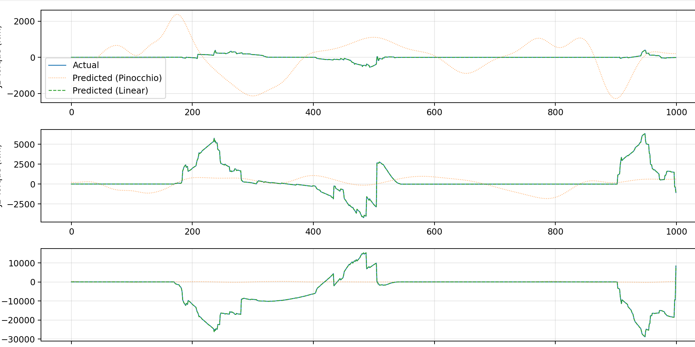


我首先是认为回归矩阵没有加入摩擦项，只有惯性项。先把mjcf里面的damping(库仑摩擦)，friction阻尼摩擦清零了，  
但是没效果  
之后发现参数对应可能出现问题  pinocchio的输出是动量矩而不是质点坐标  


在 Pinocchio 中，每个刚体的 10 个惯性参数顺序是：
```
[mass,
 mx, my, mz,
 Ixx, Ixy, Ixz,
 Iyy, Iyz,
 Izz]
 即
 [m,
 com_x * m, com_y * m, com_z * m,
 Ixx, Ixy, Ixz,
 Iyy, Iyz,
 Izz]
```
__不是直接 com_x！而是 m * com_x（动量矩）__  

修改后还是不对  
- - -
之后我把mujoco的数据采集直接替换成使用pinocchio做仿真数据采集。保证前后使用相同库做数据处理。mujoco只做实际显示  

之后得到的拟合数据更加正常，
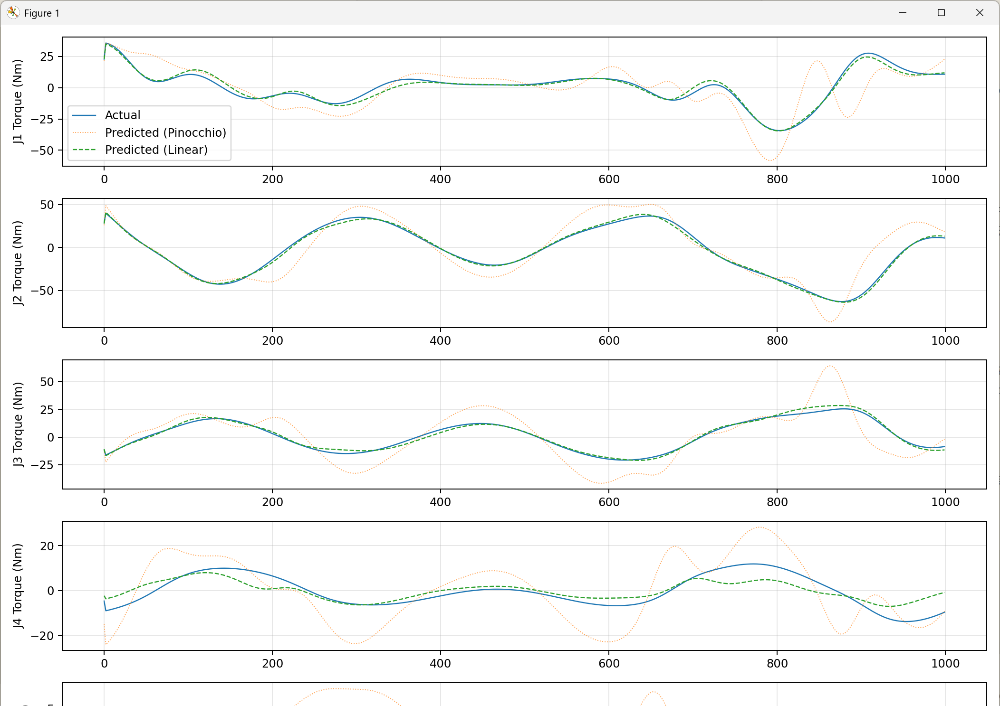
```
==============================
Identification Quality Report
==============================
Rank (base parameters): 36
Condition Number: 1.271e+02
Condition Evaluation: 很好 (Excellent)
RMSE: 3.052768 Nm
R²: 0.957137  
```
把辨识得到的参数与回归矩阵相乘得到的力矩曲线是"predicted linear"
"predicted pinocchio"是把辨识得到的参数覆盖掉原来的mjcf格式模型上的数据，重新利用pinocchio的动力学计算(rnea(model, data, q, qd, qdd))得到的力矩  
理论上两者应该一致。  
- - -
可能因为前后使用的动力学计算是牛顿欧拉法，在pinocchio里面实际计算的是近似值，导致两者不相似。


## 实际机械臂数据-参数辨识
这组数据是采样的实际机械臂数据
我去对这组数据做参数辨识      
图内是理论的激励轨迹  
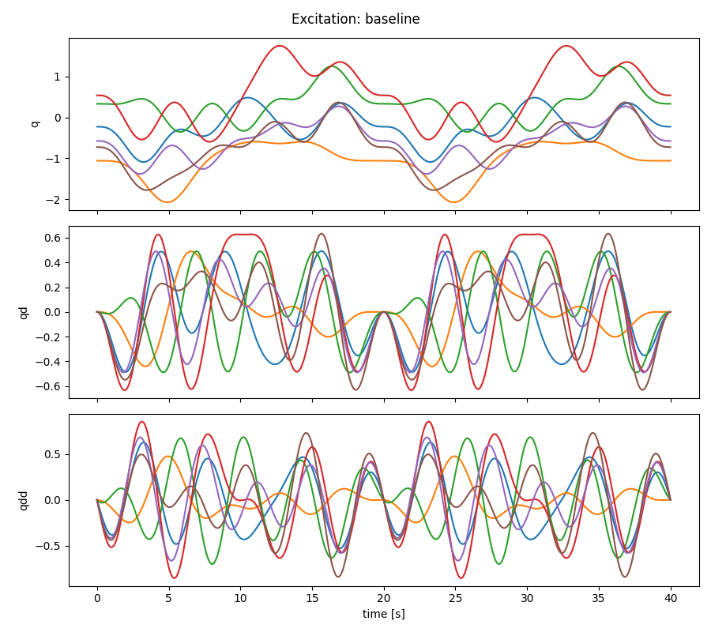
- - -
真实数据csv里没有采集到加速度，我直接微分得到ddq曲线不佳，对q和dq简单平滑滤波后得到的ddq也感觉还是用不了，目前还在想办法数据处理  
下面是移动平均的效果，不好  
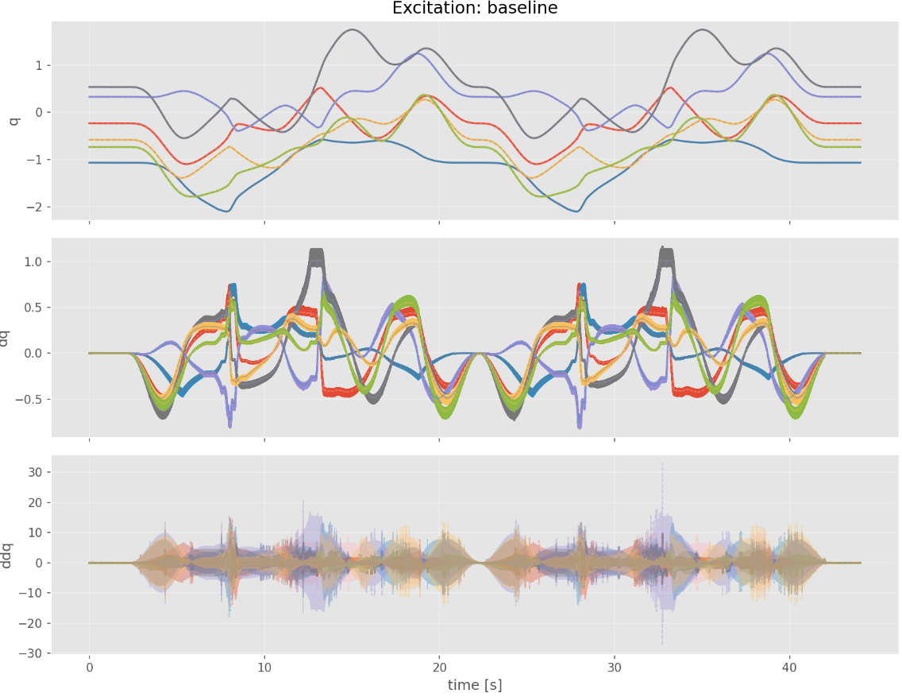

原来我理解的所采用的五级傅里叶激励轨迹公式  
$$
q_j(t)=q_{0,j}+\sum_{k=1}^{K} \left[a_{j,k}
\sin(k\omega\tau)+b_{j,k}\cos(k\omega\tau)
\right]
$$


更新后，即实际这组激励轨迹所采用的公式  
q
$$
q_j(t)=q_{0,j}+\sum_{k=1}^{K} \left[\frac{a_{j,k}}{k\omega}
\sin(k\omega\tau)-\frac{b_{j,k}}{k\omega}\cos(k\omega\tau)
\right]
$$
dq  
$$
\dot q_j(t)
=
\sum_{k=1}^{K}
\left[
a_{j,k}\cos(k\omega t)
+
b_{j,k}\sin(k\omega t)
\right]
$$
ddq 
$$
\ddot q_j(t)
=
\sum_{k=1}^{K}
\left[
- k\omega a_{j,k}\sin(k\omega t)
+
k\omega b_{j,k}\cos(k\omega t)
\right]
$$
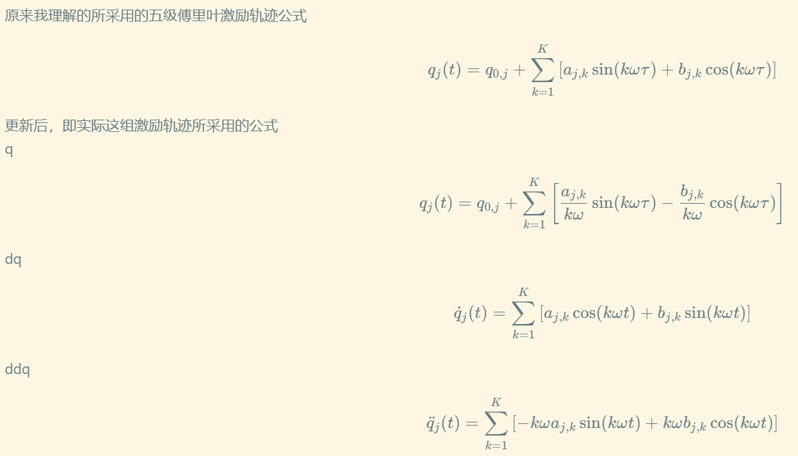
先用公式跑出了下理论曲线
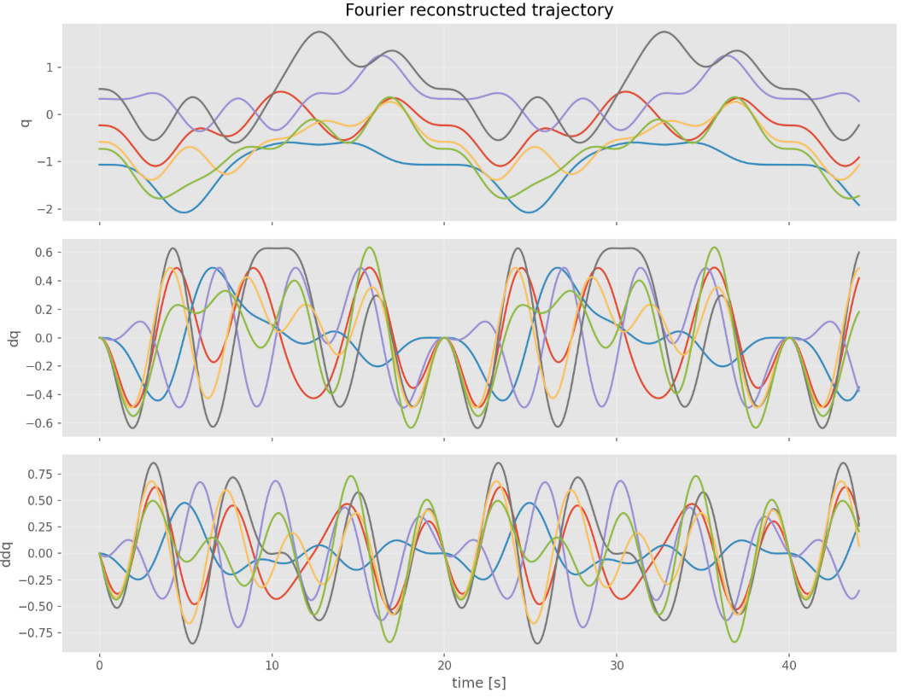

- - -
只对dq做SG  
微分得到ddq  
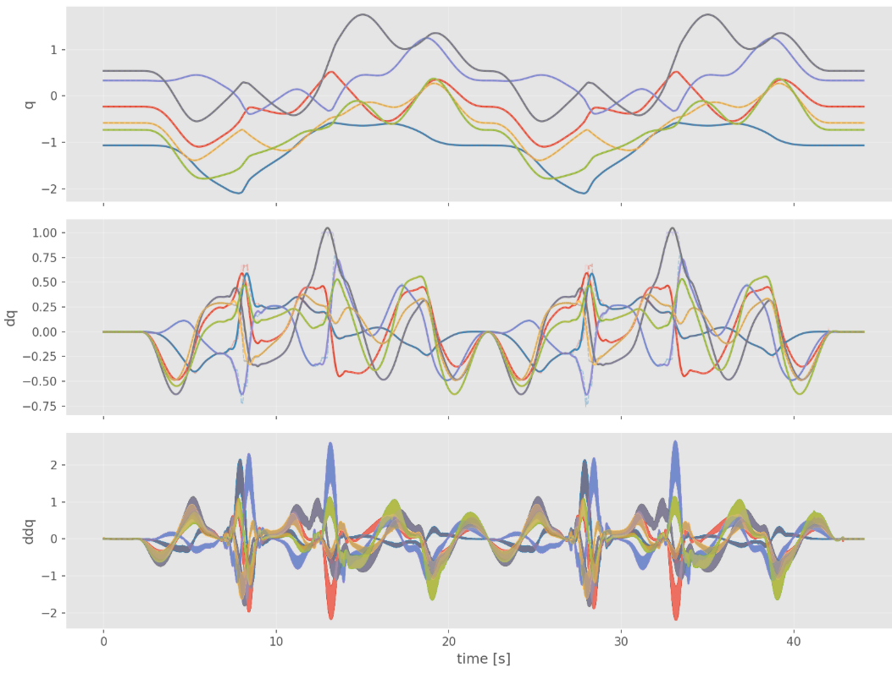

低通ddq  
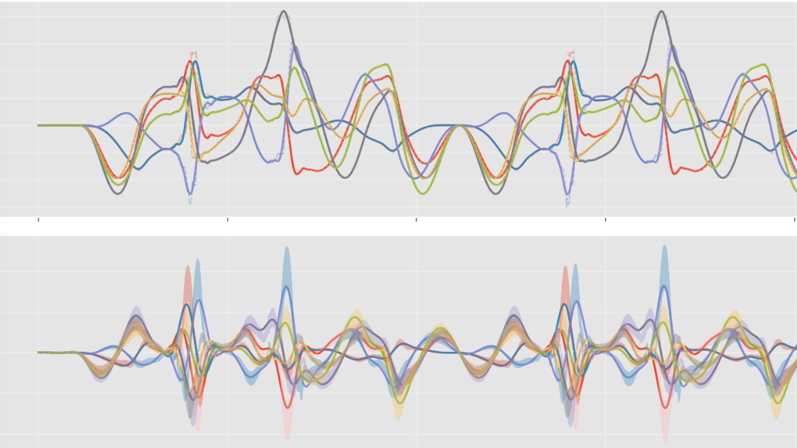


低通ddq再sg滤波后的    
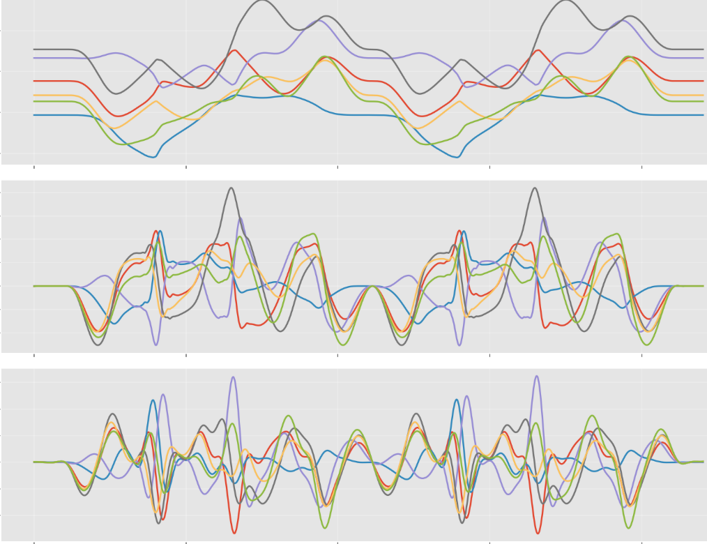
- - -
修改参数后  
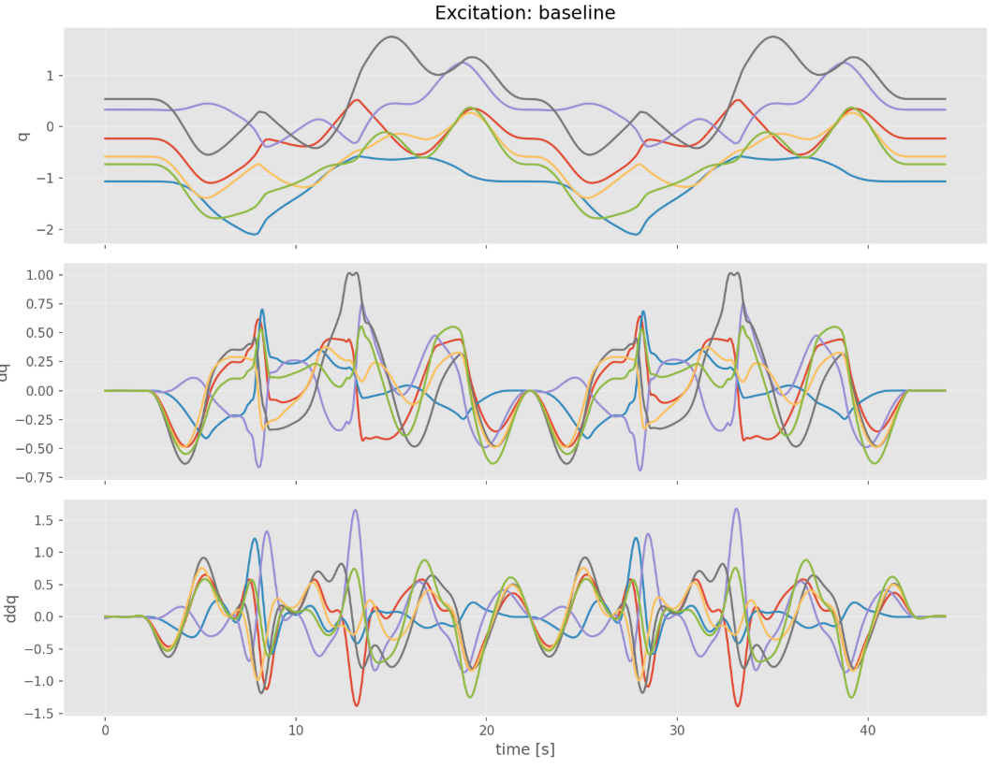


最小二乘法参数辨识结果：  
- - -
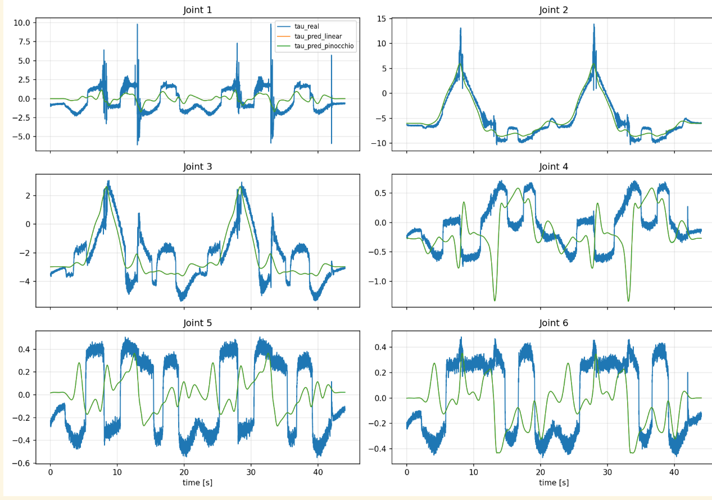
```
Identification Quality Report
==============================
samples               : 13199
regressor shape       : (79194, 60)
base rank (SVD)       : 36
condition number(base): 2.773632e+02
-
RMSE (linear)         : 0.927371
R2   (linear)         : 0.880325
RMSE (pinocchio)      : 0.927371
R2   (pinocchio)      : 0.880325
==============================
```
### 真实数据参数辨识目前问题  
方法没问题，可以看到关节二的拟合较好，但后面几个拟合曲线较差。  
组会后了解了是真实机械臂在真实世界中受到摩擦阻尼等的影响会更大，  
而前几个关节本身更重，受惯性参数影响更大，所以仿真拟合较好，而后面几个关节较轻，关节间的库仑摩擦等影响更大，仿真拟合实际效果差。  

### 后续代码改进  
___本身基础方法大体已经实现，后续加上摩擦项让拟合效果更好。___  
___然后基于二乘法的基础上做小幅度的方法改进。___  


## 论文部分
- - -
然后论文我整体梳理了下框架  
前半部分我介绍
机械臂的运动学
动力学
等等

论文后半部分
参数辨识方法（我的创新点集中在这一块）  
可能就是先基于最小二乘法做一个验证，之后在基于最小二乘的基础上做一个简单的变换来当创新点，

实验搭建
实验结果的分析(实验结果，对比，误差等)
工作总结  

